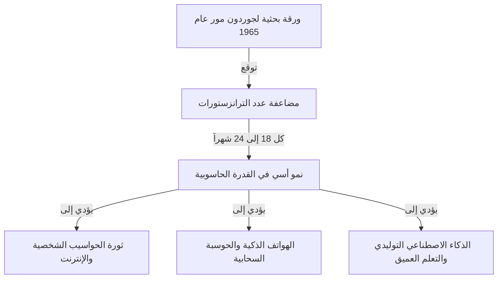
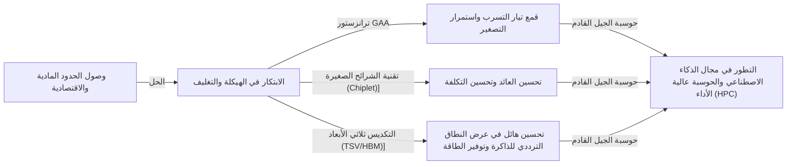

# ما هو قانون مور؟ مسار أشباه الموصلات والتطور المتسارع

يتغير مجتمعنا بسرعة بفضل التقنيات مثل الهواتف الذكية، الحوسبة السحابية، والذكاء الاصطناعي (AI). الأساس التكنولوجي الذي يدعم كل هذا هو "أشباه الموصلات (الرقائق الدقيقة)"، وقد تم تحديد تاريخ تطورها من خلال **"قانون مور (Moore's Law)"** الشهير.

في هذه المقالة، ومن منظور كاتب تقني محترف، سنتعمق في شرح قانون مور: خلفيته التاريخية، آلياته التقنية، تأثيره على الأعمال والاقتصاد، الحدود الفيزيائية التي يواجهها حالياً، وتكنولوجيا الحوسبة من الجيل التالي التي تتجاوز "نهاية قانون مور".

---

## 1. ولادة قانون مور والخلفية التاريخية

### رؤية جوردون مور عام 1965
يعود أصل قانون مور إلى مقال قصير نُشر عام 1965 في مجلة *Electronics* بقلم جوردون مور، أحد مؤسسي شركة إنتل (Intel). في ذلك الوقت، كان يعمل في شركة فيرتشايلد لأشباه الموصلات (Fairchild Semiconductor). وقدم ملاحظته بأن عدد الترانزستورات التي يمكن دمجها في دائرة متكاملة (IC) "يتضاعف كل عام تقريبًا".

في وقت لاحق، في عام 1975، قام مور نفسه بتعديل توقعاته وأعاد تعريفها لتتضاعف "تقريباً كل 18 إلى 24 شهراً (سنتين)". أصبحت هذه هي النظرية الراسخة لـ "قانون مور" الذي نعرفه اليوم.

### لماذا سُمي بـ "القانون"؟
بالمعنى الدقيق للكلمة، فإن قانون مور ليس "قانوناً (Law)" مطلقاً في الفيزياء أو الرياضيات. بل هو "قاعدة تجريبية (Rule of thumb)" كانت بمثابة "خارطة طريق" للصناعة.
شاركت الشركات المصنعة لأشباه الموصلات، بما في ذلك إنتل، شعوراً بالضرورة الملحة: "إذا لم نضاعف الأداء كل عامين، فسنخسر أمام المنافسة"، واستخدمت ذلك كهدف للقيام باستثمارات ضخمة في البحث والتطوير (R&D) والمعدات. بعبارة أخرى، قانون مور هو "منظم ضربات القلب للاقتصاد والابتكار" الذي حققته صناعة أشباه الموصلات بأكملها كنبوءة تحقق ذاتها.

---

## 2. رعب التطور المتسارع (النمو الأسي)

المفهوم الأكثر أهمية لفهم قانون مور هو **"التطور المتسارع (النمو الأسي: Exponential Growth)"**.
عادة ما يميل الدماغ البشري إلى توقع تغييرات "خطية (Linear)". على سبيل المثال، فكرة أنه "إذا تقدمت خطوة واحدة كل يوم، فسوف تتقدم 30 خطوة في 30 يومًا". ومع ذلك، في النمو الأسي، يزداد الأمر في لعبة مضاعفة: "1، 2، 4، 8، 16، 32...".

إذا تكررت المضاعفة 30 مرة، فإن الرقم النهائي سيتجاوز المليار (2 أُس 30). في عالم أشباه الموصلات، ولأن هذه المضاعفة مستمرة منذ أكثر من 50 عامًا، فإن أجهزة الكمبيوتر التي كانت تشغل في الأصل مساحة غرفة كاملة أصبحت الآن تتسع في جيوبنا بل ويتم دمجها في ساعات اليد (الساعات الذكية).

---

## 3. آلية تصغير أشباه الموصلات: كيف يمكن زيادة كثافة التكامل؟

النهج الأساسي لزيادة عدد الترانزستورات (زيادة كثافة التكامل) هو "التصغير (Scaling)". إذا أمكن جعل الترانزستورات أصغر، يمكن وضع المزيد منها على شريحة سيليكون بنفس المساحة.

### تحدي حدود الطباعة الحجرية الضوئية (Photolithography)
يتم تصنيع أشباه الموصلات باستخدام طريقة تسمى "الطباعة الحجرية الضوئية (تقنية التعرض للضوء)". يتم وضع راتنج حساس للضوء (Photoresist) على رقاقة السيليكون، ويتم تسليط الضوء من خلال قناع مرسوم عليه نمط الدائرة الكهربائية لنقل الدائرة.
لرسم دوائر أدق، يتطلب الأمر ضوءًا بطول موجي أقصر.
ظلت الصناعة تقاتل لسنوات من أجل تقصير الطول الموجي للضوء:
- **من الضوء المرئي إلى الأشعة فوق البنفسجية**
- **ليزر الإكسيمر (KrF, ArF)**
- **تقنية الطباعة الحجرية بالغمر (Immersion Lithography)**
- وأحدث التقنيات الحالية: **الطباعة الحجرية بالأشعة فوق البنفسجية القصوى (EUV)**

تستخدم معدات الطباعة الحجرية EUV، التي تُصنع حصريًا بواسطة شركة ASML الهولندية، ضوءًا بطول موجي يبلغ 13.5 نانومترًا فقط لرسم دوائر دقيقة للغاية. استغرق تطوير هذا الجهاز عقوداً واستثمارات بتريليونات الينات، ولكن هذا ما يجعل من الممكن تصنيع أشباه الموصلات المتطورة اليوم، مثل تقنيات الـ 5 نانومتر والـ 3 نانومتر.

---

## 4. تأثير قانون مور على الأعمال والاقتصاد

لم يكن قانون مور مجرد مؤشر تقني؛ بل أدى إلى تغيير جذري في هيكل الاقتصاد العالمي.

### الضغط الانكماشي والانخفاض الهائل في التكاليف
مضاعفة كثافة الترانزستور تعني أنه "يمكنك الحصول على ضعف قوة الحوسبة بنفس التكلفة"، أو "يمكنك الحصول على نفس قوة الحوسبة بنصف التكلفة". وقد أدى هذا الانخفاض الهائل في التكاليف إلى دفع الرقمنة (التحول الرقمي: DX) في جميع الصناعات.
ومع تحول موارد الحوسبة من "نادرة وباهظة الثمن" إلى "وفيرة ورخيصة"، ظهرت نماذج أعمال جديدة الواحدة تلو الأخرى.

### خلق صناعات جديدة
1. **انتشار الحواسيب الشخصية (PC):** من الثمانينيات إلى التسعينيات، أصبح بإمكان الأفراد امتلاك أجهزة الكمبيوتر.
2. **الإنترنت وأعمال الويب:** في العقد الأول من القرن الحادي والعشرين، ربطت الخوادم ومعدات الاتصال الرخيصة العالم عبر الشبكة.
3. **الهواتف الذكية واقتصاد الأجهزة المحمولة:** في العقد الأول من القرن الحادي والعشرين، اكتسبت الأجهزة التي بحجم راحة اليد أداءً يشبه الكمبيوتر العملاق، وشهد اقتصاد التطبيقات نمواً هائلاً.
4. **السحابة والذكاء الاصطناعي:** منذ عام 2020 فصاعداً، برز التعلم العميق (Deep Learning) والذكاء الاصطناعي التوليدي (Generative AI)، والتي تتطلب موارد حاسوبية هائلة. تعتمد هذه بشكل كامل على تطور قدرات الحوسبة المتوازية الفائقة لوحدات معالجة الرسومات (GPU).

---

## 5. حدود قانون مور والحواجز الفيزيائية التي يواجهها

على الرغم من أنه تم الهمس لسنوات عديدة أن "القانون قد مات"، إلا أن قانون مور استمر في إطالة عمره. ومع ذلك، فإنه يواجه الآن حدودًا فيزيائية حقيقية. العوائق الثلاثة الرئيسية هي:

### 1. تأثير النفق الكمي وتيار التسرب
عندما يتقلص حجم الترانزستور (خاصة طول البوابة) إلى مقياس بضعة نانومترات (بحجم عدد قليل إلى بضع عشرات من الذرات)، لم تعد قوانين الفيزياء الكلاسيكية قابلة للتطبيق، وتصبح ظواهر ميكانيكا الكم بارزة. المثال الأبرز هو "تأثير النفق الكمي (Quantum Tunneling)".
حتى إذا حاولت إيقاف تشغيل المفتاح لإيقاف التيار، فإن الإلكترونات تخترق الحاجز وتتدفق (تيار التسرب: Leakage Current)، مما يتسبب في زيادة استهلاك الطاقة وحدوث أعطال.

### 2. الجدار الحراري (مشكلة السيليكون المظلم)
مع زيادة كثافة الترانزستورات على شريحة ما، ترتفع كثافة الحرارة المتولدة بشكل حاد. تُسمى الظاهرة التي لا تستطيع فيها تكنولوجيا التبريد مواكبة الأمر، مما يجعل من المستحيل تشغيل الشريحة بأكملها بكامل طاقتها في وقت واحد، بـ "السيليكون المظلم (Dark Silicon)". على الرغم من زيادة قوة الحوسبة، فإننا نقع في معضلة عدم القدرة على استخراج أدائها الحقيقي بسبب القيود الحرارية.

### 3. الحدود الاقتصادية (قانون روك)
هناك قاعدة تجريبية تسمى أيضاً "قانون مور الثاني" أو "قانون روك (Rock's Law)". ينص هذا على أن "تكلفة بناء مصنع لتصنيع أشباه الموصلات تتضاعف مع كل جيل". يتطلب بناء مصنع تصنيع حديث (Fab) اليوم استثمارًا يتراوح بين 2 تريليون و 3 تريليون ين، والشركات القادرة على تحمل هذه التكلفة الهائلة انخفضت إلى حوالي ثلاث شركات فقط في العالم: TSMC و Samsung Electronics و Intel.

---

## 6. More than Moore (ما بعد قانون مور)

نظراً لأن الزيادة في كثافة التكامل من خلال التصغير البسيط (More Moore) تقترب من حدودها، تتجه صناعة أشباه الموصلات نحو نهج جديد لتحسين الأداء، ألا وهو "More than Moore".

### تطور الهيكلة (من FinFET إلى GAA)
في حين تم قمع تيار التسرب من خلال الانتقال من بنية الترانزستور المسطحة (المستوية) إلى **FinFET (ترانزستور تأثير المجال الزعنفي)** ذو البنية ثلاثية الأبعاد، هناك حالياً انتقال نحو بنية **GAA (Gate-All-Around)** حيث تحيط البوابة بالقناة بالكامل. هذا يزيد من قدرة التحكم في الإلكترونات إلى أقصى حد.

### تقنية الشرائح الصغيرة (Chiplet)
في الماضي، كانت جميع الوظائف معبأة في شريحة سيليكون عملاقة واحدة (Monolithic Die). الآن، يتم تصنيعها عن طريق تقسيمها إلى شرائح صغيرة (Chiplets) حسب الوظيفة، ثم يتم دمجها داخل حزمة واحدة باستخدام تقنية التغليف المتقدمة. وقد أدى ذلك إلى تحسين العائد (معدل المنتجات الجيدة) بشكل كبير، مما يجعل من الممكن زيادة الأداء الإجمالي مع الحفاظ على انخفاض التكاليف. لقد حققت نجاحًا كبيرًا في معالجات مثل Ryzen من AMD وأصبحت الاتجاه السائد للمستقبل.

### التغليف 2.5D / 3D وتقنية التكديس
بدلاً من مجرد ترتيب الرقائق على مستوى مسطح (2D)، يتم تكديسها رأسياً (3D) باستخدام تقنيات مثل الأقطاب الكهربائية المخترقة للسيليكون (TSV)، مما يحسن بشكل كبير سرعة الاتصال (عرض النطاق الترددي) بين الرقائق ويقلل من استهلاك الطاقة. تعد تقنية التغليف المتقدمة هذه ضرورية لتوصيل وحدات معالجة الرسومات المتطورة للذكاء الاصطناعي (مثل H100 من NVIDIA) بذاكرة HBM (ذاكرة النطاق الترددي العالي).

---

## 7. حوسبة الجيل القادم في عصر ما بعد مور

تحسباً لحدود أشباه الموصلات القائمة على السيليكون، تتقدم الأبحاث المتعلقة بتكنولوجيا الحوسبة القائمة على مبادئ جديدة تماماً بسرعة. تمتلك هذه التقنيات القدرة على أن تصبح اللاعب الرئيسي في "عصر ما بعد مور".

### الحوسبة الكمية (Quantum Computing)
باستخدام خصائص ميكانيكا الكم مثل "التراكب" و "التشابك الكمي"، من المتوقع أن تحل على الفور مشاكل محددة (فك التشفير، محاكاة الجزيئات للأدوية الجديدة، مشاكل التحسين، وما إلى ذلك) التي قد تستغرق أجهزة الكمبيوتر التقليدية (أجهزة الكمبيوتر الكلاسيكية) مئات الملايين من السنين لحلها. هناك منافسة شرسة في البحث عن أساليب مختلفة، مثل الموصلية الفائقة، والمصائد الأيونية، والضوئيات الكمية.

### الحوسبة العصبية (أجهزة كمبيوتر تحاكي الدماغ)
هذه تقنية تحاكي بنية الشبكات العصبية للدماغ البشري (الخلايا العصبية والمشابك العصبية) على مستوى الأجهزة المادية. على عكس بنية فون نيومان الحالية (حيث يتم فصل وحدة المعالجة المركزية والذاكرة، مما يخلق عنق زجاجة في نقل البيانات)، من خلال معالجة المعلومات وتخزين الذاكرة في وقت واحد، يمكنها أداء التعرف على الأنماط والتعلم باستهلاك منخفض للغاية للطاقة.

### الحوسبة البصرية (Optical Computing)
تقنية تستخدم الفوتونات (جسيمات الضوء) بدلاً من الإلكترونات لمعالجة المعلومات ونقل البيانات. نظراً لأن الضوء أسرع من الإشارات الكهربائية ويولد فقداناً أقل للطاقة والحرارة، فمن المتوقع أن يكون أساسًا للحوسبة فائقة السرعة ومنخفضة استهلاك الطاقة من الجيل القادم. على وجه الخصوص، دخلت تقنية "الضوئيات السيليكونية (Silicon Photonics)"، التي تنقل البيانات بصريًا بين الرقائق، بالفعل مرحلة التطبيق العملي.

---

## 8. الخلاصة: إرث قانون مور ومستقبلنا

لم يكن "قانون مور" الذي قدمه جوردون مور في عام 1965 مجرد توقع تقني لأشباه الموصلات. لقد منح البشرية رؤية راسخة بأن "التكنولوجيا يمكن أن تستمر في التطور بشكل كبير"، ويمكن القول إنه كان "عقدًا اجتماعيًا كبيرًا" دفع الملايين من المهندسين والباحثين نحو نفس الهدف.

حتى لو وصل تصغير الترانزستورات على السيليكون إلى حدوده الفيزيائية، فإن ابتكار البشرية لتحسين قوة الحوسبة لن يتوقف. ستستمر النماذج الجديدة مثل الشرائح الصغيرة (Chiplets)، التكديس ثلاثي الأبعاد، الهياكل المخصصة للذكاء الاصطناعي، وأجهزة الكمبيوتر الكمية في المضي قدماً بروح قانون مور وقيادة مجتمعنا إلى مناطق مجهولة.

ما هو مطلوب من قادة الأعمال والمهندسين اليوم وفي المستقبل، هو فهم وتيرة هذا "التطور التكنولوجي المتسارع"، وتوقع الاختراق القادم، والاستمرار في التكيف لضمان عدم تخلفنا عن ركب التغيير. إن تاريخ تطور أشباه الموصلات هو في حد ذاته مرآة تعكس مستقبل البشرية.
