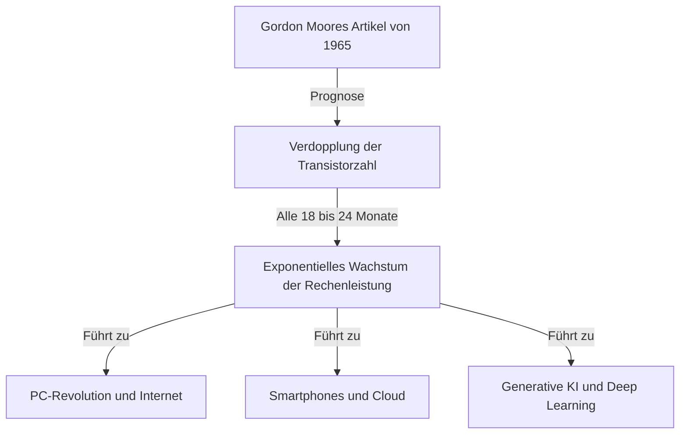
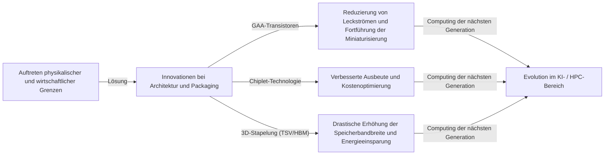

# Was ist das Mooresche Gesetz? Die Spur der Halbleiter und der exponentiellen Evolution

Unsere Gesellschaft verändert sich rasant durch Technologien wie Smartphones, Cloud-Computing und Künstliche Intelligenz (KI). Das Fundament dieser Technologien bilden "Halbleiter (Mikrochips)", und deren Entwicklungsgeschichte wurde maßgeblich von dem berühmten **"Mooreschen Gesetz (Moore's Law)"** bestimmt.

In diesem Artikel werden wir aus der Perspektive eines professionellen Technical Writers den historischen Hintergrund, die technischen Mechanismen, die Auswirkungen auf Wirtschaft und Business, die derzeitigen physikalischen Grenzen und die Computtechnologien der nächsten Generation nach dem "Ende des Mooreschen Gesetzes" tiefgehend erläutern.

---

## 1. Die Entstehung und der historische Hintergrund des Mooreschen Gesetzes

### Gordon Moores Erkenntnis von 1965
Das Mooresche Gesetz hat seinen Ursprung in einem kurzen Artikel, den Gordon Moore, einer der Mitbegründer von Intel, 1965 für die Zeitschrift "Electronics" verfasste. Damals war er bei Fairchild Semiconductor tätig. Er veröffentlichte die Beobachtung, dass sich die Anzahl der Transistoren auf integrierten Schaltkreisen (ICs) ungefähr "jedes Jahr verdoppelt".

Später, im Jahr 1975, korrigierte Moore seine Prognose und definierte sie neu: Die Anzahl "verdoppelt sich etwa alle 18 bis 24 Monate (2 Jahre)". Dies ist die heute bekannte und etablierte Form des "Mooreschen Gesetzes".

### Warum wurde es als "Gesetz" bezeichnet?
Streng genommen ist das Mooresche Gesetz kein absolutes physikalisches oder mathematisches "Gesetz (Law)". Es handelt sich vielmehr um eine "Faustregel (Rule of thumb)", die als "Roadmap" der Industrie diente.
Halbleiterhersteller wie Intel teilten die Sorge, dass sie "gegenüber der Konkurrenz verlieren würden, wenn sie die Leistung nicht alle zwei Jahre verdoppeln", und investierten riesige Summen in Forschung und Entwicklung (F&E) sowie in Anlagen, um dieses Ziel zu erreichen. Das bedeutet, dass das Mooresche Gesetz ein "Schrittmacher für Wirtschaft und Innovation" ist, der sich als selbsterfüllende Prophezeiung der gesamten Halbleiterindustrie verwirklicht hat.

---

## 2. Der Schrecken der exponentiellen Evolution (Exponentielles Wachstum)

Das wichtigste Konzept zum Verständnis des Mooreschen Gesetzes ist die **"exponentielle Evolution (Exponentielles Wachstum: Exponential Growth)"**.
Das menschliche Gehirn neigt normalerweise dazu, Veränderungen "linear (Linear)" zu erwarten. Ein Beispiel dafür ist der Gedanke: "Wenn man jeden Tag einen Schritt vorwärts geht, ist man nach 30 Tagen 30 Schritte weiter." Beim exponentiellen Wachstum hingegen vervielfacht sich der Wert wie bei einem Verdopplungsspiel: "1, 2, 4, 8, 16, 32...".

Wenn man diese Verdopplung 30 Mal wiederholt, überschreitet die endgültige Zahl 1 Milliarde (2 hoch 30). In der Welt der Halbleiter hat sich diese Verdopplung über mehr als 50 Jahre fortgesetzt, so dass Computer, die anfangs noch die Größe eines ganzen Raumes einnahmen, heute in unsere Taschen passen und sogar in Armbanduhren (Smartwatches) eingebaut werden.

---

## 3. Der Mechanismus der Halbleiter-Miniaturisierung: Wie wird die Integrationsdichte erhöht?

Der grundlegende Ansatz, um die Anzahl der Transistoren zu erhöhen (die Integrationsdichte zu steigern), ist die "Miniaturisierung (Scaling)". Wenn man Transistoren kleiner bauen kann, lassen sich auf der gleichen Fläche eines Silizium-Wafers mehr Transistoren unterbringen.

### Die Herausforderung der Grenzen der Fotolithografie
Halbleiter werden mithilfe eines Verfahrens namens "Fotolithografie (optische Belichtungstechnologie)" hergestellt. Dabei wird ein lichtempfindliches Harz (Fotolack) auf einen Silizium-Wafer aufgetragen und Licht durch eine Maske mit einem Schaltungsmuster gestrahlt, um die Schaltung zu übertragen.
Um feinere Schaltungen zu zeichnen, wird Licht mit einer kürzeren Wellenlänge benötigt.
Die Industrie kämpft seit langem darum, die Wellenlänge des Lichts zu verkürzen.
- **Von sichtbarem Licht zu Ultraviolett**
- **Excimer-Laser (KrF, ArF)**
- **Immersionslithografie**
- Und die aktuelle Spitzentechnologie: **EUV-Lithografie (Extreme Ultraviolett)**

EUV-Belichtungsanlagen, die exklusiv vom niederländischen Unternehmen ASML hergestellt werden, verwenden Licht mit einer Wellenlänge von nur 13,5 Nanometern, um extrem feine Schaltungen zu zeichnen. Die Entwicklung dieser Anlagen erforderte Jahrzehnte und Investitionen in Milliardenhöhe, ermöglicht aber heute die Herstellung modernster Halbleiter in 5nm- und 3nm-Prozessen.

---

## 4. Die Auswirkungen des Mooreschen Gesetzes auf Wirtschaft und Business

Das Mooresche Gesetz ist nicht nur ein technischer Indikator, sondern hat die Struktur der Weltwirtschaft grundlegend verändert.

### Deflationsdruck und drastische Kostensenkung
Eine Verdopplung der Transistordichte bedeutet, dass man "die doppelte Rechenleistung zu gleichen Kosten" oder "die gleiche Rechenleistung zur Hälfte der Kosten" erhält. Dieser drastische Kostenrückgang trieb die Digitalisierung (Digitale Transformation: DX) in allen Branchen voran.
Der Wandel von Rechenressourcen von "selten und teuer" zu "reichlich und billig" brachte eine Welle neuer Geschäftsmodelle hervor.

### Die Schaffung neuer Industrien
1. **Die Verbreitung von Personal Computern (PCs):** In den 1980er und 90er Jahren wurde es für Privatpersonen möglich, Computer zu besitzen.
2. **Das Internet und Web-Business:** In den 2000er Jahren verbanden kostengünstige Server und Kommunikationsgeräte die Welt über Netzwerke.
3. **Smartphones und die mobile Wirtschaft:** In den 2010er Jahren erreichten handtellergroße Geräte die Leistung von Supercomputern, was zu einem explosionsartigen Wachstum der App-Ökonomie führte.
4. **Cloud und KI:** Ab den 2020er Jahren kamen Deep Learning und generative KI (Generative AI) auf, die gewaltige Rechenressourcen erfordern. Diese basieren vollständig auf der Weiterentwicklung der massiv-parallelen Rechenkapazität von GPUs (Grafikprozessoren).

---

## 5. Die Grenzen des Mooreschen Gesetzes und die aktuellen physikalischen Barrieren

Obwohl oft geflüstert wurde, "das Gesetz sei tot", hat sich das Mooresche Gesetz lange Zeit gehalten. Derzeit stößt es jedoch an echte physikalische Grenzen. Die wichtigsten Barrieren sind die folgenden drei:

### 1. Der Quanten-Tunneleffekt und Leckströme
Wenn die Größe eines Transistors (insbesondere die Gate-Länge) auf wenige Nanometer (die Größe von einigen bis zu einigen Dutzend Atomen) schrumpft, gelten die klassischen Gesetze der Physik nicht mehr, und quantenmechanische Phänomene werden spürbar. Das bekannteste davon ist der "Quanten-Tunneleffekt".
Selbst wenn der Schalter auf "Aus" gestellt wird, um den Strom zu stoppen, durchdringen Elektronen die Barriere und fließen weiter (Leckstrom: Leakage Current), was zu einem erhöhten Stromverbrauch und Fehlfunktionen führt.

### 2. Die Hitzemauer (Dark-Silicon-Problem)
Wenn die Dichte der Transistoren auf einem Chip steigt, nimmt auch die Dichte der erzeugten Wärme stark zu. Ein Phänomen, bei dem die Kühltechnik nicht Schritt halten kann und der gesamte Chip nicht mehr gleichzeitig unter Volllast betrieben werden kann, wird als "Dark Silicon" bezeichnet. Wir befinden uns in einem Dilemma: Auch wenn die Rechenleistung erhöht wird, lässt sich das eigentliche Leistungspotenzial aufgrund von Hitzebeschränkungen nicht ausschöpfen.

### 3. Wirtschaftliche Grenzen (Das Rocksche Gesetz)
Es gibt eine Faustregel, die auch als "Zweites Mooresches Gesetz" oder "Rocksches Gesetz (Rock's Law)" bezeichnet wird. Sie besagt: "Die Kosten für den Bau von Halbleiterfabriken verdoppeln sich mit jeder Generation." Um eine hochmoderne Fabrik (Fab) zu bauen, sind heute Investitionen in der Größenordnung von zweistelligen Milliardenbeträgen erforderlich. Weltweit gibt es nur noch etwa drei Unternehmen – TSMC, Samsung Electronics und Intel –, die diese enormen Kosten tragen können.

---

## 6. More than Moore (Jenseits des Mooreschen Gesetzes)

Während die Leistungssteigerung durch einfache Miniaturisierung (More Moore) an ihre Grenzen stößt, wendet sich die Halbleiterindustrie neuen Ansätzen zu, um die Leistung zu steigern, nämlich "More than Moore".

### Die Evolution der Architektur (Von FinFET zu GAA)
Der Übergang von einer planaren Transistorstruktur zu einem räumlichen **FinFET (Fin Field-Effect Transistor)** hat geholfen, Leckströme zu reduzieren. Derzeit vollzieht sich der Wechsel zur **GAA (Gate-All-Around)**-Struktur, bei der das Gate den Kanal vollständig umschließt. Dies maximiert die Kontrolle über die Elektronen.

### Chiplet-Technologie
Bisher wurden alle Funktionen in einem riesigen Siliziumchip (monolithischer Die) untergebracht. Bei diesem Ansatz wird der Chip in kleinere Chips (Chiplets) nach Funktionen aufgeteilt, die separat hergestellt und dann mit fortschrittlichen Gehäusetechnologien in einem einzigen Gehäuse (Package) verbunden werden. Dadurch lässt sich die Ausbeute (Yield) drastisch verbessern, die Kosten senken und die Gesamtleistung steigern. Diese Methode feierte bei AMDs Ryzen-Prozessoren große Erfolge und wird zum neuen Standard.

### 2.5D / 3D-Packaging und Stapeltechnologien
Durch die nicht nur flache (2D) Anordnung der Chips, sondern deren vertikale Stapelung (3D) mithilfe von Technologien wie Through-Silicon Vias (TSV), wird die Kommunikationsgeschwindigkeit (Bandbreite) zwischen den Chips erheblich verbessert und der Stromverbrauch gesenkt. Diese fortschrittlichen Packaging-Technologien sind für die Verbindung von hochmodernen KI-GPUs (wie NVIDIAs H100) mit HBM (High Bandwidth Memory) unerlässlich.

---

## 7. Die nächste Generation des Computings in der Post-Moore-Ära

Angesichts der Grenzen siliziumbasierter Halbleiter schreitet die Forschung an Computing-Technologien voran, die auf völlig neuen Prinzipien basieren. Diese haben das Potenzial, die Hauptakteure der "Post-Moore-Ära" zu werden.

### Quantencomputing (Quantum Computing)
Indem Eigenschaften der Quantenmechanik wie "Superposition" und "Quantenverschränkung" genutzt werden, erhofft man sich, bestimmte Probleme (wie Entschlüsselung, Molekülsimulationen für neue Medikamente, Optimierungsprobleme), für deren Lösung herkömmliche (klassische) Computer Millionen von Jahren bräuchten, augenblicklich lösen zu können. Die Forschung wetteifert mit verschiedenen Ansätzen wie Supraleitung, Ionenfallen und photonischen Systemen.

### Neuromorphes Computing (Gehirn-inspirierte Computer)
Dies ist eine Technologie, die den Mechanismus der neuronalen Netzwerke (Neuronen und Synapsen) des menschlichen Gehirns auf physikalischer Hardware-Ebene nachahmt. Im Gegensatz zur aktuellen Von-Neumann-Architektur (bei der CPU und Speicher getrennt sind und ein Datenübertragungsengpass besteht), erfolgen Informationsverarbeitung und Speicherung gleichzeitig, was Mustererkennung und Lernen bei extrem niedrigem Stromverbrauch ermöglicht.

### Optisches Computing (Optical Computing)
Eine Technologie, bei der Photonen anstelle von Elektronen für die Informationsverarbeitung und Datenübertragung verwendet werden. Da Licht schneller als elektrische Signale ist und zu weniger Energieverlusten und Wärmeentwicklung führt, wird dies als Grundlage für ultraschnelle Computing-Systeme mit geringem Stromverbrauch der nächsten Generation erwartet. Insbesondere die "Silizium-Photonik", bei der die Datenübertragung zwischen Chips optisch erfolgt, hat bereits die Phase der praktischen Anwendung erreicht.

---

## 8. Fazit: Das Vermächtnis des Mooreschen Gesetzes und unsere Zukunft

Das "Mooresche Gesetz", das Gordon Moore 1965 aufstellte, war nicht nur eine technische Prognose für Halbleiter. Es bot der Menschheit die feste Vision, dass "Technologien weiterhin exponentiell fortschreiten können", und kann als "großer sozialer Vertrag" betrachtet werden, der Millionen von Ingenieuren und Forschern auf dasselbe Ziel zusteuern ließ.

Selbst wenn die Miniaturisierung von Transistoren auf Silizium an ihre physikalischen Grenzen stößt, wird die menschliche Innovation zur Steigerung der Rechenkapazität nicht aufhalten. Neue Paradigmen wie Chiplets, 3D-Stapelung, KI-spezifische Architekturen und Quantencomputer werden den Geist des Mooreschen Gesetzes weitertragen und unsere Gesellschaft weiterhin in unbekannte Gebiete führen.

Von den Führungskräften und Ingenieuren der Zukunft wird erwartet, dass sie das Tempo dieser "exponentiellen technologischen Entwicklung" verstehen, vorhersehen, welche Durchbrüche als Nächstes geschehen werden, und sich kontinuierlich anpassen, um die Welle der Veränderung nicht zu verpassen. Die Entwicklungsgeschichte der Halbleiter ist der Spiegel, der die Zukunft der Menschheit widerspiegelt.
