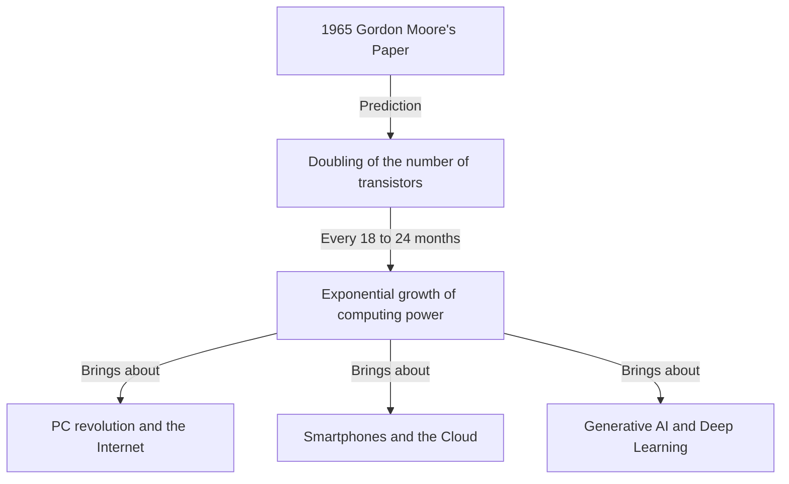
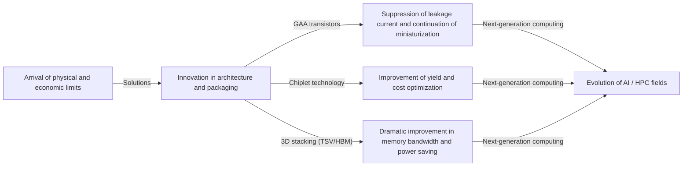

# What is Moore's Law? The Trajectory of Semiconductors and Exponential Evolution

Our society is rapidly changing due to technologies such as smartphones, cloud computing, and artificial intelligence (AI). Supporting these technological foundations are "semiconductors (microchips)," and what has defined the history of their evolution is the famous **"Moore's Law."**

In this article, from the perspective of a professional technical writer, we will delve deeply into the historical background of Moore's Law, its technical mechanisms, its impact on business and the economy, the physical limits it currently faces, and the next-generation computing technologies that lie beyond the "end of Moore's Law."

---

## 1. The Birth and Historical Background of Moore's Law

### Gordon Moore's Insight in 1965
Moore's Law originated from a short paper contributed to "Electronics" magazine in 1965 by Gordon Moore, one of the co-founders of Intel. At the time, he was at Fairchild Semiconductor. He published an observation that the number of transistors mounted on an integrated circuit (IC) was roughly "doubling every year."

Later, in 1975, Moore himself revised his prediction and redefined it as "doubling approximately every 18 to 24 months (2 years)." This has become the established theory of "Moore's Law" that we know today.

### Why Did It Come to Be Called a "Law"?
Strictly speaking, Moore's Law is not an absolute "Law" in physics or mathematics. It is a "Rule of thumb" and has served as a "roadmap" for the industry.
Semiconductor manufacturers, led by Intel, shared a sense of crisis that "if we don't double performance every two years, we will be defeated by our competitors," and have made massive research and development (R&D) and capital investments with this goal in mind. In other words, Moore's Law is a "pacemaker of the economy and innovation" that the entire semiconductor industry has realized as a self-fulfilling prophecy.

---

## 2. The Terror of Exponential Evolution (Exponential Growth)

The most important concept for understanding Moore's Law is **"Exponential Growth."**
The human brain generally tends to predict "linear" changes. For example, the idea that "if you advance one step every day, you will advance 30 steps in 30 days." However, in exponential growth, it increases in a doubling game like "1, 2, 4, 8, 16, 32...".

If you repeat the doubling 30 times, the final number exceeds 1 billion (2 to the 30th power). In the world of semiconductors, this doubling has continued for over 50 years, so computers that initially occupied the size of a room now fit in our pockets and are even built into wristwatches (smartwatches).

---

## 3. The Mechanism of Semiconductor Miniaturization: How to Increase the Degree of Integration?

The basic approach to increasing the number of transistors (increasing the degree of integration) is "Scaling" (miniaturization). If transistors can be made smaller, more transistors can be placed on a silicon wafer of the same area.

### Challenging the Limits of Photolithography
Semiconductors are manufactured using a technique called "photolithography (optical exposure technology)." A photosensitive resin (photoresist) is applied to a silicon wafer, and light is shone through a mask with a circuit pattern drawn on it to transfer the circuit.
To draw finer circuits, light with a shorter wavelength is required.
The industry has long fought a battle to shorten the wavelength of light.
- **From visible light to ultraviolet**
- **Excimer laser (KrF, ArF)**
- **Immersion lithography technology**
- And the current cutting edge, **EUV (Extreme Ultraviolet) lithography**

The EUV exposure equipment exclusively manufactured by ASML in the Netherlands uses light with a wavelength of only 13.5 nanometers to draw extremely fine circuits. The development of this equipment required decades and trillions of yen in investment, but this has enabled the manufacture of cutting-edge semiconductors such as the current 5nm and 3nm processes.

---

## 4. The Impact of Moore's Law on Business and the Economy

Moore's Law has completely transformed the structure of the global economy, going beyond a mere technical indicator.

### Deflationary Pressure and Dramatic Cost Reductions
Doubling the integration density of transistors means that "you can get twice the computing power for the same cost," or "you can get the same computing power for half the cost." This dramatic cost reduction has driven digitalization (Digital Transformation: DX) in all industries.
As computing resources shifted from "scarce and expensive" to "abundant and cheap," new business models were born one after another.

### Creation of New Industries
1. **Spread of Personal Computers (PCs):** From the 1980s to the 90s, individuals became able to own computers.
2. **Internet and Web Business:** In the 2000s, cheap servers and communication equipment connected the world through a network.
3. **Smartphones and the Mobile Economy:** In the 2010s, palm-sized devices acquired performance comparable to supercomputers, and the app economic zone grew explosively.
4. **Cloud and AI:** From the 2020s onwards, Deep Learning and Generative AI, which require massive computing resources, have emerged. These are entirely dependent on the evolution of the ultra-parallel computing capabilities of GPUs (Graphics Processing Units).

---

## 5. The Limits of Moore's Law and the Physical Barriers Faced

Although Moore's Law has continued to survive despite being whispered that "the law is dead" many times over the years, it is now facing true physical limits. The main barriers are the following three:

### 1. Quantum Tunneling Effect and Leakage Current
When the size of a transistor (especially the gate length) shrinks to the order of nanometers (the size of a few to a few dozen atoms), the classical laws of physics no longer apply, and quantum mechanical phenomena become prominent. The most representative of these is the "quantum tunneling effect."
Even if you turn the switch "off" to stop the current, electrons slip through the barrier and flow (leakage current), causing an increase in power consumption and malfunctions.

### 2. The Thermal Wall (Dark Silicon Problem)
As the density of transistors on a chip increases, the density of heat generated also rises rapidly. The phenomenon where cooling technology cannot keep up and the entire chip cannot be fully operated at the same time is called "Dark Silicon." Even if computing power is increased, we have fallen into a dilemma where the original performance cannot be extracted due to thermal constraints.

### 3. Economic Limits (Rock's Law)
There is an empirical rule also called the "Second Law of Moore's Law" or "Rock's Law." This is the observation that "the cost of building a semiconductor manufacturing plant doubles with each generation." Building a state-of-the-art fab (manufacturing plant) now requires an investment on the scale of 2 to 3 trillion yen, and the companies that can bear this enormous cost have been narrowed down to about three in the world: TSMC, Samsung Electronics, and Intel.

---

## 6. More than Moore (Beyond Moore's Law)

As the improvement of integration density through simple miniaturization (More Moore) approaches its limits, the semiconductor industry is steering toward performance improvement through new approaches, namely "More than Moore."

### Evolution of Architecture (From FinFET to GAA)
While leakage current has been suppressed by transitioning from a planar transistor structure to a three-dimensional **FinFET (Fin Field-Effect Transistor)**, the transition to a **GAA (Gate-All-Around)** structure, where the gate surrounds all sides, is currently progressing. This maximizes the controllability of electrons to the extreme limit.

### Chiplet Technology
This is a method of dividing what used to be packed with all functions on one huge silicon chip (monolithic die) into small chips (chiplets) for each function, manufacturing them, and then connecting them within a single package using advanced packaging technology. This has made it possible to dramatically improve the yield rate and increase overall performance while keeping costs down. It has achieved great success in products like AMD's Ryzen processors and is becoming the mainstream for the future.

### 2.5D / 3D Packaging and Stacking Technology
In addition to arranging chips on a flat plane (2D), by stacking them vertically (3D) using technologies such as Through-Silicon Vias (TSV), the communication speed (bandwidth) between chips is vastly improved, and power consumption is reduced. This advanced packaging technology is essential for connecting cutting-edge GPUs for AI (such as NVIDIA's H100) and HBM (High Bandwidth Memory).

---

## 7. Next-Generation Computing in the Post-Moore Era

Anticipating the limits of silicon-based semiconductors, research on computing technologies based on completely new principles is also rapidly advancing. These have the potential to take the lead in the "post-Moore era."

### Quantum Computing
Utilizing properties of quantum mechanics such as "superposition" and "quantum entanglement," it is expected to instantly solve specific problems (such as cryptography, molecular simulation for new drugs, and optimization problems) that would take conventional computers (classical computers) hundreds of millions of years to solve. Research on various methods, such as superconductivity, ion traps, and optical quanta, is fiercely competing.

### Neuromorphic Computing (Brain-Inspired Computers)
This is a technology that mimics the mechanism of the human brain's neural network (neurons and synapses) at the physical hardware level. Unlike the current von Neumann architecture (where the CPU and memory are separated, creating a data transfer bottleneck), by performing information processing and memory simultaneously, it can perform pattern recognition and learning with extremely low power consumption.

### Optical Computing
This is a technology that uses photons instead of electrons for information processing and data transmission. Light is faster than electrical signals and has less energy loss and heat generation, so it is expected to serve as a next-generation foundation for ultra-high-speed, low-power-consumption computing. In particular, "silicon photonics" technology, which transmits data between chips using light, has already entered the stage of practical application.

---

## 8. Conclusion: The Legacy of Moore's Law and Our Future

The "Moore's Law" presented by Gordon Moore in 1965 was not just a technical forecast for semiconductors. It can be said that it was a "grand social contract" that gave humanity a firm vision that "technology can continue to evolve exponentially," driving millions of engineers and researchers toward the same goal.

Even if the miniaturization of transistors on silicon reaches its physical limits, humanity's innovation to improve computing power will never stop. New paradigms such as chiplets, 3D stacking, AI-specialized architectures, and quantum computers will inherit the spirit of Moore's Law and continue to guide our society into unknown territories.

What is required of future business leaders and engineers is to understand the pace of this "exponential technological evolution," identify what kind of breakthrough will occur next, and continue to adapt so as not to be left behind by the wave of change. The history of semiconductor evolution is a mirror that reflects the future of humanity itself.
