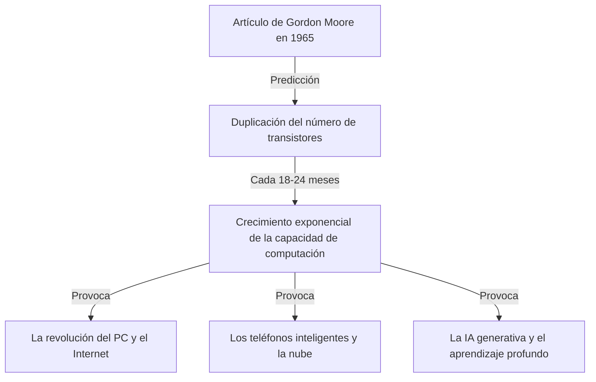
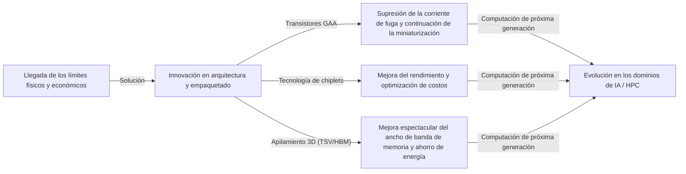

# ¿Qué es la Ley de Moore? La trayectoria de los semiconductores y la evolución exponencial

Nuestra sociedad está cambiando rápidamente debido a tecnologías como los teléfonos inteligentes, la computación en la nube y la inteligencia artificial (IA). La base que sustenta estas tecnologías es el "semiconductor (microchip)", y la historia de su evolución ha estado determinada por la famosa **"Ley de Moore" (Moore's Law)**.

En este artículo, desde la perspectiva de un redactor técnico profesional, exploraremos y explicaremos en profundidad los antecedentes históricos de la Ley de Moore, sus mecanismos técnicos, su impacto en los negocios y la economía, los límites físicos a los que se enfrenta actualmente, y las tecnologías de computación de próxima generación que se encuentran más allá del "fin de la Ley de Moore".

---

## 1. El nacimiento y los antecedentes históricos de la Ley de Moore

### La visión de Gordon Moore en 1965
La Ley de Moore tiene su origen en un breve artículo publicado en la revista "Electronics" en 1965 por Gordon Moore, uno de los cofundadores de Intel. En ese momento, trabajaba en Fairchild Semiconductor. Publicó una observación de que el número de transistores montados en un circuito integrado (CI) se estaba "duplicando cada año" aproximadamente.

Más tarde, en 1975, el propio Moore revisó su predicción y la redefinió como "duplicándose aproximadamente cada 18 a 24 meses (2 años)". Esta es la teoría establecida de la "Ley de Moore" que conocemos hoy.

### ¿Por qué llegó a llamarse "Ley"?
Estrictamente hablando, la Ley de Moore no es una "Ley" absoluta de la física o las matemáticas. Es una "regla empírica" (Rule of thumb), y ha desempeñado un papel como "hoja de ruta" para la industria.
Intel y otros fabricantes de semiconductores han compartido la sensación de crisis de que "si no duplicamos el rendimiento cada dos años, perderemos ante nuestros competidores", y han realizado enormes inversiones en investigación y desarrollo (I+D) y de capital con este objetivo en mente. En otras palabras, la Ley de Moore es el "marcapasos de la economía y la innovación" que toda la industria de los semiconductores ha hecho realidad como una profecía autocumplida.

---

## 2. El terror de la evolución exponencial (Crecimiento exponencial)

El concepto más importante para entender la Ley de Moore es el **"crecimiento exponencial" (Exponential Growth)**.
El cerebro humano generalmente tiende a predecir cambios "lineales" (Linear). Por ejemplo, la idea de que "si avanzas un paso cada día, avanzarás 30 pasos en 30 días". Sin embargo, en el crecimiento exponencial, el aumento es un juego de duplicación como "1, 2, 4, 8, 16, 32...".

Si repites la duplicación 30 veces, el número final supera los mil millones (2 elevado a la 30). En el mundo de los semiconductores, debido a que esta duplicación ha continuado durante más de 50 años, las computadoras que inicialmente ocupaban el tamaño de una habitación ahora caben en nuestros bolsillos, e incluso se instalan en relojes de pulsera (smartwatches).

---

## 3. Mecanismos de miniaturización de los semiconductores: ¿Cómo aumentar la densidad de integración?

El enfoque básico para aumentar el número de transistores (aumentar la densidad de integración) es la "miniaturización" (Scaling). Si los transistores se pueden hacer más pequeños, se pueden colocar más transistores en una oblea de silicio de la misma área.

### Desafiando los límites de la fotolitografía
Los semiconductores se fabrican utilizando una técnica llamada "fotolitografía (tecnología de exposición óptica)". Se aplica una resina fotosensible (fotorresistencia) a una oblea de silicio, y se hace pasar luz a través de una máscara con un patrón de circuito dibujado en ella para transferir el circuito.
Para dibujar circuitos más finos, se requiere luz con una longitud de onda más corta.
La industria ha librado durante mucho tiempo una batalla para acortar la longitud de onda de la luz.
- **De la luz visible a la ultravioleta**
- **Láseres excimer (KrF, ArF)**
- **Tecnología de exposición por inmersión**
- Y la vanguardia actual, **la litografía EUV (Luz Ultravioleta Extrema)**

El equipo de exposición EUV, fabricado exclusivamente por la empresa neerlandesa ASML, utiliza luz con una longitud de onda de solo 13,5 nanómetros para dibujar circuitos extremadamente finos. El desarrollo de este equipo requirió décadas y billones de yenes de inversión, pero esto ha hecho posible la fabricación de semiconductores de vanguardia, como los actuales procesos de 5nm y 3nm.

---

## 4. El impacto de la Ley de Moore en los negocios y la economía

La Ley de Moore no fue solo un indicador técnico; transformó fundamentalmente la estructura de la economía global.

### Presión deflacionaria y reducción dramática de costos
El hecho de que la densidad de integración de los transistores se duplique significa que "puedes obtener el doble de capacidad de computación por el mismo costo", o "puedes obtener la misma capacidad de computación por la mitad del costo". Esta dramática reducción de costos impulsó la digitalización (Transformación Digital: DX) en todas las industrias.
Los recursos de computación pasaron de ser "escasos y caros" a "abundantes y baratos", dando origen a una sucesión de nuevos modelos de negocio.

### Creación de nuevas industrias
1. **Difusión de las computadoras personales (PC):** Desde la década de 1980 hasta la de 90, las personas pudieron tener sus propias computadoras.
2. **Internet y negocios web:** En la década de 2000, servidores y equipos de comunicación económicos conectaron el mundo a través de una red.
3. **Teléfonos inteligentes y la economía móvil:** En la década de 2010, los dispositivos del tamaño de la palma de la mano adquirieron un rendimiento comparable al de las supercomputadoras, y la economía de las aplicaciones explotó.
4. **Nube e IA:** A partir de la década de 2020, el aprendizaje profundo (Deep Learning) y la IA generativa (Generative AI), que requieren enormes cantidades de recursos de computación, están cobrando protagonismo. Estos dependen completamente de la evolución de las capacidades de computación masivamente paralela de las GPU (unidades de procesamiento de gráficos).

---

## 5. Los límites de la Ley de Moore y las barreras físicas a las que se enfrenta

Aunque la Ley de Moore ha prolongado su vida a pesar de que se ha rumoreado muchas veces que "la ley ha muerto", actualmente se enfrenta a verdaderos límites físicos. Las principales barreras son las tres siguientes.

### 1. Efecto túnel cuántico y corriente de fuga
Cuando el tamaño de un transistor (especialmente la longitud de la puerta) se reduce a la escala de unos pocos nanómetros (el tamaño de unos pocos a unas pocas docenas de átomos), las leyes clásicas de la física dejan de aplicarse y los fenómenos de la mecánica cuántica se vuelven prominentes. El representante de esto es el "efecto túnel cuántico".
Incluso cuando se intenta "apagar" el interruptor y detener la corriente, los electrones atraviesan la barrera y fluyen (corriente de fuga), causando un aumento en el consumo de energía y fallas de funcionamiento.

### 2. El muro de calor (Problema del silicio oscuro)
A medida que aumenta la densidad de los transistores en un chip, la densidad del calor generado también aumenta drásticamente. El fenómeno en el que la tecnología de refrigeración no puede seguir el ritmo y no se puede hacer funcionar todo el chip al máximo al mismo tiempo se denomina "Silicio oscuro" (Dark Silicon). Incluso si se aumenta la capacidad de computación, hemos caído en un dilema en el que el rendimiento original no se puede aprovechar debido a restricciones térmicas.

### 3. Límites económicos (Ley de Rock)
Hay una regla empírica también llamada "Segunda Ley de la Ley de Moore" o "Ley de Rock" (Rock's Law). Esta afirma que "el costo de construir una planta de fabricación de semiconductores se duplica con cada generación". La construcción de una fábrica de vanguardia requiere actualmente una inversión de la escala de 2 a 3 billones de yenes, y las empresas capaces de soportar este costo masivo se han reducido a aproximadamente tres en el mundo: TSMC, Samsung Electronics e Intel.

---

## 6. More than Moore (Más allá de la Ley de Moore)

A medida que la mejora de la densidad de integración a través de la simple miniaturización (More Moore) se acerca a su límite, la industria de los semiconductores está cambiando su rumbo hacia la mejora del rendimiento a través de nuevos enfoques, a saber, "More than Moore".

### Evolución de la arquitectura (De FinFET a GAA)
Al pasar de una estructura de transistor plana (planar) a una estructura tridimensional llamada **FinFET (transistor de efecto de campo de aleta)**, se ha suprimido la corriente de fuga, pero actualmente se está llevando a cabo una transición hacia una estructura **GAA (Gate-All-Around)**, que rodea la puerta por todos los lados. Esto maximiza la controlabilidad de los electrones.

### Tecnología de chiplets
Este es un método de fabricación en el que lo que solía empaquetar todas las funciones en un solo chip de silicio gigante (matriz monolítica) se divide en pequeños chips (chiplets) para cada función, y estos se conectan dentro de un solo paquete utilizando tecnología de empaquetado avanzada. Esto ha mejorado drásticamente la tasa de rendimiento (proporción de productos no defectuosos), haciendo posible aumentar el rendimiento general mientras se mantienen bajos los costos. Ha logrado un gran éxito con los procesadores Ryzen de AMD, entre otros, y se está convirtiendo en la corriente principal del futuro.

### Empaquetado 2.5D / 3D y tecnología de apilamiento
En lugar de simplemente colocar chips en una superficie plana (2D), apilarlos verticalmente (3D) utilizando tecnologías como vías a través del silicio (TSV) mejora significativamente la velocidad de comunicación (ancho de banda) entre chips y reduce el consumo de energía. Para la conexión entre las GPU de vanguardia para IA (como la H100 de NVIDIA) y HBM (memoria de alto ancho de banda), esta tecnología de empaquetado avanzado es esencial.

---

## 7. Computación de próxima generación en la era post-Moore

Anticipando los límites de los semiconductores basados en silicio, la investigación sobre tecnologías de computación basadas en principios completamente nuevos también avanza rápidamente. Estas tienen el potencial de convertirse en los actores principales de la "era post-Moore".

### Computación cuántica (Quantum Computing)
Al utilizar propiedades de la mecánica cuántica como la "superposición" y el "entrelazamiento cuántico", se espera resolver instantáneamente problemas específicos (criptografía, simulación molecular de nuevos fármacos, problemas de optimización, etc.) que a las computadoras convencionales (computadoras clásicas) les llevaría cientos de millones de años resolver. La investigación utilizando diversos métodos, como superconductores, trampas de iones y cuantos ópticos, compite ferozmente.

### Computación neuromórfica (Computadoras inspiradas en el cerebro)
Esta es una tecnología que imita el mecanismo de la red neuronal (neuronas y sinapsis) del cerebro humano a un nivel de hardware físico. A diferencia de la arquitectura actual de von Neumann (donde la CPU y la memoria están separadas, y existe un cuello de botella en la transferencia de datos), al realizar el procesamiento de información y la memoria simultáneamente, puede realizar el reconocimiento de patrones y el aprendizaje con un consumo de energía extremadamente bajo.

### Computación óptica (Optical Computing)
Esta es una tecnología que utiliza fotones en lugar de electrones para el procesamiento de información y la transmisión de datos. La luz es más rápida que las señales eléctricas y tiene menos pérdida de energía y generación de calor, por lo que se espera que sea una infraestructura de computación de próxima generación de velocidad ultrarrápida y bajo consumo de energía. En particular, la tecnología de "fotónica de silicio", que realiza la transmisión de datos entre chips mediante luz, ya ha entrado en la etapa de aplicación práctica.

---

## 8. Conclusión: El legado de la Ley de Moore y nuestro futuro

La "Ley de Moore", presentada por Gordon Moore en 1965, no fue simplemente una predicción técnica para los semiconductores. Se puede decir que fue un "gran contrato social" que dio a la humanidad la firme visión de que "la tecnología puede seguir evolucionando exponencialmente" e impulsó a millones de ingenieros e investigadores hacia el mismo objetivo.

Incluso si la miniaturización de los transistores en el silicio alcanza sus límites físicos, la innovación de la humanidad que se esfuerza por mejorar la capacidad de computación no se detendrá. Nuevos paradigmas como los chiplets, el apilamiento 3D, las arquitecturas especializadas en IA y las computadoras cuánticas heredarán el espíritu de la Ley de Moore y continuarán guiando a nuestra sociedad hacia territorios desconocidos.

Lo que se requiere de los futuros líderes empresariales e ingenieros es comprender el ritmo de esta "evolución tecnológica exponencial", discernir qué avances ocurrirán a continuación y continuar adaptándose para no perder la ola de cambio. La historia de la evolución de los semiconductores es un espejo que refleja directamente el futuro de la humanidad.
