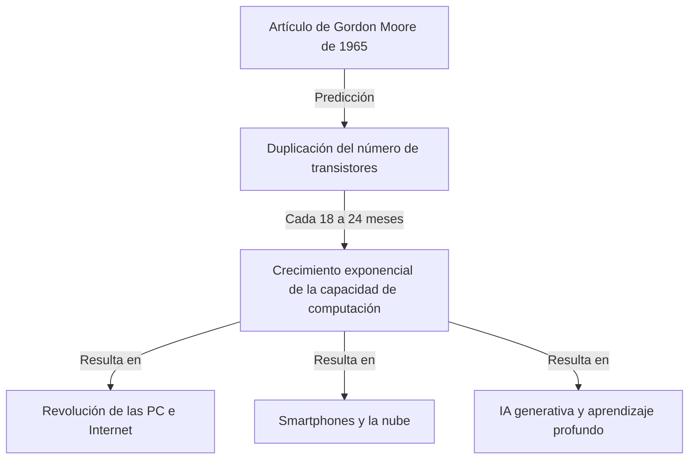
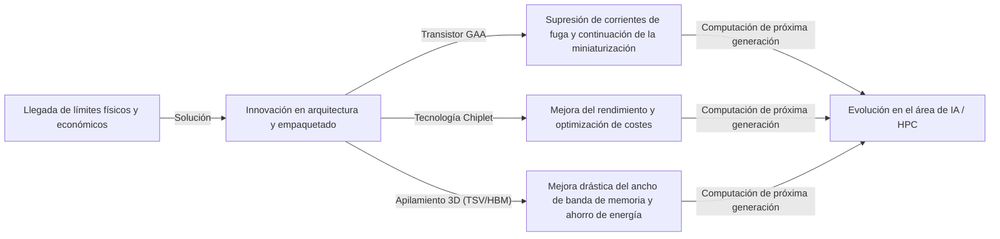

# ¿Qué es la Ley de Moore? La trayectoria de los semiconductores y la evolución exponencial

Nuestra sociedad está cambiando rápidamente gracias a tecnologías como los teléfonos inteligentes, la computación en la nube y la inteligencia artificial (IA). La base tecnológica que sustenta todo esto son los "semiconductores (microchips)", y la historia de su evolución ha sido determinada por la famosa **"Ley de Moore"**.

En este artículo, desde la perspectiva de un escritor técnico profesional, exploraremos a fondo la Ley de Moore: sus antecedentes históricos, mecanismos técnicos, impacto empresarial y económico, los límites físicos que enfrenta actualmente, y la tecnología informática de próxima generación más allá del "fin de la Ley de Moore".

---

## 1. El nacimiento de la Ley de Moore y sus antecedentes históricos

### La visión de Gordon Moore en 1965
La Ley de Moore tiene su origen en un breve artículo publicado en 1965 en la revista *Electronics* por Gordon Moore, uno de los cofundadores de Intel. En ese momento, trabajaba en Fairchild Semiconductor. Presentó la observación de que el número de transistores que se podían integrar en un circuito integrado (CI) se estaba "duplicando aproximadamente cada año".

Más tarde, en 1975, el propio Moore revisó su predicción y la redefinió para que se duplicara "aproximadamente cada 18 a 24 meses (2 años)". Esta es la teoría consolidada de la "Ley de Moore" que conocemos hoy en día.

### ¿Por qué se le empezó a llamar "Ley"?
Estrictamente hablando, la Ley de Moore no es una "ley" absoluta de la física o las matemáticas. Es una "regla empírica" (rule of thumb) que ha servido como "hoja de ruta" para la industria.
Los fabricantes de semiconductores, incluida Intel, compartieron un sentido de urgencia: "Si no duplicamos el rendimiento cada dos años, perderemos ante la competencia", y utilizaron esto como un objetivo para realizar enormes inversiones en investigación y desarrollo (I+D) y equipos. En otras palabras, la Ley de Moore es el "marcapasos de la economía y la innovación" que toda la industria de semiconductores ha realizado como una profecía autocumplida.

---

## 2. Lo aterrador de la evolución exponencial (crecimiento exponencial)

El concepto más importante para comprender la Ley de Moore es el de **"evolución exponencial (crecimiento exponencial)"**.
El cerebro humano generalmente tiende a predecir cambios "lineales". Por ejemplo, la idea de que "si avanzas un paso cada día, avanzarás 30 pasos en 30 días". Sin embargo, en el crecimiento exponencial, aumenta en un juego de duplicación: "1, 2, 4, 8, 16, 32...".

Si se repite la duplicación 30 veces, el número final supera los mil millones (2 a la 30ª potencia). En el mundo de los semiconductores, debido a que esta duplicación ha continuado durante más de 50 años, las computadoras que originalmente ocupaban el tamaño de una habitación ahora caben en nuestros bolsillos e incluso se integran en relojes de pulsera (smartwatches).

---

## 3. El mecanismo de miniaturización de semiconductores: ¿Cómo aumentar la densidad de integración?

El enfoque básico para aumentar el número de transistores (aumentar la densidad de integración) es la "miniaturización (Scaling)". Si los transistores se pueden hacer más pequeños, se pueden colocar más transistores en una oblea de silicio de la misma área.

### Desafiando los límites de la fotolitografía
Los semiconductores se fabrican mediante un método llamado "fotolitografía" (tecnología de exposición a la luz). Se aplica una resina fotosensible (fotorresistencia) sobre una oblea de silicio y se expone a la luz a través de una máscara con el patrón del circuito dibujado en ella para transferir el circuito.
Para dibujar circuitos más finos, se requiere luz con una longitud de onda más corta.
La industria ha estado librando una batalla durante años para acortar la longitud de onda de la luz:
- **De la luz visible a la ultravioleta**
- **Láser excímer (KrF, ArF)**
- **Tecnología de litografía de inmersión**
- Y el estado del arte actual: **Litografía EUV (Ultravioleta Extrema)**

El equipo de litografía EUV, fabricado exclusivamente por la empresa holandesa ASML, utiliza luz con una longitud de onda de solo 13.5 nanómetros para dibujar circuitos extremadamente finos. El desarrollo de este equipo requirió décadas e inversiones de billones de yenes, pero esto es lo que permite la fabricación de semiconductores de vanguardia en la actualidad, como los procesos de 5nm y 3nm.

---

## 4. El impacto de la Ley de Moore en los negocios y la economía

La Ley de Moore no se limitó a ser un mero indicador técnico; transformó fundamentalmente la estructura de la economía global.

### Presión deflacionaria y reducción drástica de costes
Que la densidad de los transistores se duplique significa que "se obtiene el doble de capacidad de cálculo por el mismo costo" o que "se obtiene la misma capacidad de cálculo por la mitad del costo". Esta drástica caída de los costes ha impulsado la digitalización (transformación digital: DX) en todas las industrias.
A medida que los recursos informáticos pasaron de ser "escasos y costosos" a "abundantes y baratos", fueron surgiendo nuevos modelos de negocio uno tras otro.

### Creación de nuevas industrias
1. **La popularización de la computadora personal (PC):** Entre las décadas de 1980 y 1990, los individuos pudieron poseer computadoras.
2. **Internet y negocios web:** En la década de 2000, los servidores y equipos de comunicación económicos conectaron el mundo en red.
3. **Smartphones y la economía móvil:** En la década de 2010, los dispositivos del tamaño de la palma de la mano adquirieron un rendimiento similar al de las supercomputadoras, y la economía de las aplicaciones experimentó un crecimiento explosivo.
4. **La nube y la IA:** Desde la década de 2020 en adelante, han surgido el aprendizaje profundo (Deep Learning) y la IA generativa, que requieren enormes recursos informáticos. Estos dependen completamente de la evolución de las capacidades computacionales hiperparalelas de las GPU (semiconductores de procesamiento de gráficos).

---

## 5. Los límites de la Ley de Moore y las barreras físicas que enfrenta

Aunque durante muchos años se ha susurrado repetidamente que "la ley ha muerto", la Ley de Moore ha continuado prolongando su vida. Sin embargo, actualmente se enfrenta a verdaderos límites físicos. Las tres barreras principales son:

### 1. Efecto túnel cuántico y corriente de fuga
Cuando el tamaño del transistor (especialmente la longitud de la puerta) se reduce a una escala de pocos nanómetros (el tamaño de unos pocos a unas docenas de átomos), las leyes clásicas de la física dejan de ser aplicables y los fenómenos de la mecánica cuántica se vuelven prominentes. El más representativo es el "efecto túnel cuántico".
Incluso si intentas apagar el interruptor y detener la corriente, los electrones atraviesan la barrera y fluyen (corriente de fuga), provocando un aumento en el consumo de energía y mal funcionamiento.

### 2. El muro térmico (Problema del silicio oscuro)
A medida que aumenta la densidad de transistores en un chip, la densidad del calor generado también se dispara. El fenómeno en el que la tecnología de refrigeración no puede seguir el ritmo, imposibilitando el funcionamiento a plena capacidad de todo el chip simultáneamente, se denomina "silicio oscuro" (Dark Silicon). A pesar de aumentar la capacidad de cálculo, nos encontramos en el dilema de no poder extraer su rendimiento real debido a las limitaciones térmicas.

### 3. Límites económicos (Ley de Rock)
Existe una regla empírica también llamada "Segunda Ley de Moore" o "Ley de Rock" (Rock's Law). Establece que "el coste de construir una planta de fabricación de semiconductores se duplica con cada generación". Hoy en día, la construcción de una planta de fabricación (fab) de vanguardia requiere una inversión a una escala de 2 a 3 billones de yenes, y las empresas que pueden soportar este enorme coste se han reducido a solo tres en el mundo: TSMC, Samsung Electronics e Intel.

---

## 6. More than Moore (Más allá de la Ley de Moore)

A medida que el aumento en la densidad de integración a través de la simple miniaturización (More Moore) se acerca a su límite, la industria de semiconductores está girando hacia un nuevo enfoque para mejorar el rendimiento, es decir, "More than Moore".

### Evolución de la arquitectura (De FinFET a GAA)
Si bien la corriente de fuga se ha suprimido mediante la transición de una estructura de transistor plana (planar) a un **FinFET (Transistor de efecto de campo de aleta)** con una estructura tridimensional, actualmente se está avanzando hacia una estructura **GAA (Gate-All-Around)** en la que la puerta rodea completamente el canal. Esto maximiza la capacidad de control de los electrones al extremo.

### Tecnología Chiplet
Anteriormente, todas las funciones se agrupaban en un solo chip de silicio gigante (matriz monolítica). Ahora, se fabrican dividiéndolas en chips más pequeños (chiplets) por función, que luego se conectan dentro de un solo paquete mediante tecnología de empaquetado avanzada. Esto ha mejorado drásticamente el rendimiento (tasa de productos sin defectos), lo que permite aumentar el rendimiento general mientras se mantienen bajos los costos. Ha logrado un gran éxito en procesadores como los Ryzen de AMD y se ha convertido en la tendencia principal para el futuro.

### Empaquetado 2.5D / 3D y tecnología de apilamiento
En lugar de solo colocar los chips en un plano (2D), se apilan verticalmente (3D) utilizando tecnologías como los electrodos pasantes de silicio (TSV), mejorando drásticamente la velocidad de comunicación (ancho de banda) entre los chips y reduciendo el consumo de energía. Esta avanzada tecnología de empaquetado es esencial para conectar las GPU de vanguardia para IA (como la H100 de NVIDIA) con HBM (memoria de alto ancho de banda).

---

## 7. La computación de próxima generación en la era post-Moore

Anticipando los límites de los semiconductores basados en silicio, la investigación sobre tecnologías informáticas basadas en principios completamente nuevos avanza rápidamente. Estas tienen el potencial de convertirse en las protagonistas de la "era post-Moore".

### Computación cuántica (Quantum Computing)
Utilizando propiedades de la mecánica cuántica como la "superposición" y el "entrelazamiento cuántico", se espera que resuelvan instantáneamente problemas específicos (descifrado de códigos, simulación molecular de nuevos fármacos, problemas de optimización, etc.) que a las computadoras convencionales (computadoras clásicas) les tomaría cientos de millones de años resolver. Varias tecnologías compiten ferozmente en este ámbito, como la superconductividad, las trampas de iones y la fotónica cuántica.

### Computación neuromórfica (Computadoras tipo cerebro)
Se trata de una tecnología que imita la estructura de las redes neuronales del cerebro humano (neuronas y sinapsis) a nivel de hardware físico. A diferencia de la arquitectura actual de von Neumann (donde la CPU y la memoria están separadas, creando cuellos de botella en la transferencia de datos), al procesar información y almacenar memoria simultáneamente, puede realizar reconocimiento de patrones y aprendizaje con un consumo de energía extremadamente bajo.

### Computación óptica (Optical Computing)
Tecnología que utiliza fotones en lugar de electrones para procesar información y transmitir datos. Dado que la luz es más rápida que las señales eléctricas y genera menos pérdida de energía y calor, se espera que sea la base de la computación de ultra alta velocidad y bajo consumo de energía de próxima generación. En particular, la tecnología "Silicon Photonics", que transmite datos ópticamente entre chips, ya ha entrado en la fase de aplicación práctica.

---

## 8. Conclusión: El legado de la Ley de Moore y nuestro futuro

La "Ley de Moore" presentada por Gordon Moore en 1965 no fue solo un pronóstico tecnológico para los semiconductores. Brindó a la humanidad una visión firme de que "la tecnología puede continuar evolucionando exponencialmente" y se puede decir que ha sido un "gran contrato social" que impulsó a millones de ingenieros e investigadores hacia el mismo objetivo.

Incluso si la miniaturización de los transistores de silicio alcanza su límite físico, la innovación humana para mejorar las capacidades de computación no se detendrá. Los nuevos paradigmas como los chiplets, el apilamiento 3D, arquitecturas específicas de IA y computadoras cuánticas, heredarán el espíritu de la Ley de Moore y continuarán guiando a nuestra sociedad hacia territorios desconocidos.

Lo que se requiere de los líderes empresariales e ingenieros de hoy y del futuro, es comprender el ritmo de esta "evolución tecnológica exponencial", anticipar el próximo gran avance, y adaptarse continuamente para no quedarse atrás en la ola de cambios. La historia de la evolución de los semiconductores es, en sí misma, un espejo que refleja el futuro de la humanidad.
