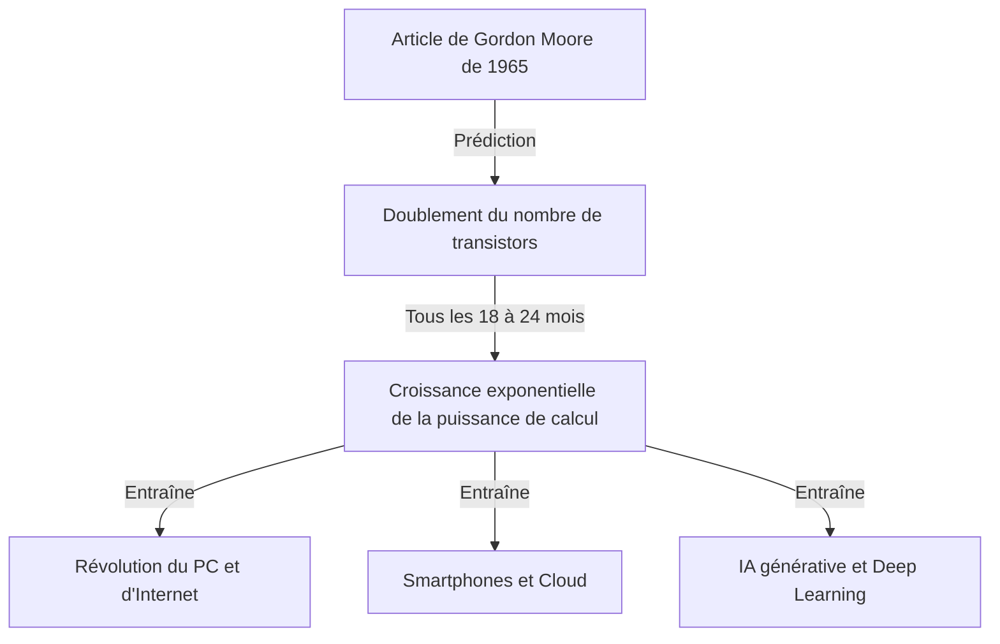
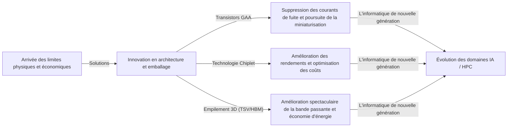

# Qu'est-ce que la loi de Moore ? L'évolution des semi-conducteurs et la trajectoire de l'évolution exponentielle

Notre société évolue rapidement grâce à des technologies telles que les smartphones, le cloud computing et l'intelligence artificielle (IA). Ces fondements technologiques reposent sur les "semi-conducteurs (puces électroniques)", et l'histoire de leur évolution a été façonnée par la célèbre **"loi de Moore (Moore's Law)"**.

Dans cet article, du point de vue d'un rédacteur technique professionnel, nous examinerons en profondeur le contexte historique de la loi de Moore, ses mécanismes techniques, son impact sur les affaires et l'économie, les limites physiques auxquelles elle est actuellement confrontée, ainsi que les technologies informatiques de nouvelle génération au-delà de "la fin de la loi de Moore".

---

## 1. La naissance et le contexte historique de la loi de Moore

### La vision de Gordon Moore en 1965
La loi de Moore trouve son origine dans un court article écrit par Gordon Moore, cofondateur d'Intel, dans le magazine *Electronics* en 1965. À l'époque, il travaillait chez Fairchild Semiconductor. Il a publié une observation selon laquelle le nombre de transistors sur un circuit intégré (CI) "doublait environ chaque année".

Plus tard, en 1975, Moore a révisé sa propre prédiction, la redéfinissant comme un doublement "environ tous les 18 à 24 mois (2 ans)". C'est aujourd'hui la théorie établie de la "loi de Moore" que nous connaissons.

### Pourquoi l'appelle-t-on une "loi" ?
Strictement parlant, la loi de Moore n'est pas une "loi (Law)" absolue de la physique ou des mathématiques. C'est une "règle empirique (Rule of thumb)" qui a servi de "feuille de route" pour l'industrie.
Les fabricants de semi-conducteurs, notamment Intel, partageaient un sentiment d'urgence : "si nous ne doublons pas les performances tous les deux ans, nous perdrons face à la concurrence", et ont réalisé d'énormes investissements en recherche et développement (R&D) ainsi qu'en équipements avec cet objectif. En d'autres termes, la loi de Moore est le "rythme de l'économie et de l'innovation" que l'ensemble de l'industrie des semi-conducteurs a réalisé comme une prophétie autoréalisatrice.

---

## 2. Le pouvoir terrifiant de l'évolution exponentielle

Le concept le plus important pour comprendre la loi de Moore est la **"croissance exponentielle (Exponential Growth)"**.
Le cerveau humain a tendance à prédire les changements de manière "linéaire (Linear)". Par exemple, l'idée que "si vous avancez d'un pas par jour, vous avancerez de 30 pas en 30 jours". Cependant, dans une croissance exponentielle, le nombre augmente de manière multiplicative : "1, 2, 4, 8, 16, 32...".

Si vous répétez le doublement 30 fois, le nombre final dépasse un milliard (2 à la puissance 30). Dans le monde des semi-conducteurs, ce doublement se poursuit depuis plus de 50 ans, si bien que les ordinateurs, qui occupaient autrefois la taille d'une pièce entière, tiennent maintenant dans nos poches et sont même intégrés à des montres (smartwatches).

---

## 3. Le mécanisme de miniaturisation des semi-conducteurs : Comment augmenter la densité d'intégration ?

L'approche fondamentale pour augmenter le nombre de transistors (augmenter la densité d'intégration) est la "miniaturisation (Scaling)". Si les transistors peuvent être fabriqués de plus petite taille, davantage de transistors peuvent être placés sur une tranche de silicium (wafer) de la même surface.

### Défier les limites de la photolithographie
Les semi-conducteurs sont fabriqués à l'aide d'une technique appelée "photolithographie (exposition à la lumière)". Une résine photosensible (photorésist) est appliquée sur une tranche de silicium, et la lumière est projetée à travers un masque portant un motif de circuit pour transférer le circuit.
Pour dessiner des circuits plus fins, il faut une lumière dont la longueur d'onde est plus courte.
L'industrie se bat depuis des années pour raccourcir la longueur d'onde de la lumière.
- **De la lumière visible à l'ultraviolet**
- **Laser excimère (KrF, ArF)**
- **Technologie de lithographie par immersion**
- Et la pointe de la technologie actuelle, la **lithographie EUV (Ultraviolet Extrême : Extreme Ultraviolet)**

Les systèmes de lithographie EUV, fabriqués exclusivement par la société néerlandaise ASML, utilisent une lumière d'une longueur d'onde de seulement 13,5 nanomètres pour dessiner des circuits extrêmement fins. Le développement de cet équipement a nécessité des décennies et des milliards de dollars d'investissements, mais il permet aujourd'hui la fabrication de semi-conducteurs de pointe tels que les processus de 5 nm et 3 nm.

---

## 4. L'impact de la loi de Moore sur les affaires et l'économie

La loi de Moore ne s'est pas limitée à être un simple indicateur technique ; elle a fondamentalement transformé la structure de l'économie mondiale.

### Pression déflationniste et baisse spectaculaire des coûts
Un doublement de la densité des transistors signifie que "le double de la puissance de calcul peut être obtenu pour le même coût" ou que "la même puissance de calcul peut être obtenue pour la moitié du coût". Cette baisse spectaculaire des coûts a poussé la numérisation (Transformation Digitale : DX) dans toutes les industries.
Alors que les ressources informatiques sont passées de "rares et chères" à "abondantes et bon marché", de nouveaux modèles commerciaux ont émergé les uns après les autres.

### Création de nouvelles industries
1. **Démocratisation des ordinateurs personnels (PC) :** Au cours des années 1980 et 1990, il est devenu possible pour les particuliers de posséder des ordinateurs.
2. **Internet et commerce en ligne :** Dans les années 2000, des serveurs et des équipements de communication bon marché ont connecté le monde entier via des réseaux.
3. **Smartphones et économie mobile :** Dans les années 2010, les appareils de la taille de la paume de la main offraient des performances comparables à celles des supercalculateurs, entraînant une croissance explosive de l'économie des applications.
4. **Cloud et IA :** Depuis les années 2020, l'apprentissage profond (Deep Learning) et l'IA générative (Generative AI), qui nécessitent d'énormes ressources de calcul, ont pris de l'importance. Ceux-ci dépendent entièrement de l'évolution des capacités de traitement massivement parallèle des GPU (unités de traitement graphique).

---

## 5. Les limites de la loi de Moore et les barrières physiques auxquelles elle est confrontée

Bien qu'il ait souvent été murmuré pendant de nombreuses années que "la loi est morte", la loi de Moore a continué de se prolonger. Cependant, elle est actuellement confrontée à de véritables limites physiques. Les trois principaux obstacles sont les suivants :

### 1. Effet tunnel quantique et courant de fuite
Lorsque la taille du transistor (en particulier la longueur de la grille) diminue jusqu'à l'échelle de quelques nanomètres (la taille de quelques atomes à quelques dizaines d'atomes), les lois classiques de la physique ne s'appliquent plus, et les phénomènes de mécanique quantique deviennent prédominants. L'exemple le plus représentatif est "l'effet tunnel quantique".
Même lorsque l'interrupteur est mis sur "arrêt" pour arrêter le courant, les électrons traversent la barrière et circulent quand même (courant de fuite : leakage current), ce qui entraîne une augmentation de la consommation d'énergie et des dysfonctionnements.

### 2. Le mur thermique (problème du Dark Silicon)
À mesure que la densité des transistors sur une puce augmente, la densité de chaleur générée augmente également rapidement. Le phénomène dans lequel les technologies de refroidissement ne parviennent pas à suivre le rythme, ce qui rend impossible de faire fonctionner toute la puce à pleine capacité en même temps, s'appelle le "Dark Silicon (Silicium Sombre)". L'industrie est prise dans un dilemme où, bien que la puissance de calcul soit augmentée, les performances inhérentes ne peuvent être exploitées en raison de contraintes thermiques.

### 3. Limites économiques (Loi de Rock)
Il existe une règle empirique également appelée "Deuxième loi de Moore" ou "Loi de Rock (Rock's Law)". Elle stipule que "le coût de construction d'une usine de fabrication de semi-conducteurs double à chaque génération". La construction d'une usine de fabrication (fab) à la pointe de la technologie nécessite désormais des investissements colossaux, et seules environ trois entreprises au monde — TSMC, Samsung Electronics et Intel — sont en mesure de supporter ces coûts énormes.

---

## 6. More than Moore (Au-delà de la loi de Moore)

Alors que l'amélioration de la densité d'intégration par simple miniaturisation (More Moore) approche de ses limites, l'industrie des semi-conducteurs s'oriente vers de nouvelles approches d'amélioration des performances, connues sous le nom de "More than Moore".

### Évolution de l'architecture (du FinFET au GAA)
Les courants de fuite ont été supprimés en passant d'une structure de transistor planaire à un **FinFET (transistor à effet de champ à ailettes)** à structure tridimensionnelle, mais on observe aujourd'hui une transition vers une structure **GAA (Gate-All-Around)** dans laquelle la grille entoure complètement le canal. Cela maximise la contrôlabilité des électrons.

### Technologie Chiplet
C'est une méthode dans laquelle des fonctions qui étaient auparavant emballées dans une seule grande puce de silicium (die monolithique) sont divisées et fabriquées en petites puces (chiplets) pour chaque fonction, puis connectées dans un seul boîtier à l'aide d'une technologie d'emballage (packaging) avancée. Cela a permis d'améliorer considérablement les rendements (taux de bons produits) et d'augmenter les performances globales tout en réduisant les coûts. Elle a connu un grand succès avec les processeurs Ryzen d'AMD, entre autres, et est en train de devenir la tendance dominante.

### Emballage 2.5D / 3D et technologie d'empilement
En plus d'aligner les puces sur un plan (2D), les empiler verticalement (3D) à l'aide de technologies telles que les vias à travers le silicium (TSV) améliore considérablement les vitesses de communication (bande passante) entre les puces et réduit la consommation d'énergie. Cette technologie d'emballage avancée est essentielle pour connecter les GPU de pointe pour l'IA (comme le H100 de NVIDIA) à la HBM (mémoire à large bande passante).

---

## 7. L'informatique de nouvelle génération à l'ère post-Moore

En prévision des limites des semi-conducteurs à base de silicium, la recherche sur les technologies informatiques basées sur des principes totalement nouveaux progresse également rapidement. Celles-ci ont le potentiel de devenir les acteurs principaux de "l'ère post-Moore".

### L'informatique quantique (Quantum Computing)
En utilisant des propriétés de la mécanique quantique telles que la "superposition" et l'"intrication quantique", on s'attend à pouvoir résoudre instantanément des problèmes spécifiques (cryptanalyse, simulation moléculaire pour de nouveaux médicaments, problèmes d'optimisation, etc.) qui prendraient des centaines de millions d'années à résoudre avec des ordinateurs conventionnels. Les recherches font rage sur diverses méthodes telles que les supraconducteurs, les pièges à ions et la photonique quantique.

### Informatique neuromorphique (ordinateurs de type cerveau)
Il s'agit d'une technologie qui imite le mécanisme des réseaux de neurones (neurones et synapses) du cerveau humain au niveau du matériel physique. Contrairement à l'architecture de von Neumann actuelle (où le processeur et la mémoire sont séparés, créant un goulot d'étranglement de transfert de données), le traitement de l'information et la mémorisation sont effectués simultanément, ce qui permet la reconnaissance de formes et l'apprentissage avec une consommation d'énergie extrêmement faible.

### L'informatique optique (Optical Computing)
C'est une technologie qui utilise des photons au lieu des électrons pour traiter l'information et transmettre des données. La lumière étant plus rapide que les signaux électriques et entraînant moins de pertes d'énergie et de génération de chaleur, elle est prometteuse en tant qu'infrastructure informatique ultra-rapide et à faible consommation d'énergie de la prochaine génération. En particulier, la technologie "silicon photonics", qui utilise la lumière pour transmettre des données entre les puces, est déjà entrée dans la phase d'application pratique.

---

## 8. Conclusion : L'héritage de la loi de Moore et notre avenir

La "loi de Moore" présentée par Gordon Moore en 1965 n'était pas seulement une prévision technique pour les semi-conducteurs. On pourrait dire que c'était un "grand contrat social" qui a donné à l'humanité la vision ferme que "la technologie peut continuer à évoluer de manière exponentielle" et a poussé des millions d'ingénieurs et de chercheurs vers le même objectif.

Même si la miniaturisation des transistors sur le silicium atteint ses limites physiques, l'innovation humaine visant à améliorer la puissance de calcul ne s'arrêtera pas. De nouveaux paradigmes tels que les chiplets, l'empilement 3D, l'architecture spécifique à l'IA et les ordinateurs quantiques hériteront de l'esprit de la loi de Moore et continueront de guider notre société vers des territoires inexplorés.

Ce qui est attendu des dirigeants d'entreprise et des ingénieurs du futur, c'est de comprendre le rythme de cette "évolution technologique exponentielle", d'identifier les prochaines percées qui se produiront et de continuer à s'adapter pour ne pas manquer la vague du changement. L'histoire de l'évolution des semi-conducteurs est un miroir qui reflète l'avenir de l'humanité.
