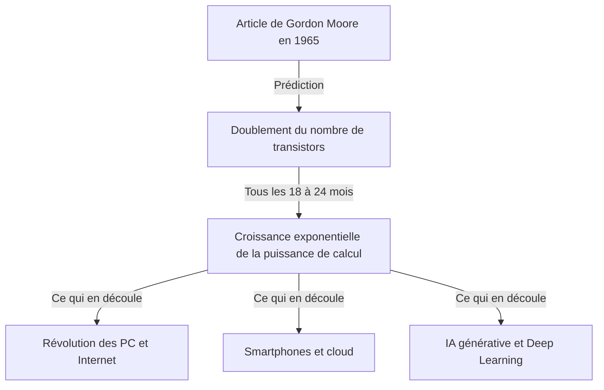
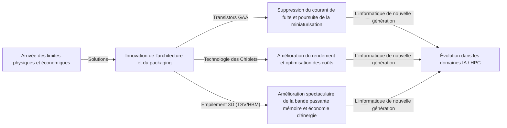

# Qu'est-ce que la loi de Moore ? La trajectoire des semi-conducteurs et de l'évolution géométrique

Notre société évolue rapidement grâce à des technologies telles que les smartphones, le cloud computing et l'intelligence artificielle (IA). Le fondement de ces technologies repose sur les « semi-conducteurs (micropuces) », et c'est la célèbre **« loi de Moore (Moore's Law) »** qui a déterminé l'histoire de leur évolution.

Dans cet article, du point de vue d'un rédacteur technique professionnel, nous explorerons en profondeur la loi de Moore : son contexte historique, son mécanisme technique, son impact sur les affaires et l'économie, les limites physiques auxquelles elle est actuellement confrontée, ainsi que les technologies informatiques de nouvelle génération au-delà de la « fin de la loi de Moore ».

---

## 1. La naissance de la loi de Moore et son contexte historique

### L'intuition de Gordon Moore en 1965
La loi de Moore trouve son origine dans un court article publié en 1965 dans le magazine *Electronics* par Gordon Moore, co-fondateur d'Intel. À l'époque, il travaillait chez Fairchild Semiconductor. Il a publié une observation selon laquelle le nombre de transistors sur un circuit intégré (CI) « doublait environ chaque année ».

Par la suite, en 1975, Moore a lui-même révisé sa prédiction, la redéfinissant comme un doublement « environ tous les 18 à 24 mois (2 ans) ». C'est aujourd'hui la théorie établie de la « loi de Moore » telle que nous la connaissons.

### Pourquoi l'appelle-t-on une « loi » ?
À proprement parler, la loi de Moore n'est pas une « loi (Law) » absolue en physique ou en mathématiques. Il s'agit d'une « règle empirique (Rule of thumb) » qui a servi de « feuille de route » à l'industrie.
Les fabricants de semi-conducteurs, notamment Intel, ont partagé un sentiment d'urgence : « Si nous ne doublons pas nos performances tous les deux ans, nous serons battus par la concurrence », et ont massivement investi en recherche et développement (R&D) et en équipements pour atteindre cet objectif. En d'autres termes, la loi de Moore est le « stimulateur cardiaque de l'économie et de l'innovation » que l'ensemble de l'industrie des semi-conducteurs a réalisé comme une prophétie autoréalisatrice.

---

## 2. La redoutable évolution géométrique (croissance exponentielle)

Le concept le plus important pour comprendre la loi de Moore est **« l'évolution géométrique (croissance exponentielle : Exponential Growth) »**.
Le cerveau humain a tendance à prévoir un changement « linéaire (Linear) ». Par exemple, l'idée que « si vous avancez d'un pas chaque jour, vous ferez 30 pas en 30 jours ». Cependant, dans une croissance géométrique, cela augmente par un jeu de doublement : « 1, 2, 4, 8, 16, 32... ».

Si l'on répète le doublement 30 fois, le nombre final dépasse le milliard (2 à la puissance 30). Dans le monde des semi-conducteurs, ce doublement s'est poursuivi pendant plus de 50 ans, si bien que les ordinateurs, qui occupaient à l'origine la taille d'une pièce, tiennent désormais dans nos poches et équipent même nos montres (smartwatches).

---

## 3. Le mécanisme de miniaturisation des semi-conducteurs : Comment augmenter la densité d'intégration ?

L'approche de base pour augmenter le nombre de transistors (augmenter la densité d'intégration) est la « miniaturisation (Scaling) ». Si les transistors peuvent être fabriqués plus petits, un plus grand nombre de transistors peuvent être placés sur une tranche de silicium (wafer) de la même surface.

### Le défi des limites de la photolithographie
Les semi-conducteurs sont fabriqués à l'aide d'une technique appelée « photolithographie (technologie d'exposition à la lumière) ». Une résine photosensible (photorésist) est appliquée sur une tranche de silicium, et la lumière est projetée à travers un masque sur lequel est dessiné un motif de circuit pour transférer le circuit.
Afin de dessiner des circuits plus fins, une lumière avec une longueur d'onde plus courte est nécessaire.
Pendant de nombreuses années, l'industrie a lutté pour raccourcir la longueur d'onde de la lumière.
- **De la lumière visible à la lumière ultraviolette**
- **Laser excimère (KrF, ArF)**
- **Technologie de lithographie par immersion**
- Et la technologie de pointe actuelle, **la lithographie EUV (Ultraviolet Extrême : Extreme Ultraviolet)**

Les équipements de lithographie EUV, fabriqués exclusivement par la société néerlandaise ASML, utilisent une lumière d'une longueur d'onde de seulement 13,5 nanomètres pour dessiner des circuits extrêmement fins. Le développement de cet équipement a nécessité des décennies et des milliards d'investissements, mais c'est ce qui rend possible la fabrication actuelle de semi-conducteurs de pointe tels que les processus de 5 nm et 3 nm.

---

## 4. L'impact de la loi de Moore sur les affaires et l'économie

La loi de Moore est bien plus qu'un simple indicateur technique ; elle a fondamentalement transformé la structure de l'économie mondiale.

### Pression déflationniste et réduction drastique des coûts
Un doublement de la densité des transistors signifie que l'on obtient « une puissance de calcul doublée pour le même coût », ou « la même puissance de calcul pour la moitié du coût ». Cette réduction drastique des coûts a favorisé la numérisation (transformation numérique : DX) dans toutes les industries.
Avec des ressources informatiques passant de « rares et chères » à « abondantes et bon marché », de nouveaux modèles économiques sont apparus les uns après les autres.

### Création de nouvelles industries
1. **La vulgarisation des ordinateurs personnels (PC) :** Des années 1980 aux années 1990, les individus ont pu posséder des ordinateurs.
2. **Internet et entreprises du web :** Dans les années 2000, des serveurs et des équipements de communication bon marché ont relié le monde entier via des réseaux.
3. **Smartphones et économie mobile :** Dans les années 2010, les appareils tenant dans la paume de la main ont atteint des performances comparables à celles des superordinateurs, et la sphère économique des applications a connu une croissance explosive.
4. **Cloud et IA :** Depuis les années 2020, l'apprentissage profond (Deep Learning) et l'IA générative (Generative AI), qui nécessitent d'énormes ressources de calcul, se développent. Ceux-ci dépendent entièrement de l'évolution des capacités de calcul massivement parallèle des GPU (processeurs graphiques).

---

## 5. Les limites de la loi de Moore et les barrières physiques rencontrées

Bien que la rumeur selon laquelle « la loi est morte » ait couru à de nombreuses reprises depuis des années, la loi de Moore a survécu, mais elle est aujourd'hui confrontée à de véritables limites physiques. Les trois principaux obstacles sont :

### 1. Effet tunnel quantique et courant de fuite
Lorsque la taille des transistors (en particulier la longueur de grille) est réduite à l'échelle de quelques nanomètres (la taille de quelques à quelques dizaines d'atomes), les lois classiques de la physique ne s'appliquent plus et des phénomènes de mécanique quantique deviennent prédominants. L'exemple le plus marquant est « l'effet tunnel quantique ».
Même si l'on tente de couper le courant en mettant l'interrupteur sur « off », les électrons traversent la barrière et circulent (courant de fuite : Leakage current), ce qui entraîne une augmentation de la consommation d'énergie et des dysfonctionnements.

### 2. Le mur de la chaleur (problème du silicium sombre)
À mesure que la densité des transistors sur une puce augmente, la densité de chaleur générée monte en flèche. Le phénomène par lequel la technologie de refroidissement ne peut pas suivre le rythme et où il devient impossible de faire fonctionner simultanément toute la puce à pleine capacité est appelé « silicium sombre (Dark Silicon) ». L'industrie est confrontée au dilemme de ne pas pouvoir exploiter pleinement les performances en raison des contraintes thermiques, même si la capacité de calcul est augmentée.

### 3. Les limites économiques (Loi de Rock)
Il existe une règle empirique appelée « deuxième loi de Moore » ou « Loi de Rock (Rock's Law) ». Celle-ci stipule que « le coût de construction d'une usine de fabrication de semi-conducteurs double à chaque génération ». La construction d'une usine de pointe (fab) nécessite aujourd'hui un investissement de l'ordre de 2 000 à 3 000 milliards de yens, et seules quelques entreprises dans le monde, comme TSMC, Samsung Electronics et Intel, peuvent supporter ces coûts faramineux.

---

## 6. More than Moore (Au-delà de la loi de Moore)

Alors que l'amélioration de la densité d'intégration par simple miniaturisation (More Moore) approche de ses limites, l'industrie des semi-conducteurs s'oriente vers l'amélioration des performances par de nouvelles approches, à savoir « More than Moore ».

### Évolution de l'architecture (du FinFET au GAA)
Le passage d'une structure de transistor plane (type planaire) à une structure tridimensionnelle **FinFET (transistor à effet de champ à ailettes)** a permis de réduire les courants de fuite, mais actuellement, la transition se fait vers une structure **GAA (Gate-All-Around)** où la grille entoure complètement le canal de tous les côtés. Cela maximise la contrôlabilité des électrons.

### Technologie des Chiplets
Plutôt que d'intégrer toutes les fonctions sur une seule énorme puce de silicium (matrice monolithique) comme par le passé, cette méthode divise les fonctions en puces plus petites (chiplets) pour la fabrication et les connecte au sein d'un seul boîtier à l'aide de technologies d'emballage (packaging) avancées. Cela améliore considérablement le rendement (taux de produits conformes) et augmente les performances globales tout en maintenant les coûts à un niveau bas. Cette approche a connu un grand succès avec les processeurs Ryzen d'AMD et est en train de devenir la norme.

### Packaging 2.5D / 3D et technologie d'empilement
En plus d'aligner les puces sur un plan (2D), on les empile verticalement (3D) en utilisant des technologies telles que les vias à travers le silicium (TSV), ce qui augmente considérablement la vitesse de communication entre les puces (bande passante) et réduit la consommation d'énergie. Cette technologie d'emballage avancée est indispensable pour connecter les GPU de pointe pour l'IA (comme le H100 de NVIDIA) et la mémoire HBM (High Bandwidth Memory).

---

## 7. Informatique de nouvelle génération dans l'ère post-Moore

En anticipant les limites des semi-conducteurs à base de silicium, la recherche sur des technologies informatiques basées sur des principes entièrement nouveaux progresse également rapidement. Celles-ci ont le potentiel de devenir les acteurs principaux de « l'ère post-Moore ».

### Informatique quantique (Quantum Computing)
En exploitant les propriétés de la mécanique quantique telles que la « superposition » et l'« intrication quantique », on s'attend à ce que ces ordinateurs puissent résoudre instantanément des problèmes spécifiques (décryptage, simulation moléculaire de nouveaux médicaments, problèmes d'optimisation, etc.) qui prendraient des centaines de millions d'années à résoudre avec des ordinateurs conventionnels (ordinateurs classiques). La recherche est très concurrentielle et implique diverses méthodes telles que les supraconducteurs, les pièges à ions et les quanta de lumière.

### Informatique neuromorphique (ordinateur de type cerveau)
Il s'agit d'une technologie qui imite le fonctionnement des réseaux de neurones (neurones et synapses) du cerveau humain au niveau matériel physique. Contrairement à l'architecture de von Neumann actuelle (où le processeur et la mémoire sont séparés, créant un goulot d'étranglement pour le transfert de données), elle traite l'information et stocke la mémoire simultanément, ce qui permet la reconnaissance de formes et l'apprentissage avec une consommation d'énergie extrêmement faible.

### Informatique optique (Optical Computing)
C'est une technologie qui utilise des photons au lieu d'électrons pour le traitement de l'information et la transmission de données. Comme la lumière est plus rapide que les signaux électriques et génère moins de perte d'énergie et de chaleur, elle est prometteuse en tant qu'infrastructure informatique ultra-rapide et à faible consommation de nouvelle génération. En particulier, la technologie « photonique sur silicium », qui transmet des données entre les puces par la lumière, est déjà entrée dans la phase d'application pratique.

---

## 8. Conclusion : L'héritage de la loi de Moore et notre avenir

La « loi de Moore », présentée par Gordon Moore en 1965, n'était pas qu'une simple prédiction technique sur les semi-conducteurs. Elle a donné à l'humanité la vision ferme que « la technologie peut continuer à évoluer de manière exponentielle », et on peut dire que c'était un « grand contrat social » qui a poussé des millions d'ingénieurs et de chercheurs vers le même objectif.

Même si la miniaturisation des transistors sur silicium atteint ses limites physiques, l'innovation humaine visant à améliorer les capacités de calcul ne s'arrêtera pas. De nouveaux paradigmes tels que les chiplets, l'empilement 3D, les architectures spécialisées en IA et les ordinateurs quantiques hériteront de l'esprit de la loi de Moore et continueront de guider notre société vers des territoires inexplorés.

Ce qui est attendu des chefs d'entreprise et des ingénieurs du futur, c'est de comprendre le rythme de cette « évolution technologique géométrique », de discerner les prochaines avancées et de continuer à s'adapter pour ne pas rater la vague de changement. L'histoire de l'évolution des semi-conducteurs est le miroir qui reflète directement l'avenir de l'humanité.
