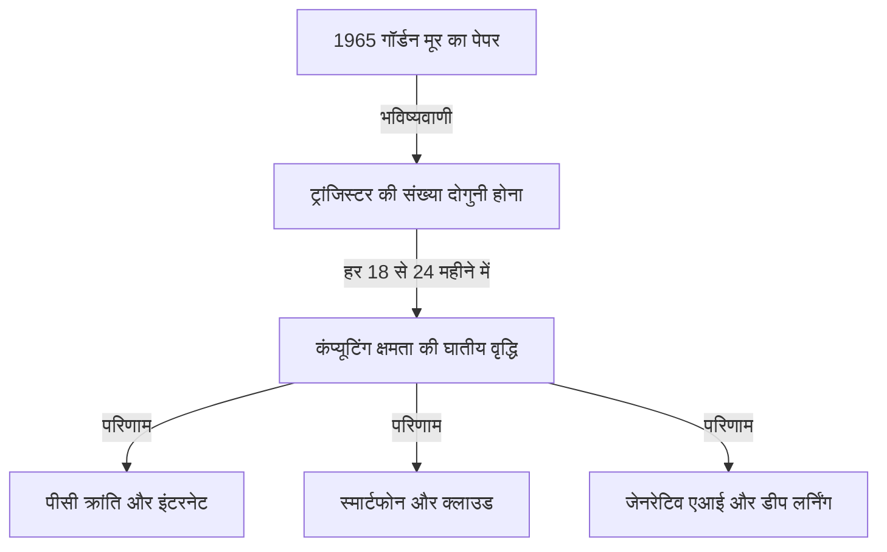
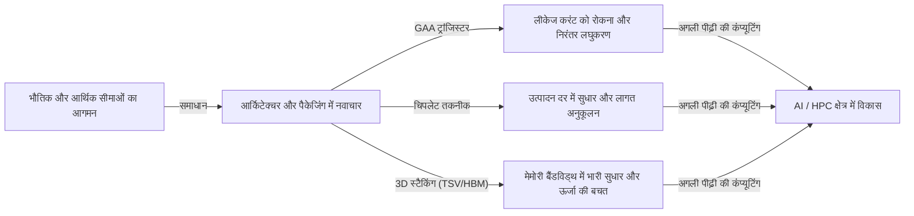

# मूर का नियम क्या है? सेमीकंडक्टर और घातीय विकास का पथ

हमारा समाज स्मार्टफोन, क्लाउड कंप्यूटिंग और आर्टिफिशियल इंटेलिजेंस (AI) जैसी तकनीकों के माध्यम से तेजी से बदल रहा है। इन तकनीकी नींवों का समर्थन करने वाले "सेमीकंडक्टर (माइक्रोचिप्स)" हैं, और उनके विकास के इतिहास को प्रसिद्ध **"मूर का नियम (Moore's Law)"** द्वारा निर्धारित किया गया है।

इस लेख में, एक पेशेवर तकनीकी लेखक के दृष्टिकोण से, हम मूर के नियम की ऐतिहासिक पृष्ठभूमि, तकनीकी तंत्र, व्यापार और अर्थव्यवस्था पर इसके प्रभाव, वर्तमान में सामने आने वाली भौतिक सीमाओं और "मूर के नियम के अंत" से परे अगली पीढ़ी की कंप्यूटिंग तकनीक का गहराई से विश्लेषण करेंगे।

---

## 1. मूर के नियम का जन्म और ऐतिहासिक पृष्ठभूमि

### 1965 में गॉर्डन मूर की अंतर्दृष्टि
मूर के नियम की उत्पत्ति एक छोटे से शोध पत्र से हुई है जिसे इंटेल (Intel) के सह-संस्थापकों में से एक, गॉर्डन मूर (Gordon Moore) ने 1965 में 'इलेक्ट्रॉनिक्स (Electronics)' पत्रिका में प्रकाशित किया था। उस समय वह फेयरचाइल्ड सेमीकंडक्टर में कार्यरत थे। उन्होंने यह अवलोकन प्रस्तुत किया कि एक एकीकृत सर्किट (IC) पर पैक किए जा सकने वाले ट्रांजिस्टर की संख्या "हर साल लगभग दोगुनी हो रही है।"

बाद में, 1975 में, मूर ने स्वयं अपनी भविष्यवाणी को संशोधित किया और इसे "हर 18 से 24 महीने (2 साल) में दोगुना" के रूप में फिर से परिभाषित किया। यही आज हमारे द्वारा जाना जाने वाला "मूर का नियम" का स्थापित सिद्धांत बन गया है।

### इसे "नियम" क्यों कहा जाने लगा?
कड़ाई से देखा जाए तो, मूर का नियम भौतिकी या गणित का कोई पूर्ण "नियम (Law)" नहीं है। यह एक "अनुभवजन्य नियम (Rule of thumb)" है जिसने उद्योग के "रोडमैप" के रूप में कार्य किया है।
इंटेल और अन्य सेमीकंडक्टर निर्माताओं ने इस तात्कालिकता को साझा किया कि "यदि हम हर दो साल में प्रदर्शन को दोगुना नहीं करते हैं, तो हम प्रतिस्पर्धा में हार जाएंगे," और उन्होंने इसे अनुसंधान और विकास (R&D) और पूंजी निवेश में भारी निवेश करने के लक्ष्य के रूप में इस्तेमाल किया। दूसरे शब्दों में, मूर का नियम "अर्थव्यवस्था और नवाचार का पेसमेकर" है जिसे पूरे सेमीकंडक्टर उद्योग ने स्वयं को पूरा करने वाली भविष्यवाणी के रूप में महसूस किया है।

---

## 2. घातीय विकास (Exponential Growth) की भयावहता

मूर के नियम को समझने के लिए सबसे महत्वपूर्ण अवधारणा **"घातीय विकास (Exponential Growth)"** है।
मानव मस्तिष्क आमतौर पर "रैखिक (Linear)" परिवर्तनों की भविष्यवाणी करने की प्रवृत्ति रखता है। उदाहरण के लिए, यह विचार कि "यदि आप हर दिन एक कदम आगे बढ़ते हैं, तो आप 30 दिनों में 30 कदम आगे बढ़ेंगे।" हालाँकि, घातीय वृद्धि में, यह दोगुने के खेल में "1, 2, 4, 8, 16, 32..." की दर से बढ़ता है।

यदि 30 बार दोगुना किया जाए, तो अंतिम संख्या 1 बिलियन (2 की 30वीं घात) को पार कर जाती है। सेमीकंडक्टर की दुनिया में, चूँकि यह दोहरीकरण पिछले 50 से अधिक वर्षों से जारी है, ऐसे कंप्यूटर जो मूल रूप से एक कमरे का आकार घेरते थे, अब हमारी जेब में फिट हो जाते हैं और यहां तक ​​कि कलाई घड़ियों (स्मार्टवॉच) में भी स्थापित किए जा रहे हैं।

---

## 3. सेमीकंडक्टर लघुकरण का तंत्र: एकीकरण घनत्व को कैसे बढ़ाया जाए?

ट्रांजिस्टर की संख्या बढ़ाने (एकीकरण घनत्व बढ़ाने) का मूल दृष्टिकोण "लघुकरण (Scaling)" है। यदि ट्रांजिस्टर को छोटा बनाया जा सकता है, तो सिलिकॉन वेफर के समान क्षेत्र में अधिक ट्रांजिस्टर रखे जा सकते हैं।

### फोटोलिथोग्राफी की सीमाओं को चुनौती
सेमीकंडक्टर का निर्माण "फोटोलिथोग्राफी (प्रकाश जोखिम तकनीक)" नामक विधि का उपयोग करके किया जाता है। एक प्रकाश-संवेदनशील राल (फोटोरेसिस्ट) को सिलिकॉन वेफर पर लगाया जाता है, और सर्किट पैटर्न को स्थानांतरित करने के लिए उस पर खींचे गए सर्किट पैटर्न वाले मुखौटे के माध्यम से प्रकाश डाला जाता है।
बारीक सर्किट खींचने के लिए, छोटी तरंग दैर्ध्य वाले प्रकाश की आवश्यकता होती है।
प्रकाश की तरंग दैर्ध्य को छोटा करने के लिए उद्योग वर्षों से संघर्ष कर रहा है।
- **दृश्य प्रकाश से पराबैंगनी प्रकाश तक**
- **एक्सीमर लेजर (KrF, ArF)**
- **विसर्जन लिथोग्राफी (Immersion Lithography)**
- और वर्तमान अत्याधुनिक: **EUV (एक्सट्रीम अल्ट्रावायलेट) लिथोग्राफी**

अत्यंत बारीक सर्किट खींचने के लिए डच कंपनी ASML द्वारा विशेष रूप से निर्मित EUV लिथोग्राफी उपकरण मात्र 13.5 नैनोमीटर तरंग दैर्ध्य के प्रकाश का उपयोग करता है। इस उपकरण को विकसित करने में दशकों और खरबों येन का निवेश लगा, लेकिन यही वह चीज़ है जो वर्तमान में अत्याधुनिक सेमीकंडक्टर्स, जैसे 5nm और 3nm प्रक्रियाओं के निर्माण को संभव बना रही है।

---

## 4. मूर के नियम का व्यापार और अर्थव्यवस्था पर प्रभाव

मूर का नियम केवल एक तकनीकी मीट्रिक नहीं रहा; इसने वैश्विक अर्थव्यवस्था की संरचना को मौलिक रूप से बदल दिया।

### अपस्फीतिकारी दबाव और लागत में भारी कमी
ट्रांजिस्टर घनत्व के दोगुने होने का अर्थ है कि "समान लागत पर दोगुनी कंप्यूटिंग शक्ति उपलब्ध है," या "समान कंप्यूटिंग शक्ति आधी लागत पर उपलब्ध है।" लागत में इस भारी गिरावट ने सभी उद्योगों में डिजिटलीकरण (डिजिटल ट्रांसफॉर्मेशन: DX) को बढ़ावा दिया है।
जैसे-जैसे कंप्यूटिंग संसाधन "दुर्लभ और महंगे" से "प्रचुर और सस्ते" में बदले, नए व्यापार मॉडल एक के बाद एक उभरे।

### नए उद्योगों का निर्माण
1. **पर्सनल कंप्यूटर (PC) का प्रसार:** 1980 से 1990 के दशक तक, व्यक्ति कंप्यूटर के मालिक बनने में सक्षम हुए।
2. **इंटरनेट और वेब व्यवसाय:** 2000 के दशक में, सस्ते सर्वर और संचार उपकरणों ने दुनिया को नेटवर्क के माध्यम से जोड़ दिया।
3. **स्मार्टफोन और मोबाइल अर्थव्यवस्था:** 2010 के दशक में, हथेली के आकार के उपकरणों ने सुपरकंप्यूटर जैसा प्रदर्शन हासिल किया, और ऐप अर्थव्यवस्था में विस्फोटक रूप से वृद्धि हुई।
4. **क्लाउड और AI:** 2020 के दशक के बाद से, डीप लर्निंग और जनरेटिव AI (Generative AI), जिनके लिए भारी कम्प्यूटेशनल संसाधनों की आवश्यकता होती है, प्रमुख हो गए हैं। ये पूरी तरह से GPU (ग्राफिक्स प्रोसेसिंग सेमीकंडक्टर) की अति-समानांतर कंप्यूटिंग क्षमताओं के विकास पर निर्भर हैं।

---

## 5. मूर के नियम की सीमाएँ और सामना की जाने वाली भौतिक बाधाएँ

यद्यपि कई वर्षों से बार-बार यह कहा जा रहा है कि "नियम मर चुका है," मूर के नियम ने लंबे समय तक अपना जीवन बढ़ाया है, लेकिन अब यह वास्तविक भौतिक सीमाओं का सामना कर रहा है। मुख्य बाधाएँ निम्नलिखित तीन हैं:

### 1. क्वांटम टनलिंग प्रभाव और लीकेज करंट
जब ट्रांजिस्टर का आकार (विशेष रूप से गेट की लंबाई) कुछ नैनोमीटर (कुछ से कुछ दर्जन परमाणुओं के आकार) तक सिकुड़ जाता है, तो भौतिकी के शास्त्रीय नियम लागू नहीं होते हैं, और क्वांटम यांत्रिक घटनाएं प्रमुख हो जाती हैं। इसका सबसे विशिष्ट उदाहरण "क्वांटम टनलिंग प्रभाव" है।
यहां तक ​​कि अगर आप स्विच को "बंद" करने और करंट को रोकने की कोशिश करते हैं, तो इलेक्ट्रॉन बाधा से गुजरते हैं और प्रवाहित होते हैं (लीकेज करंट), जिससे बिजली की खपत बढ़ जाती है और खराबी आ जाती है।

### 2. थर्मल दीवार (डार्क सिलिकॉन समस्या)
जैसे-जैसे चिप पर ट्रांजिस्टर का घनत्व बढ़ता है, उत्पन्न गर्मी का घनत्व भी तेजी से बढ़ता है। वह घटना जिसमें कूलिंग तकनीक तालमेल नहीं बिठा पाती है, जिससे पूरी चिप को एक साथ पूरी क्षमता से चलाना असंभव हो जाता है, "डार्क सिलिकॉन (Dark Silicon)" कहलाती है। कंप्यूटिंग शक्ति बढ़ाने के बावजूद, हम इस दुविधा में हैं कि थर्मल बाधाओं के कारण हम इसके वास्तविक प्रदर्शन को बाहर नहीं ला पा रहे हैं।

### 3. आर्थिक सीमाएँ (रॉक का नियम)
"मूर के नियम का दूसरा नियम" या "रॉक का नियम (Rock's Law)" नामक एक अनुभवजन्य नियम भी है। यह बताता है कि "सेमीकंडक्टर निर्माण संयंत्र बनाने की लागत हर पीढ़ी के साथ दोगुनी हो जाती है।" एक अत्याधुनिक फैब (निर्माण संयंत्र) के निर्माण के लिए आज 2 ट्रिलियन से 3 ट्रिलियन येन के निवेश की आवश्यकता है, और दुनिया में केवल तीन कंपनियां, TSMC, सैमसंग इलेक्ट्रॉनिक्स और इंटेल, इस भारी लागत को वहन कर सकती हैं।

---

## 6. More than Moore (मूर के नियम से परे)

चूंकि साधारण लघुकरण (More Moore) के माध्यम से एकीकरण घनत्व में वृद्धि अपनी सीमा तक पहुंच रही है, सेमीकंडक्टर उद्योग नए दृष्टिकोणों के माध्यम से प्रदर्शन में सुधार की ओर बढ़ रहा है, जिसे "More than Moore" कहा जाता है।

### आर्किटेक्चर का विकास (FinFET से GAA तक)
हालांकि लीकेज करंट को फ्लैट ट्रांजिस्टर संरचना (प्लानर प्रकार) से त्रि-आयामी संरचना वाले **FinFET (फिन-टाइप फील्ड इफेक्ट ट्रांजिस्टर)** में स्थानांतरित करके दबा दिया गया था, अब एक **GAA (Gate-All-Around)** संरचना की ओर संक्रमण चल रहा है, जहां गेट पूरी तरह से चैनल को घेरता है। यह चरम सीमा तक इलेक्ट्रॉनों के नियंत्रण को अधिकतम करता है।

### चिपलेट (Chiplet) तकनीक
अतीत में, सभी कार्यों को एक विशाल सिलिकॉन चिप (मोनोलिथिक डाई) में पैक किया जाता था। अब, उन्हें फ़ंक्शन द्वारा छोटी चिप्स (चिपलेट्स) में विभाजित करके निर्मित किया जाता है, और फिर उन्हें उन्नत पैकेजिंग तकनीक का उपयोग करके एक एकल पैकेज के भीतर जोड़ा जाता है। इससे यील्ड (अच्छे उत्पादों की दर) में भारी सुधार हुआ है, जिससे लागत कम रखते हुए समग्र प्रदर्शन में वृद्धि संभव हो गई है। इसने AMD के Ryzen प्रोसेसर के साथ बड़ी सफलता हासिल की है और भविष्य की मुख्यधारा बन गई है।

### 2.5D / 3D पैकेजिंग और स्टैकिंग तकनीक
चिप्स को केवल एक समतल (2D) विमान पर व्यवस्थित करने के बजाय, उन्हें सिलिकॉन थ्रू-सिलिकॉन विअस (TSV) जैसी तकनीकों का उपयोग करके लंबवत (3D) स्टैक किया जाता है, जिससे चिप्स के बीच संचार गति (बैंडविड्थ) में नाटकीय रूप से सुधार होता है और बिजली की खपत कम होती है। एआई (जैसे NVIDIA के H100) के लिए अत्याधुनिक GPU को HBM (हाई बैंडविड्थ मेमोरी) से जोड़ने के लिए यह उन्नत पैकेजिंग तकनीक आवश्यक है।

---

## 7. पोस्ट-मूर युग में अगली पीढ़ी की कंप्यूटिंग

सिलिकॉन-आधारित सेमीकंडक्टर्स की सीमाओं का अनुमान लगाते हुए, पूरी तरह से नए सिद्धांतों पर आधारित कंप्यूटिंग तकनीक पर शोध तेजी से आगे बढ़ रहा है। इनमें "पोस्ट-मूर युग" के नायक बनने की क्षमता है।

### क्वांटम कंप्यूटिंग (Quantum Computing)
क्वांटम यांत्रिकी के "सुपरपोजिशन" और "क्वांटम उलझाव (entanglement)" जैसे गुणों का उपयोग करके, विशिष्ट समस्याओं (कोड क्रैकिंग, नई दवा आणविक सिमुलेशन, अनुकूलन समस्याएं, आदि) को तुरंत हल करने की उम्मीद है जिन्हें हल करने में पारंपरिक कंप्यूटर (क्लासिक कंप्यूटर) को करोड़ों वर्ष लगेंगे। सुपरकंडक्टिविटी, आयन ट्रैप्स और ऑप्टिकल क्वांटम जैसे विभिन्न तरीकों में भयंकर प्रतिस्पर्धा चल रही है।

### न्यूरोमॉर्फिक कंप्यूटिंग (ब्रेन-टाइप कंप्यूटर)
यह एक ऐसी तकनीक है जो भौतिक हार्डवेयर स्तर पर मानव मस्तिष्क के तंत्रिका नेटवर्क (न्यूरॉन्स और सिनैप्स) की संरचना की नकल करती है। वर्तमान वॉन न्यूमैन आर्किटेक्चर के विपरीत (जहां सीपीयू और मेमोरी अलग-अलग हैं, जिससे डेटा ट्रांसफर बाधा उत्पन्न होती है), सूचना प्रसंस्करण और मेमोरी को एक साथ निष्पादित करके, यह अत्यधिक कम बिजली की खपत के साथ पैटर्न पहचान और सीखने का कार्य कर सकता है।

### ऑप्टिकल कंप्यूटिंग (Optical Computing)
यह एक ऐसी तकनीक है जो सूचना को संसाधित करने और डेटा संचारित करने के लिए इलेक्ट्रॉनों के बजाय फोटॉन (प्रकाश कणों) का उपयोग करती है। चूंकि प्रकाश विद्युत संकेतों की तुलना में तेज है और इसमें कम ऊर्जा हानि और गर्मी उत्पादन होता है, इसलिए यह अगली पीढ़ी की अल्ट्रा-हाई स्पीड और कम बिजली खपत वाली कंप्यूटिंग नींव होने की उम्मीद है। विशेष रूप से, "सिलिकॉन फोटोनिक्स (Silicon Photonics)" तकनीक, जो चिप्स के बीच डेटा को वैकल्पिक रूप से संचारित करती है, पहले ही व्यावहारिक अनुप्रयोग के चरण में प्रवेश कर चुकी है।

---

## 8. निष्कर्ष: मूर के नियम की विरासत और हमारा भविष्य

1965 में गॉर्डन मूर द्वारा प्रस्तुत "मूर का नियम" सेमीकंडक्टर्स के लिए केवल एक तकनीकी भविष्यवाणी नहीं थी। इसने मानवता को एक दृढ़ दृष्टिकोण दिया कि "प्रौद्योगिकी घातीय रूप से विकसित होती रह सकती है," और इसे एक "भव्य सामाजिक अनुबंध" कहा जा सकता है जिसने लाखों इंजीनियरों और शोधकर्ताओं को एक ही लक्ष्य की ओर प्रेरित किया।

भले ही सिलिकॉन पर ट्रांजिस्टर का लघुकरण अपनी भौतिक सीमा तक पहुँच जाए, कंप्यूटिंग शक्ति में सुधार के लिए मानवता का नवाचार कभी नहीं रुकेगा। चिपलेट, 3डी स्टैकिंग, एआई-विशिष्ट आर्किटेक्चर और क्वांटम कंप्यूटर जैसे नए प्रतिमान मूर के नियम की भावना को आगे बढ़ाएंगे और हमारे समाज को अज्ञात क्षेत्रों में ले जाना जारी रखेंगे।

आज के और भविष्य के व्यापारिक नेताओं और इंजीनियरों के लिए जो आवश्यक है वह यह है कि इस "घातीय तकनीकी विकास" की गति को समझें, भविष्यवाणी करें कि अगला बड़ा सुधार (ब्रेकथ्रू) क्या होगा, और यह सुनिश्चित करने के लिए अनुकूलन करना जारी रखें कि हम परिवर्तन की लहर में पीछे न रहें। सेमीकंडक्टर विकास का इतिहास ही मानवता के भविष्य को दर्शाने वाला एक दर्पण है।
