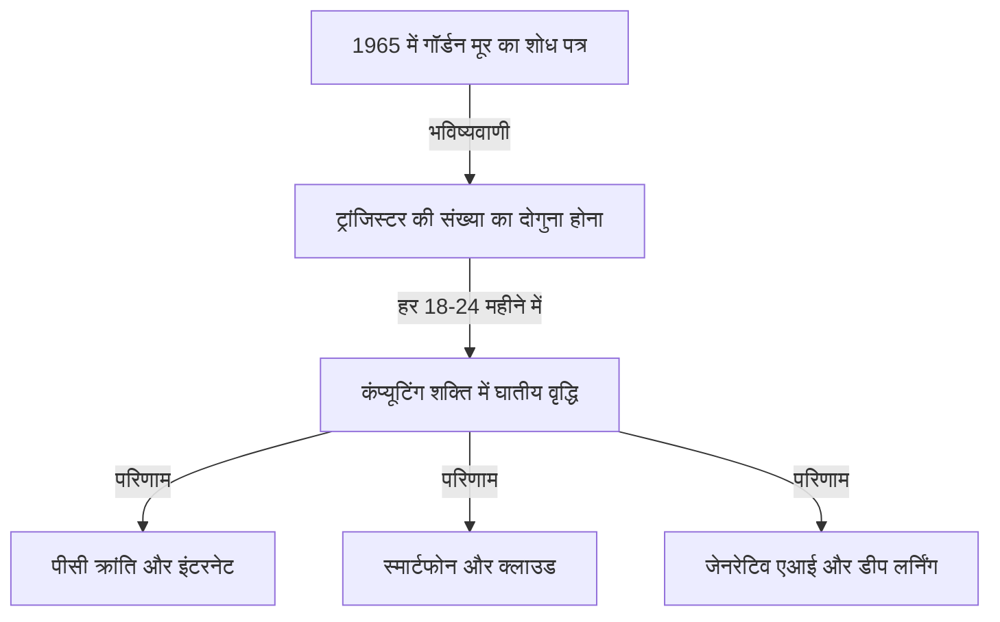
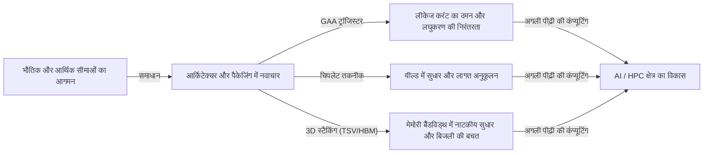

# मूर का नियम क्या है? सेमीकंडक्टर्स और घातीय विकास का प्रक्षेपवक्र

हमारा समाज स्मार्टफोन, क्लाउड कंप्यूटिंग और आर्टिफिशियल इंटेलिजेंस (AI) जैसी तकनीकों के माध्यम से तेजी से बदल रहा है। इस तकनीकी आधार का समर्थन "सेमीकंडक्टर (माइक्रोचिप)" कर रहे हैं, और इसके विकास के इतिहास को प्रसिद्ध **"मूर के नियम (Moore's Law)"** ने निर्धारित किया है।

इस लेख में, एक पेशेवर तकनीकी लेखक के दृष्टिकोण से, हम मूर के नियम की ऐतिहासिक पृष्ठभूमि, तकनीकी तंत्र, व्यापार और अर्थव्यवस्था पर प्रभाव, वर्तमान भौतिक सीमाओं और "मूर के नियम के अंत" से परे अगली पीढ़ी की कंप्यूटिंग तकनीकों की गहराई से व्याख्या करेंगे।

---

## 1. मूर के नियम का जन्म और ऐतिहासिक पृष्ठभूमि

### 1965 में गॉर्डन मूर की अंतर्दृष्टि
मूर के नियम की उत्पत्ति 1965 में 'इलेक्ट्रॉनिक्स' पत्रिका में इंटेल के सह-संस्थापक गॉर्डन मूर द्वारा लिखे गए एक छोटे से लेख से हुई। उस समय, वह फेयरचाइल्ड सेमीकंडक्टर में काम करते थे। उन्होंने यह अवलोकन प्रस्तुत किया कि इंटीग्रेटेड सर्किट (IC) पर लगे ट्रांजिस्टर की संख्या "हर साल दोगुनी" हो रही है।

बाद में 1975 में, मूर ने अपनी भविष्यवाणी को संशोधित किया और इसे फिर से परिभाषित किया कि यह संख्या "लगभग हर 18 से 24 महीने (2 साल) में दोगुनी हो जाएगी"। यही आज हमारे द्वारा जाने जाने वाले "मूर के नियम" का स्थापित सिद्धांत बन गया है।

### इसे "नियम" क्यों कहा जाने लगा?
तकनीकी रूप से, मूर का नियम भौतिकी या गणित का कोई पूर्ण "नियम" नहीं है। यह एक "अनुभवजन्य नियम (Rule of thumb)" है और इसने उद्योग के लिए एक "रोडमैप" के रूप में काम किया है।
इंटेल सहित विभिन्न सेमीकंडक्टर निर्माताओं ने एक संकट की भावना साझा की कि "यदि हम हर दो साल में प्रदर्शन दोगुना नहीं करते हैं, तो हम प्रतिस्पर्धा में हार जाएंगे।" इसे एक लक्ष्य मानकर, उन्होंने अनुसंधान और विकास (R&D) और सुविधाओं में भारी निवेश किया है। दूसरे शब्दों में, मूर का नियम "अर्थव्यवस्था और नवाचार का पेसमेकर" है जिसे पूरे सेमीकंडक्टर उद्योग ने स्व-सत्यापित भविष्यवाणी (Self-fulfilling prophecy) के रूप में साकार किया है।

---

## 2. घातीय विकास की भयावहता

मूर के नियम को समझने के लिए सबसे महत्वपूर्ण अवधारणा **"घातीय विकास (Exponential Growth)"** है।
मानव मस्तिष्क में आम तौर पर "रैखिक (Linear)" परिवर्तनों की भविष्यवाणी करने की प्रवृत्ति होती है। उदाहरण के लिए, "यदि आप हर दिन एक कदम आगे बढ़ते हैं, तो आप 30 दिनों में 30 कदम आगे बढ़ेंगे।" हालांकि, घातीय विकास में, यह "1, 2, 4, 8, 16, 32..." की तरह दोगुना होता चला जाता है।

30 बार दोगुना होने के बाद, अंतिम संख्या 1 अरब (2 की घात 30) से अधिक हो जाती है। सेमीकंडक्टर की दुनिया में, यह दोहरीकरण पिछले 50 से अधिक वर्षों से जारी है, इसलिए एक कंप्यूटर जो शुरू में एक कमरे का आकार लेता था, अब हमारी जेब में समा सकता है और यहां तक कि कलाई घड़ियों (स्मार्टवॉच) में भी बनाया जा रहा है।

---

## 3. सेमीकंडक्टर लघुकरण (Miniaturization) का तंत्र: एकीकरण (Integration) कैसे बढ़ाया जाता है?

ट्रांजिस्टर की संख्या (एकीकरण बढ़ाने) को बढ़ाने का मूल दृष्टिकोण "लघुकरण (Scaling)" है। यदि ट्रांजिस्टर को छोटा बनाया जा सकता है, तो समान क्षेत्र के सिलिकॉन वेफर पर अधिक ट्रांजिस्टर रखे जा सकते हैं।

### फोटोलिथोग्राफी की सीमाओं को चुनौती
सेमीकंडक्टर्स का निर्माण "फोटोलिथोग्राफी" नामक तकनीक से किया जाता है। सिलिकॉन वेफर पर एक प्रकाश-संवेदनशील राल (फोटोरेसिस्ट) लगाया जाता है, और सर्किट पैटर्न वाले मास्क के माध्यम से प्रकाश डालकर सर्किट को स्थानांतरित किया जाता है।
महीन सर्किट खींचने के लिए, छोटी तरंग दैर्ध्य वाले प्रकाश की आवश्यकता होती है।
उद्योग कई वर्षों से प्रकाश की तरंग दैर्ध्य को छोटा करने के लिए संघर्ष कर रहा है।
- **दृश्यमान प्रकाश से पराबैंगनी (Ultraviolet) तक**
- **एक्साइमर लेजर (KrF, ArF)**
- **इमर्शन लिथोग्राफी तकनीक**
- और वर्तमान अत्याधुनिक **EUV (एक्सट्रीम अल्ट्रावॉयलेट) लिथोग्राफी**

डच कंपनी ASML द्वारा विशेष रूप से निर्मित EUV लिथोग्राफी मशीनें, केवल 13.5 नैनोमीटर की तरंग दैर्ध्य वाले प्रकाश का उपयोग करके अत्यंत महीन सर्किट खींचती हैं। इस उपकरण को विकसित करने में दशकों और ट्रिलियन येन के निवेश की आवश्यकता थी, लेकिन इसने 5nm और 3nm प्रक्रियाओं जैसे वर्तमान अत्याधुनिक सेमीकंडक्टर्स के निर्माण को संभव बना दिया है।

---

## 4. व्यापार और अर्थव्यवस्था पर मूर के नियम का प्रभाव

मूर का नियम केवल एक तकनीकी संकेतक नहीं है, इसने वैश्विक अर्थव्यवस्था की संरचना को मौलिक रूप से बदल दिया है।

### अपस्फीति का दबाव और लागत में भारी कमी
ट्रांजिस्टर घनत्व दोगुना होने का अर्थ है कि आपको "समान लागत पर दोगुनी कंप्यूटिंग शक्ति" मिलती है, या "समान कंप्यूटिंग शक्ति आधी लागत पर" मिलती है। इस नाटकीय लागत में कमी ने हर उद्योग में डिजिटलीकरण (डिजिटल ट्रांसफॉर्मेशन: DX) को बढ़ावा दिया है।
जैसे ही कंप्यूटिंग संसाधन "दुर्लभ और महंगे" से "प्रचुर और सस्ते" हो गए, नए बिजनेस मॉडल एक के बाद एक पैदा हुए।

### नए उद्योगों का निर्माण
1. **पर्सनल कंप्यूटर (PC) का प्रसार:** 1980 और 90 के दशक में, लोगों有时 के लिए कंप्यूटर का मालिक होना संभव हो गया।
2. **इंटरनेट और वेब व्यवसाय:** 2000 के दशक में, सस्ते सर्वर और संचार उपकरणों ने दुनिया को एक नेटवर्क से जोड़ दिया।
3. **स्मार्टफोन और मोबाइल अर्थव्यवस्था:** 2010 के दशक में, हथेली के आकार के उपकरणों में सुपरकंप्यूटर जैसा प्रदर्शन था, और ऐप अर्थव्यवस्था में विस्फोट हुआ।
4. **क्लाउड और AI:** 2020 के दशक के बाद से, डीप लर्निंग और जेनरेटिव AI (Generative AI), जिन्हें भारी कंप्यूटिंग संसाधनों की आवश्यकता होती है, प्रमुखता प्राप्त कर रहे हैं। ये पूरी तरह से GPU (ग्राफिक्स प्रोसेसिंग यूनिट) की बड़े पैमाने पर समानांतर कंप्यूटिंग क्षमताओं के विकास पर निर्भर करते हैं।

---

## 5. मूर के नियम की सीमाएँ और भौतिक बाधाएँ

मूर का नियम, जो "नियम मर चुका है" जैसी कई अफवाहों के बावजूद जीवित रहा है, अब वास्तविक भौतिक सीमाओं का सामना कर रहा है। मुख्य बाधाएँ निम्नलिखित तीन हैं:

### 1. क्वांटम टनलिंग प्रभाव और लीकेज करंट
जब ट्रांजिस्टर का आकार (विशेष रूप से गेट की लंबाई) कुछ नैनोमीटर (कुछ परमाणुओं से लेकर दर्जनों परमाणुओं के आकार) तक सिकुड़ जाता है, तो भौतिकी के शास्त्रीय नियम लागू नहीं होते हैं, और क्वांटम यांत्रिक घटनाएँ प्रमुख हो जाती हैं। इसका मुख्य उदाहरण "क्वांटम टनलिंग प्रभाव" है।
भले ही आप स्विच को "बंद (ऑफ)" करने और करंट को रोकने की कोशिश करें, इलेक्ट्रॉन बाधा से गुजर सकते हैं और प्रवाहित हो सकते हैं (लीकेज करंट), जिससे बिजली की खपत बढ़ जाती है और खराबी आ जाती है।

### 2. थर्मल वॉल (डार्क सिलिकॉन समस्या)
जैसे ही चिप पर ट्रांजिस्टर का घनत्व बढ़ता है, उत्पन्न गर्मी का घनत्व भी तेजी से बढ़ता है। उस घटना को "डार्क सिलिकॉन (Dark Silicon)" कहा जाता है, जहां कूलिंग तकनीक गति नहीं रख पाती है और पूरे चिप को एक ही समय में पूरी क्षमता से संचालित नहीं किया जा सकता है। हम एक ऐसी दुविधा में हैं जहाँ कंप्यूटिंग शक्ति बढ़ने पर भी थर्मल बाधाओं के कारण पूर्ण प्रदर्शन प्राप्त नहीं किया जा सकता है।

### 3. आर्थिक सीमाएँ (रॉक का नियम)
एक अनुभवजन्य नियम है जिसे "मूर के नियम का दूसरा नियम" या "रॉक का नियम (Rock's Law)" भी कहा जाता है। यह कहता है कि "सेमीकंडक्टर निर्माण संयंत्रों के निर्माण की लागत हर पीढ़ी के साथ दोगुनी हो जाती है।" एक अत्याधुनिक फैब (निर्माण संयंत्र) के निर्माण के लिए अब 2 से 3 ट्रिलियन येन के निवेश की आवश्यकता होती है, और इस भारी लागत को वहन करने में सक्षम कंपनियां दुनिया में केवल TSMC, सैमसंग इलेक्ट्रॉनिक्स और इंटेल जैसी तीन कंपनियों तक सीमित हो गई हैं।

---

## 6. मूर से परे (More than Moore)

चूंकि सरल लघुकरण (More Moore) के माध्यम से एकीकरण में सुधार अपनी सीमा के करीब पहुंच रहा है, सेमीकंडक्टर उद्योग नए दृष्टिकोणों के माध्यम से प्रदर्शन में सुधार, या "मूर से परे (More than Moore)" की ओर मुड़ रहा है।

### आर्किटेक्चर का विकास (FinFET से GAA तक)
प्लानर ट्रांजिस्टर संरचना से त्रि-आयामी संरचना वाले **FinFET (फिन-टाइप फील्ड इफेक्ट ट्रांजिस्टर)** में स्थानांतरित होकर लीकेज करंट को दबा दिया गया है, लेकिन अब **GAA (Gate-All-Around)** संरचना में परिवर्तन हो रहा है, जो गेट को सभी तरफ से घेरता है। इससे इलेक्ट्रॉनों के नियंत्रण को अधिकतम किया गया है।

### चिपलेट (Chiplet) तकनीक
पहले सभी कार्यों को एक विशाल सिलिकॉन चिप (मोनोलिथिक डाई) में पैक किया जाता था, लेकिन अब उन्हें फ़ंक्शन के आधार पर छोटे चिप्स (चिपलेट्स) में विभाजित करके निर्मित किया जाता है, और फिर उन्नत पैकेजिंग तकनीक का उपयोग करके एक ही पैकेज में जोड़ा जाता है। इससे यील्ड (अच्छे उत्पादों की दर) में काफी सुधार हुआ है और लागत को कम रखते हुए समग्र प्रदर्शन को बढ़ाना संभव हो गया है। इसे AMD के Ryzen प्रोसेसर आदि में बड़ी सफलता मिली है, और यह भविष्य की मुख्य धारा बन रहा है।

### 2.5D / 3D पैकेजिंग और स्टैकिंग तकनीक
चिप्स को केवल दो आयामों (2D) में व्यवस्थित करने के बजाय, थ्रू-सिलिकॉन वायस (TSV) जैसी तकनीकों का उपयोग करके उन्हें लंबवत रूप से (3D) स्टैक करने से चिप्स के बीच संचार गति (बैंडविड्थ) में काफी सुधार होता है और बिजली की खपत कम हो जाती है। एआई के लिए अत्याधुनिक जीपीयू (जैसे NVIDIA का H100) और HBM (High Bandwidth Memory) को जोड़ने के लिए यह उन्नत पैकेजिंग तकनीक आवश्यक है।

---

## 7. पोस्ट-मूर युग में अगली पीढ़ी की कंप्यूटिंग

सिलिकॉन-आधारित सेमीकंडक्टर्स की सीमाओं को देखते हुए, पूरी तरह से नए सिद्धांतों पर आधारित कंप्यूटिंग तकनीकों पर अनुसंधान तेजी से आगे बढ़ रहा है। इनमें "पोस्ट-मूर युग" में अग्रणी भूमिका निभाने की क्षमता है।

### क्वांटम कंप्यूटिंग (Quantum Computing)
क्वांटम यांत्रिकी के गुणों जैसे "सुपरपोजिशन" और "क्वांटम एंटैंगलमेंट" का उपयोग करके, यह उन विशिष्ट समस्याओं (क्रिप्टोग्राफी, नई दवाओं के आणविक सिमुलेशन, अनुकूलन समस्याओं, आदि) को तुरंत हल करने की उम्मीद है जिन्हें हल करने में पारंपरिक कंप्यूटर (शास्त्रीय कंप्यूटर) को करोड़ों साल लगेंगे। सुपरकंडक्टिंग, आयन ट्रैप, और फोटोनिक क्वांटम जैसे विभिन्न तरीकों पर शोध किया जा रहा है।

### न्यूरोमॉर्फिक कंप्यूटिंग (ब्रेन-इंस्पायर्ड कंप्यूटर)
यह एक ऐसी तकनीक है जो भौतिक हार्डवेयर स्तर पर मानव मस्तिष्क के तंत्रिका नेटवर्क (न्यूरॉन्स और सिनैप्स) के तंत्र की नकल करती है। वर्तमान वॉन न्यूमैन आर्किटेक्चर (जहाँ CPU और मेमोरी अलग-अलग हैं, जिससे डेटा ट्रांसफर में अड़चन आती है) के विपरीत, यह एक ही समय में सूचना प्रसंस्करण और मेमोरी करके अत्यंत कम बिजली की खपत के साथ पैटर्न पहचान और सीखने का कार्य कर सकती है।

### ऑप्टिकल कंप्यूटिंग (Optical Computing)
यह सूचना को संसाधित करने और डेटा संचारित करने के लिए इलेक्ट्रॉनों के बजाय फोटॉन का उपयोग करने वाली तकनीक है। चूंकि प्रकाश विद्युत संकेतों की तुलना में तेज होता है और इसमें कम ऊर्जा हानि और गर्मी उत्पादन होता है, इसलिए इसे अगली पीढ़ी के अल्ट्रा-हाई-स्पीड और कम-शक्ति कंप्यूटिंग आधार के रूप में देखा जा रहा है। विशेष रूप से, "सिलिकॉन फोटोनिक्स" तकनीक जो प्रकाश का उपयोग करके चिप्स के बीच डेटा प्रसारित करती है, पहले ही व्यावहारिक उपयोग के चरण में प्रवेश कर चुकी है।

---

## 8. निष्कर्ष: मूर के नियम की विरासत और हमारा भविष्य

गॉर्डन मूर द्वारा 1965 में प्रस्तुत किया गया "मूर का नियम" मात्र सेमीकंडक्टर प्रौद्योगिकी की भविष्यवाणी नहीं थी। यह कहा जा सकता है कि यह एक "भव्य सामाजिक अनुबंध" था जिसने मानवता को एक दृढ़ दृष्टिकोण दिया कि "प्रौद्योगिकी तेजी से विकसित हो सकती है," और लाखों इंजीनियरों और शोधकर्ताओं को एक ही लक्ष्य की ओर प्रेरित किया।

भले ही सिलिकॉन पर ट्रांजिस्टर का लघुकरण अपनी भौतिक सीमा तक पहुँच जाए, कंप्यूटिंग शक्ति में सुधार करने के लिए मानवता का नवाचार कभी नहीं रुकेगा। चिपलेट्स, 3D स्टैकिंग, एआई-विशिष्ट आर्किटेक्चर और क्वांटम कंप्यूटर जैसे नए प्रतिमान मूर के नियम की भावना को आगे बढ़ाएंगे और हमारे समाज को अज्ञात क्षेत्रों में ले जाते रहेंगे।

भविष्य के व्यापारिक नेताओं और इंजीनियरों के लिए जो आवश्यक है वह यह है कि इस "घातीय तकनीकी विकास" की गति को समझें, यह पता लगाएं कि अगली सफलता क्या होगी, और अनुकूलन करना जारी रखें ताकि वे परिवर्तन की लहर में पीछे न रहें। सेमीकंडक्टर विकास का इतिहास एक ऐसा दर्पण है जो मानवता के भविष्य को दर्शाता है।
