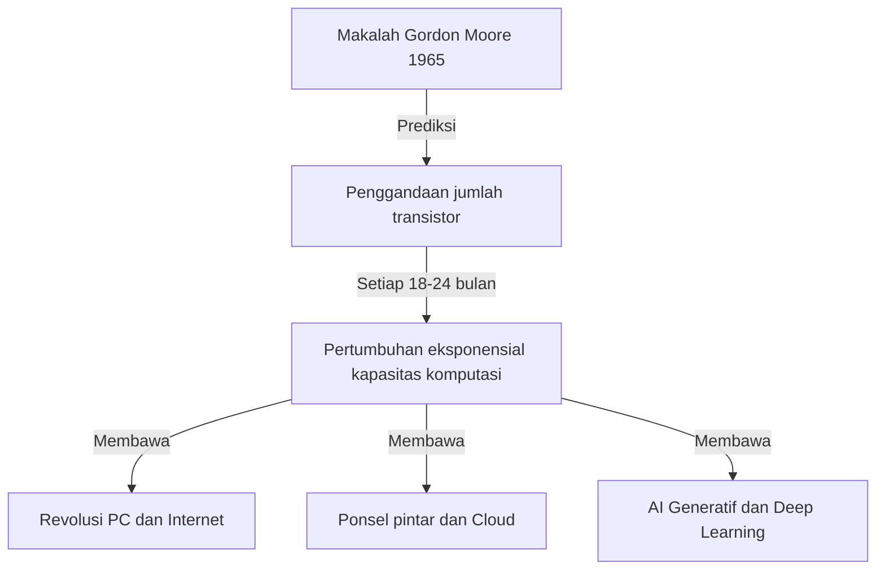
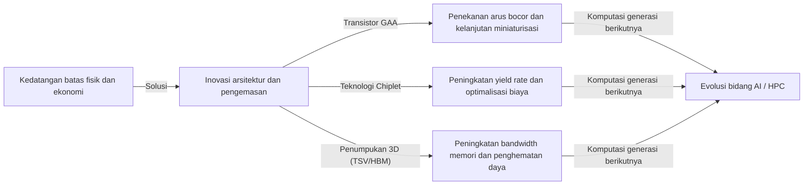

# Apa itu Hukum Moore? Jejak Semikonduktor dan Evolusi Eksponensial

Masyarakat kita berubah dengan cepat karena teknologi seperti ponsel pintar, komputasi awan, dan kecerdasan buatan (AI). Fondasi yang menopang teknologi ini adalah "semikonduktor (mikrochip)", dan yang menentukan sejarah evolusinya adalah **"Hukum Moore (Moore's Law)"** yang terkenal.

Dalam artikel ini, dari perspektif penulis teknis profesional, kami akan membahas secara mendalam latar belakang sejarah Hukum Moore, mekanisme teknis, dampak terhadap bisnis dan ekonomi, batasan fisik yang dihadapi saat ini, hingga teknologi komputasi generasi berikutnya di luar "akhir Hukum Moore".

---

## 1. Kelahiran dan Latar Belakang Sejarah Hukum Moore

### Wawasan Gordon Moore pada Tahun 1965
Hukum Moore berawal dari sebuah makalah singkat yang ditulis oleh Gordon Moore, salah satu pendiri Intel, di majalah "Electronics" pada tahun 1965. Pada saat itu, ia bekerja di Fairchild Semiconductor. Ia menerbitkan pengamatan bahwa jumlah transistor dalam sirkuit terpadu (IC) "berlipat ganda setiap tahun".

Kemudian, pada tahun 1975, Moore sendiri merevisi prediksinya menjadi "berlipat ganda sekitar setiap 18 hingga 24 bulan (2 tahun)". Inilah yang menjadi teori mapan "Hukum Moore" yang kita kenal saat ini.

### Mengapa Disebut "Hukum"?
Sebenarnya, Hukum Moore bukanlah "Hukum (Law)" mutlak dalam fisika atau matematika. Ini adalah semacam "aturan praktis (Rule of thumb)" yang telah berfungsi sebagai "peta jalan" industri.
Pembuat semikonduktor, termasuk Intel, berbagi rasa krisis bahwa "jika mereka tidak menggandakan kinerja setiap dua tahun, mereka akan kalah dari pesaing", dan mereka telah melakukan investasi besar dalam penelitian dan pengembangan (R&D) serta fasilitas untuk mencapai tujuan ini. Singkatnya, Hukum Moore adalah "alat pacu ekonomi dan inovasi" yang diwujudkan oleh seluruh industri semikonduktor sebagai ramalan yang terwujud dengan sendirinya (self-fulfilling prophecy).

---

## 2. Kengerian Evolusi Eksponensial (Pertumbuhan Eksponensial)

Konsep paling penting dalam memahami Hukum Moore adalah **"Evolusi Eksponensial (Exponential Growth)"**.
Otak manusia biasanya cenderung memprediksi perubahan yang "linier". Misalnya, jika Anda maju 1 langkah setiap hari, Anda akan maju 30 langkah dalam 30 hari. Namun, dalam pertumbuhan eksponensial, peningkatannya adalah permainan penggandaan: "1, 2, 4, 8, 16, 32...".

Jika penggandaan ini diulang 30 kali, angka akhirnya melebihi 1 miliar (2 pangkat 30). Di dunia semikonduktor, penggandaan ini telah berlanjut selama lebih dari 50 tahun, sehingga komputer yang awalnya sebesar ruangan kini muat di saku kita, dan bahkan di jam tangan pintar.

---

## 3. Mekanisme Miniaturisasi Semikonduktor: Bagaimana Meningkatkan Kepadatan?

Pendekatan dasar untuk meningkatkan jumlah transistor (meningkatkan kepadatan) adalah "Miniaturisasi (Scaling)". Jika transistor dapat dibuat lebih kecil, lebih banyak transistor dapat ditempatkan pada wafer silikon dengan luas yang sama.

### Tantangan Batas Fotolitografi
Semikonduktor diproduksi menggunakan metode yang disebut "fotolitografi". Resin fotosensitif (photoresist) dioleskan pada wafer silikon, dan cahaya disinari melalui masker dengan pola sirkuit untuk mentransfer sirkuit tersebut.
Untuk menggambar sirkuit yang lebih halus, diperlukan cahaya dengan panjang gelombang yang lebih pendek.
Industri ini telah berjuang selama bertahun-tahun untuk memperpendek panjang gelombang cahaya.
- **Dari cahaya tampak ke ultraviolet**
- **Laser excimer (KrF, ArF)**
- **Teknologi litografi imersi**
- Dan yang paling canggih saat ini, **EUV (Extreme Ultraviolet) litografi**

Peralatan litografi EUV, yang diproduksi secara eksklusif oleh perusahaan Belanda ASML, menggunakan cahaya dengan panjang gelombang hanya 13,5 nanometer untuk menggambar sirkuit yang sangat halus. Pengembangan peralatan ini membutuhkan investasi puluhan tahun dan triliunan yen, tetapi inilah yang memungkinkan produksi semikonduktor mutakhir seperti proses 5nm dan 3nm saat ini.

---

## 4. Dampak Hukum Moore pada Bisnis dan Ekonomi

Hukum Moore bukan hanya sekadar indikator teknis, tetapi telah mengubah struktur ekonomi global secara mendasar.

### Tekanan Deflasi dan Penurunan Biaya yang Dramatis
Menggandakan kepadatan transistor berarti "mendapatkan daya komputasi dua kali lipat dengan biaya yang sama", atau "mendapatkan daya komputasi yang sama dengan setengah biaya". Penurunan biaya yang dramatis ini telah mendorong digitalisasi (Transformasi Digital: DX) di semua industri.
Transformasi sumber daya komputasi dari sesuatu yang "langka dan mahal" menjadi sesuatu yang "berlimpah dan murah" telah melahirkan model-model bisnis baru.

### Penciptaan Industri Baru
1. **Penyebaran Komputer Pribadi (PC):** Pada tahun 1980-an dan 90-an, individu mulai bisa memiliki komputer.
2. **Internet dan Bisnis Web:** Pada tahun 2000-an, server dan peralatan komunikasi murah menghubungkan seluruh dunia dalam jaringan.
3. **Ponsel Pintar dan Ekonomi Seluler:** Pada tahun 2010-an, perangkat seukuran telapak tangan memiliki kinerja layaknya superkomputer, dan ekonomi aplikasi tumbuh secara eksplosif.
4. **Cloud dan AI:** Sejak tahun 2020-an, deep learning dan AI generatif yang membutuhkan sumber daya komputasi besar mulai bermunculan. Ini sepenuhnya bergantung pada evolusi kapasitas komputasi paralel masif GPU (prosesor grafis).

---

## 5. Batas Hukum Moore dan Hambatan Fisik yang Dihadapi

Meskipun sering kali terdengar bahwa "Hukum ini sudah mati", Hukum Moore terus bertahan. Namun, kini ia menghadapi batasan fisik yang sebenarnya. Hambatan utamanya adalah sebagai berikut:

### 1. Efek Terowongan Kuantum dan Arus Bocor
Ketika ukuran transistor (terutama panjang gerbang) menyusut hingga beberapa nanometer (ukuran beberapa hingga puluhan atom), hukum fisika klasik tidak berlaku lagi, dan fenomena mekanika kuantum menjadi menonjol. Yang paling mewakilinya adalah "efek terowongan kuantum".
Bahkan saat sakelar dimatikan (off) untuk menghentikan arus, elektron dapat melewati penghalang dan mengalir (arus bocor/leakage current), yang menyebabkan peningkatan konsumsi daya dan kerusakan.

### 2. Dinding Panas (Masalah Dark Silicon)
Seiring dengan meningkatnya kepadatan transistor pada cip, kepadatan panas yang dihasilkan juga meningkat tajam. Fenomena di mana teknologi pendinginan tidak dapat mengimbangi dan seluruh cip tidak dapat dioperasikan secara maksimal pada saat yang bersamaan disebut "Dark Silicon". Kita terjebak dalam dilema di mana meskipun kemampuan perhitungan ditingkatkan, kinerja sebenarnya tidak dapat dicapai karena batasan termal.

### 3. Batasan Ekonomi (Hukum Rock)
Terdapat aturan praktis yang dikenal sebagai "Hukum Moore Kedua" atau "Hukum Rock (Rock's Law)". Hukum ini menyatakan bahwa "biaya pembangunan pabrik manufaktur semikonduktor berlipat ganda pada setiap generasi". Untuk membangun pabrik (fab) tercanggih saat ini membutuhkan investasi antara 2 hingga 3 triliun yen, dan perusahaan yang mampu menanggung biaya sangat besar ini di dunia hanya tersisa sekitar tiga, yaitu TSMC, Samsung Electronics, dan Intel.

---

## 6. More than Moore (Melampaui Hukum Moore)

Seiring dengan peningkatan kepadatan melalui miniaturisasi sederhana (More Moore) yang mendekati batasnya, industri semikonduktor telah beralih ke peningkatan kinerja melalui pendekatan baru, yaitu "More than Moore".

### Evolusi Arsitektur (Dari FinFET ke GAA)
Transisi dari struktur transistor planar ke **FinFET (Fin Field-Effect Transistor)** dengan struktur tiga dimensi telah menekan arus bocor. Saat ini, transisi bergerak lebih jauh ke struktur **GAA (Gate-All-Around)** yang mengelilingi seluruh saluran dengan gerbang. Hal ini memaksimalkan kontrol terhadap elektron.

### Teknologi Chiplet
Ini adalah metode di mana sebuah cip silikon raksasa (monolithic die) yang memuat semua fungsi, dibagi menjadi cip-cip kecil (chiplet) untuk setiap fungsi dan diproduksi secara terpisah, kemudian dihubungkan menjadi satu paket menggunakan teknologi pengemasan tingkat lanjut. Hal ini secara drastis meningkatkan hasil panen (yield rate), menekan biaya, dan pada saat yang sama meningkatkan performa keseluruhan. Teknologi ini telah meraih kesuksesan besar pada prosesor AMD Ryzen dan akan menjadi arus utama di masa depan.

### Pengemasan 2.5D / 3D dan Teknologi Penumpukan
Selain menyusun cip secara datar (2D), teknologi seperti TSV (Through Silicon Via) digunakan untuk menumpuk cip secara vertikal (3D). Hal ini secara signifikan meningkatkan kecepatan komunikasi antar cip (bandwidth) dan mengurangi konsumsi daya. Teknologi pengemasan tingkat lanjut ini sangat penting untuk menghubungkan GPU canggih untuk AI (seperti H100 dari NVIDIA) dan HBM (High Bandwidth Memory).

---

## 7. Komputasi Generasi Berikutnya di Era Pasca-Moore

Mengingat batas semikonduktor berbasis silikon, penelitian teknologi komputasi berdasarkan prinsip-prinsip yang sama sekali baru juga berkembang pesat. Ini berpotensi menjadi pemeran utama di "Era Pasca-Moore".

### Komputasi Kuantum (Quantum Computing)
Menggunakan sifat-sifat mekanika kuantum seperti "superposisi" dan "keterikatan kuantum", teknologi ini diharapkan dapat memecahkan masalah tertentu (dekripsi kriptografi, simulasi molekul obat baru, masalah optimisasi, dll.) secara instan, yang akan memakan waktu ratusan juta tahun bagi komputer konvensional (komputer klasik). Penelitian dengan berbagai metode seperti superkonduktor, ion trap, dan kuantum cahaya (fotonik) sedang bersaing dengan sengit.

### Komputasi Neuromorfik (Komputer Berbasis Otak)
Ini adalah teknologi yang meniru mekanisme jaringan saraf otak manusia (neuron dan sinapsis) pada tingkat perangkat keras fisik. Tidak seperti arsitektur von Neumann saat ini (di mana CPU dan memori dipisahkan dan terdapat bottleneck transfer data), teknologi ini memproses informasi dan menyimpan memori secara bersamaan, sehingga mampu melakukan pengenalan pola dan pembelajaran dengan konsumsi daya yang sangat rendah.

### Komputasi Optik (Optical Computing)
Ini adalah teknologi yang menggunakan foton sebagai ganti elektron untuk memproses informasi dan mengirimkan data. Cahaya lebih cepat daripada sinyal listrik serta memiliki sedikit kehilangan energi dan emisi panas, sehingga diharapkan menjadi dasar komputasi berkecepatan sangat tinggi dan berdaya rendah di masa depan. Khususnya, teknologi "silikon fotonik", yang melakukan transmisi data antar cip menggunakan cahaya, sudah memasuki tahap komersialisasi.

---

## 8. Kesimpulan: Warisan Hukum Moore dan Masa Depan Kita

"Hukum Moore" yang dikemukakan oleh Gordon Moore pada tahun 1965 bukan sekadar prediksi teknis untuk semikonduktor. Dapat dikatakan bahwa itu adalah "kontrak sosial yang megah" yang memberi umat manusia visi kuat bahwa "teknologi dapat terus berkembang secara eksponensial", dan mendorong jutaan insinyur dan peneliti menuju tujuan yang sama.

Bahkan ketika miniaturisasi transistor pada silikon mencapai batas fisiknya, inovasi manusia untuk meningkatkan kapasitas komputasi tidak akan pernah berhenti. Paradigma baru seperti chiplet, penumpukan 3D, arsitektur khusus AI, dan komputer kuantum akan mewarisi semangat Hukum Moore dan terus memandu masyarakat kita ke wilayah yang tidak diketahui.

Yang dibutuhkan oleh para pemimpin bisnis dan insinyur di masa depan adalah memahami laju "evolusi teknologi eksponensial" ini, mengidentifikasi terobosan apa yang akan terjadi selanjutnya, dan terus beradaptasi agar tidak tertinggal oleh gelombang perubahan. Sejarah evolusi semikonduktor adalah cermin yang memantulkan masa depan umat manusia.
