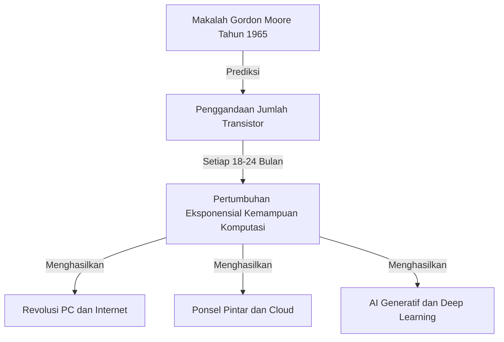
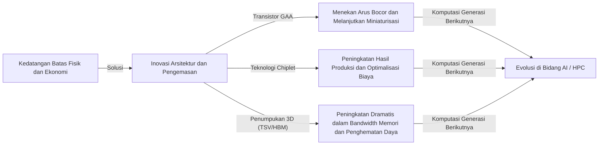

# Apa itu Hukum Moore? Jejak Semikonduktor dan Evolusi Eksponensial

Masyarakat kita berubah dengan cepat karena teknologi seperti ponsel pintar, komputasi awan (cloud), dan kecerdasan buatan (AI). Fondasi teknologi yang mendukung semua ini adalah "semikonduktor (mikrochip)", dan sejarah evolusinya telah sangat ditentukan oleh **"Hukum Moore (Moore's Law)"** yang terkenal.

Dalam artikel ini, dari sudut pandang penulis teknis profesional, kami akan membahas secara mendalam dan menyeluruh mengenai latar belakang sejarah Hukum Moore, mekanisme teknisnya, dampaknya terhadap bisnis dan ekonomi, keterbatasan fisik yang dihadapinya saat ini, serta teknologi komputasi generasi berikutnya yang ada melampaui "akhir Hukum Moore".

---

## 1. Kelahiran Hukum Moore dan Latar Belakang Sejarah

### Wawasan Gordon Moore pada tahun 1965
Hukum Moore berawal dari sebuah makalah pendek yang disumbangkan oleh Gordon Moore, salah satu pendiri Intel, pada majalah "Electronics" di tahun 1965. Pada saat itu, ia bekerja di Fairchild Semiconductor. Ia mempublikasikan pengamatannya bahwa jumlah transistor yang diintegrasikan dalam sirkuit terpadu (IC) kira-kira "berlipat ganda setiap tahun".

Kemudian, pada tahun 1975, Moore merevisi prediksinya dan mendefinisikannya kembali menjadi "berlipat ganda sekitar setiap 18 hingga 24 bulan (2 tahun)". Inilah yang saat ini kita kenal sebagai pandangan umum tentang "Hukum Moore".

### Mengapa disebut "Hukum"?
Secara tegas, Hukum Moore bukanlah sebuah "Hukum" absolut dalam fisika atau matematika. Ini lebih merupakan "aturan praktis (Rule of thumb)" yang berperan sebagai "peta jalan (roadmap)" industri.
Perusahaan produsen semikonduktor seperti Intel berbagi rasa krisis yang sama bahwa "jika tidak menggandakan kinerja setiap 2 tahun, kita akan kalah dari pesaing," dan menjadikannya sebagai tujuan untuk melakukan investasi besar-besaran dalam riset dan pengembangan (R&D) serta fasilitas. Dengan kata lain, Hukum Moore adalah "pemacu kecepatan ekonomi dan inovasi" yang diwujudkan secara mandiri oleh industri semikonduktor secara keseluruhan.

---

## 2. Kengerian Evolusi Eksponensial

Konsep terpenting dalam memahami Hukum Moore adalah **"Evolusi Eksponensial (Exponential Growth)"**.
Otak manusia umumnya cenderung memprediksi perubahan secara "linear (garis lurus)". Contohnya adalah pemikiran bahwa "jika maju satu langkah setiap hari, dalam 30 hari akan maju 30 langkah". Namun, dalam pertumbuhan eksponensial, peningkatan terjadi seperti permainan ganda, yaitu "1, 2, 4, 8, 16, 32...".

Jika penggandaan diulang sebanyak 30 kali, angka akhirnya akan melebihi 1 miliar (2 pangkat 30). Di dunia semikonduktor, karena penggandaan ini telah berlanjut selama lebih dari 50 tahun, komputer yang dulunya menempati ruang sebesar ruangan, kini muat di saku kita, bahkan dipasang pada jam tangan pintar.

---

## 3. Mekanisme Miniaturisasi Semikonduktor: Bagaimana Meningkatkan Kepadatannya?

Pendekatan dasar untuk meningkatkan jumlah transistor (meningkatkan kepadatan) adalah dengan "Miniaturisasi (Scaling)". Jika kita bisa membuat transistor menjadi lebih kecil, kita dapat menempatkan lebih banyak transistor di atas wafer silikon dengan luas yang sama.

### Tantangan Terhadap Batas Fotolitografi
Semikonduktor diproduksi menggunakan metode yang disebut "fotolitografi". Resin fotosensitif (photoresist) diaplikasikan pada wafer silikon, dan kemudian cahaya dipancarkan melalui masker dengan pola sirkuit untuk mencetak sirkuit.
Untuk menggambar sirkuit yang lebih halus, diperlukan cahaya dengan panjang gelombang yang lebih pendek.
Selama bertahun-tahun, industri ini telah berjuang untuk memperpendek panjang gelombang cahaya.
- **Dari Cahaya Tampak ke Ultraviolet**
- **Laser Excimer (KrF, ArF)**
- **Teknologi Litografi Imersi**
- Dan teknologi mutakhir saat ini, yaitu **Litografi EUV (Extreme Ultraviolet)**

Mesin litografi EUV yang diproduksi secara eksklusif oleh perusahaan Belanda ASML menggunakan cahaya dengan panjang gelombang hanya 13,5 nanometer untuk menggambar sirkuit yang sangat halus. Pengembangan peralatan ini membutuhkan investasi puluhan tahun dan triliunan yen, yang memungkinkan pembuatan semikonduktor tercanggih saat ini seperti proses 5nm dan 3nm.

---

## 4. Dampak Hukum Moore terhadap Bisnis dan Ekonomi

Hukum Moore tidak sekadar indikator teknis, tetapi juga secara fundamental mengubah struktur ekonomi global.

### Tekanan Deflasi dan Penurunan Biaya Dramatis
Jika kepadatan transistor berlipat ganda, artinya "dua kali lipat kemampuan komputasi bisa diperoleh dengan biaya yang sama", atau "kemampuan komputasi yang sama bisa diperoleh dengan setengah biaya". Penurunan biaya yang dramatis ini telah mendorong digitalisasi (Transformasi Digital: DX) di semua industri.
Seiring dengan berubahnya sumber daya komputasi dari sesuatu yang "langka dan mahal" menjadi sesuatu yang "melimpah dan murah", model bisnis baru bermunculan satu demi satu.

### Penciptaan Industri Baru
1. **Penyebaran Komputer Pribadi (PC):** Selama tahun 1980-an dan 90-an, individu mulai dapat memiliki komputer.
2. **Internet dan Bisnis Web:** Pada era 2000-an, server dan peralatan komunikasi murah menghubungkan seluruh dunia melalui jaringan.
3. **Ponsel Pintar dan Ekonomi Seluler:** Di era 2010-an, perangkat seukuran telapak tangan memiliki kinerja layaknya superkomputer, yang menyebabkan ekonomi aplikasi tumbuh meledak.
4. **Cloud dan AI:** Sejak tahun 2020-an, Pembelajaran Mendalam (Deep Learning) dan AI Generatif, yang membutuhkan sumber daya komputasi besar, semakin dominan. Ini sepenuhnya bergantung pada evolusi kemampuan perhitungan paralel super dari GPU (unit pemrosesan grafis).

---

## 5. Batas Hukum Moore dan Hambatan Fisik yang Dihadapi

Meskipun Hukum Moore berulang kali disebut "sudah mati" selama bertahun-tahun, namun tetap berhasil diperpanjang usianya. Saat ini, Hukum Moore tengah menghadapi hambatan fisik yang sesungguhnya. Hambatan utamanya adalah tiga hal berikut:

### 1. Efek Terowongan Kuantum dan Arus Bocor
Ketika ukuran transistor (terutama panjang gerbang) menyusut ke dalam skala nanometer (seukuran beberapa hingga puluhan atom), hukum fisika klasik tidak lagi berlaku, dan fenomena mekanika kuantum menjadi lebih menonjol. Yang paling umum adalah "efek terowongan kuantum".
Bahkan saat sakelar "dimatikan" untuk menghentikan arus, elektron menerobos penghalang dan terus mengalir (arus bocor: arus bocoran), menyebabkan peningkatan konsumsi daya dan malfungsi.

### 2. Dinding Panas (Masalah Silikon Gelap)
Ketika kepadatan transistor pada cip meningkat, kepadatan panas yang dihasilkan juga melonjak. Fenomena di mana teknologi pendingin tidak dapat mengimbangi sehingga tidak mungkin untuk mengoperasikan seluruh bagian cip secara maksimal di saat yang sama disebut "Silikon Gelap (Dark Silicon)". Kita terjebak dalam dilema di mana peningkatan kemampuan perhitungan tidak sejalan dengan unjuk kinerja sebenarnya karena hambatan panas.

### 3. Batas Ekonomi (Hukum Rock)
Ada aturan praktis lain yang juga dikenal sebagai "Hukum Moore Kedua" atau "Hukum Rock (Rock's Law)". Ini menyatakan bahwa "biaya pembangunan pabrik semikonduktor berlipat ganda setiap generasi." Saat ini, pembangunan pabrik tercanggih (Fab) membutuhkan investasi sekitar 2 hingga 3 triliun yen. Perusahaan di dunia yang mampu menanggung biaya sangat besar ini hanya tinggal TSMC, Samsung Electronics, dan Intel.

---

## 6. More than Moore (Melampaui Hukum Moore)

Seiring pendekatan peningkatan kepadatan melalui miniaturisasi sederhana (More Moore) yang semakin mendekati batasnya, industri semikonduktor kini mulai mengadopsi pendekatan baru untuk peningkatan kinerja, yang dikenal sebagai "More than Moore".

### Evolusi Arsitektur (Dari FinFET ke GAA)
Untuk menekan arus bocor, industri beralih dari struktur transistor datar (planar) ke struktur tiga dimensi **FinFET (Fin Field-Effect Transistor)**. Saat ini, peralihan lebih jauh menuju struktur **GAA (Gate-All-Around)**, di mana seluruh saluran elektron dikelilingi oleh gerbang pelindung, sedang berlangsung. Ini memungkinkan pengontrolan elektron hingga ke tingkat ekstrem.

### Teknologi Chiplet
Bila sebelumnya seluruh fungsi ditumpuk pada satu cip silikon raksasa (monolithic die), pendekatan baru membagi fungsi-fungsi tersebut ke dalam cip kecil terpisah (chiplet), memproduksinya, dan kemudian menggabungkannya ke dalam satu kemasan dengan teknologi pengemasan tingkat tinggi. Hal ini secara drastis meningkatkan hasil produksi, menekan biaya, dan pada saat yang sama, meningkatkan kinerja secara keseluruhan. Teknologi ini sangat sukses, seperti yang terlihat pada prosesor seri Ryzen dari AMD, dan mulai menjadi arus utama masa depan.

### Pengemasan 2.5D / 3D dan Teknologi Penumpukan (Stacking)
Selain menyusun cip dalam satu bidang (2D), cip ditumpuk secara vertikal (3D) menggunakan teknologi seperti TSV (Through-Silicon Via). Ini secara signifikan meningkatkan kecepatan komunikasi (bandwidth) antarcip sekaligus mengurangi konsumsi daya. Pengemasan tingkat lanjut ini sangat penting untuk menyambungkan GPU tercanggih untuk AI (seperti NVIDIA H100) dan HBM (High Bandwidth Memory).

---

## 7. Komputasi Generasi Berikutnya di Era Pasca-Hukum Moore

Dengan menyadari keterbatasan semikonduktor berbasis silikon, riset terhadap teknologi komputasi yang didasarkan pada prinsip yang sama sekali berbeda kini berkembang pesat. Teknologi ini berpotensi besar menjadi pendorong utama di "Era Pasca-Hukum Moore".

### Komputasi Kuantum (Quantum Computing)
Memanfaatkan sifat mekanika kuantum seperti "Superposisi" dan "Keterikatan Kuantum", diharapkan teknologi ini mampu secara instan memecahkan masalah spesifik tertentu (dekripsi kriptografi, simulasi molekuler obat baru, masalah optimisasi, dll.) yang memerlukan waktu ratusan juta tahun bagi komputer konvensional (komputer klasik). Riset berkembang sangat kompetitif menggunakan berbagai metode, termasuk superkonduktor, perangkap ion, dan foton kuantum.

### Komputasi Neuromorfik (Komputer Model Otak)
Ini adalah teknologi yang secara fisik meniru struktur jaringan saraf (neuron dan sinapsis) otak manusia di tingkat perangkat keras. Berbeda dari arsitektur von Neumann saat ini (di mana CPU dan memori dipisahkan, menimbulkan masalah penyumbatan pada pengiriman data), teknologi ini melakukan pemrosesan informasi dan memori secara bersamaan. Sehingga dapat melakukan pengenalan pola dan pembelajaran dengan konsumsi daya yang sangat rendah.

### Komputasi Optik (Optical Computing)
Teknologi ini menggunakan foton sebagai pengganti elektron untuk pemrosesan informasi dan transmisi data. Cahaya jauh lebih cepat dibandingkan dengan sinyal elektrik, minim hilangnya energi dan panas, menjadikannya tumpuan harapan bagi komputasi kecepatan tinggi berdaya rendah generasi selanjutnya. Khususnya teknologi "Silicon Photonics" yang mengirimkan data antarcip menggunakan cahaya telah mencapai tahapan komersialisasi.

---

## 8. Kesimpulan: Warisan Hukum Moore dan Masa Depan Kita

"Hukum Moore" yang diperkenalkan oleh Gordon Moore pada tahun 1965 tidak hanya sekadar ramalan teknologi semikonduktor. Ini memberi umat manusia visi yang kuat bahwa "teknologi mampu terus berevolusi secara eksponensial", dan merupakan sebuah "kontrak sosial megah" yang mendorong jutaan insinyur serta periset bergerak bersama menuju satu tujuan yang sama.

Sekalipun jika miniaturisasi transistor pada silikon perlahan-lahan menghadapi keterbatasan fisiknya, inovasi manusia untuk terus meningkatkan kemampuan komputasi takkan berhenti. Paradigma baru seperti chiplet, penumpukan 3D, arsitektur yang dikhususkan pada AI, dan komputer kuantum akan melanjutkan semangat Hukum Moore, terus membimbing masyarakat kita menelusuri wilayah yang belum terpetakan.

Hal yang sangat penting bagi para pemimpin bisnis dan insinyur di masa mendatang adalah memahami laju "evolusi teknologi eksponensial" ini, mengenali penemuan besar (breakthrough) baru seperti apa yang akan muncul, dan beradaptasi agar tak tertinggal dari gelombang perubahan. Evolusi dan perjalanan sejarah semikonduktor bagaikan cermin yang memantulkan gambaran masa depan umat manusia.
