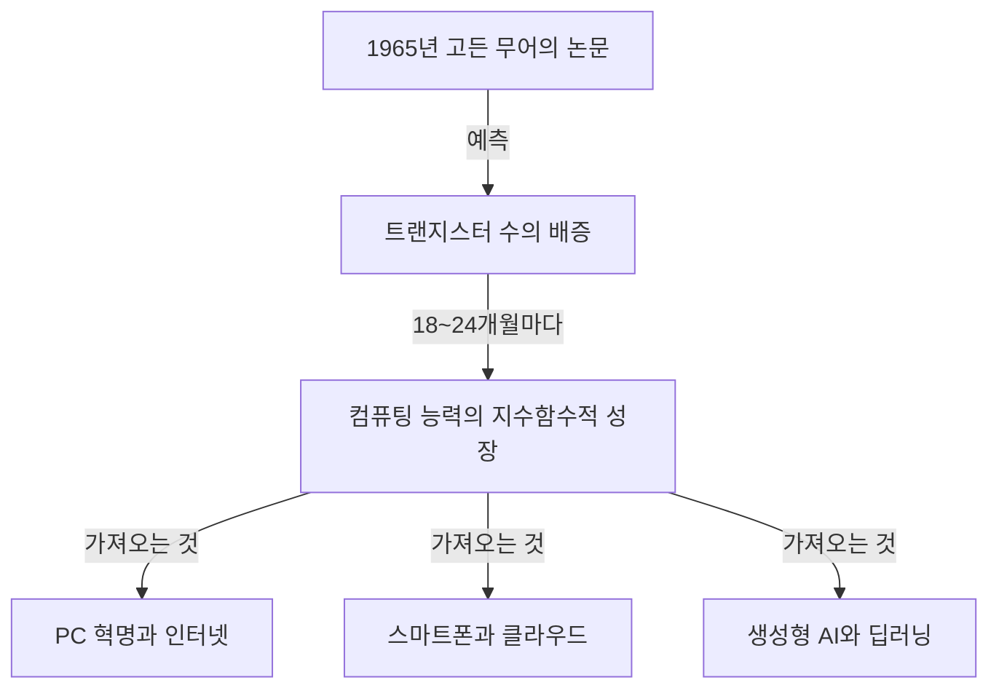
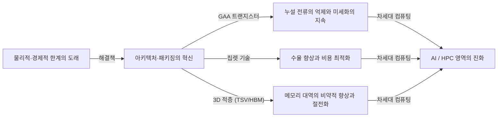

# 무어의 법칙이란 무엇인가? 반도체와 기하급수적 진화의 궤적

우리 사회는 스마트폰, 클라우드 컴퓨팅, 그리고 인공지능(AI)과 같은 기술에 의해 급속하게 변화하고 있습니다. 이러한 기술 기반을 지탱하고 있는 것은 '반도체(마이크로칩)'이며, 그 진화의 역사를 결정지어 온 것이 바로 그 유명한 **'무어의 법칙(Moore's Law)'**입니다.

이 기사에서는 전문 테크니컬 라이터의 시각에서 무어의 법칙의 역사적 배경, 기술적 메커니즘, 비즈니스 및 경제에 미치는 영향, 현재 직면한 물리적 한계, 그리고 '무어의 법칙의 종언' 너머에 있는 차세대 컴퓨팅 기술에 이르기까지 철저히 파헤쳐 해설합니다.

---

## 1. 무어의 법칙의 탄생과 역사적 배경

### 1965년 고든 무어의 통찰
무어의 법칙은 인텔(Intel)의 공동 창업자 중 한 명인 고든 무어(Gordon Moore)가 1965년에 『일렉트로닉스(Electronics)』지에 기고한 짧은 논문에서 비롯되었습니다. 당시에 그는 페어차일드 반도체(Fairchild Semiconductor)에 재직 중이었습니다. 그는 집적회로(IC) 위에 탑재되는 트랜지스터의 수가 대략 '1년마다 배증하고 있다'는 관찰 결과를 발표했습니다.

이후 1975년에 무어 자신이 예측을 수정하여 '약 18개월에서 24개월(2년)마다 배증한다'고 재정의했습니다. 이것이 오늘날 우리가 알고 있는 '무어의 법칙'의 정설이 되었습니다.

### 왜 '법칙'이라고 불리게 되었는가?
엄밀히 말하면 무어의 법칙은 물리학이나 수학의 절대적인 '법칙(Law)'이 아닙니다. 그것은 하나의 '경험법칙(Rule of thumb)'이며, 업계의 '로드맵'으로서의 역할을 해왔습니다.
인텔을 비롯한 반도체 제조사들은 '2년마다 성능을 두 배로 높이지 않으면 경쟁에서 패배한다'는 위기감을 공유하고, 이를 목표로 거액의 연구개발(R&D) 투자와 설비 투자를 진행해 왔습니다. 즉, 무어의 법칙은 반도체 업계 전체가 자기 충족적 예언으로서 실현시켜 온 '경제와 혁신의 페이스메이커'인 것입니다.

---

## 2. 기하급수적 진화(지수함수적 성장)의 무서움

무어의 법칙을 이해하는 데 있어 가장 중요한 개념이 **'기하급수적 진화(지수함수적 성장: Exponential Growth)'**입니다.
인간의 뇌는 일반적으로 '직선적(선형: Linear)'인 변화를 예측하는 경향이 있습니다. 예를 들어 '매일 1보씩 나아가면 30일 만에 30보를 나아간다'는 식의 사고방식입니다. 하지만 기하급수적인 성장에서는 '1, 2, 4, 8, 16, 32...'로 배수 게임처럼 증가해 나갑니다.

30번의 배증을 반복하면 최종적인 숫자는 10억(2의 30승)을 넘어섭니다. 반도체 세계에서는 이러한 배증이 과거 50년 이상에 걸쳐 지속되어 왔기 때문에, 초기에 방만 한 크기를 차지했던 컴퓨터가 이제는 우리 주머니에 들어가고, 심지어 손목시계(스마트워치)에까지 탑재되게 된 것입니다.

---

## 3. 반도체 미세화의 메커니즘: 어떻게 집적도를 높이는가?

트랜지스터의 수를 늘리기(집적도를 높이기) 위한 기본적인 접근 방식은 '미세화(Scaling)'입니다. 트랜지스터를 더 작게 만들 수 있다면 동일한 면적의 실리콘 웨이퍼 위에 더 많은 트랜지스터를 배치할 수 있습니다.

### 포토리소그래피의 한계에 대한 도전
반도체는 '포토리소그래피(광노광 기술)'라고 불리는 기법으로 제조됩니다. 실리콘 웨이퍼 위에 감광성 수지(포토레지스트)를 바르고, 그곳에 회로 패턴이 그려진 마스크를 통해 빛을 비추어 회로를 전사합니다.
더 미세한 회로를 그리기 위해서는 더 파장이 짧은 빛이 필요해집니다.
업계는 오랜 세월 빛의 파장을 짧게 하기 위한 싸움을 계속해 왔습니다.
- **가시광선에서 자외선으로**
- **엑시머 레이저(KrF, ArF)**
- **액침 노광 기술**
- 그리고 현재의 최첨단인 **EUV(극자외선: Extreme Ultraviolet) 리소그래피**

네덜란드의 ASML사가 독점적으로 제조하고 있는 EUV 노광 장비는 파장이 불과 13.5나노미터인 빛을 사용하여 극도로 미세한 회로를 그려냅니다. 이 장비의 개발에는 수십 년과 수십 조 원 단위의 투자가 필요했지만, 이것이 현재의 5nm나 3nm 공정 같은 최첨단 반도체의 제조를 가능하게 하고 있습니다.

---

## 4. 무어의 법칙이 비즈니스·경제에 미친 영향

무어의 법칙은 단순한 기술적인 지표에 머물지 않고 세계 경제의 구조를 근본부터 변혁했습니다.

### 디플레이션 압력과 비용의 극적인 저하
트랜지스터의 집적도가 2배가 된다는 것은 '동일한 비용으로 2배의 계산 능력을 얻을 수 있다', 혹은 '동일한 계산 능력을 절반의 비용으로 얻을 수 있다'는 것을 의미합니다. 이 극적인 비용 저하는 모든 산업에서의 디지털화(디지털 트랜스포메이션: DX)를 추진했습니다.
컴퓨팅 리소스가 '희소하고 비싼 것'에서 '풍부하고 저렴한 것'으로 변화함에 따라 새로운 비즈니스 모델이 차례차례 탄생했습니다.

### 새로운 산업의 창출
1. **개인용 컴퓨터(PC)의 보급:** 1980년대부터 90년대에 걸쳐 개인이 컴퓨터를 소유할 수 있게 되었습니다.
2. **인터넷과 웹 비즈니스:** 2000년대, 저렴한 서버와 통신 기기가 전 세계를 네트워크로 연결했습니다.
3. **스마트폰과 모바일 경제:** 2010년대, 손바닥만 한 크기의 기기가 슈퍼컴퓨터급의 성능을 갖추게 되면서 앱 경제권이 폭발적으로 성장했습니다.
4. **클라우드와 AI:** 2020년대 이후, 막대한 계산 자원을 필요로 하는 딥러닝(심층학습)이나 생성형 AI(Generative AI)가 대두하고 있습니다. 이들은 GPU(화상처리 반도체)의 초병렬 계산 능력 진화에 전적으로 의존하고 있습니다.

---

## 5. 무어의 법칙의 한계와 직면한 물리적 장벽

오랜 세월 '법칙은 죽었다'고 수없이 회자되면서도 연명을 계속해 온 무어의 법칙이지만, 현재 진정한 물리적 한계에 직면해 있습니다. 주요 장벽은 다음 3가지입니다.

### 1. 양자 터널 효과와 누설 전류
트랜지스터의 크기(특히 게이트 길이)가 수 나노미터 단위(원자 몇 개~수십 개 정도의 크기)까지 축소되면 물리학의 고전적인 법칙이 통용되지 않게 되고, 양자역학적인 현상이 뚜렷해집니다. 그 대표적인 것이 '양자 터널 효과'입니다.
스위치를 '오프'로 하여 전류를 멈추려 해도 전자가 장벽을 빠져나가 흘러버리는(누설 전류: 리크 전류) 현상이 발생하여 소비 전력 증대와 오작동을 일으킵니다.

### 2. 열의 벽(다크 실리콘 문제)
칩 위의 트랜지스터 밀도가 높아지면 발생하는 열의 밀도도 급상승합니다. 냉각 기술이 따라가지 못해 칩 전체를 동시에 풀가동할 수 없게 되는 현상을 '다크 실리콘(Dark Silicon)'이라고 부릅니다. 계산 능력을 높여도 열 제약으로 인해 본래의 성능을 끌어낼 수 없는 딜레마에 빠져 있습니다.

### 3. 경제적 한계(록의 법칙)
'무어의 법칙의 제2 법칙' 혹은 '록의 법칙(Rock's Law)'이라고도 불리는 경험법칙이 있습니다. 이는 '반도체 제조 공장의 건설 비용은 세대마다 배증한다'는 것입니다. 최첨단 팹(제조 공장)을 건설하려면 현재는 20조 원에서 30조 원 규모의 투자가 필요하며, 이 막대한 비용을 부담할 수 있는 기업은 세계에서도 TSMC, 삼성전자, 인텔의 3개사 정도로 좁혀져 버렸습니다.

---

## 6. More than Moore (무어의 법칙을 넘어)

단순한 미세화에 의한 집적도 향상(More Moore)이 한계에 가까워지는 가운데, 반도체 업계는 새로운 접근 방식에 의한 성능 향상, 즉 'More than Moore'로 키를 틀고 있습니다.

### 아키텍처의 진화 (FinFET에서 GAA로)
평면적인 트랜지스터 구조(플래너형)에서 입체적인 구조를 가진 **FinFET(핀형 전계효과 트랜지스터)**로 이행함으로써 누설 전류를 억제해 왔으나, 현재는 한발 더 나아가 모든 주위를 게이트로 감싸는 **GAA(Gate-All-Around)** 구조로의 이행이 진행되고 있습니다. 이를 통해 전자의 제어성을 극한까지 높이고 있습니다.

### 칩렛(Chiplet) 기술
지금까지 하나의 거대한 실리콘 칩(모놀리식 다이)에 모든 기능을 욱여넣었던 것을 기능별로 작은 칩(칩렛)으로 분할하여 제조하고, 그것들을 고도의 패키징 기술로 하나의 패키지 내에 연결하는 기법입니다. 이를 통해 수율(양품률)을 극적으로 향상시키고 비용을 억제하면서 전체의 성능을 끌어올리는 것이 가능해졌습니다. AMD의 Ryzen 프로세서 등에서 큰 성공을 거두었으며 향후의 주류가 되고 있습니다.

### 2.5D / 3D 패키징과 적층 기술
칩을 평면(2D)으로 나열할 뿐만 아니라 실리콘 관통 전극(TSV) 등의 기술을 사용하여 수직 방향(3D)으로 적층함으로써 칩 간의 통신 속도(대역폭)를 대폭 향상시키고 소비 전력을 삭감합니다. AI용 최첨단 GPU(NVIDIA의 H100 등)와 HBM(고대역폭 메모리)의 연결에는 이 고도의 패키징 기술이 불가결합니다.

---

## 7. 포스트 무어 시대의 차세대 컴퓨팅

실리콘 기반 반도체의 한계를 내다보고 완전히 새로운 원리에 기반한 컴퓨팅 기술의 연구도 급속히 진행되고 있습니다. 이들은 '포스트 무어 시대'의 주역이 될 가능성을 품고 있습니다.

### 양자 컴퓨팅(Quantum Computing)
양자역학의 '중첩'이나 '양자 얽힘'과 같은 성질을 이용하여, 기존의 컴퓨터(고전 컴퓨터)로는 푸는 데 수억 년이 걸릴 만한 특정 문제(암호 해독, 신약 분자 시뮬레이션, 최적화 문제 등)를 순식간에 푸는 것이 기대되고 있습니다. 초전도, 이온 트랩, 광양자 등 다양한 방식의 연구가 치열하게 전개되고 있습니다.

### 뉴로모픽 컴퓨팅(뇌형 컴퓨터)
인간 뇌의 신경 회로망(뉴런과 시냅스) 구조를 물리적인 하드웨어 수준에서 모방하는 기술입니다. 현재의 폰 노이만형 아키텍처(CPU와 메모리가 분리되어 있어 데이터 전송의 병목 현상이 존재함)와는 달리 정보 처리와 기억을 동시에 수행함으로써 극히 낮은 소비 전력으로 패턴 인식이나 학습을 수행할 수 있습니다.

### 광 컴퓨팅(Optical Computing)
전자 대신 광자(포톤)를 사용하여 정보 처리나 데이터 전송을 수행하는 기술입니다. 빛은 전기 신호에 비해 빠르고 에너지 손실이나 발열이 적기 때문에 차세대 초고속·저전력 컴퓨팅 기반으로 기대받고 있습니다. 특히 칩 간의 데이터 전송을 빛으로 수행하는 '실리콘 포토닉스' 기술은 이미 실용화 단계에 들어서 있습니다.

---

## 8. 결론: 무어의 법칙의 유산과 우리의 미래

고든 무어가 1965년에 제시한 '무어의 법칙'은 단순한 반도체 기술 예측이 아니었습니다. 그것은 인류에게 '기술은 지수함수적으로 계속 진화할 수 있다'는 확고한 비전을 제시하였고, 수백만 명의 엔지니어와 연구자를 같은 목표를 향해 움직이게 한 '장대한 사회 계약'이었다고 할 수 있습니다.

설령 실리콘 위 트랜지스터의 미세화가 물리적인 한계를 맞이했다 할지라도, 컴퓨팅 능력을 향상시키고자 하는 인류의 혁신은 멈추지 않을 것입니다. 칩렛, 3D 적층, AI 특화형 아키텍처, 그리고 양자 컴퓨터 등의 새로운 패러다임이 무어의 법칙의 정신을 이어받아 우리 사회를 미지의 영역으로 계속 이끌어 갈 것입니다.

앞으로의 비즈니스 리더나 엔지니어에게 요구되는 것은 이러한 '기하급수적인 기술 진화'의 속도를 이해하고, 다음에 어떤 돌파구가 열릴지 가늠하여 변화의 물결에 뒤처지지 않도록 계속 적응해 나가는 것입니다. 반도체 진화의 역사는 그대로 인류의 미래를 비추는 거울인 것입니다.
