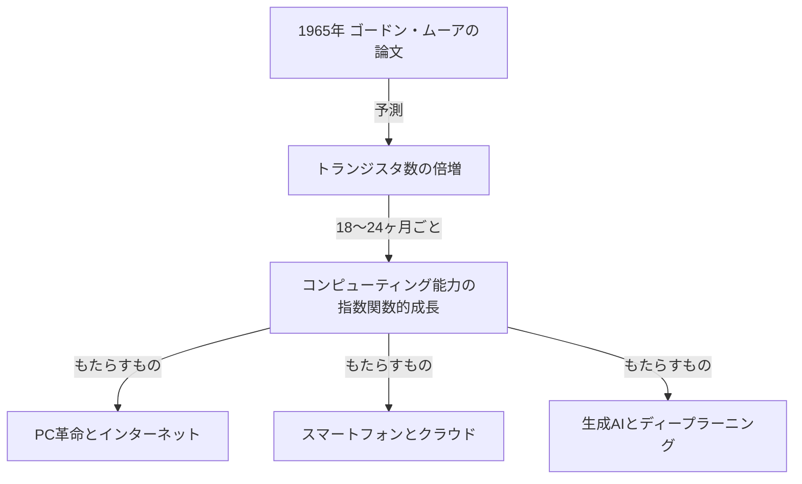
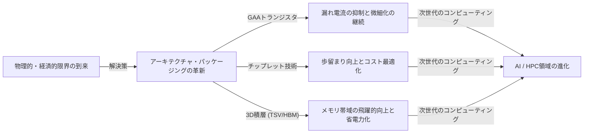

# ムーアの法則とは何か？半導体と幾何級数的進化の軌跡

私たちの社会は、スマートフォン、クラウドコンピューティング、そして人工知能（AI）といったテクノロジーによって急速に変化しています。これらの技術基盤を支えているのは「半導体（マイクロチップ）」であり、その進化の歴史を決定づけてきたのが、かの有名な**「ムーアの法則（Moore's Law）」**です。

この記事では、プロのテクニカルライターの視点から、ムーアの法則の歴史的背景、技術的なメカニズム、ビジネス・経済への影響、現在直面している物理的限界、そして「ムーアの法則の終焉」の先にある次世代コンピューティング技術に至るまで、徹底的に深掘りして解説します。

---

## 1. ムーアの法則の誕生と歴史的背景

### 1965年のゴードン・ムーアの洞察
ムーアの法則は、インテル（Intel）の共同創業者の一人であるゴードン・ムーア（Gordon Moore）が、1965年に『エレクトロニクス（Electronics）』誌に寄稿した短い論文に端を発しています。当時、彼はフェアチャイルドセミコンダクター社に在籍していました。彼は、集積回路（IC）上に搭載されるトランジスタの数が、おおよそ「1年ごとに倍増している」という観察結果を発表しました。

その後、1975年にムーア自身が予測を修正し、「約18ヶ月から24ヶ月（2年）ごとに倍増する」と再定義しました。これが、今日私たちが知る「ムーアの法則」の定説となっています。

### なぜ「法則」と呼ばれるようになったのか？
厳密に言えば、ムーアの法則は物理学や数学の絶対的な「法則（Law）」ではありません。それは一つの「経験則（Rule of thumb）」であり、業界の「ロードマップ」としての役割を果たしてきました。
インテルをはじめとする半導体メーカー各社は、「2年ごとに性能を倍増させなければ競合に敗北する」という危機感を共有し、それを目標として巨額の研究開発（R&D）投資と設備投資を行ってきました。つまり、ムーアの法則は、半導体業界全体が自己成就的予言として実現させてきた「経済とイノベーションのペースメーカー」なのです。

---

## 2. 幾何級数的進化（指数関数的成長）の恐ろしさ

ムーアの法則を理解する上で最も重要な概念が**「幾何級数的進化（指数関数的成長：Exponential Growth）」**です。
人間の脳は、通常「直線的（線形：Linear）」な変化を予測する傾向があります。たとえば「毎日1歩ずつ進めば、30日で30歩進む」という考え方です。しかし、幾何級数的な成長では「1, 2, 4, 8, 16, 32...」と倍々ゲームで増加していきます。

30回の倍増を繰り返すと、最終的な数字は10億（2の30乗）を超えます。半導体の世界では、この倍増が過去50年以上にわたって継続してきたため、当初は部屋ほどの大きさを占めていたコンピュータが、今や私たちのポケットに収まり、さらに腕時計（スマートウォッチ）にまで搭載されるようになったのです。

---

## 3. 半導体微細化のメカニズム：どのようにして集積度を上げるのか？

トランジスタの数を増やす（集積度を上げる）ための基本的なアプローチは「微細化（Scaling）」です。トランジスタをより小さく作ることができれば、同じ面積のシリコンウェハー上に、より多くのトランジスタを配置することができます。

### フォトリソグラフィの限界への挑戦
半導体は、「フォトリソグラフィ（光露光技術）」と呼ばれる手法で製造されます。シリコンウェハー上に感光性の樹脂（フォトレジスト）を塗り、そこに回路パターンの描かれたマスクを通して光を当て、回路を転写します。
より細かい回路を描くためには、より波長の短い光が必要になります。
業界は長年、光の波長を短くするための戦いを続けてきました。
- **可視光から紫外線へ**
- **エキシマレーザー（KrF, ArF）**
- **液浸露光技術**
- そして現在の最先端である**EUV（極端紫外線：Extreme Ultraviolet）リソグラフィ**

オランダのASML社が独占的に製造しているEUV露光装置は、波長わずか13.5ナノメートルの光を使い、極めて微細な回路を描き出します。この装置の開発には数十年と兆円単位の投資が必要でしたが、これが現在の5nmや3nmプロセスといった最先端半導体の製造を可能にしています。

---

## 4. ムーアの法則がビジネス・経済に与えた影響

ムーアの法則は単なる技術的な指標にとどまらず、世界経済の構造を根本から変革しました。

### デフレ圧力とコストの劇的な低下
トランジスタの集積度が2倍になるということは、「同じコストで2倍の計算能力が手に入る」、あるいは「同じ計算能力が半分のコストで手に入る」ということを意味します。この劇的なコスト低下は、あらゆる産業におけるデジタル化（デジタルトランスフォーメーション：DX）を推進しました。
コンピューティングリソースが「希少で高価なもの」から「豊富で安価なもの」へと変化したことで、新しいビジネスモデルが次々と誕生しました。

### 新たな産業の創出
1. **パーソナルコンピュータ（PC）の普及:** 1980年代から90年代にかけて、個人がコンピュータを所有できるようになりました。
2. **インターネットとウェブビジネス:** 2000年代、安価なサーバーと通信機器が世界中をネットワークで結びました。
3. **スマートフォンとモバイル経済:** 2010年代、手のひらサイズのデバイスがスーパーコンピュータ並みの性能を持ち、アプリ経済圏が爆発的に成長しました。
4. **クラウドとAI:** 2020年代以降、莫大な計算資源を必要とするディープラーニング（深層学習）や生成AI（Generative AI）が台頭しています。これらは、GPU（画像処理半導体）の超並列計算能力の進化に完全に依存しています。

---

## 5. ムーアの法則の限界と直面する物理的障壁

長年「法則は死んだ」と何度も囁かれながらも延命を続けてきたムーアの法則ですが、現在、真の物理的限界に直面しています。主な障壁は以下の3つです。

### 1. 量子トンネル効果と漏れ電流
トランジスタのサイズ（特にゲート長）が数ナノメートル単位（原子数個〜数十個分のサイズ）まで縮小すると、物理学の古典的な法則が通用しなくなり、量子力学的な現象が顕著になります。その代表が「量子トンネル効果」です。
スイッチを「オフ」にして電流を止めようとしても、電子が障壁をすり抜けて流れてしまう（漏れ電流：リーク電流）現象が発生し、消費電力の増大と誤動作を引き起こします。

### 2. 熱の壁（ダークシリコン問題）
チップ上のトランジスタの密度が高まると、発生する熱の密度も急上昇します。冷却技術が追いつかず、チップ全体を同時にフル稼働させることができなくなる現象を「ダークシリコン（Dark Silicon）」と呼びます。計算能力を高めても、熱制約によって本来の性能を引き出せないというジレンマに陥っています。

### 3. 経済的限界（ロックの法則）
「ムーアの法則の第2法則」あるいは「ロックの法則（Rock's Law）」とも呼ばれる経験則があります。これは「半導体製造工場の建設コストは、世代ごとに倍増する」というものです。最先端のファブ（製造工場）を建設するには、現在では2兆円から3兆円規模の投資が必要であり、この莫大なコストを負担できる企業は、世界でもTSMC、サムスン電子、インテルの3社程度に絞られてしまっています。

---

## 6. More than Moore（ムーアの法則を超えて）

単純な微細化による集積度の向上（More Moore）が限界に近づく中、半導体業界は新しいアプローチによる性能向上、すなわち「More than Moore」へと舵を切っています。

### アーキテクチャの進化（FinFETからGAAへ）
平面的なトランジスタ構造（プレーナー型）から、立体的な構造を持つ**FinFET（フィン型電界効果トランジスタ）**へと移行することで漏れ電流を抑えてきましたが、現在はさらに全周囲をゲートで囲む**GAA（Gate-All-Around）**構造への移行が進んでいます。これにより、電子の制御性を極限まで高めています。

### チップレット（Chiplet）技術
これまで1つの巨大なシリコンチップ（モノリシック・ダイ）にすべての機能を詰め込んでいたものを、機能ごとに小さなチップ（チップレット）に分割して製造し、それらを高度なパッケージング技術で1つのパッケージ内に連結する手法です。これにより、歩留まり（良品率）を劇的に向上させ、コストを抑えつつ全体の性能を引き上げることが可能になりました。AMDのRyzenプロセッサなどで大きな成功を収めており、今後の主流となっています。

### 2.5D / 3Dパッケージングと積層技術
チップを平面（2D）に並べるだけでなく、シリコン貫通電極（TSV）などの技術を用いて垂直方向（3D）に積層することで、チップ間の通信速度（帯域幅）を大幅に向上させ、消費電力を削減します。AI用の最先端GPU（NVIDIAのH100など）とHBM（High Bandwidth Memory）の接続には、この高度なパッケージング技術が不可欠です。

---

## 7. ポスト・ムーア時代の次世代コンピューティング

シリコンベースの半導体の限界を見据え、全く新しい原理に基づくコンピューティング技術の研究も急速に進んでいます。これらは「ポスト・ムーア時代」の主役となる可能性を秘めています。

### 量子コンピューティング（Quantum Computing）
量子力学の「重ね合わせ」や「量子もつれ」といった性質を利用し、従来のコンピュータ（古典コンピュータ）では解くのに何億年もかかるような特定の問題（暗号解読、新薬の分子シミュレーション、最適化問題など）を瞬時に解くことが期待されています。超伝導、イオントラップ、光量子など、様々な方式での研究がしのぎを削っています。

### ニューロモルフィック・コンピューティング（脳型コンピュータ）
人間の脳の神経回路網（ニューロンとシナプス）の仕組みを物理的なハードウェアレベルで模倣する技術です。現在のノイマン型アーキテクチャ（CPUとメモリが分離しており、データ転送のボトルネックが存在する）とは異なり、情報処理と記憶を同時に行うことで、極めて低い消費電力でパターン認識や学習を行うことができます。

### 光コンピューティング（Optical Computing）
電子の代わりに光子（フォトン）を用いて情報処理やデータ伝送を行う技術です。光は電気信号に比べて高速であり、エネルギー損失や発熱が少ないため、次世代の超高速・低消費電力コンピューティング基盤として期待されています。特に、チップ間のデータ伝送を光で行う「シリコンフォトニクス」技術はすでに実用化の段階に入っています。

---

## 8. 結論：ムーアの法則の遺産と私たちの未来

ゴードン・ムーアが1965年に提示した「ムーアの法則」は、単なる半導体の技術予測ではありませんでした。それは人類に対して、「テクノロジーは指数関数的に進化し続けることができる」という確固たるビジョンを与え、数百万人のエンジニアや研究者を同じ目標に向かって突き動かしてきた「壮大な社会契約」だったと言えます。

たとえシリコン上のトランジスタの微細化が物理的な限界を迎えたとしても、コンピューティング能力を向上させようとする人類のイノベーションが止まることはありません。チップレット、3D積層、AI特化型アーキテクチャ、そして量子コンピュータなどの新しいパラダイムが、ムーアの法則の精神を引き継ぎ、私たちの社会を未知の領域へと導き続けるでしょう。

これからのビジネスリーダーやエンジニアに求められるのは、この「幾何級数的な技術進化」のペースを理解し、次にどのようなブレイクスルーが起こるのかを見極め、変化の波に乗り遅れないように適応し続けることです。半導体の進化の歴史は、そのまま人類の未来を映し出す鏡なのです。
