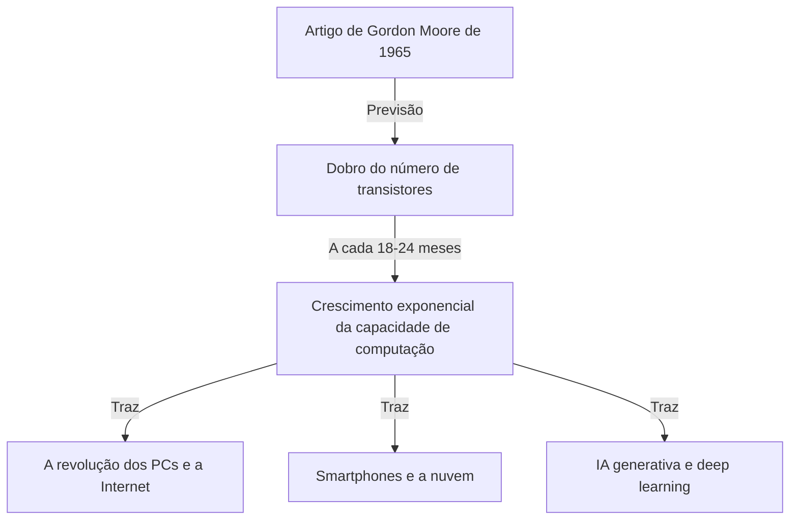
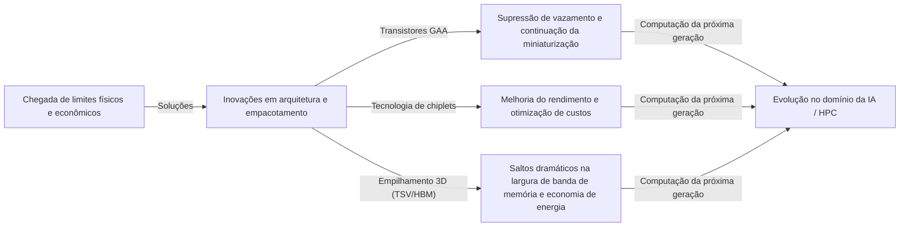

# O que é a Lei de Moore? A Trajetória dos Semicondutores e a Evolução Exponencial

Nossa sociedade está mudando rapidamente através de tecnologias como smartphones, computação em nuvem e inteligência artificial (IA). A base que sustenta essas tecnologias são os "semicondutores (microchips)", e a história de sua evolução tem sido determinada pela famosa **"Lei de Moore (Moore's Law)"**.

Neste artigo, a partir da perspectiva de um redator técnico profissional, exploraremos a fundo e explicaremos o contexto histórico da Lei de Moore, seus mecanismos técnicos, os impactos nos negócios e na economia, os limites físicos que enfrenta atualmente, e as tecnologias de computação de próxima geração além do "fim da Lei de Moore".

---

## 1. O Nascimento da Lei de Moore e o Contexto Histórico

### O Insight de Gordon Moore em 1965
A Lei de Moore teve origem em um pequeno artigo escrito em 1965 para a revista *Electronics* por Gordon Moore, um dos cofundadores da Intel. Na época, ele trabalhava na Fairchild Semiconductor. Ele publicou a observação de que o número de transistores em um circuito integrado (CI) estava "dobrando a cada ano".

Mais tarde, em 1975, o próprio Moore revisou sua previsão, redefinindo-a como "dobrando aproximadamente a cada 18 a 24 meses (2 anos)". Essa se tornou a teoria aceita da "Lei de Moore" que conhecemos hoje.

### Por que passou a ser chamada de "Lei"?
Estritamente falando, a Lei de Moore não é uma "Lei" absoluta da física ou da matemática. Tem sido uma "regra prática (Rule of thumb)" e serviu como um "roteiro" para a indústria.
Fabricantes de semicondutores, incluindo a Intel, compartilhavam um senso de crise de que "se não dobrarmos o desempenho a cada 2 anos, perderemos para a concorrência", e fizeram enormes investimentos em pesquisa e desenvolvimento (P&D) e equipamentos de capital com esse objetivo. Em outras palavras, a Lei de Moore tem sido o "marcapasso da economia e da inovação" que toda a indústria de semicondutores tem realizado como uma profecia autorrealizável.

---

## 2. O Terror da Evolução Exponencial (Crescimento Exponencial)

O conceito mais importante para entender a Lei de Moore é a **"Evolução Exponencial (Crescimento Exponencial: Exponential Growth)"**.
O cérebro humano geralmente tende a prever mudanças de forma "Linear". Por exemplo, a ideia de que "se você der 1 passo todos os dias, dará 30 passos em 30 dias". No entanto, no crescimento exponencial, aumenta como um jogo de duplicação: "1, 2, 4, 8, 16, 32...".

Após 30 duplicações repetidas, o número final ultrapassa 1 bilhão (2 elevado a 30). No mundo dos semicondutores, essa duplicação continuou por mais de 50 anos, de modo que computadores que inicialmente ocupavam o tamanho de uma sala, agora cabem em nossos bolsos e até mesmo em nossos relógios de pulso (smartwatches).

---

## 3. Mecanismo de Miniaturização de Semicondutores: Como Aumentar a Densidade de Integração?

A abordagem básica para aumentar o número de transistores (aumentar a densidade de integração) é a "Miniaturização (Scaling)". Se os transistores puderem ser feitos em tamanho menor, mais transistores poderão ser colocados no mesmo wafer de silício.

### Desafiando os Limites da Fotolitografia
Semicondutores são fabricados usando uma técnica chamada "fotolitografia". Uma resina sensível à luz (fotorresiste) é aplicada a um wafer de silício e a luz é projetada através de uma máscara com o padrão do circuito para transferi-lo.
Para desenhar circuitos mais finos, é necessária luz com um comprimento de onda mais curto.
A indústria há muito tempo trava uma batalha para encurtar os comprimentos de onda da luz.
- **Da luz visível para a ultravioleta**
- **Laser Excimer (KrF, ArF)**
- **Tecnologia de litografia de imersão**
- E a atual vanguarda, **Litografia EUV (Ultravioleta Extremo: Extreme Ultraviolet)**

A empresa holandesa ASML fabrica exclusivamente equipamentos de litografia EUV que usam luz com um comprimento de onda de apenas 13,5 nanômetros para desenhar circuitos extremamente finos. O desenvolvimento desse equipamento exigiu décadas e trilhões de ienes em investimentos, mas isso possibilitou a fabricação de semicondutores de ponta, como os processos de 5nm e 3nm de hoje.

---

## 4. O Impacto da Lei de Moore nos Negócios e na Economia

A Lei de Moore não tem sido apenas um indicador técnico, mas mudou fundamentalmente a estrutura da economia global.

### Pressão Deflacionária e a Queda Dramática nos Custos
O fato de a densidade de integração do transistor dobrar significa que "você pode obter o dobro da capacidade de computação pelo mesmo custo" ou "a mesma capacidade de computação pela metade do custo". Essa redução dramática nos custos tem impulsionado a digitalização (Transformação Digital: DX) em todas as indústrias.
A mudança dos recursos de computação de "escassos e caros" para "abundantes e baratos" gerou sucessivamente novos modelos de negócios.

### Criação de Novas Indústrias
1. **Popularização dos Computadores Pessoais (PCs):** Nas décadas de 1980 e 1990, indivíduos passaram a poder possuir computadores.
2. **A Internet e Negócios Web:** Nos anos 2000, servidores baratos e equipamentos de comunicação conectaram o mundo inteiro em uma rede.
3. **Smartphones e a Economia Móvel:** Na década de 2010, dispositivos que cabem na palma da mão atingiram o desempenho de um supercomputador e a economia de aplicativos explodiu.
4. **Nuvem e IA:** A partir da década de 2020, o deep learning e a IA generativa, que exigem enormes recursos computacionais, ganharam destaque. Estes dependem inteiramente da evolução do enorme poder de computação paralela das GPUs (Unidades de Processamento Gráfico).

---

## 5. Os Limites da Lei de Moore e as Barreiras Físicas Enfrentadas

Embora muitas vezes se tenha sussurrado que "a lei está morta", a Lei de Moore prolongou sua vida, mas agora enfrenta verdadeiros limites físicos. As três principais barreiras são as seguintes.

### 1. Efeito de Tunelamento Quântico e Corrente de Fuga
Quando o tamanho de um transistor (especialmente o comprimento da porta) é reduzido a alguns nanômetros (o tamanho de alguns a dezenas de átomos), as leis clássicas da física não se aplicam mais, e fenômenos quânticos tornam-se proeminentes. Um exemplo típico é o "Efeito de Tunelamento Quântico".
Mesmo quando o interruptor é "desligado" para interromper a corrente, os elétrons passam pela barreira e fluem (corrente de fuga), causando aumento do consumo de energia e mau funcionamento.

### 2. A Parede de Calor (Problema do Silício Escuro)
À medida que a densidade de transistores em um chip aumenta, a densidade de calor gerado também dispara. O fenômeno em que a tecnologia de resfriamento não consegue acompanhar e todo o chip não pode ser operado em plena capacidade ao mesmo tempo é chamado de "Silício Escuro (Dark Silicon)". Isso cria um dilema onde, mesmo que o poder de computação seja aumentado, o desempenho real não pode ser extraído devido a restrições térmicas.

### 3. Limite Econômico (Lei de Rock)
Existe uma regra prática conhecida como "A Segunda Lei de Moore" ou "Lei de Rock (Rock's Law)". Ela afirma que "o custo de construção de uma fábrica de semicondutores dobra a cada geração". Para construir uma fab (fábrica de fabricação) de ponta, um investimento de 2 a 3 trilhões de ienes é agora necessário, e as empresas no mundo capazes de suportar esse enorme custo se reduziram a cerca de três: TSMC, Samsung Electronics e Intel.

---

## 6. More than Moore (Além da Lei de Moore)

À medida que a melhoria na densidade de integração através da simples miniaturização (More Moore) se aproxima do seu limite, a indústria de semicondutores está mudando para novas abordagens para melhorar o desempenho, ou seja, "More than Moore".

### Evolução da Arquitetura (Do FinFET para o GAA)
A transição da estrutura de transistor planar para o **FinFET (Transistor de Efeito de Campo do tipo Fin)**, que possui uma estrutura tridimensional, ajudou a suprimir as correntes de fuga, mas agora uma nova transição para a estrutura **GAA (Gate-All-Around)**, onde a porta envolve completamente o canal, está avançando. Isso aumenta o controle sobre os elétrons ao máximo.

### Tecnologia de Chiplets
Onde todos os recursos costumavam ser compactados em um único chip de silício gigante (die monolítico), esta abordagem os divide em pequenos chips (chiplets) por função, os fabrica e os une em um único pacote usando tecnologia avançada de empacotamento. Isso aumentou drasticamente o rendimento (taxa de produtos bons) e permitiu um desempenho geral mais alto mantendo os custos baixos. Essa abordagem teve grande sucesso em processadores como o AMD Ryzen e está se tornando a principal tendência do futuro.

### Empacotamento 2.5D / 3D e Tecnologia de Empilhamento
Em vez de simplesmente organizar chips em uma superfície plana (2D), eles são empilhados verticalmente (3D) usando tecnologias como Through-Silicon Via (TSV), o que melhora muito a velocidade de comunicação (largura de banda) entre os chips e reduz o consumo de energia. Para conectar GPUs de IA de ponta (como o H100 da NVIDIA) com HBM (Memória de Alta Largura de Banda), essa tecnologia avançada de empacotamento é indispensável.

---

## 7. A Computação da Próxima Geração na Era Pós-Moore

Antecipando os limites dos semicondutores baseados em silício, a pesquisa sobre tecnologias de computação baseadas em princípios inteiramente novos está avançando rapidamente. Essas tecnologias têm o potencial de se tornarem as protagonistas da "era pós-Moore".

### Computação Quântica (Quantum Computing)
Espera-se que, usando propriedades da mecânica quântica como "superposição" e "emaranhamento quântico", seja possível resolver instantaneamente problemas específicos (como criptoanálise, simulação molecular de novos medicamentos, problemas de otimização, etc.) que levariam centenas de milhões de anos para serem resolvidos por computadores convencionais (computadores clássicos). Pesquisas sobre vários métodos, como supercondução, armadilhas de íons e óptica quântica, estão competindo intensamente.

### Computação Neuromórfica (Computadores do Tipo Cérebro)
Essa tecnologia imita os mecanismos das redes neurais do cérebro humano (neurônios e sinapses) em um nível físico de hardware. Ao contrário da atual arquitetura de von Neumann (onde a CPU e a memória são separadas e existe um gargalo de transferência de dados), ao realizar processamento de informações e memória simultaneamente, o reconhecimento e a aprendizagem de padrões podem ser feitos com um consumo de energia extremamente baixo.

### Computação Óptica (Optical Computing)
Esta tecnologia utiliza fótons em vez de elétrons para processamento de informações e transmissão de dados. A luz é mais rápida que os sinais elétricos, e tem menos perda de energia e geração de calor, por isso é esperada como base para a computação de altíssima velocidade e baixo consumo de energia da próxima geração. Em particular, a tecnologia de "fotônica de silício", que utiliza a luz para a transmissão de dados entre os chips, já entrou na fase de implementação prática.

---

## 8. Conclusão: O Legado da Lei de Moore e o Nosso Futuro

A "Lei de Moore" proposta por Gordon Moore em 1965 não foi apenas uma previsão da tecnologia de semicondutores. Pode-se dizer que foi um "grande contrato social" que deu à humanidade a firme visão de que "a tecnologia pode continuar evoluindo exponencialmente" e impulsionou milhões de engenheiros e pesquisadores em direção ao mesmo objetivo.

Mesmo se a miniaturização de transistores em silício atingir um limite físico, a inovação humana para melhorar a capacidade de computação nunca parará. Novos paradigmas como chiplets, empilhamento 3D, arquiteturas específicas para IA e computadores quânticos herdarão o espírito da Lei de Moore e continuarão a guiar nossa sociedade para territórios desconhecidos.

O que se exige dos líderes de negócios e engenheiros do futuro é entender o ritmo dessa "evolução tecnológica exponencial", identificar que tipo de avanço ocorrerá em seguida e continuar a se adaptar para não perder a onda das mudanças. A história da evolução dos semicondutores é, em si mesma, um espelho que reflete o futuro da humanidade.
