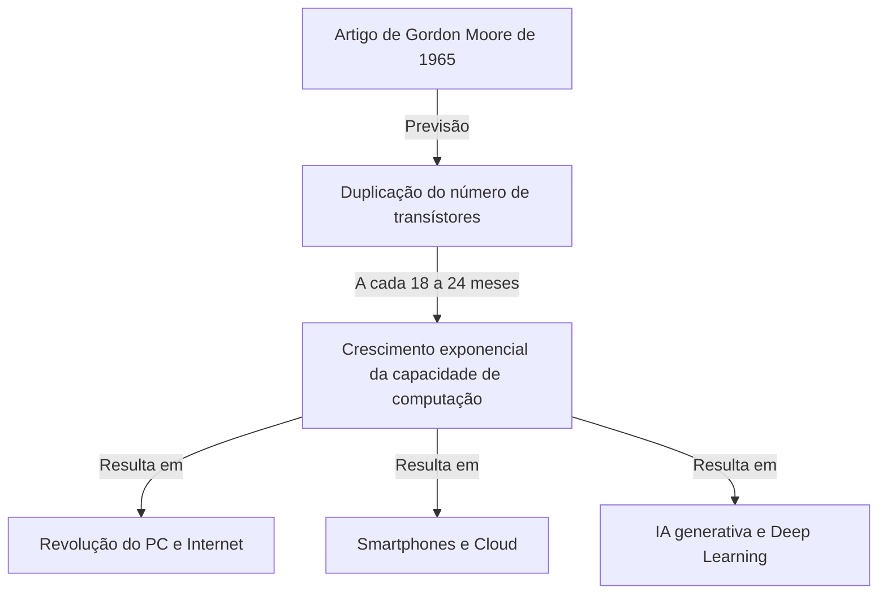
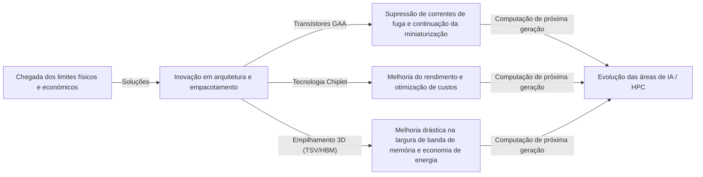

# O que é a Lei de Moore? A trajetória dos semicondutores e da evolução exponencial

A nossa sociedade está a mudar rapidamente devido a tecnologias como os smartphones, a computação em nuvem (cloud computing) e a inteligência artificial (IA). A base que sustenta essas tecnologias são os "semicondutores (microchips)", e a história da sua evolução foi determinada pela famosa **"Lei de Moore (Moore's Law)"**.

Neste artigo, a partir da perspetiva de um escritor técnico profissional, exploraremos a fundo o contexto histórico da Lei de Moore, os seus mecanismos técnicos, o seu impacto nos negócios e na economia, os limites físicos que enfrenta atualmente, bem como as tecnologias de computação de próxima geração para além do "fim da Lei de Moore".

---

## 1. O nascimento e o contexto histórico da Lei de Moore

### A visão de Gordon Moore em 1965
A Lei de Moore tem origem num curto artigo escrito por Gordon Moore, um dos cofundadores da Intel, na revista *Electronics* em 1965. Naquela época, ele trabalhava na Fairchild Semiconductor. Ele publicou uma observação de que o número de transístores num circuito integrado (CI) estava "a duplicar aproximadamente a cada ano".

Mais tarde, em 1975, Moore reviu a sua própria previsão, redefinindo-a como uma duplicação "aproximadamente a cada 18 a 24 meses (2 anos)". Esta é a teoria estabelecida da "Lei de Moore" que conhecemos hoje.

### Por que passou a ser chamada de "Lei"?
Estritamente falando, a Lei de Moore não é uma "lei (Law)" absoluta da física ou da matemática. É uma "regra empírica (Rule of thumb)" que serviu como um "roteiro" para a indústria.
Os fabricantes de semicondutores, incluindo a Intel, partilhavam um sentido de urgência: "se não duplicarmos o desempenho a cada dois anos, perderemos para a concorrência", e, com esse objetivo, fizeram enormes investimentos em pesquisa e desenvolvimento (R&D) e equipamentos. Por outras palavras, a Lei de Moore é o "marcapasso da economia e da inovação" que toda a indústria de semicondutores tornou realidade como uma profecia autorrealizável.

---

## 2. O poder assustador da evolução exponencial

O conceito mais importante para entender a Lei de Moore é o **"crescimento exponencial (Exponential Growth)"**.
O cérebro humano tem geralmente tendência para prever as mudanças de forma "linear (Linear)". Por exemplo, a ideia de que "se avançar um passo por dia, avançarei 30 passos em 30 dias". No entanto, no crescimento exponencial, o número aumenta de forma multiplicativa: "1, 2, 4, 8, 16, 32...".

Se repetir a duplicação 30 vezes, o número final ultrapassa mil milhões (2 elevado a 30). No mundo dos semicondutores, esta duplicação tem continuado há mais de 50 anos, de modo que os computadores que antes ocupavam o tamanho de uma sala inteira cabem agora nos nossos bolsos e até são integrados em relógios de pulso (smartwatches).

---

## 3. O mecanismo de miniaturização de semicondutores: Como aumentar a densidade de integração?

A abordagem básica para aumentar o número de transístores (aumentar a densidade de integração) é a "miniaturização (Scaling)". Se os transístores puderem ser feitos cada vez mais pequenos, mais transístores poderão ser colocados numa bolacha (wafer) de silício da mesma área.

### Desafiando os limites da fotolitografia
Os semicondutores são fabricados utilizando uma técnica chamada "fotolitografia (exposição à luz)". Uma resina fotossensível (fotorresiste) é aplicada a uma bolacha de silício, e a luz é projetada através de uma máscara com um padrão de circuito para transferir o circuito.
Para desenhar circuitos mais finos, é necessária uma luz com um comprimento de onda mais curto.
A indústria tem lutado durante anos para encurtar o comprimento de onda da luz.
- **Da luz visível para o ultravioleta**
- **Laser Excimer (KrF, ArF)**
- **Tecnologia de litografia de imersão**
- E o topo de gama atual, a **litografia EUV (Ultravioleta Extremo: Extreme Ultraviolet)**

Os sistemas de litografia EUV, fabricados exclusivamente pela empresa neerlandesa ASML, utilizam luz com um comprimento de onda de apenas 13,5 nanómetros para desenhar circuitos extremamente finos. O desenvolvimento deste equipamento exigiu décadas e milhares de milhões de dólares de investimento, mas é isto que possibilita o fabrico dos semicondutores mais avançados da atualidade, como os processos de 5 nm e 3 nm.

---

## 4. O impacto da Lei de Moore nos negócios e na economia

A Lei de Moore não se limitou a ser um mero indicador técnico; ela transformou fundamentalmente a estrutura da economia global.

### Pressão deflacionária e redução dramática de custos
Uma duplicação na densidade dos transístores significa que "o dobro da capacidade de computação pode ser obtido pelo mesmo custo" ou "a mesma capacidade de computação pode ser obtida por metade do custo". Esta redução drástica de custos impulsionou a digitalização (Transformação Digital: DX) em todas as indústrias.
À medida que os recursos de computação passaram de "escassos e caros" para "abundantes e baratos", surgiram sucessivamente novos modelos de negócio.

### Criação de novas indústrias
1. **Popularização dos Computadores Pessoais (PC):** Nas décadas de 1980 e 90, tornou-se possível aos indivíduos possuírem os seus próprios computadores.
2. **Internet e negócios na web:** Na década de 2000, servidores e equipamentos de comunicação baratos ligaram o mundo em rede.
3. **Smartphones e a economia móvel:** Na década de 2010, dispositivos do tamanho da palma da mão alcançaram o desempenho de supercomputadores, resultando num crescimento explosivo da economia das aplicações.
4. **Cloud e IA:** A partir da década de 2020, o Deep Learning (aprendizagem profunda) e a IA Generativa (Generative AI), que requerem enormes recursos de computação, ganharam destaque. Estes dependem totalmente da evolução das capacidades de processamento massivamente paralelo das GPUs (unidades de processamento gráfico).

---

## 5. Os limites da Lei de Moore e as barreiras físicas enfrentadas

Apesar de se murmurar frequentemente ao longo de muitos anos que "a lei está morta", a Lei de Moore continuou a prolongar-se. No entanto, ela enfrenta atualmente limites físicos reais. As três principais barreiras são as seguintes:

### 1. Efeito túnel quântico e corrente de fuga
Quando o tamanho do transístor (especificamente o comprimento da porta) encolhe para a escala de nanómetros (o tamanho de alguns a dezenas de átomos), as leis clássicas da física deixam de se aplicar e os fenómenos da mecânica quântica tornam-se proeminentes. O mais representativo deles é o "efeito túnel quântico".
Mesmo quando o interruptor é "desligado" para parar a corrente, os eletrões passam através da barreira e fluem na mesma (corrente de fuga: leakage current), causando um aumento no consumo de energia e falhas de funcionamento.

### 2. A parede térmica (problema do Dark Silicon)
À medida que a densidade dos transístores num chip aumenta, a densidade de calor gerada também sobe rapidamente. O fenómeno em que as tecnologias de arrefecimento não conseguem acompanhar, tornando impossível operar todo o chip na sua capacidade máxima ao mesmo tempo, é chamado de "Dark Silicon (Silício Escuro)". A indústria encontra-se num dilema em que, embora a capacidade de computação aumente, o desempenho inerente não pode ser totalmente aproveitado devido a restrições térmicas.

### 3. Limites económicos (Lei de Rock)
Existe uma regra empírica também chamada de "Segunda Lei de Moore" ou "Lei de Rock (Rock's Law)". Ela afirma que "o custo de construção de uma fábrica de semicondutores duplica a cada geração". A construção de uma fábrica (fab) de ponta requer agora investimentos de 15 a 20 mil milhões de dólares, e apenas cerca de três empresas no mundo — TSMC, Samsung Electronics e Intel — são capazes de suportar estes custos enormes.

---

## 6. More than Moore (Para além da Lei de Moore)

À medida que a melhoria da densidade de integração através da simples miniaturização (More Moore) se aproxima dos seus limites, a indústria de semicondutores está a mudar para novas abordagens de melhoria de desempenho, conhecidas como "More than Moore".

### Evolução da arquitetura (de FinFET para GAA)
As correntes de fuga foram suprimidas pela transição de uma estrutura de transístor planar para um **FinFET (transístor de efeito de campo de barbatana)** tridimensional, mas atualmente há uma transição para uma estrutura **GAA (Gate-All-Around)**, em que a porta envolve completamente o canal. Isso maximiza o controlo dos eletrões.

### Tecnologia Chiplet
Este é um método no qual funções que antes eram empacotadas num único grande chip de silício (die monolítico) são divididas e fabricadas em pequenos chips (chiplets) para cada função, e depois ligadas num único pacote usando tecnologia de empacotamento (packaging) avançada. Isto melhorou drasticamente os rendimentos (taxa de bons produtos) e aumentou o desempenho geral ao mesmo tempo que reduziu os custos. Obteve um enorme sucesso com os processadores Ryzen da AMD, entre outros, e está a tornar-se a tendência dominante.

### Empacotamento 2.5D / 3D e tecnologia de empilhamento
Além de alinhar chips num plano (2D), empilhá-los verticalmente (3D) utilizando tecnologias como vias através do silício (TSV) melhora significativamente a velocidade de comunicação (largura de banda) entre os chips e reduz o consumo de energia. Esta tecnologia de empacotamento avançada é absolutamente essencial para ligar GPUs de ponta para IA (como a H100 da NVIDIA) a HBM (memória de alta largura de banda).

---

## 7. Computação de próxima geração na era pós-Moore

Em antecipação aos limites dos semicondutores à base de silício, a pesquisa de tecnologias de computação baseadas em princípios totalmente novos também avança rapidamente. Estas têm o potencial de se tornarem as protagonistas da "era pós-Moore".

### Computação Quântica (Quantum Computing)
Utilizando propriedades da mecânica quântica, como a "superposição" e o "entrelaçamento quântico", espera-se resolver instantaneamente problemas específicos (criptoanálise, simulação molecular de novos medicamentos, problemas de otimização, etc.) que os computadores convencionais (computadores clássicos) levariam centenas de milhões de anos a resolver. A investigação decorre intensamente em vários métodos, como supercondutores, armadilhas de iões e fotónica quântica.

### Computação Neuromórfica (Computadores tipo cérebro)
Trata-se de uma tecnologia que imita o mecanismo das redes neurais (neurónios e sinapses) do cérebro humano ao nível do hardware físico. Ao contrário da atual arquitetura de von Neumann (onde a CPU e a memória estão separadas, criando um estrangulamento na transferência de dados), o processamento de informação e a memorização ocorenden simultaneamente, permitindo o reconhecimento de padrões e a aprendizagem com um consumo de energia extremamente baixo.

### Computação Ótica (Optical Computing)
Esta é uma tecnologia que utiliza fotões em vez de eletrões para processar informações e transmitir dados. Como a luz é mais rápida do que os sinais elétricos e resulta em menos perda de energia e geração de calor, é promissora como infraestrutura de computação ultrarrápida e de baixo consumo de energia da próxima geração. Em particular, a tecnologia de "fotónica de silício", que utiliza a luz para transmitir dados entre chips, já entrou na fase de aplicação prática.

---

## 8. Conclusão: O legado da Lei de Moore e o nosso futuro

A "Lei de Moore" apresentada por Gordon Moore em 1965 não era apenas uma previsão técnica para os semicondutores. Pode-se dizer que foi um "grande contrato social" que deu à humanidade a firme visão de que "a tecnologia pode continuar a evoluir exponencialmente" e impulsionou milhões de engenheiros e investigadores em direção ao mesmo objetivo.

Mesmo que a miniaturização dos transístores no silício atinja os seus limites físicos, a inovação humana para melhorar a capacidade de computação não vai parar. Novos paradigmas, como chiplets, empilhamento 3D, arquitetura específica de IA e computadores quânticos herdarão o espírito da Lei de Moore e continuarão a guiar a nossa sociedade rumo a territórios inexplorados.

O que se exige dos líderes empresariais e dos engenheiros do futuro é compreender o ritmo desta "evolução tecnológica exponencial", identificar quais serão os próximos grandes avanços e continuar a adaptar-se para não perder a onda da mudança. A história da evolução dos semicondutores é um espelho que reflete o futuro da humanidade.
