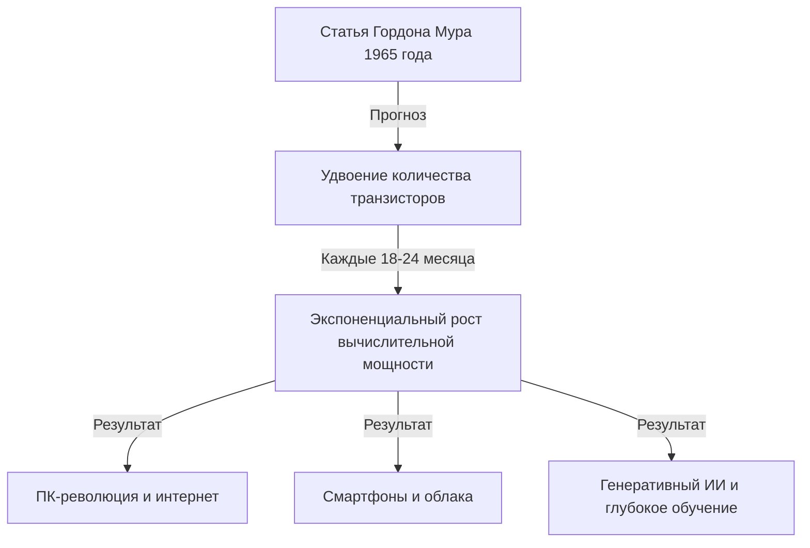
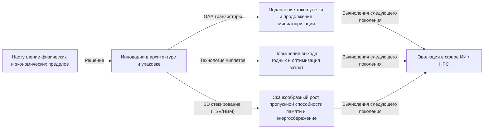

# Что такое закон Мура? Траектория полупроводников и экспоненциальная эволюция

Наше общество стремительно меняется благодаря таким технологиям, как смартфоны, облачные вычисления и искусственный интеллект (ИИ). Фундаментом этих технологий являются «полупроводники (микрочипы)», а историю их развития определял знаменитый **«Закон Мура (Moore's Law)»**.

В этой статье с точки зрения профессионального технического писателя мы глубоко и подробно рассмотрим исторические предпосылки закона Мура, его технические механизмы, влияние на бизнес и экономику, физические ограничения, с которыми он сталкивается сегодня, а также технологии вычислений следующего поколения, лежащие за пределами «конца закона Мура».

---

## 1. Зарождение закона Мура и исторические предпосылки

### Идея Гордона Мура 1965 года
Закон Мура берет свое начало из короткой статьи, написанной одним из соучредителей компании Intel Гордоном Муром (Gordon Moore) в 1965 году для журнала «Electronics». В то время он работал в компании Fairchild Semiconductor. Он опубликовал наблюдение, согласно которому количество транзисторов, размещаемых на интегральной схеме (ИС), удваивается примерно «каждый год».

Позже, в 1975 году, Мур сам скорректировал свой прогноз и переопределил его, заявив, что удвоение будет происходить «примерно каждые 18–24 месяца (2 года)». Именно это и стало общепринятым «законом Мура», который мы знаем сегодня.

### Почему его стали называть «законом»?
Строго говоря, закон Мура не является абсолютным «законом (Law)» физики или математики. Это скорее «эмпирическое правило (Rule of thumb)», которое служило «дорожной картой» для всей индустрии.
Компании-производители полупроводников, начиная с Intel, разделяли чувство необходимости: «если не удваивать производительность каждые два года, мы проиграем конкурентам», и ради достижения этой цели вкладывали огромные средства в исследования и разработки (R&D) и капитальные инвестиции. Другими словами, закон Мура — это «кардиостимулятор экономики и инноваций», который полупроводниковая индустрия реализовала как самоисполняющееся пророчество.

---

## 2. Устрашающая сила экспоненциальной эволюции (экспоненциальный рост)

Самой важной концепцией для понимания закона Мура является **«Экспоненциальная эволюция (экспоненциальный рост: Exponential Growth)»**.
Человеческий мозг обычно склонен прогнозировать «линейные (Linear)» изменения. Например, идея о том, что «если вы каждый день делаете один шаг, то за 30 дней вы пройдете 30 шагов». Однако при экспоненциальном росте числа увеличиваются в геометрической прогрессии: «1, 2, 4, 8, 16, 32...».

Если повторить удвоение 30 раз, итоговая цифра превысит 1 миллиард (2 в 30-й степени). В мире полупроводников это удвоение продолжалось на протяжении более 50 лет, в результате чего компьютеры, изначально занимавшие размер целой комнаты, теперь помещаются в наших карманах, и даже в наручных часах (смарт-часах).

---

## 3. Механизм миниатюризации полупроводников: Как повысить степень интеграции?

Основной подход к увеличению числа транзисторов (повышению степени интеграции) — это «миниатюризация (Scaling)». Если транзисторы можно сделать меньше, то на кремниевой пластине той же площади можно разместить большее их количество.

### Вызов пределам фотолитографии
Полупроводники производятся с использованием метода, называемого «фотолитография». На кремниевую пластину наносится светочувствительная смола (фоторезист), на которую через маску с рисунком схемы направляется свет для переноса схемы.
Для создания более тонких схем требуется свет с более короткой длиной волны.
Индустрия долгие годы вела борьбу за укорачивание длины волны света:
- **От видимого света к ультрафиолетовому**
- **Эксимерные лазеры (KrF, ArF)**
- **Иммерсионная литография**
- И современный передовой рубеж — **EUV (Экстремальная ультрафиолетовая: Extreme Ultraviolet) литография**

Оборудование для EUV-литографии, которое эксклюзивно производится нидерландской компанией ASML, использует свет с длиной волны всего 13,5 нанометров для прорисовки сверхтонких схем. Разработка этого оборудования потребовала десятилетий и триллионных инвестиций, но именно оно делает возможным производство самых современных полупроводников по технологиям 5 нм и 3 нм.

---

## 4. Влияние закона Мура на бизнес и экономику

Закон Мура вышел далеко за рамки простого технического показателя и в корне изменил структуру мировой экономики.

### Дефляционное давление и радикальное снижение затрат
Удвоение плотности транзисторов означает, что «вы получаете вдвое больше вычислительной мощности за те же деньги» или «вы получаете ту же вычислительную мощность за половину стоимости». Это радикальное снижение затрат стало двигателем цифровизации (цифровой трансформации: DX) во всех отраслях.
По мере того как вычислительные ресурсы перешли от статуса «дефицитных и дорогих» к «избыточным и дешевым», одна за другой рождались новые бизнес-модели.

### Создание новых отраслей
1. **Распространение персональных компьютеров (ПК):** В период с 1980-х по 90-е годы обычные люди получили возможность владеть компьютерами.
2. **Интернет и веб-бизнес:** В 2000-е годы недорогие серверы и коммуникационное оборудование связали весь мир в сеть.
3. **Смартфоны и мобильная экономика:** В 2010-х устройства, помещающиеся на ладони, обрели производительность, сравнимую с суперкомпьютерами, а экономика приложений стремительно выросла.
4. **Облака и ИИ:** С 2020-х годов начали доминировать глубокое обучение (Deep Learning) и генеративный ИИ (Generative AI), требующие колоссальных вычислительных ресурсов. Они полностью зависят от эволюции сверхпараллельных вычислительных возможностей графических процессоров (GPU).

---

## 5. Пределы закона Мура и физические барьеры

Несмотря на то, что закону Мура неоднократно предрекали смерть, он продолжал продлевать свою жизнь, но сейчас сталкивается с истинными физическими пределами. Основными барьерами являются следующие три:

### 1. Эффект квантового туннелирования и ток утечки
Когда размер транзистора (особенно длина затвора) уменьшается до нескольких нанометров (размер от нескольких до нескольких десятков атомов), классические законы физики перестают действовать, и становятся заметны квантово-механические явления. Типичным примером является «эффект квантового туннелирования».
Даже при выключении переключателя для остановки тока электроны проходят сквозь барьер (ток утечки), что приводит к увеличению энергопотребления и сбоям в работе.

### 2. Тепловой барьер (проблема темного кремния)
По мере увеличения плотности транзисторов на чипе также стремительно растет плотность выделяемого тепла. Ситуация, когда технологии охлаждения не успевают за нагревом, и весь чип невозможно использовать на полную мощность одновременно, называется «темным кремнием (Dark Silicon)». Индустрия попала в дилемму, когда даже при повышении вычислительной мощности тепловые ограничения не позволяют раскрыть ее истинный потенциал.

### 3. Экономические пределы (Закон Рока)
Существует эмпирическое правило, также известное как «Второй закон Мура» или «Закон Рока (Rock's Law)». Оно гласит, что «затраты на строительство заводов по производству полупроводников удваиваются с каждым новым поколением». Строительство передового предприятия (фаба) сегодня требует инвестиций в размере от 2 до 3 триллионов иен, и в мире осталось только около трех компаний, способных нести такие огромные расходы — TSMC, Samsung Electronics и Intel.

---

## 6. More than Moore (За пределами закона Мура)

Поскольку повышение степени интеграции за счет простой миниатюризации (More Moore) приближается к своему пределу, полупроводниковая индустрия берет курс на новые подходы к повышению производительности, а именно «More than Moore».

### Эволюция архитектуры (от FinFET к GAA)
Переход от плоской структуры транзисторов (планарный тип) к трехмерной структуре **FinFET (полевой транзистор с плавником)** помог подавить токи утечки, но в настоящее время идет переход к структуре **GAA (Gate-All-Around)**, в которой затвор окружает канал со всех сторон. Это позволяет максимально повысить контроль над электронами.

### Технология чиплетов (Chiplet)
Раньше все функции упаковывались в один огромный кремниевый чип (монолитный кристалл). Теперь они производятся по отдельности в виде небольших чипов (чиплетов) по функциям, которые затем соединяются в одном корпусе с использованием передовых технологий упаковки. Это позволило радикально повысить процент выхода годной продукции и увеличить общую производительность при одновременном снижении затрат. Эта технология уже достигла огромного успеха, например в процессорах AMD Ryzen, и становится господствующим трендом будущего.

### Технологии упаковки 2.5D / 3D и стекирование
Помимо простого размещения чипов на плоскости (2D), использование таких технологий, как сквозные кремниевые переходы (TSV), позволяет укладывать их по вертикали (3D), что значительно увеличивает скорость обмена данными между чипами (пропускную способность) и снижает энергопотребление. Эта передовая технология упаковки необходима для соединения самых современных графических процессоров для ИИ (например, NVIDIA H100) с памятью HBM (High Bandwidth Memory).

---

## 7. Вычисления следующего поколения в эпоху пост-Мура

Осознавая пределы полупроводников на основе кремния, исследователи стремительно разрабатывают вычислительные технологии, основанные на совершенно новых принципах. Они обладают потенциалом стать главными героями эпохи «пост-Мура».

### Квантовые вычисления (Quantum Computing)
Используя такие свойства квантовой механики, как «суперпозиция» и «квантовая запутанность», ожидается, что они смогут мгновенно решать конкретные задачи (расшифровка криптографии, молекулярное моделирование новых лекарств, задачи оптимизации и т. д.), решение которых на традиционных (классических) компьютерах заняло бы сотни миллионов лет. Разработки интенсивно ведутся с использованием различных подходов: сверхпроводимости, ионных ловушек, фотонов и других.

### Нейроморфные вычисления (мозгоподобные компьютеры)
Это технология имитации работы нейронных сетей человеческого мозга (нейронов и синапсов) на физическом аппаратном уровне. В отличие от современной архитектуры фон Неймана (где процессор и память разделены, что создает узкое место при передаче данных), они способны выполнять обработку информации и ее хранение одновременно, что позволяет осуществлять распознавание образов и обучение с чрезвычайно низким энергопотреблением.

### Оптические вычисления (Optical Computing)
Это технология использования фотонов (частиц света) вместо электронов для обработки информации и передачи данных. Поскольку свет быстрее электрических сигналов и имеет меньшие потери энергии и тепловыделение, он рассматривается как основа для сверхвысокоскоростных вычислений с низким энергопотреблением следующего поколения. В частности, технология «кремниевой фотоники», осуществляющая оптическую передачу данных между чипами, уже вступила в стадию практического применения.

---

## 8. Заключение: Наследие закона Мура и наше будущее

«Закон Мура», представленный Гордоном Муром в 1965 году, не был простым техническим прогнозом для полупроводников. Это можно назвать «грандиозным общественным договором», который дал человечеству твердое видение того, что «технологии могут продолжать развиваться экспоненциально», и побуждал миллионы инженеров и исследователей стремиться к одной и той же цели.

Даже если миниатюризация транзисторов на кремнии достигнет своих физических пределов, инновации человечества, направленные на повышение вычислительных мощностей, не остановятся. Новые парадигмы, такие как чиплеты, 3D стекирование, архитектуры, специализированные для ИИ, и квантовые компьютеры, унаследуют дух закона Мура и продолжат вести наше общество в неизведанные сферы.

От будущих бизнес-лидеров и инженеров требуется понимать темпы этой «экспоненциальной технологической эволюции», предвидеть, какие прорывы произойдут дальше, и постоянно адаптироваться, чтобы не отстать от волны изменений. История эволюции полупроводников — это зеркало, отражающее будущее самого человечества.
