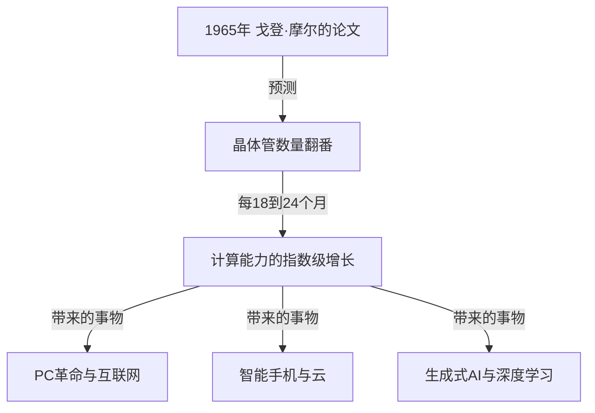
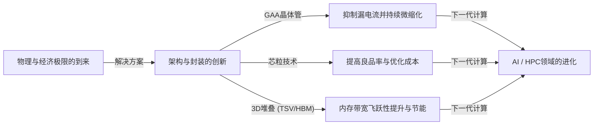

# 摩尔定律是什么？半导体与几何级数进化的轨迹

我们的社会正随着智能手机、云计算以及人工智能（AI）等技术的不断发展而迅速变化。支撑这些技术基础的是“半导体（微芯片）”，而决定其进化历史的，正是著名的**“摩尔定律（Moore's Law）”**。

在本文中，我们将从专业技术作家的视角，深入剖析摩尔定律的历史背景、技术机制、对商业与经济的影响、目前面临的物理极限，以及在“摩尔定律终结”之后的下一代计算技术。

---

## 1. 摩尔定律的诞生与历史背景

### 1965年戈登·摩尔的洞察
摩尔定律起源于英特尔（Intel）联合创始人之一戈登·摩尔（Gordon Moore）在1965年向《电子学（Electronics）》杂志投稿的一篇简短论文。当时他在仙童半导体公司任职。他发表了一个观察结果，即集成电路（IC）上搭载的晶体管数量大约“每年翻一番”。

之后在1975年，摩尔本人修正了预测，将其重新定义为“大约每18到24个月（2年）翻一番”。这就是今天我们所熟知的“摩尔定律”的定论。

### 为什么被称为“定律”？
严格来说，摩尔定律并不是物理学或数学中绝对的“定律（Law）”。它是一个“经验法则（Rule of thumb）”，并一直发挥着行业“路线图”的作用。
以英特尔为首的各家半导体制造商都有着“如果不每两年将性能提升一倍，就会被竞争对手击败”的危机感，并将此作为目标，投入巨额的研发（R&D）资金和设备投资。也就是说，摩尔定律是整个半导体行业作为自我实现的预言而实现下来的“经济与创新的心脏起搏器”。

---

## 2. 几何级数进化（指数级增长）的可怕之处

理解摩尔定律最重要的概念是**“几何级数进化（指数级增长：Exponential Growth）”**。
人类的大脑通常倾向于预测“直线（线性：Linear）”变化。例如“每天前进1步，30天就前进30步”的想法。然而，几何级数的增长则是以“1, 2, 4, 8, 16, 32...”这种翻倍游戏的方式增加。

如果重复30次翻倍，最终数字将超过10亿（2的30次方）。在半导体世界里，这种翻倍现象在过去50多年里持续发生，所以最初占据一个房间大小的计算机，如今不仅能放进我们的口袋，甚至还被搭载在了手表（智能手表）上。

---

## 3. 半导体的微缩化机制：如何提高集成度？

增加晶体管数量（提高集成度）的基本方法是“微缩化（Scaling）”。如果晶体管能够被制造得更小，就可以在同样面积的硅晶圆上配置更多的晶体管。

### 挑战光刻技术的极限
半导体是通过一种被称为“光刻（光曝光技术）”的方法制造的。在硅晶圆上涂抹感光树脂（光刻胶），通过印有电路图案的掩膜板照射光线，将电路转移上去。
为了描绘更细微的电路，需要波长更短的光。
多年来，行业一直在为缩短光的波长而战。
- **从可见光到紫外线**
- **准分子激光（KrF, ArF）**
- **浸没式光刻技术**
- 以及目前的尖端技术**EUV（极紫外：Extreme Ultraviolet）光刻**

荷兰ASML公司独家制造的EUV光刻机，使用波长仅为13.5纳米的光，能够描绘出极其细微的电路。这台设备的研发需要几十年的时间以及数万亿日元级别的投资，正是它使得当前最先进的5nm或3nm工艺等半导体制造成为可能。

---

## 4. 摩尔定律对商业和经济的影响

摩尔定律不仅是一个技术指标，更从根本上改变了全球经济结构。

### 通缩压力与成本的急剧下降
晶体管集成度翻番，意味着“用同样的成本可以获得2倍的计算能力”，或者“同样的计算能力只需要一半的成本”。这种成本的急剧下降，推动了所有产业的数字化（数字化转型：DX）。
随着计算资源从“稀缺昂贵”转变为“丰富廉价”，新的商业模式层出不穷。

### 创造新产业
1. **个人电脑（PC）的普及:** 从20世纪80年代到90年代，个人开始能够拥有计算机。
2. **互联网与网络商业:** 到了21世纪初，廉价的服务器和通信设备通过网络连接了全世界。
3. **智能手机与移动经济:** 到了2010年代，手掌大小的设备具备了媲美超级计算机的性能，应用程序经济圈呈现爆炸式增长。
4. **云与AI:** 进入2020年代后，需要巨大计算资源的深度学习（Deep Learning）和生成式AI（Generative AI）开始崛起。这些都完全依赖于GPU（图形处理半导体）超强并行计算能力的进化。

---

## 5. 摩尔定律的极限与面临的物理障碍

尽管多年来不断有人传言“定律已死”，但摩尔定律却一次又一次地延续着生命，然而现在，它确实面临着真正的物理极限。主要障碍有以下三个：

### 1. 量子隧穿效应与漏电流
当晶体管的尺寸（特别是栅极长度）缩小到几纳米级别（相当于几个到几十个原子大小）时，经典的物理学定律不再适用，量子力学现象变得显著。最具代表性的就是“量子隧穿效应”。
即使试图“关闭”开关以切断电流，电子也会穿透势垒流过去（漏电流：Leakage current），这会导致功耗增加和发生故障。

### 2. 热墙（暗硅问题）
芯片上晶体管密度增加，产生的热量密度也会急剧上升。当散热技术无法跟上时，就无法让整个芯片同时满负荷运转，这种现象被称为“暗硅（Dark Silicon）”。这就陷入了即使提高计算能力，也因热量限制而无法发挥原有性能的困境。

### 3. 经济极限（洛克定律）
有一个被称为“摩尔第二定律”或“洛克定律（Rock's Law）”的经验法则。即“半导体制造工厂的建设成本，每一代都会翻倍”。要建设最先进的晶圆厂（制造工厂），现在需要规模达到两万亿至三万亿日元级别的投资，能负担得起这笔巨额成本的企业，在世界上也仅缩减到了台积电（TSMC）、三星电子和英特尔这三家左右。

---

## 6. More than Moore（超越摩尔定律）

在仅仅依靠微缩化来提高集成度（More Moore）接近极限的情况下，半导体行业开始转向通过新方法来提升性能，即“More than Moore（超越摩尔）”。

### 架构进化（从FinFET到GAA）
从平面的晶体管结构（平面型）向拥有立体结构的**FinFET（鳍式场效应晶体管）**过渡，有效抑制了漏电流，但目前正在进一步向四周被栅极包围的**GAA（全环绕栅极：Gate-All-Around）**结构转变。由此实现了对电子控制能力的极限提升。

### 芯粒（Chiplet）技术
以往将所有功能塞进一个巨大的硅芯片（单片裸片）的做法，被改变为按功能拆分成一个个小芯片（芯粒）来制造，再通过先进的封装技术将它们连接在一个封装内部的方法。这极大提高了良品率，在控制成本的同时提升了整体性能。该技术在AMD的Ryzen处理器等产品上取得了巨大成功，并正在成为未来的主流。

### 2.5D / 3D封装与堆叠技术
不仅将芯片平面（2D）排列，还利用硅通孔（TSV）等技术进行垂直方向（3D）的堆叠，从而大幅提升芯片间的通信速度（带宽）并降低功耗。在AI用的最先进GPU（如NVIDIA的H100）和HBM（高带宽内存）的连接中，这种先进的封装技术是不可或缺的。

---

## 7. 后摩尔时代的下一代计算

鉴于硅基半导体的极限，基于全新原理的计算技术研究也在快速推进。这些技术具备成为“后摩尔时代”主角的潜力。

### 量子计算（Quantum Computing）
利用量子力学中的“叠加”和“量子纠缠”等特性，有望瞬间解决传统计算机需要上亿年才能解决的特定问题（如密码破解、新药分子模拟、优化问题等）。超导、离子阱、光量子等各种方式的研究正处于激烈竞争阶段。

### 神经形态计算（类脑计算机）
这是一种在物理硬件层面模仿人脑神经网络（神经元与突触）机制的技术。与当前的冯·诺依曼架构（CPU和内存分离，存在数据传输瓶颈）不同，它能同时进行信息处理和记忆，从而以极低的功耗进行模式识别和学习。

### 光计算（Optical Computing）
使用光子代替电子来进行信息处理和数据传输的技术。光比电信号速度更快，且能量损失和发热较少，因此被寄希望于成为下一代超高速、低功耗计算基础设施。特别是用光进行芯片间数据传输的“硅光子”技术已经进入了实用化阶段。

---

## 8. 结论：摩尔定律的遗产与我们的未来

戈登·摩尔在1965年提出的“摩尔定律”，不仅仅是单纯的半导体技术预测。它为人类赋予了“技术能够保持指数级进化”的坚定愿景，可以说是一份驱使数百万工程师和研究人员朝着同一目标迈进的“宏大社会契约”。

即使硅晶体管的微缩化迎来了物理极限，人类提升计算能力的创新也不会停止。芯粒、3D堆叠、AI专用架构以及量子计算机等新的范式，将继承摩尔定律的精神，继续引领我们的社会走向未知的领域。

对未来的商业领袖和工程师们来说，必须理解这种“几何级数般的技术进化”步伐，看清下一步将会发生怎样的突破，并持续适应以免被变化的浪潮所淘汰。半导体进化的历史，正是映照人类未来的一面镜子。
