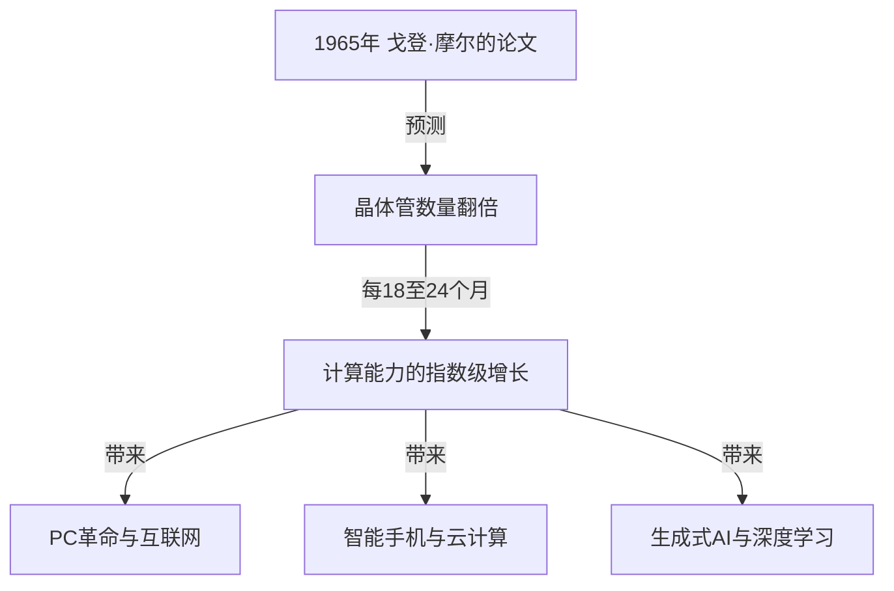
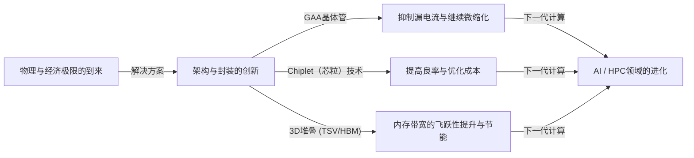

# 什么是摩尔定律？半导体与指数级进化的轨迹

我们的社会正因智能手机、云计算和人工智能（AI）等技术而发生快速变化。支撑这些技术基础的是“半导体（微芯片）”，而决定其进化历史的正是著名的**“摩尔定律（Moore's Law）”**。

在本文中，我们将从专业技术撰稿人的角度，深入解析摩尔定律的历史背景、技术机制、对商业与经济的影响、目前面临的物理极限，以及在“摩尔定律终结”之后的下一代计算技术。

---

## 1. 摩尔定律的诞生与历史背景

### 1965年戈登·摩尔的洞察
摩尔定律源于英特尔（Intel）联合创始人之一戈登·摩尔（Gordon Moore）于1965年在《电子学（Electronics）》杂志上发表的一篇简短论文。当时他就职于仙童半导体公司。他发表了一项观察结果，即集成电路（IC）上搭载的晶体管数量大约“每年翻一番”。

随后，在1975年，摩尔本人修正了他的预测，将其重新定义为“大约每18到24个月（2年）翻一番”。这就是今天我们所熟知的“摩尔定律”的定论。

### 为什么被称为“定律”？
严格来说，摩尔定律并不是物理学或数学中绝对的“定律（Law）”。它是一个“经验法则（Rule of thumb）”，并充当了行业的“路线图”。
以英特尔为首的各半导体制造商都有这样一种危机感：“如果不能每两年将性能翻倍，就会被竞争对手击败”，并以此为目标进行了巨额的研发（R&D）和设备投资。换句话说，摩尔定律是整个半导体行业作为自我实现的预言而实现的“经济与创新的起搏器”。

---

## 2. 指数级增长的威力

在理解摩尔定律时，最重要的概念就是**“指数级进化（指数级增长：Exponential Growth）”**。
人类的大脑通常倾向于预测“线性（Linear）”变化。例如，“如果每天前进1步，30天就会前进30步”的想法。然而，在指数级增长中，它是以“1, 2, 4, 8, 16, 32...”这样的翻倍游戏增加的。

如果重复翻倍30次，最终的数字将超过10亿（2的30次方）。在半导体世界中，由于这种翻倍已经持续了50多年，最初占据整个房间大小的计算机现在可以装在我们的口袋里，甚至可以戴在手腕上（智能手表）。

---

## 3. 半导体微缩化的机制：如何提高集成度？

增加晶体管数量（提高集成度）的基本方法是“微缩化（Scaling）”。如果能把晶体管做得更小，就可以在相同面积的硅晶圆上放置更多的晶体管。

### 挑战光刻技术的极限
半导体是通过一种称为“光刻（光曝光技术）”的方法制造的。在硅晶圆上涂抹感光树脂（光刻胶），然后通过画有电路图案的掩模照射光线，将电路转移上去。
为了绘制更精细的电路，需要波长更短的光。
业界多年来一直在为缩短光的波长而战。
- **从可见光到紫外线**
- **准分子激光（KrF, ArF）**
- **浸没式光刻技术**
- 以及目前最先进的**EUV（极紫外：Extreme Ultraviolet）光刻**

荷兰ASML公司独家制造的EUV曝光设备使用波长仅为13.5纳米的光，绘制出极其微小的电路。该设备的开发需要数十年和数万亿日元级别的投资，但这使得目前最先进的半导体制造（如5nm和3nm工艺）成为可能。

---

## 4. 摩尔定律对商业与经济的影响

摩尔定律不仅是一个技术指标，它从根本上改变了全球经济的结构。

### 通缩压力与成本的剧烈下降
晶体管集成度翻倍意味着“以相同的成本获得两倍的计算能力”，或者“以一半的成本获得相同的计算能力”。这种剧烈的成本下降推动了所有行业的数字化（数字化转型：DX）。
随着计算资源从“稀缺且昂贵”变为“丰富且廉价”，新的商业模式层出不穷。

### 创造新产业
1. **个人电脑（PC）的普及：**在20世纪80年代到90年代，个人变得能够拥有计算机。
2. **互联网与网络商业：**2000年代，廉价的服务器和通信设备通过网络将全球连接起来。
3. **智能手机与移动经济：**2010年代，手掌大小的设备拥有了可媲美超级计算机的性能，应用程序经济圈爆发式增长。
4. **云计算与AI：**2020年代以后，需要巨大计算资源的深度学习和生成式AI（Generative AI）崛起。这些完全依赖于GPU（图形处理单元）大规模并行计算能力的进化。

---

## 5. 摩尔定律的极限与面临的物理障碍

多年来，尽管“定律已死”的传言不断，摩尔定律仍在延续，但目前它正面临着真正的物理极限。主要障碍有以下三个：

### 1. 量子隧穿效应与漏电流
当晶体管的尺寸（特别是栅极长度）缩小到几纳米级别（几个到几十个原子的尺寸）时，经典的物理学定律不再适用，量子力学现象变得显著。其代表就是“量子隧穿效应”。
即使将开关“关闭”以阻止电流，电子也会穿过势垒流动（漏电流），导致功耗增加和误动作。

### 2. 热障（暗硅问题）
随着芯片上晶体管密度的增加，产生的热量密度也急剧上升。冷却技术跟不上，导致无法使整个芯片同时满负荷运行的现象被称为“暗硅（Dark Silicon）”。即使提高了计算能力，也陷入了因热量限制而无法发挥原有性能的困境。

### 3. 经济极限（洛克定律）
有一个被称为“摩尔第二定律”或“洛克定律（Rock's Law）”的经验法则。它指出“半导体制造工厂的建设成本每一代都会翻倍”。建设一个最先进的晶圆厂（制造工厂），现在需要2万亿到3万亿日元规模的投资，全球能够承担如此庞大成本的企业已缩小到台积电（TSMC）、三星电子和英特尔这3家左右。

---

## 6. More than Moore（超越摩尔定律）

随着通过简单微缩化提高集成度（More Moore）接近极限，半导体行业正转向通过新方法提高性能，即“More than Moore”。

### 架构的进化（从FinFET到GAA）
通过从平面的晶体管结构转移到具有立体结构的**FinFET（鳍式场效应晶体管）**来抑制漏电流，而目前正在进一步向栅极完全包围沟道的**GAA（全环绕栅极）**结构过渡。这将电子的可控性提升到了极限。

### Chiplet（芯粒）技术
与以前将所有功能塞进一个巨大的硅芯片（单片裸片）不同，这种方法将功能分割成小芯片（Chiplet）进行制造，然后利用先进的封装技术将它们连接在一个封装内。这大大提高了良率，并能够在控制成本的同时提升整体性能。它在AMD的Ryzen处理器等产品中取得了巨大成功，并正在成为未来的主流。

### 2.5D / 3D封装与堆叠技术
不仅仅是将芯片在平面（2D）上排列，通过使用硅通孔（TSV）等技术在垂直方向（3D）上堆叠芯片，大幅提高了芯片间的通信速度（带宽）并降低了功耗。为了连接用于AI的最先进GPU（如NVIDIA的H100）和HBM（高带宽内存），这种先进的封装技术是不可或缺的。

---

## 7. 后摩尔时代的下一代计算

着眼于硅基半导体的极限，基于全新原理的计算技术研究也在快速推进。这些技术有潜力成为“后摩尔时代”的主角。

### 量子计算（Quantum Computing）
利用量子力学的“叠加态”和“量子纠缠”等特性，有望瞬间解决传统计算机（经典计算机）需要几亿年才能解决的特定问题（如密码破解、新药分子模拟、优化问题等）。超导、离子阱和光量子等各种方法的研究正在激烈竞争。

### 神经形态计算（类脑计算机）
这是一种在物理硬件层面上模仿人脑神经网络（神经元和突触）机制的技术。与当前的冯·诺依曼架构（CPU和内存分离，存在数据传输瓶颈）不同，通过同时进行信息处理和记忆，它可以以极低的功耗进行模式识别和学习。

### 光计算（Optical Computing）
这是一种使用光子代替电子进行信息处理和数据传输的技术。由于光比电信号速度快，且能量损耗和发热少，被期待作为下一代超高速、低功耗的计算基础。特别是使用光进行芯片间数据传输的“硅光子”技术已经进入了实用化阶段。

---

## 8. 结论：摩尔定律的遗产与我们的未来

戈登·摩尔在1965年提出的“摩尔定律”不仅仅是对半导体的技术预测。可以说，它向人类提供了一个坚定的愿景：“技术可以持续呈指数级进化”，并作为一项“宏大的社会契约”，驱使着数百万工程师和研究人员朝着同一个目标前进。

即使硅上晶体管的微缩化达到物理极限，人类提高计算能力的创新也不会停止。小芯片、3D堆叠、AI专用架构以及量子计算机等新范式将继承摩尔定律的精神，继续引领我们的社会走向未知的领域。

未来的商业领袖和工程师需要做的是，理解这种“指数级技术进化”的步伐，看清接下来会发生什么样的突破，并不断适应，以免错失变革的浪潮。半导体进化的历史，正是直接反映人类未来的一面镜子。
