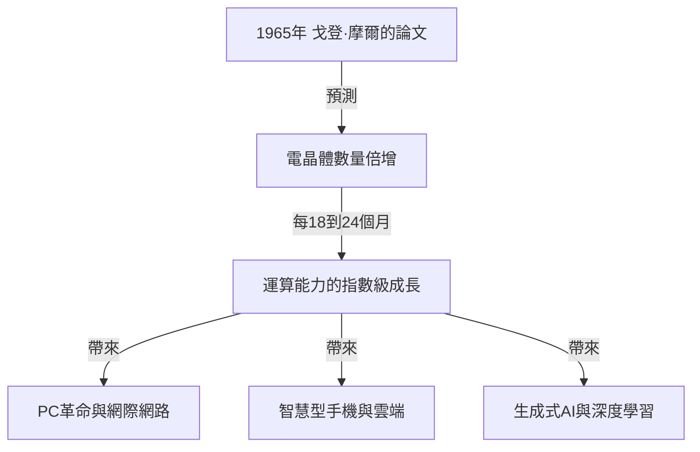
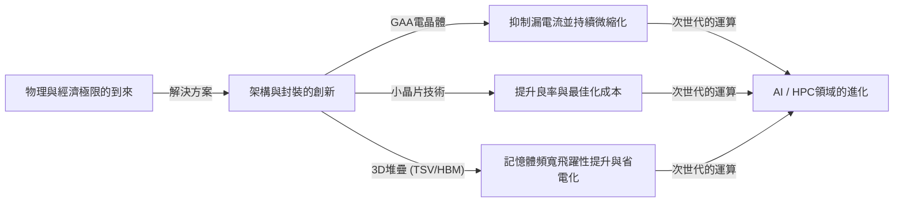

# 摩爾定律是什麼？半導體與幾何級數進化的軌跡

我們的社會正因智慧型手機、雲端運算以及人工智慧（AI）等科技而快速改變。支撐這些技術基礎的是「半導體（微晶片）」，而決定其進化歷史的，正是著名的**「摩爾定律（Moore's Law）」**。

在這篇文章中，我們將從專業技術作家的視角，深入探討摩爾定律的歷史背景、技術機制、對商業與經濟的影響、目前面臨的物理極限，以及在「摩爾定律終結」之後的次世代運算技術。

---

## 1. 摩爾定律的誕生與歷史背景

### 1965年戈登·摩爾的洞察
摩爾定律源於英特爾（Intel）共同創辦人之一的戈登·摩爾（Gordon Moore）於1965年在《電子學（Electronics）》雜誌上發表的一篇簡短論文。當時他任職於快捷半導體（Fairchild Semiconductor）公司。他發表了一項觀察結果，指出積體電路（IC）上搭載的電晶體數量，大約「每年會增加一倍」。

之後，摩爾在1975年修正了他的預測，重新定義為「大約每18個月到24個月（2年）增加一倍」。這成為了我們今天所熟知的「摩爾定律」之定論。

### 為什麼被稱為「定律」？
嚴格來說，摩爾定律並非物理學或數學中絕對的「定律（Law）」。它是一種「經驗法則（Rule of thumb）」，並扮演著業界「路線圖（Roadmap）」的角色。
包含英特爾在內的各家半導體製造商，都抱持著「如果不能每兩年將性能提升一倍，就會敗給競爭對手」的危機感，並以此為目標進行鉅額的研究開發（R&D）投資與設備投資。換句話說，摩爾定律是整個半導體業界作為自我實現預言而實現的「經濟與創新的心律調節器」。

---

## 2. 幾何級數進化（指數級成長）的可怕之處

在理解摩爾定律時，最重要的概念就是<strong>「幾何級數進化（指數級成長：Exponential Growth）」</strong>。
人類的大腦通常傾向於預測「直線型（線性：Linear）」的變化。例如「如果每天前進一步，30天就會前進30步」的想法。然而，在幾何級數的成長中，會以「1, 2, 4, 8, 16, 32...」這種倍增的遊戲方式增加。

如果重複30次倍增，最終的數字將超過10億（2的30次方）。在半導體的世界裡，這種倍增在過去50多年來持續進行，因此當初佔據整個房間大小的電腦，現在已經能夠收納在我們的口袋裡，甚至搭載在手錶（智慧型手錶）上了。

---

## 3. 半導體微縮化的機制：如何提高積體度？

為了增加電晶體的數量（提高積體度），最基本的方法就是「微縮化（Scaling）」。如果能將電晶體做得更小，就能在相同面積的矽晶圓上配置更多的電晶體。

### 挑戰微影技術的極限
半導體是透過一種稱為「微影（光學曝光技術，Photolithography）」的方法製造的。在矽晶圓上塗佈感光性樹脂（光阻劑），接著讓光穿過畫有電路圖案的光罩，將電路轉印上去。
為了繪製更精細的電路，就需要波長更短的光。
業界長年來持續進行縮短光波長的戰鬥。
- **從可見光到紫外線**
- **準分子雷射（KrF, ArF）**
- **浸潤式微影技術**
- 以及目前最先進的**EUV（極紫外光：Extreme Ultraviolet）微影技術**

由荷蘭ASML公司獨家製造的EUV曝光機，使用波長僅13.5奈米的光，繪製出極為精細的電路。這台設備的開發需要數十年與兆日圓規模的投資，但這使得目前5奈米或3奈米製程等最先進半導體的製造成為可能。

---

## 4. 摩爾定律對商業與經濟帶來的影響

摩爾定律不單只是一個技術指標，它從根本上改變了世界經濟的結構。

### 通縮壓力與成本的劇烈下降
電晶體積體度提升兩倍，意味著「用相同的成本可以獲得兩倍的運算能力」，或者是「可以用一半的成本獲得相同的運算能力」。這種成本的劇烈下降，推動了所有產業的數位化（數位轉型：DX）。
運算資源從「稀缺且昂貴」轉變為「豐富且廉價」，使得新的商業模式不斷誕生。

### 創造新產業
1. **個人電腦（PC）的普及：** 從1980年代到90年代，個人開始能夠擁有電腦。
2. **網際網路與網路商業：** 2000年代，廉價的伺服器與通訊設備透過網路將全世界連結在一起。
3. **智慧型手機與行動經濟：** 2010年代，手掌大小的裝置擁有了媲美超級電腦的性能，應用程式（App）經濟圈爆發性成長。
4. **雲端與AI：** 2020年代以後，需要龐大運算資源的深度學習與生成式AI（Generative AI）崛起。這些都完全依賴於GPU（圖形處理半導體）超平行運算能力的進化。

---

## 5. 摩爾定律的極限與面臨的物理障礙

長年來雖然多次被謠傳「定律已死」卻不斷延壽的摩爾定律，目前正面臨真正的物理極限。主要的障礙有以下三個。

### 1. 量子穿隧效應與漏電流
當電晶體的尺寸（尤其是閘極長度）縮小到數奈米等級（幾個到幾十個原子的尺寸）時，物理學的古典定律將不再適用，量子力學現象將變得顯著。其中最具代表性的就是「量子穿隧效應」。
即使試圖將開關「關閉」以停止電流，電子也會穿過障壁流動（漏電流：Leakage current），這會導致耗電量增加與誤動作。

### 2. 散熱之牆（暗矽問題）
隨著晶片上電晶體密度的提高，產生的熱能密度也會急遽上升。冷卻技術無法跟上，導致晶片整體無法同時全速運轉的現象被稱為「暗矽（Dark Silicon）」。這陷入了一種進退兩難的困境，即使提高了運算能力，也因為熱能限制而無法發揮原有的性能。

### 3. 經濟極限（洛克定律）
有一項被稱為「摩爾第二定律」或「洛克定律（Rock's Law）」的經驗法則。內容是「半導體製造廠的建設成本，每一個世代就會增加一倍」。現在要建設最先進的晶圓代工廠（製造廠），需要兩兆到三兆日圓規模的投資，全世界能負擔這筆龐大成本的企業，已經縮減到只剩台積電（TSMC）、三星電子、英特爾等三家左右。

---

## 6. More than Moore（超越摩爾定律）

在單純靠微縮化來提升積體度（More Moore）已接近極限的情況下，半導體業界正轉向透過新方法來提升性能，也就是「More than Moore」。

### 架構的進化（從FinFET到GAA）
雖然過去透過從平面的電晶體結構（平面型）轉移到具有立體結構的**FinFET（鰭式場效電晶體）**來抑制漏電流，但現在正進一步轉移到將閘極環繞四周的**GAA（環繞閘極）**結構。藉此將電子的控制性提升到極致。

### 小晶片（Chiplet）技術
過去是將所有功能塞進一個巨大的矽晶片（單片晶粒）中，現在則轉變為將各個功能分割成小晶片（Chiplet）來製造，並透過先進的封裝技術將它們連接在一個封裝內。這使得良率大幅提升，在抑制成本的同時也能提升整體性能。這在AMD的Ryzen處理器等方面取得了巨大的成功，並成為未來的主流趨勢。

### 2.5D / 3D封裝與堆疊技術
不只是將晶片在平面（2D）上排列，而是利用矽穿孔（TSV）等技術在垂直方向（3D）上堆疊，從而大幅提升晶片間的通訊速度（頻寬）並降低耗電量。要連接AI用的最先進GPU（如NVIDIA的H100）與HBM（高頻寬記憶體），這種先進的封裝技術是不可或缺的。

---

## 7. 後摩爾時代的次世代運算

著眼於矽基半導體的極限，基於全新原理的運算技術研究也正快速進展。這些技術具有成為「後摩爾時代」主角的潛力。

### 量子運算（Quantum Computing）
利用量子力學的「疊加」與「量子糾纏」等特性，有望能在瞬間解決傳統電腦（古典電腦）需要數億年才能解開的特定問題（如密碼破解、新藥分子模擬、最佳化問題等）。超導體、離子阱、光量子等各種方式的研究正在激烈競爭。

### 神經形態運算（類腦電腦）
這是一種在實體硬體層面上模仿人類大腦神經網路（神經元與突觸）機制的技術。與目前的馮·紐曼架構（CPU與記憶體分離，存在資料傳輸瓶頸）不同，它能同時進行資訊處理與記憶，從而以極低的耗電量進行模式識別與學習。

### 光學運算（Optical Computing）
使用光子（Photon）代替電子進行資訊處理與資料傳輸的技術。與電子訊號相比，光的速度更快，能量耗損與發熱也較少，因此被期待能作為次世代的超高速、低耗電運算基礎設施。特別是透過光來進行晶片間資料傳輸的「矽光子」技術，已經進入實用化階段。

---

## 8. 結論：摩爾定律的遺產與我們的未來

戈登·摩爾在1965年提出的「摩爾定律」，不僅僅是半導體的技術預測。可以說，它給予了人類「科技能持續呈指數級進化」的堅定願景，是一份驅使數百萬工程師與研究人員朝向相同目標前進的「宏偉社會契約」。

即使矽晶圓上電晶體的微縮化面臨物理極限，人類試圖提升運算能力的創新也不會停止。小晶片、3D堆疊、AI專用架構，以及量子電腦等新典範，將繼承摩爾定律的精神，繼續引領我們的社會邁向未知的領域。

未來的商業領袖與工程師所需要的，是理解這種「幾何級數技術進化」的步調，看清接下來會發生什麼樣的突破，並持續適應以避免錯失變革的浪潮。半導體進化的歷史，正是一面映照出人類未來的鏡子。
