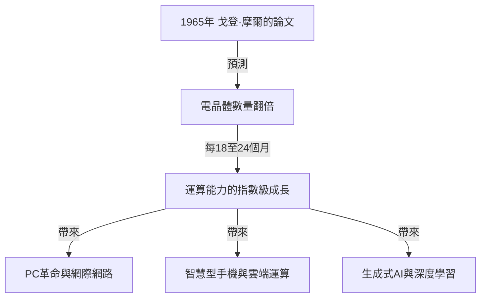
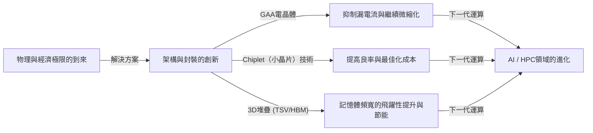

# 什麼是摩爾定律？半導體與指數級進化的軌跡

我們的社會正因智慧型手機、雲端運算和人工智慧（AI）等技術而發生快速變化。支撐這些技術基礎的是「半導體（微晶片）」，而決定其進化歷史的正是著名的**「摩爾定律（Moore's Law）」**。

在本文中，我們將從專業技術撰稿人的角度，深入解析摩爾定律的歷史背景、技術機制、對商業與經濟的影響、目前面臨的物理極限，以及在「摩爾定律終結」之後的下一代運算技術。

---

## 1. 摩爾定律的誕生與歷史背景

### 1965年戈登·摩爾的洞察
摩爾定律源於英特爾（Intel）共同創辦人之一戈登·摩爾（Gordon Moore）於1965年在《電子學（Electronics）》雜誌上發表的一篇簡短論文。當時他任職於快捷半導體公司。他發表了一項觀察結果，即積體電路（IC）上搭載的電晶體數量大約「每年翻一倍」。

隨後，在1975年，摩爾本人修正了他的預測，將其重新定義為「大約每18到24個月（2年）翻一倍」。這就是今天我們所熟知的「摩爾定律」的定論。

### 為什麼被稱為「定律」？
嚴格來說，摩爾定律並不是物理學或數學中絕對的「定律（Law）」。它是一個「經驗法則（Rule of thumb）」，並充當了業界的「路線圖」。
以英特爾為首的各半導體製造商都有這樣一種危機感：「如果不能每兩年將效能翻倍，就會被競爭對手擊敗」，並以此為目標進行了巨額的研發（R&D）和設備投資。換句話說，摩爾定律是整個半導體產業作為自我實現的預言而實現的「經濟與創新的心律調節器」。

---

## 2. 指數級成長的威力

在理解摩爾定律時，最重要的概念就是**「指數級進化（指數級成長：Exponential Growth）」**。
人類的大腦通常傾向於預測「線性（Linear）」變化。例如，「如果每天前進1步，30天就會前進30步」的想法。然而，在指數級成長中，它是以「1, 2, 4, 8, 16, 32...」這樣的翻倍遊戲增加的。

如果重複翻倍30次，最終的數字將超過10億（2的30次方）。在半導體世界中，由於這種翻倍已經持續了50多年，最初佔據整個房間大小的電腦現在可以裝在我們的口袋裡，甚至可以戴在手腕上（智慧手錶）。

---

## 3. 半導體微縮化的機制：如何提高整合度？

增加電晶體數量（提高整合度）的基本方法是「微縮化（Scaling）」。如果能把電晶體做得更小，就可以在相同面積的矽晶圓上放置更多的電晶體。

### 挑戰微影技術的極限
半導體是透過一種稱為「微影（光曝光技術）」的方法製造的。在矽晶圓上塗抹感光樹脂（光阻），然後透過畫有電路圖案的光罩照射光線，將電路轉移上去。
為了繪製更精細的電路，需要波長更短的光。
業界多年來一直在為縮短光的波長而戰。
- **從可見光到紫外線**
- **準分子雷射（KrF, ArF）**
- **浸潤式微影技術**
- 以及目前最先進的**EUV（極紫外光：Extreme Ultraviolet）微影**

荷蘭ASML公司獨家製造的EUV曝光設備使用波長僅為13.5奈米的光，繪製出極其微小的電路。該設備的開發需要數十年和數兆日圓級別的投資，但這使得目前最先進的半導體製造（如5奈米和3奈米製程）成為可能。

---

## 4. 摩爾定律對商業與經濟的影響

摩爾定律不僅是一個技術指標，它從根本上改變了全球經濟的結構。

### 通縮壓力與成本的劇烈下降
電晶體整合度翻倍意味著「以相同的成本獲得兩倍的運算能力」，或者「以一半的成本獲得相同的運算能力」。這種劇烈的成本下降推動了所有產業的數位化（數位轉型：DX）。
隨著運算資源從「稀缺且昂貴」變為「豐富且廉價」，新的商業模式層出不窮。

### 創造新產業
1. **個人電腦（PC）的普及：**在20世紀80年代到90年代，個人變得能夠擁有電腦。
2. **網際網路與網路商業：**2000年代，廉價的伺服器和通訊設備透過網路將全球連接起來。
3. **智慧型手機與行動經濟：**2010年代，手掌大小的設備擁有了可媲美超級電腦的效能，應用程式經濟圈爆發式成長。
4. **雲端運算與AI：**2020年代以後，需要巨大運算資源的深度學習和生成式AI（Generative AI）崛起。這些完全依賴於GPU（圖形處理單元）大規模平行運算能力的進化。

---

## 5. 摩爾定律的極限與面臨的物理障礙

多年來，儘管「定律已死」的傳言不斷，摩爾定律仍在延續，但目前它正面臨著真正的物理極限。主要障礙有以下三個：

### 1. 量子穿隧效應與漏電流
當電晶體的尺寸（特別是閘極長度）縮小到幾奈米級別（幾個到幾十個原子的尺寸）時，古典物理學定律不再適用，量子力學現象變得顯著。其代表就是「量子穿隧效應」。
即使將開關「關閉」以阻止電流，電子也會穿過位能障壁流動（漏電流），導致功耗增加和誤動作。

### 2. 熱障礙（暗矽問題）
隨著晶片上電晶體密度的增加，產生的熱量密度也急劇上升。散熱技術跟不上，導致無法使整個晶片同時滿載運作的現象被稱為「暗矽（Dark Silicon）」。即使提高了運算能力，也陷入了因熱量限制而無法發揮原有效能的困境。

### 3. 經濟極限（洛克定律）
有一個被稱為「摩爾第二定律」或「洛克定律（Rock's Law）」的經驗法則。它指出「半導體製造工廠的建設成本每一代都會翻倍」。建設一個最先進的晶圓廠（製造工廠），現在需要2兆到3兆日圓規模的投資，全球能夠承擔如此龐大成本的企業已縮小到台積電（TSMC）、三星電子和英特爾這3家左右。

---

## 6. More than Moore（超越摩爾定律）

隨著透過簡單微縮化提高整合度（More Moore）接近極限，半導體產業正轉向透過新方法提高效能，即「More than Moore」。

### 架構的進化（從FinFET到GAA）
透過從平面的電晶體結構轉移到具有立體結構的**FinFET（鰭式場效電晶體）**來抑制漏電流，而目前正在進一步向閘極完全包圍通道的**GAA（全環繞閘極）**結構過渡。這將電子的可控性提升到了極限。

### Chiplet（小晶片）技術
與以前將所有功能塞進一個巨大的矽晶片（單片裸晶）不同，這種方法將功能分割成小晶片（Chiplet）進行製造，然後利用先進的封裝技術將它們連接在一個封裝內。這大大提高了良率，並能夠在控制成本的同時提升整體效能。它在AMD的Ryzen處理器等產品中取得了巨大成功，並正在成為未來的主流。

### 2.5D / 3D封裝與堆疊技術
不僅僅是將晶片在平面（2D）上排列，透過使用矽穿孔（TSV）等技術在垂直方向（3D）上堆疊晶片，大幅提高了晶片間的通訊速度（頻寬）並降低了功耗。為了連接用於AI的最先進GPU（如NVIDIA的H100）和HBM（高頻寬記憶體），這種先進的封裝技術是不可或缺的。

---

## 7. 後摩爾時代的下一代運算

著眼於矽基半導體的極限，基於全新原理的運算技術研究也在快速推進。這些技術有潛力成為「後摩爾時代」的主角。

### 量子運算（Quantum Computing）
利用量子力學的「疊加態」和「量子糾纏」等特性，有望瞬間解決傳統電腦（古典電腦）需要幾億年才能解決的特定問題（如密碼破解、新藥分子模擬、最佳化問題等）。超導、離子阱和光量子等各種方法的研究正在激烈競爭。

### 神經形態運算（類腦電腦）
這是一種在物理硬體層面上模仿人腦神經網路（神經元和突觸）機制的技術。與當前的馮·紐曼架構（CPU和記憶體分離，存在資料傳輸瓶頸）不同，透過同時進行資訊處理和記憶，它可以以極低的功耗進行模式識別和學習。

### 光運算（Optical Computing）
這是一種使用光子代替電子進行資訊處理和資料傳輸的技術。由於光比電訊號速度快，且能量損耗和發熱少，被期待作為下一代超高速、低功耗的運算基礎。特別是使用光進行晶片間資料傳輸的「矽光子」技術已經進入了實用化階段。

---

## 8. 結論：摩爾定律的遺產與我們的未來

戈登·摩爾在1965年提出的「摩爾定律」不僅僅是對半導體的技術預測。可以說，它向人類提供了一個堅定的願景：「技術可以持續呈指數級進化」，並作為一項「宏大的社會契約」，驅使著數百萬工程師和研究人員朝著同一個目標前進。

即使矽上電晶體的微縮化達到物理極限，人類提高運算能力的創新也不會停止。小晶片、3D堆疊、AI專用架構以及量子電腦等新範式將繼承摩爾定律的精神，繼續引領我們的社會走向未知的領域。

未來的商業領袖和工程師需要做的是，理解這種「指數級技術進化」的步伐，看清接下來會發生什麼樣的突破，並不斷適應，以免錯失變革的浪潮。半導體進化的歷史，正是直接反映人類未來的一面鏡子。
