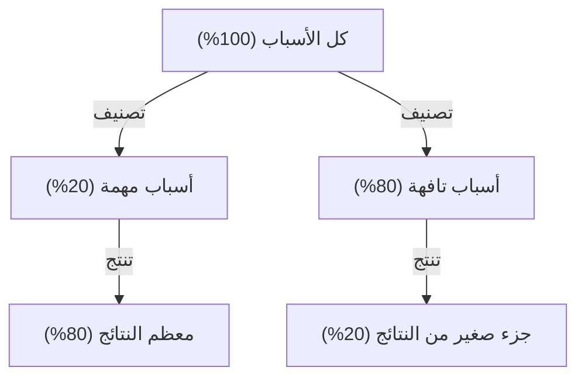

# مقدمة: لماذا يعتبر "مبدأ باريتو" أمراً لا غنى عنه اليوم؟

المجتمع الحديث مليء بالمعلومات والخيارات. يواجه رجال الأعمال يومياً مهام هائلة، ويحتاج المديرون إلى اختيار أفضل خيار من بين عدد لا يحصى من الخيارات الاستراتيجية. في مثل هذه البيئة شديدة التعقيد، فإن نهج "القيام بكل شيء بشكل مثالي" غالباً ما يؤدي إلى استنزاف الموارد والإرهاق.

هنا يبرز "مبدأ باريتو (قاعدة 80:20)" بقوته الساحقة. هذه القاعدة التجريبية البسيطة، التي تنص على أن "80% من النتائج تأتي من 20% من الأسباب"، توضح لنا بوضوح أين يجب أن نركز طاقتنا.

في هذه المقالة، سنتعمق في شرح مبدأ باريتو، بدءاً من الفهم الأساسي للمبدأ، والخلفية التاريخية، والاستراتيجيات المحددة للتطبيق في تحسين إنتاجية الأعمال والأفراد، ووصولاً إلى قيود هذا المبدأ والمفاهيم الخاطئة حوله. بحلول الوقت الذي تنتهي فيه من قراءة هذه المقالة، يجب أن تكون قد حصلت على عدسة قوية لتحديد "ما يجب التركيز عليه وما يجب التخلي عنه".

## ما هو مبدأ باريتو؟ تاريخه وجوهره

تم اقتراح مبدأ باريتو من قبل الاقتصادي الإيطالي فيلفريدو باريتو (Vilfredo Pareto)، الذي كان نشطاً في أواخر القرن التاسع عشر وأوائل القرن العشرين. في بحث نشره عام 1896، درس توزيع الثروة في أوروبا في ذلك الوقت واكتشف حقيقة مذهلة. وهي التوزيع غير المتكافئ للثروة، حيث "يمتلك حوالي 80% من إجمالي ثروة المجتمع أعلى 20% من الأثرياء".

في وقت لاحق، أكد العديد من الباحثين أن هذا التوزيع غير المتماثل "80:20" ينطبق على نطاق واسع يتجاوز حدود علم الاقتصاد ليشمل العالم الطبيعي والأعمال والظواهر الاجتماعية. في الأربعينيات من القرن العشرين، طبق جوزيف جوران (Joseph M. Juran)، وهو مرجع في مراقبة الجودة، هذا المبدأ على عالم الأعمال واقترح مفهوم "القلة الحيوية (vital few) والكثرة التافهة (trivial many)". أصبح هذا أساس مبدأ باريتو في الأعمال الحديثة.

### توضيح آلية المبدأ

جوهر مبدأ باريتو هو أن **العلاقة بين "المدخلات (الأسباب)" و"المخرجات (النتائج)" ليست متساوية**. يوضح الرسم البياني التالي بساطة هذه العلاقة غير المتوازنة.

إن الفكرة التي نميل حدسياً إلى تصديقها بأن "النتائج تتناسب مع مقدار الجهد (قاعدة 1:1)" نادراً ما تصح في العالم الحقيقي. في الواقع، يحدد عدد قليل من العوامل النتيجة بشكل حاسم.

## تطبيق مبدأ باريتو في الأعمال

يظهر مبدأ باريتو أثره الأكثر دراماتيكية في مجال الأعمال. من أجل زيادة الأرباح إلى أقصى حد في ظل محدودية الموارد (الوقت والمال والموظفين)، من الضروري دمج هذا المبدأ في جميع عمليات الأعمال.

### 1. استراتيجية المبيعات والتسويق

أشهر مثال لتطبيق مبدأ باريتو في الأعمال هو أن "80% من المبيعات تأتي من أعلى 20% من العملاء".

*   **تحديد أفضل 20% من العملاء الممتازين:** يجب على الشركات أولاً تحديد مجموعة أعلى 20% من العملاء الذين يولدون معظم مبيعاتها وأرباحها من البيانات.
*   **تركيز الموارد:** بدلاً من تقديم خدمات متساوية لجميع العملاء، ركز معظم (80%) ميزانية التسويق وموارد المبيعات على تقديم معاملة كبار الشخصيات ونجاح العملاء الخاص لهذه الفئة العليا التي تبلغ 20% لزيادة الولاء.
*   **التعليقات لتطوير المنتجات:** من خلال تحليل ما يبحث عنه أعلى 20% من العملاء بشكل شامل وتحديث المنتجات لتلبية احتياجاتهم، يصبح التحسين الأكثر فعالية من حيث التكلفة ممكناً.

### 2. إدارة الموارد البشرية والمنظمات

يظهر مبدأ باريتو بوضوح أيضاً في الأداء التنظيمي. هناك اتجاه نحو أن "80% من نتائج الشركة يتم إنتاجها بواسطة أفضل 20% من الموظفين المتميزين".

*   **الاستثمار في ذوي الأداء العالي:** إن الحفاظ على تحفيز أعلى 20% من الموظفين وخلق بيئة (التفويض، المكافآت، ترتيبات العمل المرنة، إلخ) حيث يمكنهم إظهار قدراتهم إلى أقصى حد سيزيد من إنتاجية المنظمة بأكملها بشكل كبير.
*   **إنشاء نظام لنشر المهارات:** من خلال استخراج المعرفة الضمنية والخصائص السلوكية لأفضل 20% من المواهب وإنشاء نظام (الأدلة أو التوجيه) لمشاركتها مع 80% المتبقية من الموظفين، نهدف إلى رفع مستوى المنظمة بأكملها.

### 3. إدارة المخزون ومراقبة الجودة

*   **إدارة المخزون (تحليل ABC):** غالباً ما تمثل أعلى 20% من العناصر التي يتم التعامل معها 80% من إجمالي المبيعات. من الضروري إدارتها بصرامة لمنع نفاد مخزون هذه العناصر المهمة (الرتبة A)، واتخاذ قرارات مثل تقليل تكرار الطلب أو التوقف عن التعامل مع العناصر ذات المساهمة المنخفضة في المبيعات (الرتبة C).
*   **مراقبة الجودة (إصلاح الأخطاء):** في تطوير البرمجيات، يُقال إن "80% من أخطاء النظام وعيوبه ناتجة عن 20% من إجمالي الوحدات (الكود)". من خلال تركيز موارد الاختبار وإعادة البناء على تلك الـ 20%، يمكن تحسين الجودة بكفاءة.

## التطبيق على الإنتاجية الشخصية وإدارة الوقت

ليس فقط في الأعمال التجارية، ولكن أيضاً في أساليب العمل الفردية والحياة اليومية، يمكنك ممارسة "التفكير الجوهري (التفكير في التركيز على ما هو ضروري)" من خلال اعتماد مبدأ باريتو.

### 1. إدارة المهام: تحديد "الـ 20% المهمة"

لنفترض أن لديك 10 مهام في قائمة المهام الخاصة بك كل يوم. وفقاً لمبدأ باريتو، فإن المهام التي تخلق قيمة حقيقية وتؤدي مباشرة إلى تحقيق أهدافك هي "مهمتان فقط (20%)".

يميل الكثير من الناس إلى التفكير، "دعنا نتخلص من المهام السهلة أولاً لاكتساب الزخم"، ولكن هذا سيؤدي إلى سرقة وقتك وطاقتك بسبب الـ 80% التافهة. يقوم الأشخاص ذوو الإنتاجية العالية بمعالجة أهم 20% من المهام (المهام الأكثر صعوبة والتي تؤدي إلى أكبر النتائج) في أول شيء في الصباح عندما تكون مستويات طاقتهم في أعلى مستوياتها.

### 2. 80:20 في اكتساب المهارات

مبدأ باريتو فعال أيضاً عند تعلم لغة جديدة أو برمجة أو آلة موسيقية.
هناك حقيقة أن "80% من المحادثات اليومية في لغة ما تتكون من 20% من الكلمات الأكثر استخداماً". لذلك، قبل حفظ الكلمات الأقل شيوعاً أو القواعد النحوية المعقدة بشكل مثالي، فإن التدريب المتكرر والمكثف على الـ 20% الأساسية هو أقصر طريق للتحسن.

### 3. التبسيط الرقمي وجمع المعلومات

يتعرض الأشخاص المعاصرون لكميات هائلة من المعلومات من وسائل التواصل الاجتماعي والمواقع الإخبارية، ولكن "المعلومات التي لها تأثير إيجابي حقيقي على حياتك وعملك تمثل أقل من 20% من جميع مصادر المعلومات".
لتحقيق النتائج، تحتاج إلى الشجاعة لحذف التطبيقات غير الضرورية، وإلغاء الاشتراك في النشرات الإخبارية منخفضة القيمة، وتخصيص الوقت فقط لـ 20% من مصادر المعلومات عالية الجودة (الكتب الممتازة، والمجلات المتخصصة، والموجهين الموثوق بهم، إلخ).

## دورة تطبيق مبدأ باريتو

إليك إطار عمل لمواصلة تطبيق المبدأ فعلياً، وليس فقط فهمه كمعرفة.

1.  **تحليل الوضع الحالي (القياس وجمع البيانات):** أولاً، افهم الحقائق بدقة. فيم يُستخدم الوقت؟ من أين تأتي المبيعات؟ التحليل القائم على البيانات، وليس الاعتماد على الحدس، أمر ضروري.
2.  **استخراج الـ 20% المهمة:** من البيانات التي تم جمعها، حدد "الأقلية الحاسمة". في الوقت نفسه، قم بتوضيح "الـ 80% التي يجب التخلص منها أو تقليلها".
3.  **تركيز الموارد:** تحلى بالشجاعة لتقرر "ما لا يجب فعله (Not-to-do)". صب كل وقتك وأموالك وجهدك المتاح في الـ 20% المهمة المستخرجة.
4.  **التقييم والمراجعة:** البيئة والظروف تتغير باستمرار. قد تصبح "الـ 20% المهمة" السابقة قديمة، لذلك استمر في تدوير هذه الدورة بانتظام (على سبيل المثال، كل ربع سنة) لضبط تركيزك دائماً.

## فخاخ وتنبيهات مبدأ باريتو

يعد مبدأ باريتو أداة قوية للغاية، ولكن الثقة العمياء فيه يمكن أن يكون لها آثار جانبية خطيرة. يجب الانتباه جيداً إلى النقاط التالية.

### 1. "80:20" ليست نسبة مطلقة
الأرقام 80 و 20 هي مجرد إرشادات تستند إلى قاعدة تجريبية وليست قاعدة رياضية صارمة. اعتماداً على الموقف، يمكن أن تكون "90:10" أو "70:30". ما يهم ليس "دقة الأرقام"، بل إدراك "عدم التوازن بين السبب والنتيجة".

### 2. الـ 80% المتبقية ليست "عديمة القيمة تماماً"
على سبيل المثال، إذا ركزت كثيراً على "أفضل 20% من العملاء الذين يولدون 80% من المبيعات" لدرجة أنك تتخلى تماماً عن الـ 80% المتبقية من العملاء، فهناك خطر الإضرار بسمعة الشركة أو فقدان العملاء المحتملين الذين كان من الممكن أن ينموا ليصبحوا عملاء ممتازين في المستقبل. وبالمثل، في تشكيلات المنتجات، غالباً ما تدعم المنتجات المتخصصة (الذيل الطويل) خبرة العلامة التجارية وجاذبيتها.
المهم ليس "التخلي عن شيء ما"، بل "تحسين نسبة تخصيص الموارد (إيجاد التوازن الصحيح)".

### 3. الافتقار إلى منظور طويل الأجل
مبدأ باريتو قوي في التحسين بناءً على البيانات الحالية، لكنه لا يخلق ابتكارات مستقبلية. قد تكون البذور التي ستدعم أعمالك بعد 5 سنوات مخفية في "الـ 80% من الأنشطة التي لا تدر أرباحاً" اليوم. إن الموازنة بين الكفاءة قصيرة الأجل (تطبيق 80:20 بشكل صارم) والاستكشاف طويل الأجل (الاستثمار في ما يبدو أنه مضيعة للوقت) أمر ضروري حقاً للنمو المستدام.

## التطبيق النهائي: "80/20 من 80/20"

كنهج أكثر تقدماً، هناك فكرة تطبيق مبدأ باريتو في بنية متداخلة.

ينطبق مبدأ باريتو أيضاً ضمن "أعلى 20% من العناصر". بعبارة أخرى، إنه تركيز شديد حيث 20% من الـ 20% (أي 4% من الإجمالي) تنتج 80% من الـ 80% (أي 64% من الإجمالي) من النتائج (قاعدة 64:4).

إذا وجدت "الـ 20% الأكثر أهمية" في المشروع الذي تعمل عليه حالياً، فاسأل نفسك: "ما هو "الجوهر بنسبة 4%" ضمن تلك الـ 20% الذي يحدث فرقاً هائلاً؟". إذا تمكنت من تضييق نطاق تركيزك إلى هذا الحد، فستصل إنتاجيتك حرفياً إلى مستوى مختلف تماماً.

## خاتمة: جمالية الطرح

نحن نميل إلى محاولة حل المشكلات عن طريق "الجمع". نزيد عدد المنتجات لزيادة المبيعات، ونزيد عدد الاجتماعات لإنجاح المشاريع، ونزيد عدد الأدوات لتحسين الإنتاجية.

ومع ذلك، ما يعلمنا إياه مبدأ باريتو هو جمالية "الطرح". إن الإنجازات الحقيقية لا تأتي من إضافة شيء ما، بل من إزالة 80% من الضوضاء التي لا تؤدي مباشرة إلى النتائج وشحذ 20% من الإشارات الجوهرية.

ابتداءً من اليوم، يرجى إعادة النظر في ما هي "الـ 20% المهمة" في عملك وحياتك. لست بحاجة إلى جعل كل شيء مثالياً. فقط صب أفضل طاقتك في أهم الأشياء. هذا هو المسار الأكثر ضماناً لتحقيق أقصى قدر من النتائج بأقل جهد وعيش حياة أكثر ثراءً وذات مغزى.
