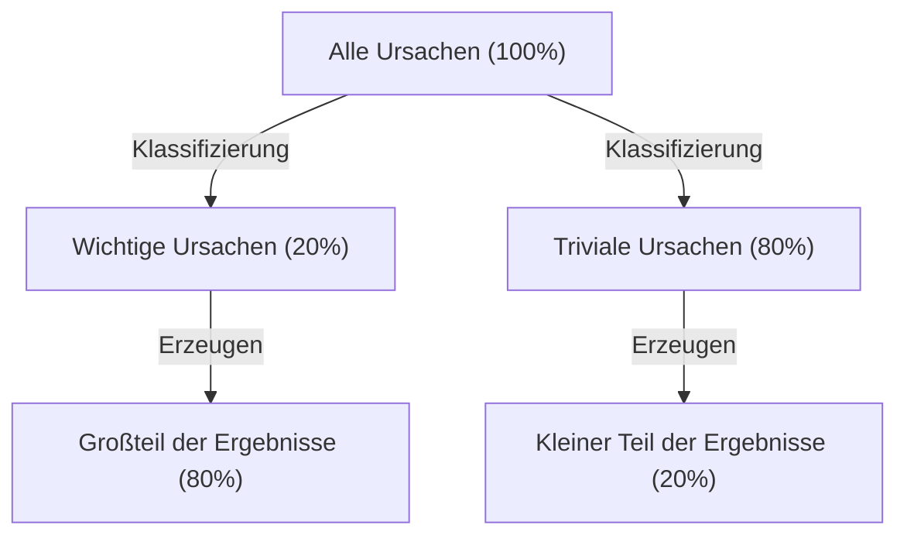
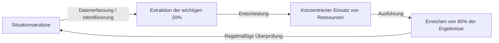

# Einführung: Warum das "Pareto-Prinzip" heute unverzichtbar ist

Die moderne Gesellschaft ist überflutet mit Informationen und Auswahlmöglichkeiten. Geschäftsleute werden täglich von einer riesigen Anzahl an Aufgaben überwältigt, und Manager müssen aus unzähligen strategischen Optionen die beste auswählen. In einem so hochkomplexen Umfeld führt der Ansatz, "alles perfekt erledigen zu wollen", oft zu einer Erschöpfung der Ressourcen und zu Burnout.

Hier entfaltet das "Pareto-Prinzip (die 80:20-Regel)" seine überwältigende Kraft. Diese einfache Faustregel, die besagt, dass "80 % der Ergebnisse durch 20 % der Ursachen erzielt werden", zeigt uns klar, worauf wir unsere Energie konzentrieren sollten.

In diesem Artikel werden wir tief in das Pareto-Prinzip eintauchen: vom grundlegenden Verständnis über die historischen Hintergründe, spezifische Anwendungsstrategien zur Steigerung der geschäftlichen und persönlichen Produktivität bis hin zu den Grenzen und Missverständnissen dieses Prinzips. Wenn Sie diesen Artikel zu Ende gelesen haben, werden Sie über eine starke Linse verfügen, um zu erkennen, "worauf Sie sich konzentrieren und was Sie verwerfen sollten".

## Was ist das Pareto-Prinzip? Seine Geschichte und sein Wesen

Das Pareto-Prinzip wurde von Vilfredo Pareto, einem italienischen Ökonomen, der vom späten 19. bis zum frühen 20. Jahrhundert aktiv war, aufgestellt. In einem 1896 veröffentlichten Papier untersuchte er die Vermögensverteilung im damaligen Europa und entdeckte eine erstaunliche Tatsache. Es war die ungleiche Verteilung des Reichtums: "Etwa 80 % des gesamten gesellschaftlichen Reichtums befinden sich im Besitz der oberen 20 % der Reichen."

Später wurde von vielen Forschern bestätigt, dass diese asymmetrische "80:20"-Verteilung über die Wirtschaftswissenschaften hinaus auch in der Natur, in der Wirtschaft und in vielen anderen Bereichen gesellschaftlicher Phänomene weit verbreitet ist. In den 1940er Jahren wandte Joseph M. Juran, eine Autorität im Bereich Qualitätskontrolle, dieses Prinzip auf die Geschäftswelt an und schlug das Konzept der "wichtigen Wenigen (vital few) und der trivialen Vielen (trivial many)" vor. Dies bildet die Grundlage für das Pareto-Prinzip in der modernen Wirtschaft.

### Veranschaulichung des Mechanismus des Prinzips

Der Kern des Pareto-Prinzips ist, dass **die Beziehung zwischen "Input (Ursache)" und "Output (Ergebnis)" nicht gleichmäßig ist**. Das folgende Diagramm stellt diese ungleiche Beziehung einfach dar.

Die Vorstellung, an die wir intuitiv gerne glauben wollen, dass "Ergebnisse proportional zum Aufwand sind (1:1-Regel)", trifft in der realen Welt fast nie zu. In Wirklichkeit haben einige wenige Faktoren einen entscheidenden Einfluss auf das Ergebnis.

## Anwendung des Pareto-Prinzips im Business

Seine dramatischste Wirkung entfaltet das Pareto-Prinzip im geschäftlichen Bereich. Um den Gewinn bei begrenzten Ressourcen (Zeit, Geld, Personal) zu maximieren, ist es notwendig, dieses Prinzip in alle Geschäftsprozesse zu integrieren.

### 1. Vertriebs- und Marketingstrategie

Das bekannteste Beispiel für die Anwendung des Pareto-Prinzips im Business ist: "80 % des Umsatzes werden von den oberen 20 % der Kunden generiert."

*   **Identifizierung der oberen 20 % der Top-Kunden:** Unternehmen müssen zunächst anhand von Daten die oberen 20 % der Kunden identifizieren, die den Großteil ihres Umsatzes oder Gewinns ausmachen.
*   **Konzentrierter Einsatz von Ressourcen:** Anstatt allen Kunden denselben Service zu bieten, konzentriert man den Großteil (80 %) des Marketingbudgets und der Vertriebsressourcen darauf, diesen oberen 20 % VIP-Behandlung und besonderen Kundenerfolg zu bieten, um deren Loyalität zu erhöhen.
*   **Feedback in die Produktentwicklung:** Indem man gründlich analysiert, was die oberen 20 % der Kunden wollen, und das Produkt auf ihre Bedürfnisse zuschneidet, können die kostengünstigsten Verbesserungen erzielt werden.

### 2. Personal- und Organisationsmanagement

Auch bei der Leistung einer Organisation zeigt sich das Pareto-Prinzip deutlich. Es ist die Tendenz, dass "80 % der Ergebnisse des Unternehmens von den oberen 20 % der exzellenten Mitarbeiter erbracht werden".

*   **Investitionen in High-Performer:** Die Produktivität der gesamten Organisation wird dramatisch gesteigert, indem man die Motivation der oberen 20 % der Mitarbeiter aufrechterhält und ein Umfeld schafft (Delegation von Befugnissen, Vergütung, flexible Arbeitszeiten usw.), in dem sie ihr Potenzial maximieren können.
*   **Schaffung von Mechanismen zur Kompetenzvermittlung:** Durch die Extraktion des impliziten Wissens und der Verhaltensmerkmale der 20 % hervorragenden Talente und die Schaffung von Systemen (wie Handbücher oder Mentoring), um diese mit den restlichen 80 % der Mitarbeiter zu teilen, wird das Niveau der gesamten Organisation angehoben.

### 3. Bestandsverwaltung und Qualitätskontrolle

*   **Bestandsverwaltung (ABC-Analyse):** Von den geführten Produkten machen die oberen 20 % oft 80 % des Gesamtumsatzes aus. Es ist eine strikte Verwaltung erforderlich, um zu verhindern, dass diese wichtigen Artikel (A-Rang) ausverkauft sind, während Artikel mit geringem Umsatzbeitrag (C-Rang) Entscheidungen wie eine Reduzierung der Bestellhäufigkeit oder eine Einstellung des Sortiments erfordern.
*   **Qualitätskontrolle (Fehlerbehebung):** In der Softwareentwicklung wird oft gesagt, dass "80 % der Systemfehler oder Bugs auf 20 % der Module (Code) zurückzuführen sind". Durch die Konzentration von Test- und Refactoring-Ressourcen auf diese 20 % kann die Qualität effizient verbessert werden.

## Anwendung auf persönliche Produktivität und Zeitmanagement

Nicht nur im Geschäftsleben, sondern auch bei der persönlichen Arbeitsweise und im täglichen Leben kann durch die Anwendung des Pareto-Prinzips das "Essentialistische Denken (die Konzentration auf das Wesentliche)" in die Praxis umgesetzt werden.

### 1. Aufgabenmanagement: Erkennen der "wichtigen 20 %"

Angenommen, Sie haben jeden Tag 10 Aufgaben auf Ihrer To-Do-Liste. Nach dem Pareto-Prinzip sind nur "etwa 2 (20 %)" dieser Aufgaben diejenigen, die wirklich Wert schaffen und direkt zur Zielerreichung beitragen.

Viele Menschen neigen dazu, zu denken: "Lass uns die einfachen Aufgaben zuerst erledigen, um in Schwung zu kommen", aber das raubt ihnen Zeit und Energie für die trivialen 80 %. Hochproduktive Menschen gehen die wichtigsten 20 % der Aufgaben (die Aufgaben mit dem höchsten Schwierigkeitsgrad und dem höchsten Ertrag) als erstes am Morgen an, wenn ihr Energielevel am höchsten ist.

### 2. Die 80:20-Regel beim Erlernen von Fähigkeiten

Das Pareto-Prinzip ist auch beim Erlernen einer neuen Sprache, beim Programmieren oder beim Spielen eines Musikinstruments wirksam.
Es ist eine Tatsache, dass "80 % der alltäglichen Konversationen in einer Sprache aus den 20 % der am häufigsten verwendeten Wörter bestehen". Bevor man also kleinere Wörter oder komplexe Grammatik perfekt lernt, ist das gründliche und wiederholte Üben der 20 % des Kernfundaments der kürzeste Weg zur Verbesserung.

### 3. Digitaler Minimalismus und Informationsbeschaffung

Moderne Menschen werden von einer riesigen Menge an Informationen aus sozialen Medien und Nachrichtenseiten überflutet, aber "Informationen, die wirklich einen positiven Einfluss auf das eigene Leben oder die Arbeit haben, machen weniger als 20 % aller Informationsquellen aus".
Um Ergebnisse zu erzielen, bedarf es des Mutes, unnötige Apps zu löschen, sich von minderwertigen E-Mail-Newslettern abzumelden und Zeit nur den wahrhaft hochwertigen 20 % der Informationsquellen (hervorragende Bücher, Fachzeitschriften, vertrauenswürdige Mentoren usw.) zu widmen.

## Der Praxiszyklus des Pareto-Prinzips

Wir stellen ein Rahmenwerk vor, um das Prinzip nicht nur als Wissen zu verstehen, sondern auch in der Praxis weiterhin anzuwenden.

1.  **Situationsanalyse (Messung und Datenerfassung):** Zunächst werden die Fakten genau erfasst. Wofür wird Zeit verbracht? Woher kommt der Umsatz? Eine auf Daten basierende Analyse ist unerlässlich, anstatt sich auf Intuition zu verlassen.
2.  **Extraktion der wichtigen 20 %:** Identifizieren Sie die "kritischen Wenigen" aus den gesammelten Daten. Klären Sie gleichzeitig die "80 %, die verworfen oder reduziert werden sollten".
3.  **Konzentrierter Einsatz von Ressourcen:** Haben Sie den Mut, sich zu entscheiden, "was nicht zu tun ist (Not-to-do)". Stecken Sie alle freigewordene Zeit, Geld und Mühe in die identifizierten wichtigen 20 %.
4.  **Bewertung und Überprüfung:** Umgebungen und Situationen ändern sich ständig. Da die einst "wichtigen 20 %" veralten können, durchlaufen Sie diesen Zyklus regelmäßig (z. B. vierteljährlich) und passen Sie Ihren Fokus kontinuierlich an.

## Fallstricke und Vorbehalte beim Pareto-Prinzip

Das Pareto-Prinzip ist ein sehr mächtiges Werkzeug, aber wenn man blind daran glaubt, kann es gefährliche Nebenwirkungen haben. Die folgenden Punkte bedürfen besonderer Aufmerksamkeit.

### 1. "80:20" ist kein absolutes Verhältnis
Die Zahlen 80 und 20 sind lediglich ein Leitfaden, der auf einer Faustregel basiert, und keine mathematisch strenge Regel. Je nach Situation kann es "90:10" oder "70:30" sein. Das Wichtige ist nicht die "Genauigkeit der Zahlen", sondern das Erkennen der "Asymmetrie zwischen Ursache und Wirkung".

### 2. Die restlichen 80 % sind nicht "völlig wertlos"
Wenn sich ein Unternehmen beispielsweise zu sehr auf die "20 % Top-Kunden, die 80 % des Umsatzes generieren" konzentriert und die restlichen 80 % der Kunden komplett ignoriert, besteht das Risiko, dass der Ruf des Unternehmens sinkt oder es potenzielle Kunden verliert, die zu Top-Kunden hätten heranwachsen können. Zudem ist es auch beim Produktangebot oft so, dass Nischenprodukte (Long Tail) die Expertise und Attraktivität der Marke unterstützen.
Wichtig ist nicht das "Ausschneiden", sondern die "Optimierung der Ressourcenverteilung (Setzen von Prioritäten)".

### 3. Fehlende langfristige Perspektive
Das Pareto-Prinzip eignet sich hervorragend zur Optimierung auf Basis aktueller Daten, bringt jedoch keine zukünftigen Innovationen hervor. Es besteht die Möglichkeit, dass die Saat, die das Geschäft von in 5 Jahren unterstützen wird, in den "80 % der Aktivitäten, die derzeit keinen Gewinn bringen", schlummert. Eine Balance zwischen kurzfristiger Effizienz (Durchsetzung von 80:20) und langfristiger Erkundung (Investitionen in scheinbar unnütze Dinge) ist für wirklich nachhaltiges Wachstum unerlässlich.

## Die ultimative Anwendung: "80/20 vom 80/20"

Als Ansatz für Fortgeschrittene gibt es die Idee, das Pareto-Prinzip als verschachtelte Struktur anzuwenden.

Auch innerhalb der "oberen 20 % der Faktoren" kommt das Pareto-Prinzip zur Anwendung. Das heißt, 20 % der 20 % (= 4 % des Ganzen) generieren 80 % der 80 % (= 64 % des Ganzen) der Ergebnisse. Dies ist eine extreme Konzentration (die 64:4-Regel).

Wenn Sie im Projekt, an dem Sie gerade arbeiten, die "wichtigsten 20 %" gefunden haben, fragen Sie sich weiter: "Was sind die '4 % im Kern' dieser 20 %, die einen noch überwältigenderen Unterschied ausmachen?" Wenn Sie Ihren Fokus so weit eingrenzen können, wird Ihre Produktivität buchstäblich ein völlig neues Level erreichen.

## Fazit: Die Ästhetik der Subtraktion

Wir neigen dazu, Probleme durch "Addition" lösen zu wollen. Wir erhöhen die Anzahl der Produkte, um den Umsatz zu steigern, wir vergrößern die Anzahl der Meetings, um Projekte zum Erfolg zu führen, und wir fügen Werkzeuge hinzu, um die Produktivität zu erhöhen.

Aber was uns das Pareto-Prinzip lehrt, ist die Ästhetik der "Subtraktion". Wahre Durchbrüche entstehen nicht durch das Hinzufügen von etwas Neuem, sondern durch das Entfernen der 80 % Rauschen, die nicht direkt zum Ergebnis beitragen, und das Schärfen der essenziellen 20 % Signale.

Bitte überprüfen Sie ab heute noch einmal, was die "wichtigen 20 %" in Ihrer Arbeit und Ihrem Leben sind. Sie müssen nicht alles perfekt machen. Stecken Sie Ihre beste Energie einfach in die wichtigsten Dinge. Das ist der sicherste Weg, um mit minimalem Aufwand maximale Ergebnisse zu erzielen und ein reicheres und bedeutungsvolleres Leben zu führen.
