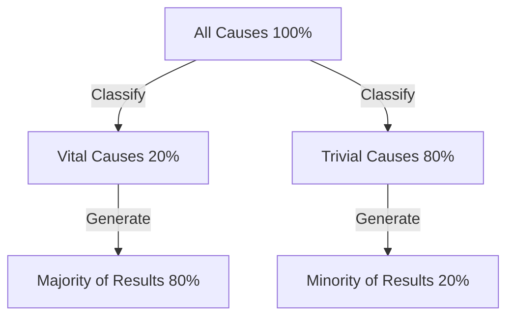

# Introduction: Why the "Pareto Principle" is Indispensable Now

Modern society is overflowing with information and choices. Business professionals are constantly chased by a massive amount of daily tasks, and managers must select the optimal one from countless strategic options. In such a highly complex environment, the approach of trying to "do everything perfectly" often leads to resource depletion and exhaustion.

Here, the "Pareto Principle (80/20 Rule)" demonstrates overwhelming power. This simple rule of thumb, which states that "80% of results come from 20% of causes," clearly shows us where we should focus our energy.

In this article, we will delve deeply and thoroughly explain the Pareto Principle, from a fundamental understanding of it to its historical background, specific application strategies for improving business and personal productivity, and even the limits and misconceptions of this principle. By the time you finish reading this article, you will have acquired a powerful lens to discern "what to focus on and what to discard."

## What is the Pareto Principle? Its History and Essence

The Pareto Principle was proposed by Vilfredo Pareto, an Italian economist active from the late 19th to the early 20th century. In a paper published in 1896, he studied the distribution of wealth in Europe at the time and discovered a surprising fact. It was the unequal distribution of wealth, where "about 80% of the wealth of society as a whole is owned by the top 20% of the wealthy class."

Later, this asymmetrical distribution of "80:20" was confirmed by many researchers to apply widely not only to economics but also to the natural world, business, and various social phenomena. In the 1940s, Joseph M. Juran, an authority on quality control, applied this principle to the business world and proposed the concept of the "vital few and the trivial many." This forms the foundation of the Pareto Principle in modern business.

### Illustrating the Mechanism of the Principle

The core of the Pareto Principle is that **the relationship between "inputs (causes)" and "outputs (results)" is not equal**. The following diagram simply illustrates this unbalanced relationship.

The idea that "results are proportional to the amount of effort (the 1:1 rule)", which we intuitively tend to believe, hardly holds true in the real world. In reality, a small number of factors have a decisive impact on the results.

## Application of the Pareto Principle in Business

The area where the Pareto Principle brings the most dramatic effects is business. In order to maximize profits with limited resources (time, funds, personnel), it is necessary to incorporate this principle into all business processes.

### 1. Sales and Marketing Strategy

The most well-known application of the Pareto Principle in business is that "80% of sales are brought in by the top 20% of customers."

*   **Identifying the Top 20% Loyal Customers:** Companies must first identify the top 20% customer segment that generates the majority of their sales and profits from data.
*   **Concentrating Resources:** Instead of providing equal service to all customers, the majority (80%) of the marketing budget and sales resources should be concentrated on providing VIP treatment and special customer success to this top 20% of customers to increase loyalty.
*   **Feedback for Product Development:** By thoroughly analyzing what the top 20% of customers want and updating the product to meet their needs, the most cost-effective improvements can be made.

### 2. HR and Organizational Management

The Pareto Principle is also evident in organizational performance. It is the tendency that "80% of the company's results are generated by the top 20% of excellent employees."

*   **Investing in High Performers:** Maintaining the motivation of the top 20% of employees and providing an environment (delegation of authority, compensation, flexible work styles, etc.) where they can maximize their abilities will dramatically increase the productivity of the entire organization.
*   **Creating a Mechanism for Skill Dissemination:** By extracting the tacit knowledge and behavioral characteristics held by the 20% of excellent talent and creating a mechanism (manualization or mentoring) to share them with the remaining 80% of employees, the foundation of the entire organization can be raised.

### 3. Inventory Control and Quality Control

*   **Inventory Control (ABC Analysis):** Among handled products, the top 20% of items often account for 80% of total sales. These important items (Rank A) must be strictly managed to prevent stockouts, and it is necessary to make decisions such as reducing the ordering frequency or discontinuing the handling of items with low sales contribution (Rank C).
*   **Quality Control (Bug Fixing):** In software development, it is said that "80% of system bugs and defects are caused by 20% of the modules (code)." By concentrating testing and refactoring resources on that 20%, quality can be improved efficiently.

## Application to Personal Productivity and Time Management

By incorporating the Pareto Principle not only in business but also in personal work styles and daily life, you can practice "Essentialism (the mindset of focusing on the essential)."

### 1. Task Management: Identifying the "Vital 20%"

Suppose you have 10 tasks on your daily To-Do list. According to the Pareto Principle, only "just 2 tasks (20%)" of them truly create value and directly lead to goal achievement.

Many people tend to think, "Let's gain momentum by knocking out the easy tasks first," but this ends up robbing them of time and energy for the trivial 80%. Highly productive people tackle the most important 20% of tasks (the tasks that are the most difficult and lead to the most results) first thing in the morning when their energy levels are highest.

### 2. The 80/20 in Skill Acquisition

The Pareto Principle is also effective when learning a new language, programming, or an instrument.
There is a fact that "80% of everyday conversation in a language consists of the 20% most frequently used words." Therefore, before perfectly memorizing minor words and complex grammar, thoroughly practicing the core 20% basics through repetition is the shortest route to improvement.

### 3. Digital Minimalism and Information Gathering

Modern people are showered with a massive amount of information from social media and news sites, but "the information that truly has a positive impact on one's life and work is less than 20% of all information sources."
To achieve results, you need the courage to delete unnecessary apps, unsubscribe from low-value email newsletters, and dedicate time only to the truly high-quality 20% of information sources (excellent books, specialized magazines, reliable mentors, etc.).

## The Practice Cycle of the Pareto Principle

Here is a framework not just for understanding it as knowledge, but for actually continuing to apply the principle.

1.  **Current Status Analysis (Measurement and Data Collection):** First, accurately grasp the facts. What is time being spent on? Where are sales coming from? Analysis based on data, rather than relying on intuition, is essential.
2.  **Extraction of the Vital 20%:** Identify the "critical few" from the collected data. At the same time, clarify the "80% to discard or cut."
3.  **Concentration of Resources:** Have the courage to decide on "Not-to-do" lists. Pour all the freed-up time, funds, and effort into the extracted vital 20%.
4.  **Evaluation and Review:** Environments and situations are constantly changing. Since what was once the "vital 20%" may become obsolete, regularly (e.g., quarterly) run this cycle and constantly adjust your focus.

## Pitfalls and Points to Note Regarding the Pareto Principle

The Pareto Principle is a very powerful tool, but blindly trusting it can bring dangerous side effects. It is necessary to pay careful attention to the following points.

### 1. "80:20" is Not an Absolute Ratio
The numbers 80 and 20 are just a guideline based on empirical rules and are not a strictly mathematical law. Depending on the situation, it could be "90:10" or "70:30". What is important is not the "accuracy of the numbers", but recognizing the "imbalance between cause and effect".

### 2. The Remaining 80% is Not "Completely Worthless"
For example, if you concentrate so much on the "20% of loyal customers who generate 80% of sales" that you completely cut off the remaining 80% of customers, you run the risk of dropping the company's reputation or missing out on the potential demographic that would have grown into loyal customers in the future. Also, in product lineups, niche products (the long tail) often support the brand's expertise and appeal.
The important thing is not to "discard," but to "optimize the resource allocation ratio (adding contrast)."

### 3. Lack of a Long-Term Perspective
The Pareto Principle is strong in optimization based on current data, but it does not produce future innovation. The seeds that will support the business five years from now may currently be dormant within the "80% of activities that do not generate profit." Balancing short-term efficiency (thorough implementation of 80/20) and long-term exploration (investing in what seemingly looks useless) is indispensable for truly sustainable growth.

## Ultimate Application: "The 80/20 of the 80/20"

As an even more advanced approach, there is the idea of applying the Pareto Principle in a nested structure.

The Pareto Principle applies even further within the "top 20% elements." In other words, 20% of the 20% (4% of the total) produces 80% of the 80% (64% of the total) of the results; this is an extreme concentration (the 64/4 rule).

If you have found the "most important 20%" in the project you are currently working on, ask yourself further: "Within that 20%, what is the '4% core' that makes an even more overwhelming difference?" If you can narrow your focus down that far, your productivity will literally reach a completely different level.

## Conclusion: The Aesthetics of Subtraction

We have a tendency to try to solve problems through "addition." We increase the number of products to increase sales, increase meetings to make a project successful, and increase tools to improve productivity.

However, what the Pareto Principle teaches us is the aesthetics of "subtraction." True breakthroughs are not brought about by adding something, but by removing the 80% of noise that does not directly link to results, and sharpening the essential 20% of signals.

Starting today, try to reexamine what the "vital 20%" is in your work and life. You don't need to make everything perfect. Pour your best energy only into what matters most. That is the surest path to achieving maximum results with minimal effort, and living a richer, more meaningful life.
