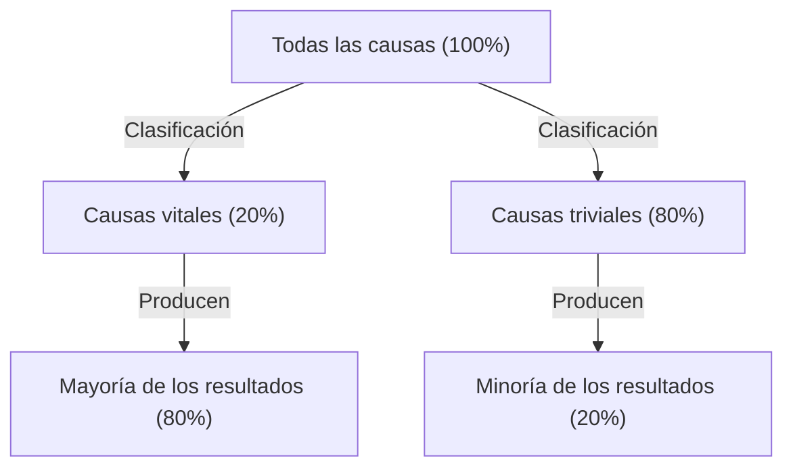
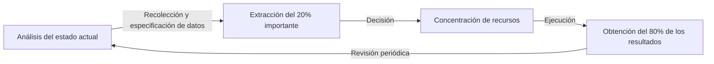

# Introducción: ¿Por qué el "Principio de Pareto" es indispensable ahora?

La sociedad moderna está desbordada de información y opciones. Los profesionales de los negocios se ven abrumados diariamente por una enorme cantidad de tareas, y los directivos deben elegir la mejor estrategia entre innumerables opciones. En un entorno tan complejo, el enfoque de "intentar hacer todo a la perfección" a menudo conduce al agotamiento de los recursos y la fatiga.

Aquí es donde el "Principio de Pareto (Regla del 80:20)" demuestra un poder abrumador. Esta sencilla regla empírica de que "el 80% de los resultados provienen del 20% de las causas" nos muestra claramente dónde debemos concentrar nuestra energía.

En este artículo, profundizaremos en una explicación exhaustiva desde la comprensión básica del Principio de Pareto, sus antecedentes históricos, hasta estrategias específicas de aplicación para mejorar la productividad empresarial y personal, así como los límites y malentendidos de este principio. Para cuando termines de leer este artículo, deberías tener una lente poderosa para identificar "en qué concentrarte y qué descartar".

## ¿Qué es el Principio de Pareto? Su historia y esencia

El Principio de Pareto fue propuesto por el economista italiano Vilfredo Pareto, activo a finales del siglo XIX y principios del XX. En un artículo publicado en 1896, investigó la distribución de la riqueza en la Europa de la época y descubrió un hecho sorprendente. Fue la distribución desigual de la riqueza en la que "aproximadamente el 80% de la riqueza total de la sociedad es propiedad del 20% superior de los ricos".

Posteriormente, muchos investigadores confirmaron que esta distribución asimétrica de "80:20" se aplica ampliamente más allá de la economía a diversos ámbitos del mundo natural, los negocios y los fenómenos sociales. En la década de 1940, la autoridad en control de calidad Joseph M. Juran aplicó este principio al mundo empresarial y propuso el concepto de los "pocos vitales (vital few) y muchos triviales (trivial many)". Esta es la base del Principio de Pareto en los negocios modernos.

### Ilustrando el mecanismo del principio

El núcleo del Principio de Pareto es que **la relación entre "entrada (causa)" y "salida (resultado)" no es igual**. El siguiente diagrama ilustra de manera sencilla esta relación desequilibrada.

La idea que solemos creer intuitivamente de que "los resultados son proporcionales a la cantidad de esfuerzo (la regla 1:1)" casi nunca se cumple en el mundo real. En realidad, un pequeño número de elementos tiene un impacto decisivo en los resultados.

## Aplicación del Principio de Pareto en los negocios

El área donde el Principio de Pareto tiene el efecto más dramático es en los negocios. Para maximizar los beneficios cuando los recursos (tiempo, dinero, talento) son limitados, es necesario integrar este principio en todos los procesos de negocio.

### 1. Estrategia de ventas y marketing

El ejemplo más conocido de aplicación del Principio de Pareto en los negocios es que "el 80% de las ventas son generadas por el 20% de los mejores clientes".

*   **Identificación del 20% de los clientes premium:** Las empresas primero deben identificar a partir de los datos el segmento del 20% superior de clientes que generan la mayor parte de sus ventas y beneficios.
*   **Concentración de recursos:** En lugar de proporcionar servicios por igual a todos los clientes, concentrar la mayor parte (80%) del presupuesto de marketing y recursos de ventas en ofrecer un trato VIP y éxito especial al cliente (customer success) a este 20% superior para aumentar la lealtad.
*   **Retroalimentación para el desarrollo de productos:** Analizar exhaustivamente lo que busca el 20% de los clientes principales y actualizar los productos para satisfacer sus necesidades permite las mejoras más rentables.

### 2. Gestión de recursos humanos y organización

El Principio de Pareto también se manifiesta claramente en el rendimiento organizacional. Existe la tendencia de que "el 80% de los resultados de la empresa son producidos por el 20% de los empleados más talentosos".

*   **Inversión en los altos rendimientos:** Mantener la motivación del 20% superior de los empleados y proporcionar un entorno en el que puedan maximizar su potencial (empoderamiento, compensación, estilos de trabajo flexibles, etc.) aumenta drásticamente la productividad general de la organización.
*   **Creación de sistemas para difundir habilidades:** Extraer el conocimiento tácito y las características de comportamiento que posee el 20% del talento excepcional, y crear sistemas (manualización y mentoría) para compartirlos con el 80% restante de los empleados ayuda a elevar el nivel de toda la organización.

### 3. Gestión de inventarios y control de calidad

*   **Gestión de inventarios (Análisis ABC):** A menudo, el 20% de los artículos de un inventario representan el 80% de las ventas totales. Es necesario controlar estrictamente estos artículos importantes (Rango A) para evitar que se agoten, y tomar decisiones como reducir la frecuencia de pedidos o suspender la manipulación de artículos de baja contribución a las ventas (Rango C).
*   **Control de calidad (Corrección de errores):** En el desarrollo de software, se dice que "el 80% de los errores y defectos del sistema provienen del 20% de los módulos (código) generales". Al concentrar los recursos de prueba y refactorización en ese 20%, se puede mejorar la calidad de manera eficiente.

## Aplicación a la productividad personal y gestión del tiempo

Al adoptar el Principio de Pareto no solo en los negocios, sino también en los estilos de trabajo personales y en la vida diaria, se puede practicar el "pensamiento esencial (pensar centrándose en lo esencial)".

### 1. Gestión de tareas: Identificar el "20% importante"

Supongamos que tienes 10 tareas en tu lista de quehaceres diaria. Según el Principio de Pareto, solo "apenas 2 (20%)" de ellas crearán valor real y conducirán directamente al logro de tus objetivos.

Muchas personas tienden a pensar: "empecemos con las tareas fáciles para coger impulso", pero esto las lleva a perder tiempo y energía en el 80% trivial. Las personas altamente productivas abordan el 20% de las tareas más importantes (las más difíciles y que producen los mayores resultados) a primera hora de la mañana, cuando su nivel de energía es más alto.

### 2. El 80:20 en la adquisición de habilidades

El Principio de Pareto también es efectivo al aprender nuevos idiomas, programación, o instrumentos musicales.
Existe el hecho de que "el 80% de las conversaciones cotidianas en un idioma consisten en el 20% de las palabras que se usan con mayor frecuencia". Por lo tanto, antes de memorizar a la perfección palabras menos comunes o gramática compleja, la práctica repetida del 20% de los fundamentos básicos es la ruta más rápida hacia el dominio.

### 3. Minimalismo digital y recopilación de información

Las personas modernas son bombardeadas con una gran cantidad de información de redes sociales y sitios de noticias, pero "la información que realmente tiene un impacto positivo en la propia vida o trabajo es menos del 20% de todas las fuentes de información".
Para lograr resultados, se necesita el valor de eliminar aplicaciones innecesarias, darse de baja de boletines de bajo valor y dedicar tiempo solo al 20% de las fuentes de información verdaderamente de alta calidad (libros excelentes, revistas especializadas, mentores de confianza, etc.).

## Ciclo de práctica del Principio de Pareto

Presentaremos un marco para no solo entenderlo como conocimiento, sino también para continuar aplicando el principio en la práctica.

1.  **Análisis del estado actual (Medición y recolección de datos):** En primer lugar, comprender los hechos con precisión. ¿En qué se gasta el tiempo? ¿De dónde provienen las ventas? Un análisis basado en datos es indispensable en lugar de depender de la intuición.
2.  **Extracción del 20% importante:** A partir de los datos recolectados, identificar a la "minoría crítica". Al mismo tiempo, aclarar también el "80% que debe ser descartado o reducido".
3.  **Concentración de recursos:** Tomar con valentía la decisión de "las cosas que no se deben hacer (Not-to-do)". Vertir todo el tiempo libre, los fondos y el esfuerzo en el 20% importante extraído.
4.  **Evaluación y revisión:** El entorno y la situación están en constante cambio. Dado que el "20% importante" del pasado puede volverse obsoleto, ejecutar este ciclo periódicamente (por ejemplo, cada trimestre) y continuar ajustando el enfoque constantemente.

## Trampas y precauciones del Principio de Pareto

Aunque el Principio de Pareto es una herramienta muy poderosa, creer en él a ciegas puede traer efectos secundarios peligrosos. Se debe prestar especial atención a los siguientes puntos.

### 1. "80:20" no es una proporción absoluta
Los números 80 y 20 son solo estimaciones basadas en una regla empírica y no son una ley estrictamente matemática. Dependiendo de la situación, puede ser "90:10" o "70:30". Lo importante no es "la exactitud de los números", sino reconocer "la asimetría entre causa y resultado".

### 2. El 80% restante no carece "totalmente de valor"
Por ejemplo, si uno se centra tanto en el "20% de los clientes excelentes que generan el 80% de las ventas" y abandona por completo al 80% restante de los clientes, existe el riesgo de que la reputación de la empresa disminuya, o de perder un segmento de clientes potenciales que podrían haberse convertido en clientes excelentes en el futuro. Además, en las líneas de productos, no son pocos los casos en los que los productos de nicho (long tail) respaldan la especialización y el atractivo de la marca.
Lo importante no es "descartar", sino "optimizar la proporción de asignación de recursos (establecer prioridades claras)".

### 3. Falta de una perspectiva a largo plazo
El Principio de Pareto es fuerte en la optimización basada en datos actuales, pero no genera la innovación del futuro. Es imprescidible encontrar un equilibrio entre la mejora de la eficiencia a corto plazo (la aplicación estricta del 80:20) y la exploración a largo plazo (la inversión intencional en lo que parece un desperdicio) para un crecimiento verdaderamente sostenible. Es posible que dentro del "80% de las actividades que actualmente no generan beneficios" se escondan las semillas que apoyarán el negocio dentro de 5 años.

## La aplicación definitiva: "El 80/20 del 80/20"

Como un enfoque de nivel aún más avanzado, existe la idea de aplicar el Principio de Pareto en una estructura anidada.

El Principio de Pareto también se aplica dentro del "20% superior de los elementos". En otras palabras, es una concentración extrema donde el 20% del 20% (es decir, el 4% del total) produce los resultados del 80% del 80% (es decir, el 64% del total) (La regla del 64:4).

Si has encontrado "el 20% más importante" dentro del proyecto en el que estás trabajando actualmente, pregúntate un paso más allá: "¿Cuál es el 'núcleo del 4%' dentro de ese 20% que crea una diferencia aún más abrumadora?". Si puedes reducir tu enfoque hasta ese punto, tu productividad alcanzará literalmente un nivel completamente diferente.

## Conclusión: La estética de la resta

Tendemos a tratar de resolver los problemas mediante la "suma". Aumentamos el número de productos para aumentar las ventas, aumentamos el número de reuniones para lograr el éxito del proyecto, y aumentamos las herramientas para mejorar la productividad.

Sin embargo, lo que nos enseña el Principio de Pareto es la estética de la "resta". Los verdaderos avances no se logran añadiendo algo, sino eliminando el 80% del ruido que no está directamente relacionado con el resultado y afinando el 20% de las señales esenciales.

A partir de hoy, revisa cuál es el "20% importante" en tu trabajo y tu vida. No tienes que hacer todo perfecto. Vierte tu mejor energía solo en las cosas más importantes. Ese es el camino más seguro para lograr los máximos resultados con el mínimo esfuerzo, y para llevar una vida más rica y significativa.
