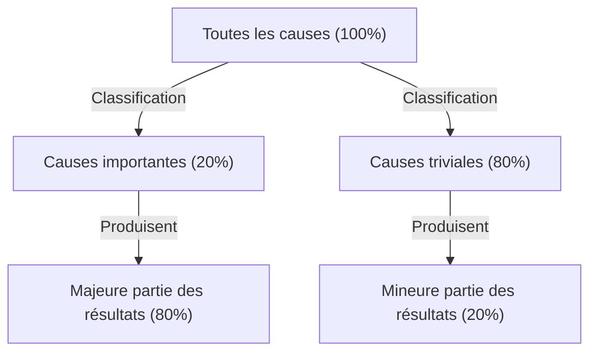
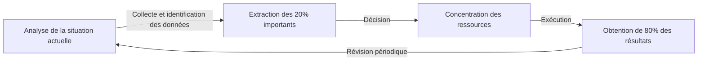

# Introduction : Pourquoi la « Loi de Pareto » est-elle indispensable aujourd'hui ?

La société moderne regorge d'informations et d'options. Les professionnels sont submergés chaque jour par une quantité énorme de tâches, et les dirigeants doivent choisir la meilleure parmi d'innombrables options stratégiques. Dans un environnement aussi complexe, l'approche consistant à vouloir « tout faire parfaitement » conduit souvent à l'épuisement et à la pénurie des ressources.

C'est là que la « loi de Pareto (loi des 80/20) » fait preuve d'une puissance écrasante. Cette règle empirique simple selon laquelle « 80 % des résultats proviennent de 20 % des causes » nous montre clairement où nous devrions concentrer notre énergie.

Dans cet article, nous explorerons en profondeur la loi de Pareto, depuis sa compréhension de base jusqu'à son contexte historique, ses stratégies d'application concrètes pour améliorer la productivité des entreprises et des individus, et enfin ses limites et les malentendus la concernant. À la fin de cette lecture, vous aurez acquis une lentille puissante pour déterminer « sur quoi se concentrer et ce qu'il faut abandonner ».

## Qu'est-ce que la loi de Pareto ? Son histoire et son essence

La loi de Pareto a été proposée par Vilfredo Pareto, un économiste italien actif de la fin du 19ème au début du 20ème siècle. Dans un article publié en 1896, il a étudié la répartition des richesses en Europe à l'époque et a fait une découverte surprenante : la répartition inégale des richesses selon laquelle « environ 80 % de la richesse totale de la société est détenue par les 20 % les plus riches ».

Par la suite, de nombreux chercheurs ont confirmé que cette distribution asymétrique « 80/20 » s'applique largement au-delà de l'économie, à la nature, aux affaires et à divers phénomènes sociaux. Dans les années 1940, Joseph M. Juran, une autorité en matière de contrôle qualité, a appliqué cette loi au monde des affaires et a proposé le concept des « few vital (les 20% importants) et trivial many (les 80% futiles) ». C'est le fondement de la loi de Pareto dans les affaires modernes.

### Illustration du mécanisme de la loi

Le cœur de la loi de Pareto réside dans le fait que **la relation entre les « intrants (causes) » et les « extrants (résultats) » n'est pas égale**. Le diagramme ci-dessous illustre simplement cette relation déséquilibrée.

L'idée à laquelle nous avons tendance à croire intuitivement, selon laquelle « les résultats sont proportionnels à la quantité d'efforts fournis (loi de 1:1) », ne tient presque jamais dans le monde réel. En réalité, un petit nombre d'éléments a un impact décisif sur les résultats.

## Application de la loi de Pareto dans les affaires

C'est dans le domaine des affaires que la loi de Pareto produit les effets les plus spectaculaires. Afin de maximiser les profits avec des ressources (temps, argent, personnel) limitées, cette loi doit être intégrée à tous les processus opérationnels.

### 1. Stratégie de vente et de marketing

L'exemple le plus connu de l'application de la loi de Pareto dans les affaires est que « 80 % des ventes sont générées par les 20 % de clients les plus importants ».

*   **Identification des 20 % de clients fidèles :** Les entreprises doivent d'abord identifier, à partir des données, les 20 % de clients qui génèrent la majorité de leurs ventes et de leurs bénéfices.
*   **Concentration des ressources :** Au lieu de fournir le même service à tous les clients, il faut concentrer la majeure partie (80 %) du budget marketing et des ressources de vente sur ces 20 % de clients majeurs, en leur offrant un traitement VIP et un succès client spécifique pour accroître leur fidélité.
*   **Retour d'information pour le développement de produits :** Analyser en profondeur ce que recherchent ces 20 % de clients majeurs et adapter le produit à leurs besoins permet d'apporter les améliorations les plus rentables.

### 2. Ressources humaines et gestion des organisations

Dans les performances organisationnelles également, la loi de Pareto se manifeste clairement : « 80 % des résultats de l'entreprise sont produits par les 20 % d'employés les plus performants ».

*   **Investissement dans les employés très performants :** Maintenir la motivation des 20 % d'employés les plus performants et créer un environnement (délégation d'autorité, rémunération, flexibilité, etc.) où ils peuvent maximiser leur potentiel augmente considérablement la productivité de l'ensemble de l'organisation.
*   **Mise en place d'un système de transmission des compétences :** Extraire les connaissances tacites et les caractéristiques comportementales des 20 % de talents exceptionnels, et créer un système (manuels, mentorat) pour les partager avec les 80 % restants, permet d'élever le niveau général de l'organisation.

### 3. Gestion des stocks et contrôle qualité

*   **Gestion des stocks (Analyse ABC) :** Parmi les articles manipulés, il arrive souvent que les 20 % d'articles les plus importants représentent 80 % des ventes totales. Il est nécessaire de gérer ces articles importants (Catégorie A) de manière stricte pour éviter les ruptures de stock, et de prendre des décisions telles que réduire la fréquence des commandes ou arrêter la vente des articles (Catégorie C) ayant une faible contribution aux ventes.
*   **Contrôle qualité (Correction des bugs) :** Dans le développement de logiciels, on dit que « 80 % des bugs et défauts d'un système sont causés par 20 % des modules (code) ». En concentrant les ressources de test et de refactoring sur ces 20 %, la qualité peut être améliorée efficacement.

## Application à la productivité personnelle et à la gestion du temps

En intégrant la loi de Pareto non seulement dans les affaires, mais aussi dans notre façon de travailler et notre vie quotidienne, nous pouvons pratiquer « l'essentialisme (la pensée qui se concentre sur l'essentiel) ».

### 1. Gestion des tâches : Identifier les « 20 % importants »

Supposons que vous ayez 10 tâches sur votre liste quotidienne. Selon la loi de Pareto, seules « 2 tâches (20 %) » créent véritablement de la valeur et sont directement liées à l'atteinte de vos objectifs.

Beaucoup de gens ont tendance à penser : « Débarrassons-nous d'abord des tâches faciles pour prendre notre élan », mais cela leur fait perdre du temps et de l'énergie sur les 80 % futiles. Les personnes hautement productives s'attaquent aux 20 % de tâches les plus importantes (celles qui sont les plus difficiles et qui apportent le plus de résultats) dès le matin, lorsque leur niveau d'énergie est au maximum.

### 2. Le 80/20 dans l'acquisition de compétences

La loi de Pareto est également efficace lors de l'apprentissage d'une nouvelle langue, de la programmation ou d'un instrument de musique.
Il est un fait que « 80 % des conversations quotidiennes dans une langue sont constituées des 20 % de mots les plus fréquemment utilisés ». Par conséquent, plutôt que de mémoriser parfaitement des mots rares ou une grammaire complexe, s'entraîner d'abord de manière répétitive sur les 20 % de bases fondamentales est le chemin le plus court vers la maîtrise.

### 3. Minimalisme numérique et collecte d'informations

Les gens d'aujourd'hui sont inondés d'informations provenant des réseaux sociaux et des sites d'actualités, mais « les informations qui ont un impact véritablement positif sur notre vie ou notre travail représentent moins de 20 % de toutes les sources d'information ».
Pour obtenir des résultats, il faut avoir le courage de supprimer les applications inutiles, de se désabonner des newsletters sans valeur et de ne consacrer son temps qu'aux 20 % de sources d'information de grande qualité (excellents livres, revues spécialisées, mentors de confiance, etc.).

## Le cycle pratique de la loi de Pareto

Voici un cadre pour non seulement comprendre la loi théoriquement, mais aussi continuer à l'appliquer dans la pratique.

1.  **Analyse de la situation actuelle (Mesure et collecte de données) :** Saisir d'abord les faits avec précision. À quoi passez-vous votre temps ? D'où viennent vos ventes ? Une analyse basée sur les données, plutôt que sur l'intuition, est indispensable.
2.  **Extraction des 20 % importants :** Identifier la « minorité critique » à partir des données collectées. En même temps, clarifier clairement « les 80 % à abandonner/réduire ».
3.  **Concentration des ressources :** Avoir le courage de décider « ce qu'il ne faut pas faire (Not-to-do) ». Consacrer tout le temps, l'argent et les efforts libérés aux 20 % importants identifiés.
4.  **Évaluation et révision :** L'environnement et la situation changent constamment. Les « 20 % importants » d'hier peuvent devenir obsolètes, il faut donc faire tourner ce cycle régulièrement (par exemple, chaque trimestre) et ajuster continuellement la cible.

## Les pièges et les points d'attention de la loi de Pareto

La loi de Pareto est un outil très puissant, mais une croyance aveugle en elle peut avoir des effets secondaires dangereux. Il faut prêter une attention particulière aux points suivants.

### 1. « 80/20 » n'est pas un ratio absolu
Les chiffres 80 et 20 ne sont que des repères basés sur des règles empiriques, et non une loi mathématique stricte. Selon la situation, il peut s'agir de « 90/10 » ou de « 70/30 ». Ce qui est important, ce n'est pas « l'exactitude des chiffres », mais la reconnaissance de « l'asymétrie entre les causes et les résultats ».

### 2. Les 80 % restants ne sont pas « totalement sans valeur »
Par exemple, si l'on se concentre trop sur « les 20 % de clients excellents qui génèrent 80 % des ventes » et que l'on abandonne complètement les 80 % restants, on court le risque de nuire à la réputation de l'entreprise ou de perdre un potentiel qui aurait pu devenir de bons clients à l'avenir. De plus, dans la gamme de produits, il n'est pas rare que des produits de niche (longue traîne) soutiennent l'expertise et l'attrait de la marque.
Ce qui est important, ce n'est pas « d'éliminer », mais « d'optimiser le ratio d'allocation des ressources (établir des priorités) ».

### 3. Le manque de vision à long terme
La loi de Pareto est efficace pour l'optimisation basée sur les données actuelles, mais elle ne génère pas d'innovations futures. Les germes de l'activité de demain dans 5 ans peuvent se cacher dans « les 80 % d'activités qui ne génèrent pas de profit aujourd'hui ». Un équilibre entre l'efficacité à court terme (l'application stricte du 80/20) et l'exploration à long terme (l'investissement délibéré dans des choses apparemment inutiles) est essentiel pour une croissance véritablement durable.

## L'application ultime : « Le 80/20 du 80/20 »

En tant qu'approche de niveau plus avancé, il existe l'idée d'appliquer la loi de Pareto selon une structure imbriquée.

La loi de Pareto s'applique également aux « éléments des 20 % supérieurs ». En d'autres termes, 20 % des 20 % (soit 4 % du total) produisent 80 % des 80 % (soit 64 % du total) des résultats. C'est une concentration extrême (la loi du 64/4).

Si vous avez trouvé « les 20 % les plus importants » dans le projet sur lequel vous travaillez actuellement, posez-vous encore la question. « Quel est le 'cœur des 4 %' qui fait une différence encore plus écrasante au sein de ces 20 % ? » Si vous parvenez à vous concentrer à ce point, votre productivité atteindra littéralement une tout autre dimension.

## Conclusion : L'esthétique de la soustraction

Nous avons tendance à vouloir résoudre les problèmes par « l'addition ». Nous augmentons le nombre de produits pour augmenter les ventes, nous multiplions les réunions pour réussir un projet et nous ajoutons des outils pour améliorer la productivité.

Cependant, ce que la loi de Pareto nous enseigne, c'est « l'esthétique de la soustraction ». La véritable percée ne vient pas de l'ajout de quelque chose, mais de l'élimination des 80 % de bruit qui ne sont pas directement liés aux résultats, et du perfectionnement des 20 % de signaux essentiels.

Dès aujourd'hui, reconsidérez quels sont les « 20 % importants » dans votre travail et votre vie. Il n'est pas nécessaire que tout soit parfait. Consacrez votre meilleure énergie uniquement aux choses les plus importantes. C'est la voie la plus sûre pour obtenir un maximum de résultats avec un minimum d'efforts et mener une vie plus riche et plus significative.
