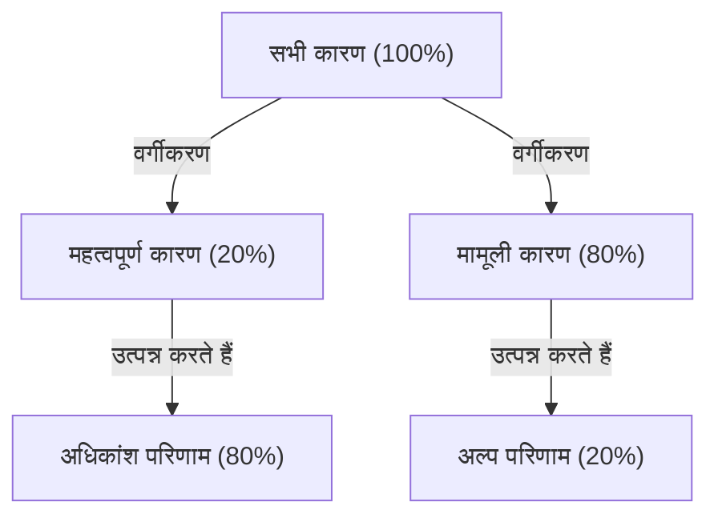

# परिचय: अभी "पैरेटो सिद्धांत" क्यों आवश्यक है?

आधुनिक समाज सूचना और विकल्पों से भरा हुआ है। व्यावसायिक पेशेवर हर दिन अनगिनत कार्यों में उलझे रहते हैं, और प्रबंधकों को अनगिनत रणनीतिक विकल्पों में से सर्वश्रेष्ठ चुनना होता है। इस तरह के अत्यधिक जटिल वातावरण में, "सब कुछ पूरी तरह से करने" का दृष्टिकोण अक्सर संसाधनों की कमी और थकावट की ओर ले जाता है।

यहीं पर "पैरेटो सिद्धांत (80:20 नियम)" अपनी जबरदस्त शक्ति प्रदर्शित करता है। यह सरल अनुभवजन्य नियम कि "80% परिणाम 20% कारणों से उत्पन्न होते हैं" स्पष्ट रूप से दिखाता है कि हमें अपनी ऊर्जा कहाँ केंद्रित करनी चाहिए।

इस लेख में, हम पैरेटो सिद्धांत की बुनियादी समझ से लेकर इसकी ऐतिहासिक पृष्ठभूमि, व्यापार और व्यक्तिगत उत्पादकता में सुधार के लिए विशिष्ट अनुप्रयोग रणनीतियों और यहाँ तक कि इस सिद्धांत की सीमाओं और गलतफहमियों तक गहराई से विचार करेंगे। जब तक आप इस लेख को पढ़ना समाप्त करेंगे, तब तक आपके पास यह पहचानने के लिए एक शक्तिशाली लेंस होगा कि "किस पर ध्यान केंद्रित करना है और क्या छोड़ना है।"

## पैरेटो सिद्धांत क्या है? इसका इतिहास और सार

पैरेटो सिद्धांत का प्रस्ताव विल्फ्रेडो पैरेटो (Vilfredo Pareto) द्वारा किया गया था, जो 19वीं सदी के अंत और 20वीं सदी की शुरुआत में सक्रिय एक इतालवी अर्थशास्त्री थे। 1896 में प्रकाशित एक शोध पत्र में, उन्होंने उस समय यूरोप में धन के वितरण का अध्ययन किया और एक आश्चर्यजनक तथ्य की खोज की। वह धन का असमान वितरण था: "समाज में लगभग 80% धन शीर्ष 20% अमीरों के स्वामित्व में है।"

बाद में, कई शोधकर्ताओं ने पुष्टि की कि यह "80:20" असममित वितरण अर्थशास्त्र के दायरे से बाहर, प्रकृति, व्यापार और सामाजिक घटनाओं के सभी क्षेत्रों में व्यापक रूप से लागू होता है। 1940 के दशक में, गुणवत्ता नियंत्रण प्राधिकरण जोसेफ एम. जुरान (Joseph M. Juran) ने इस सिद्धांत को व्यापार की दुनिया में लागू किया और "महत्वपूर्ण कुछ (vital few) और मामूली कई (trivial many)" की अवधारणा का प्रस्ताव रखा। यह आधुनिक व्यापार में पैरेटो सिद्धांत का आधार है।

### सिद्धांत के तंत्र का चित्रण

पैरेटो सिद्धांत का मूल यह है कि **"इनपुट (कारण)" और "आउटपुट (परिणाम)" के बीच संबंध समान नहीं है**। निम्नलिखित आरेख इस असंतुलित संबंध को सरलता से व्यक्त करता है।

यह विचार कि "परिणाम प्रयास की मात्रा के अनुपात में प्राप्त होते हैं (1:1 नियम)", जिस पर हम अक्सर सहज रूप से विश्वास करते हैं, वास्तविक दुनिया में शायद ही कभी सच होता है। वास्तव में, कुछ तत्व परिणामों पर निर्णायक प्रभाव डालते हैं।

## व्यापार में पैरेटो सिद्धांत का अनुप्रयोग

पैरेटो सिद्धांत का व्यापार के क्षेत्र में सबसे नाटकीय प्रभाव पड़ता है। सीमित संसाधनों (समय, धन, मानव संसाधन) के साथ मुनाफे को अधिकतम करने के लिए, इस सिद्धांत को हर व्यावसायिक प्रक्रिया में शामिल करने की आवश्यकता है।

### 1. बिक्री और विपणन रणनीति

व्यापार में पैरेटो सिद्धांत का सबसे प्रसिद्ध अनुप्रयोग यह है कि "80% बिक्री शीर्ष 20% ग्राहकों द्वारा उत्पन्न होती है।"

*   **शीर्ष 20% वफादार ग्राहकों की पहचान:** कंपनियों को पहले डेटा से उन शीर्ष 20% ग्राहकों की पहचान करनी चाहिए जो उनकी अधिकांश बिक्री और मुनाफा उत्पन्न करते हैं।
*   **संसाधनों का सघन आवंटन:** सभी ग्राहकों को समान रूप से सेवाएं प्रदान करने के बजाय, वे अपने अधिकांश विपणन बजट और बिक्री संसाधनों (80%) को वीआईपी उपचार और इस शीर्ष 20% को विशेष ग्राहक सफलता प्रदान करने पर केंद्रित करते हैं ताकि वफादारी बढ़ाई जा सके।
*   **उत्पाद विकास के लिए प्रतिक्रिया:** शीर्ष 20% ग्राहक क्या चाहते हैं इसका गहन विश्लेषण करके और उनकी जरूरतों को पूरा करने के लिए उत्पादों को अपडेट करके सबसे अधिक लागत प्रभावी सुधार किए जा सकते हैं।

### 2. मानव संसाधन और संगठनात्मक प्रबंधन

पैरेटो सिद्धांत संगठनात्मक प्रदर्शन में भी स्पष्ट रूप से देखा जा सकता है। यह प्रवृत्ति है कि "कंपनी के 80% परिणाम उसके शीर्ष 20% उत्कृष्ट कर्मचारियों द्वारा उत्पन्न होते हैं।"

*   **उच्च प्रदर्शन करने वालों में निवेश:** शीर्ष 20% कर्मचारियों की प्रेरणा बनाए रखना और एक ऐसा वातावरण बनाना जहां वे अपनी पूरी क्षमता (अधिकार تفویض (delegation of authority), मुआवजा, लचीली कार्य शैली आदि) प्राप्त कर सकें, समग्र संगठन की उत्पादकता में नाटकीय रूप से सुधार करेगा।
*   **कौशल प्रसार तंत्र बनाना:** 20% उत्कृष्ट प्रतिभाओं के पास मौजूद निहित ज्ञान और व्यवहारिक विशेषताओं को निकालकर और उन्हें शेष 80% कर्मचारियों (मैनुअल और मेंटरिंग के माध्यम से) के साथ साझा करने के लिए एक प्रणाली बनाकर पूरे संगठन का उत्थान करें।

### 3. इन्वेंटरी प्रबंधन और गुणवत्ता नियंत्रण

*   **इन्वेंटरी प्रबंधन (एबीसी विश्लेषण):** संभाले गए उत्पादों में से, शीर्ष 20% आइटम अक्सर कुल बिक्री का 80% हिस्सा होते हैं। इन महत्वपूर्ण वस्तुओं (रैंक ए) को कड़ाई से प्रबंधित किया जाना चाहिए ताकि यह सुनिश्चित हो सके कि वे कभी स्टॉक से बाहर न हों, और उन वस्तुओं (रैंक सी) के लिए निर्णय लिए जाने चाहिए जो बिक्री में कम योगदान देती हैं, जैसे कि ऑर्डर की आवृत्ति कम करना या उन्हें संभालना बंद करना।
*   **गुणवत्ता नियंत्रण (बग फिक्सिंग):** सॉफ्टवेयर विकास में, यह कहा जाता है कि "80% सिस्टम बग और दोष 20% मॉड्यूल (कोड) के कारण होते हैं।" उस 20% पर परीक्षण और रिफैक्टरिंग संसाधनों को केंद्रित करके, गुणवत्ता में कुशलतापूर्वक सुधार किया जा सकता है।

## व्यक्तिगत उत्पादकता और समय प्रबंधन में अनुप्रयोग

न केवल व्यापार में, बल्कि व्यक्तिगत कार्य शैलियों और दैनिक जीवन में भी, आप पैरेटो सिद्धांत को शामिल करके "आवश्यक सोच (आवश्यक चीजों पर ध्यान केंद्रित करना)" का अभ्यास कर सकते हैं।

### 1. कार्य प्रबंधन: "महत्वपूर्ण 20%" की पहचान करना

मान लीजिए कि आपकी टू-डू सूची में हर दिन 10 कार्य हैं। पैरेटो सिद्धांत के अनुसार, उनमें से केवल "सिर्फ 2 (20%)" ही वास्तव में मूल्य पैदा करेंगे और सीधे आपके लक्ष्यों को प्राप्त करने की ओर ले जाएंगे।

बहुत से लोग सोचते हैं कि "आइए आसान कार्यों को पहले पूरा करके गति प्राप्त करें", लेकिन यह उन्हें मामूली 80% पर अपना समय और ऊर्जा बर्बाद करने का कारण बनता है। अत्यधिक उत्पादक लोग सुबह सबसे पहले सबसे महत्वपूर्ण 20% कार्यों (सबसे कठिन कार्य और वे जो सबसे अधिक परिणाम देंगे) से निपटते हैं, जब उनका ऊर्जा स्तर अपने उच्चतम स्तर पर होता है।

### 2. कौशल अधिग्रहण में 80:20

एक नई भाषा, प्रोग्रामिंग, या एक संगीत वाद्ययंत्र सीखते समय पैरेटो सिद्धांत भी प्रभावी होता है।
यह एक तथ्य है कि "दैनिक भाषा की बातचीत का 80% पूरी भाषा में सबसे अधिक उपयोग किए जाने वाले 20% शब्दों से बना है।" इसलिए, मामूली शब्दों और जटिल व्याकरण को पूरी तरह से याद करने से पहले, मुख्य 20% मूल बातों का पूरी तरह से बार-बार अभ्यास करना सुधार का सबसे छोटा रास्ता है।

### 3. डिजिटल अतिसूक्ष्मवाद (Digital Minimalism) और सूचना एकत्रीकरण

आधुनिक लोग सोशल मीडिया और समाचार साइटों से बड़ी मात्रा में जानकारी प्राप्त करते हैं, लेकिन "वे जानकारी जो वास्तव में आपके जीवन या कार्य पर सकारात्मक प्रभाव डालती हैं, वे सभी सूचना स्रोतों के 20% से भी कम हैं।"
परिणाम प्राप्त करने के लिए, आपको अनावश्यक ऐप्स को हटाने, कम मूल्य वाले ईमेल न्यूज़लेटर्स की सदस्यता समाप्त करने और वास्तव में उच्च गुणवत्ता वाले 20% सूचना स्रोतों (उत्कृष्ट पुस्तकें, पेशेवर पत्रिकाएं, विश्वसनीय गुरु, आदि) के लिए ही समय निकालने का साहस होना चाहिए।

## पैरेटो सिद्धांत का अभ्यास चक्र

न केवल इसे ज्ञान के रूप में समझना, बल्कि सिद्धांत को अभ्यास में लागू करने के लिए यहां एक रूपरेखा दी गई है।

1.  **वर्तमान स्थिति का विश्लेषण (माप और डेटा संग्रह):** पहले तथ्यों को सटीक रूप से समझें। समय किस पर व्यतीत हो रहा है? बिक्री कहाँ से आ रही है? अंतर्ज्ञान पर निर्भर रहने के बजाय डेटा-संचालित विश्लेषण आवश्यक है।
2.  **महत्वपूर्ण 20% का निष्कर्षण:** एकत्र किए गए डेटा से "महत्वपूर्ण कुछ" की पहचान करें। साथ ही, "छोड़े जाने / काटे जाने वाले 80%" को स्पष्ट करें।
3.  **संसाधनों का सघन आवंटन:** साहस रखें और तय करें कि "क्या नहीं करना है (Not-to-do)"। अपना सारा खाली समय, पैसा और प्रयास निकाले गए महत्वपूर्ण 20% में लगा दें।
4.  **मूल्यांकन और समीक्षा:** परिवेश और परिस्थितियाँ हमेशा बदलती रहती हैं। क्योंकि एक बार "महत्वपूर्ण 20%" पुराना हो सकता है, इस चक्र को नियमित रूप से (उदाहरण के लिए, त्रैमासिक) चलाएं और हमेशा अपना ध्यान समायोजित करते रहें।

## पैरेटो सिद्धांत के नुकसान और सावधानियां

पैरेटो सिद्धांत एक बहुत ही शक्तिशाली उपकरण है, लेकिन अगर आँख बंद करके भरोसा किया जाए, तो इसके खतरनाक दुष्प्रभाव हो सकते हैं। निम्नलिखित बिंदुओं पर ध्यान देना आवश्यक है।

### 1. "80:20" कोई पूर्ण अनुपात नहीं है
80 और 20 की संख्या केवल अनुभवजन्य नियमों पर आधारित अनुमान हैं, न कि गणितीय रूप से सख्त नियम। स्थिति के आधार पर, यह "90:10" या "70:30" हो सकता है। महत्वपूर्ण बात "संख्याओं की सटीकता" नहीं है, बल्कि "कारणों और परिणामों के असंतुलन" को पहचानना है।

### 2. शेष 80% "पूरी तरह से बेकार" नहीं है
उदाहरण के लिए, यदि आप उन "20% वफादार ग्राहकों पर बहुत अधिक ध्यान केंद्रित करते हैं जो 80% बिक्री उत्पन्न करते हैं", और शेष 80% ग्राहकों को पूरी तरह से काट देते हैं, तो आपकी कंपनी की प्रतिष्ठा गिरने का जोखिम है, या आप संभावित ग्राहकों को खो सकते हैं जो भविष्य में वफादार ग्राहक बन सकते हैं। इसके अलावा, उत्पाद लाइनअप में भी, ऐसे कई मामले हैं जहां विशिष्ट उत्पाद (लॉन्ग टेल - long tail) ब्रांड की विशेषज्ञता और अपील का समर्थन करते हैं।
महत्वपूर्ण बात "काटना" नहीं है, बल्कि "संसाधन आवंटन अनुपात को अनुकूलित करना (प्राथमिकता देना)" है।

### 3. दीर्घकालिक परिप्रेक्ष्य का अभाव
पैरेटो सिद्धांत वर्तमान डेटा के आधार पर अनुकूलन में मजबूत है, लेकिन यह भविष्य के नवाचारों को उत्पन्न नहीं करता है। भविष्य के 5 वर्षों में व्यवसाय का समर्थन करने वाले बीज अब उन "80% गतिविधियों में छिपे हो सकते हैं जो लाभ उत्पन्न नहीं करते हैं।" वास्तव में टिकाऊ विकास के लिए अल्पकालिक दक्षता (80:20 का पूर्ण कार्यान्वयन) और दीर्घकालिक अन्वेषण (उन चीजों में निवेश करना जो जानबूझकर बेकार लगती हैं) के बीच संतुलन बनाना आवश्यक है।

## अंतिम अनुप्रयोग: "80/20 का 80/20"

और भी उन्नत दृष्टिकोण के रूप में, पैरेटो सिद्धांत को एक नेस्टेड संरचना में लागू करने का विचार है।

पैरेटो सिद्धांत "शीर्ष 20% तत्वों" पर भी लागू होता है। दूसरे शब्दों में, 20% में से 20% (यानी, कुल का 4%) परिणाम के 80% में से 80% (यानी, कुल का 64%) उत्पन्न करता है, जो एकाग्रता का चरम रूप है (64:4 का नियम)।

यदि आपको उस प्रोजेक्ट में "सबसे महत्वपूर्ण 20%" मिल गया है जिस पर आप वर्तमान में काम कर रहे हैं, तो अपने आप से आगे पूछें: "उस 20% के भीतर '4% का मूल' क्या है जो और भी अधिक भारी अंतर पैदा करता है?" यदि आप वहां तक अपना ध्यान केंद्रित कर सकते हैं, तो आपकी उत्पादकता सचमुच एक अलग ही स्तर पर पहुंच जाएगी।

## निष्कर्ष: घटाव का सौंदर्यशास्त्र

हम समस्याओं को "जोड़ने" से हल करने की प्रवृत्ति रखते हैं। हम बिक्री बढ़ाने के लिए अधिक उत्पाद जोड़ते हैं, किसी परियोजना को सफल बनाने के लिए अधिक बैठकें जोड़ते हैं, और उत्पादकता बढ़ाने के लिए अधिक उपकरण जोड़ते हैं।

हालाँकि, पैरेटो सिद्धांत हमें "घटाव" का सौंदर्यशास्त्र सिखाता है। सच्ची सफलताएँ कुछ जोड़ने से नहीं आती हैं, बल्कि 80% शोर को दूर करने से आती हैं जो सीधे परिणामों की ओर नहीं ले जाता है, और आवश्यक 20% संकेतों को तेज करता है।

आज से, यह सोचने पर पुनर्विचार करें कि आपके काम और जीवन में "महत्वपूर्ण 20%" क्या है। आपको सब कुछ सही करने की आवश्यकतान्वयन की आवश्यकता नहीं है। अपनी सर्वश्रेष्ठ ऊर्जा केवल उस चीज़ में लगाएँ जो सबसे ज्यादा मायने रखती है। न्यूनतम प्रयास के साथ अधिकतम परिणाम प्राप्त करने और अधिक समृद्ध, अधिक सार्थक जीवन जीने का यही सबसे सुरक्षित तरीका है।
