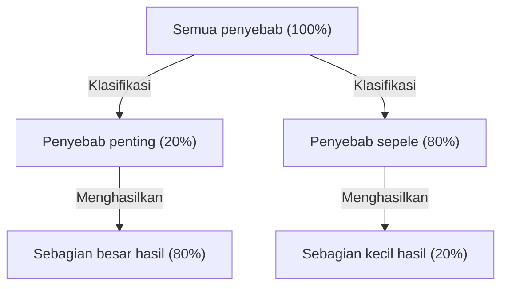
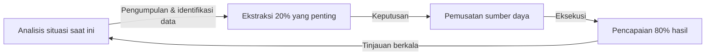

# Pendahuluan: Mengapa "Prinsip Pareto" Sangat Penting Saat Ini?

Masyarakat modern dipenuhi dengan informasi dan pilihan. Para pebisnis dituntut dengan tugas-tugas yang sangat banyak setiap harinya, dan para eksekutif harus memilih yang terbaik dari opsi strategi yang tak terhitung jumlahnya. Dalam lingkungan yang sangat kompleks ini, pendekatan "mencoba melakukan semuanya dengan sempurna" sering kali menyebabkan kelelahan dan kehabisan sumber daya.

Di sinilah "Prinsip Pareto (Aturan 80:20)" menunjukkan kekuatannya yang luar biasa. Aturan empiris sederhana ini, yang menyatakan bahwa "80% dari hasil berasal dari 20% penyebab", dengan jelas menunjukkan kepada kita di mana kita harus memusatkan energi kita.

Dalam artikel ini, kami akan membahas secara mendalam Prinsip Pareto, mulai dari pemahaman dasarnya, latar belakang sejarahnya, strategi aplikasi spesifik untuk meningkatkan produktivitas dalam bisnis maupun individu, hingga batasan dan kesalahpahaman mengenai prinsip ini. Pada saat Anda selesai membaca artikel ini, Anda seharusnya sudah memiliki lensa yang kuat untuk mengidentifikasi "apa yang harus difokuskan dan apa yang harus dibuang".

## Apa itu Prinsip Pareto? Sejarah dan Esensinya

Prinsip Pareto dikemukakan oleh Vilfredo Pareto, seorang ekonom Italia yang aktif pada akhir abad ke-19 hingga awal abad ke-20. Dalam makalah yang diterbitkannya pada tahun 1896, ia meneliti distribusi kekayaan di Eropa pada saat itu dan menemukan fakta yang mengejutkan. Yaitu, ketidakmerataan distribusi kekayaan di mana "sekitar 80% dari seluruh kekayaan masyarakat dimiliki oleh 20% orang kaya teratas".

Setelah itu, distribusi asimetris "80:20" ini dikonfirmasi oleh banyak peneliti berlaku luas tidak hanya dalam bidang ekonomi tetapi juga dalam alam, bisnis, dan fenomena sosial. Pada tahun 1940-an, Joseph M. Juran, seorang ahli manajemen mutu, menerapkan prinsip ini ke dalam dunia bisnis dan mengemukakan konsep "sedikit yang penting (vital few) dan banyak yang sepele (trivial many)". Inilah yang menjadi dasar Prinsip Pareto dalam bisnis modern.

### Ilustrasi Mekanisme Prinsip

Inti dari Prinsip Pareto adalah **hubungan antara "input (penyebab)" dan "output (hasil)" yang tidak seimbang**. Diagram di bawah ini secara sederhana menunjukkan hubungan yang tidak seimbang tersebut.

Gagasan bahwa "hasil sebanding dengan jumlah usaha (aturan 1:1)" yang secara intuitif cenderung kita yakini, jarang berlaku di dunia nyata. Kenyataannya, sejumlah kecil elemen memberikan dampak yang menentukan pada hasil.

## Aplikasi Prinsip Pareto dalam Bisnis

Area di mana Prinsip Pareto memberikan efek paling dramatis adalah di bidang bisnis. Untuk memaksimalkan keuntungan dengan sumber daya (waktu, dana, sumber daya manusia) yang terbatas, prinsip ini harus diintegrasikan ke dalam semua proses bisnis.

### 1. Strategi Penjualan dan Pemasaran

Contoh aplikasi Prinsip Pareto yang paling terkenal dalam bisnis adalah "80% penjualan dihasilkan oleh 20% pelanggan teratas".

*   **Identifikasi 20% pelanggan unggulan teratas:** Perusahaan pertama-tama harus mengidentifikasi dari data, kelompok 20% pelanggan teratas yang menghasilkan sebagian besar pendapatan dan keuntungan mereka.
*   **Pemusatan sumber daya:** Alih-alih memberikan layanan yang sama rata kepada semua pelanggan, pusatkan sebagian besar (80%) anggaran pemasaran dan sumber daya penjualan untuk memberikan perlakuan VIP dan kesuksesan pelanggan (customer success) khusus kepada 20% pelanggan teratas ini guna meningkatkan loyalitas mereka.
*   **Umpan balik pada pengembangan produk:** Menganalisis secara menyeluruh apa yang diinginkan oleh 20% pelanggan teratas dan memperbarui produk agar sesuai dengan kebutuhan mereka, memungkinkan peningkatan yang paling hemat biaya.

### 2. Manajemen SDM dan Organisasi

Bahkan dalam kinerja organisasi, Prinsip Pareto terlihat dengan jelas. Ada kecenderungan bahwa "80% dari hasil perusahaan dihasilkan oleh 20% karyawan berprestasi teratas".

*   **Investasi pada karyawan berkinerja tinggi (high performer):** Menjaga motivasi 20% karyawan teratas dan menciptakan lingkungan (pendelegasian wewenang, kompensasi, jam kerja fleksibel, dll.) di mana mereka dapat memaksimalkan potensinya akan secara dramatis meningkatkan produktivitas seluruh organisasi.
*   **Membangun sistem penyebaran keterampilan:** Menggali pengetahuan tacit dan karakteristik perilaku dari 20% SDM unggulan, dan membuat sistem (seperti manual atau pendampingan) untuk membagikannya kepada 80% karyawan yang tersisa guna meningkatkan standar organisasi secara keseluruhan.

### 3. Manajemen Persediaan dan Manajemen Mutu

*   **Manajemen Persediaan (Analisis ABC):** Dari semua produk yang ditangani, 20% item teratas sering kali menyumbang 80% dari total penjualan. Penting untuk mengelola secara ketat agar tidak terjadi kehabisan stok pada item penting (peringkat A) ini, sedangkan untuk item yang kontribusinya terhadap penjualan rendah (peringkat C), perlu diambil keputusan seperti mengurangi frekuensi pemesanan atau menghentikan penanganannya.
*   **Manajemen Mutu (Perbaikan Bug):** Dalam pengembangan perangkat lunak, dikatakan bahwa "80% dari bug dan cacat sistem disebabkan oleh 20% modul (kode) keseluruhan". Dengan memusatkan sumber daya pengujian dan refactoring pada 20% tersebut, Anda dapat meningkatkan kualitas secara efisien.

## Aplikasi pada Produktivitas dan Manajemen Waktu Pribadi

Tidak hanya dalam bisnis, tetapi juga dalam gaya kerja dan kehidupan pribadi kita sehari-hari, dengan mengadopsi Prinsip Pareto, kita dapat mempraktikkan "Pemikiran Esensial (pemikiran yang berfokus pada hal-hal esensial)".

### 1. Manajemen Tugas: Mengidentifikasi "20% yang Penting"

Misalkan ada 10 tugas dalam daftar To-Do Anda setiap hari. Menurut Prinsip Pareto, hanya "2 tugas (20%)" yang benar-benar menciptakan nilai dan terhubung langsung dengan pencapaian tujuan.

Banyak orang cenderung berpikir, "Mari kita selesaikan tugas yang mudah terlebih dahulu untuk mendapatkan momentum", tetapi ini akan menguras waktu dan energi Anda untuk 80% tugas yang sepele. Orang yang sangat produktif mengatasi 20% tugas yang paling penting (tugas yang paling sulit dan paling membuahkan hasil) di pagi hari saat tingkat energi mereka paling tinggi.

### 2. 80:20 dalam Penguasaan Keterampilan

Prinsip Pareto juga efektif saat mempelajari bahasa, pemrograman, alat musik baru, dll.
Ada fakta bahwa "80% percakapan sehari-hari dalam suatu bahasa terdiri dari 20% kata yang paling sering digunakan secara keseluruhan". Oleh karena itu, sebelum menghafal kosakata minor atau tata bahasa yang kompleks dengan sempurna, praktik pengulangan yang menyeluruh pada 20% dasar inti merupakan rute terpendek menuju kemahiran.

### 3. Minimalisme Digital dan Pengumpulan Informasi

Orang modern dibombardir dengan informasi dalam jumlah besar dari media sosial dan situs berita, tetapi "informasi yang benar-benar memberikan dampak positif pada kehidupan dan pekerjaan Anda kurang dari 20% dari semua sumber informasi".
Untuk mencapai hasil, dibutuhkan keberanian untuk menghapus aplikasi yang tidak perlu, berhenti berlangganan buletin email yang bernilai rendah, dan hanya menghabiskan waktu pada 20% sumber informasi yang benar-benar berkualitas tinggi (buku-buku bagus, jurnal profesional, mentor tepercaya, dll.).

## Siklus Praktik Prinsip Pareto

Berikut ini adalah kerangka kerja (framework) untuk terus menerapkan prinsip ini secara nyata, bukan sekadar memahaminya sebagai pengetahuan.

1.  **Analisis situasi saat ini (Pengukuran dan Pengumpulan Data):** Pertama-tama, pahami faktanya dengan akurat. Untuk apa waktu dihabiskan? Dari mana penjualan berasal? Analisis berbasis data sangat penting, bukan mengandalkan tebakan.
2.  **Ekstraksi 20% yang penting:** Dari data yang dikumpulkan, identifikasi "segelintir hal yang sangat penting (critical few)". Pada saat yang sama, perjelas "80% yang harus dibuang atau dikurangi".
3.  **Pemusatan sumber daya:** Kumpulkan keberanian untuk memutuskan "apa yang tidak boleh dilakukan (Not-to-do)". Curahkan waktu, dana, dan upaya yang tersisa untuk 20% hal penting yang telah diekstraksi.
4.  **Evaluasi dan Tinjauan:** Lingkungan dan situasi selalu berubah. Karena "20% yang penting" di masa lalu mungkin menjadi usang, jalankan siklus ini secara berkala (misalnya, setiap kuartal) dan terus sesuaikan fokus Anda.

## Jebakan dan Peringatan pada Prinsip Pareto

Prinsip Pareto adalah alat yang sangat kuat, tetapi keyakinan buta padanya dapat membawa efek samping yang berbahaya. Hal-hal berikut perlu mendapat perhatian penuh.

### 1. "80:20" Bukanlah Rasio Absolut
Angka 80 dan 20 hanyalah panduan berdasarkan aturan empiris, bukan hukum matematis yang ketat. Tergantung pada situasinya, bisa jadi "90:10" atau "70:30". Yang penting bukanlah "keakuratan angkanya", melainkan menyadari "ketidakseimbangan antara penyebab dan hasil".

### 2. Sisa 80% Bukannya "Sama Sekali Tidak Berharga"
Misalnya, jika Anda terlalu fokus pada "20% pelanggan unggulan yang menghasilkan 80% penjualan" dan sepenuhnya mengabaikan 80% pelanggan yang tersisa, ada risiko reputasi perusahaan akan turun atau kehilangan segmen potensial yang kelak bisa menjadi pelanggan unggulan. Juga, dalam jajaran produk, tidak jarang produk niche (long tail) menopang spesialisasi dan daya tarik merek.
Yang penting bukanlah "membuangnya", tetapi "mengoptimalkan rasio alokasi sumber daya (menyeimbangkan secara tepat)".

### 3. Kurangnya Perspektif Jangka Panjang
Prinsip Pareto kuat untuk optimasi berdasarkan data saat ini, tetapi tidak untuk menciptakan inovasi di masa depan. Ada kemungkinan benih yang akan mendukung bisnis lima tahun mendatang sedang tertidur dalam "80% aktivitas yang tidak menghasilkan keuntungan saat ini". Menyeimbangkan efisiensi jangka pendek (penerapan mendalam 80:20) dan eksplorasi jangka panjang (sengaja berinvestasi pada hal yang tampak sia-sia) sangat penting untuk pertumbuhan yang benar-benar berkelanjutan.

## Aplikasi Pamungkas: "80/20 dari 80/20"

Sebagai pendekatan tingkat yang lebih mahir, ada gagasan untuk menerapkan Prinsip Pareto dengan struktur bersarang.

Prinsip Pareto juga berlaku di dalam "20% elemen teratas". Dengan kata lain, 20% dari 20% (＝4% dari total) menghasilkan 80% dari 80% (＝64% dari total) hasil. Ini adalah konsentrasi yang ekstrem (Aturan 64:4).

Jika Anda telah menemukan "20% yang paling penting" dalam proyek yang sedang Anda kerjakan, tanyakan lagi pada diri Anda sendiri. "Dari 20% tersebut, apa 'inti 4%' yang menciptakan perbedaan yang lebih dahsyat?" Jika Anda bisa mempersempit fokus sejauh itu, produktivitas Anda akan benar-benar mencapai tingkat dimensi yang berbeda.

## Kesimpulan: Estetika Pengurangan

Kita cenderung mencoba memecahkan masalah dengan "penambahan". Kita menambah jumlah produk untuk meningkatkan penjualan, mengadakan lebih banyak rapat agar proyek berhasil, dan menambah perangkat (tools) untuk meningkatkan produktivitas.

Namun, apa yang diajarkan Prinsip Pareto kepada kita adalah estetika "pengurangan". Terobosan sejati tidak dihasilkan dari penambahan sesuatu, melainkan dari menghilangkan 80% kebisingan (noise) yang tidak terhubung langsung dengan hasil, dan mempertajam 20% sinyal yang esensial.

Mulai hari ini, cobalah meninjau kembali apa "20% yang penting" dalam pekerjaan dan hidup Anda. Anda tidak perlu membuat semuanya sempurna. Curahkan energi terbaik Anda hanya untuk hal yang paling penting. Itulah jalan yang paling pasti untuk mencapai hasil maksimal dengan upaya minimal, dan menjalani kehidupan yang lebih kaya dan lebih bermakna.
