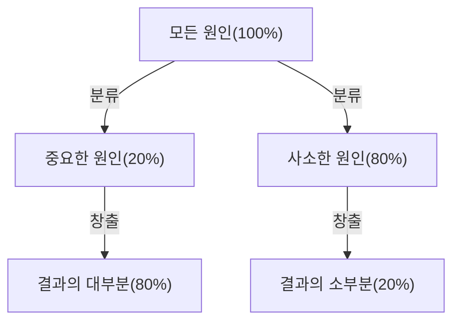
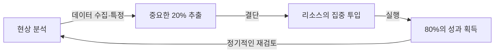

# 시작하며: 왜 지금 '파레토의 법칙'이 필수적인가?

현대 사회는 정보와 선택지로 넘쳐납니다. 비즈니스맨은 매일 방대한 작업에 쫓기고, 경영자는 수많은 전략 옵션 중에서 최적의 것을 선택해야 합니다. 이러한 복잡성이 높은 환경에서, '모든 것을 완벽하게 해내자'는 접근은 종종 리소스의 고갈과 피로를 초래합니다.

여기서 압도적인 위력을 발휘하는 것이 '파레토의 법칙(80:20의 법칙)'입니다. "결과의 80%는 원인의 20%에서 창출된다"는 이 단순한 경험 법칙은 우리가 어디에 에너지를 집중해야 하는지 명확하게 보여줍니다.

본 기사에서는 파레토의 법칙의 기초적인 이해부터 역사적 배경, 비즈니스 및 개인의 생산성 향상에 있어 구체적인 응용 전략, 그리고 이 법칙의 한계와 오해에 이르기까지 철저하게 파고들어 해설합니다. 이 기사를 다 읽을 즈음에는 당신도 '무엇에 집중하고 무엇을 버려야 할지'를 판별하는 강력한 렌즈를 얻게 될 것입니다.

## 파레토의 법칙이란 무엇인가? 그 역사와 본질

파레토의 법칙은 19세기 말부터 20세기 초에 걸쳐 활약한 이탈리아의 경제학자 빌프레도 파레토(Vilfredo Pareto)에 의해 제창되었습니다. 그는 1896년에 발표한 논문에서 당시 유럽의 부의 분포를 연구하여 놀라운 사실을 발견했습니다. 그것은 "사회 전체 부의 약 80%는 상위 20%의 부유층에 의해 소유되고 있다"는 부의 편재입니다.

그 후, 이 '80:20'이라는 비대칭적인 분포가 경제학의 틀을 넘어 자연계나 비즈니스, 사회 현상의 모든 영역에 널리 들어맞는다는 것이 많은 연구자들에 의해 확인되었습니다. 1940년대에는 품질 관리의 권위자인 조셉 주란(Joseph M. Juran)이 이 법칙을 비즈니스 세계에 적용하여 "중요한 소수(vital few)와 사소한 다수(trivial many)"라는 개념을 제창했습니다. 이것이 현대 비즈니스에서의 파레토 법칙의 기초가 되었습니다.

### 법칙의 메커니즘을 도해하다

파레토 법칙의 핵심은 **'투입(원인)'과 '산출(결과)'의 관계가 균등하지 않다**는 것입니다. 다음 도식은 그 불균형한 관계성을 단순하게 나타내고 있습니다.

우리가 직감적으로 믿기 쉬운 '노력량에 비례하여 성과가 나온다(1:1의 법칙)'는 사고방식은 현실 세계에서는 거의 성립하지 않습니다. 실제로는 소수의 요소가 결과에 결정적인 영향을 미치고 있는 것입니다.

## 비즈니스에서의 파레토 법칙의 응용

파레토의 법칙이 가장 극적인 효과 가져오는 것은 비즈니스 영역입니다. 리소스(시간, 자금, 인재)가 제한된 가운데 이익을 극대화하기 위해서는 이 법칙을 모든 업무 프로세스에 통합해야 합니다.

### 1. 영업 및 마케팅 전략

비즈니스에서 가장 잘 알려진 파레토 법칙의 적용 사례는 "매출의 80%는 상위 20%의 고객에 의해 창출된다"는 것입니다.

*   **상위 20%의 우량 고객 특정:** 기업은 먼저 자사의 매출이나 이익의 대부분을 창출하고 있는 상위 20%의 고객군을 데이터에서 특정해야 합니다.
*   **리소스의 집중 투입:** 모든 고객에게 균등하게 서비스를 제공하는 것이 아니라, 이 상위 20%의 고객에 대해 VIP 대우나 특별한 커스터머 석세스를 제공하여 로열티를 높이는 데 마케팅 예산이나 영업 리소스의 대부분(80%)을 집중시킵니다.
*   **제품 개발에 대한 피드백:** 상위 20%의 고객이 무엇을 원하는지 철저하게 분석하고, 그들의 니즈에 맞춰 제품을 업데이트함으로써 가장 비용 대비 효과가 높은 개선이 가능해집니다.

### 2. 인사 및 조직 매니지먼트

조직의 퍼포먼스에 있어서도 파레토의 법칙은 여실히 나타납니다. "회사 성과의 80%는 상위 20%의 우수한 직원에 의해 창출된다"는 경향입니다.

*   **하이 퍼포머에 대한 투자:** 상위 20% 직원의 동기 부여를 유지하고 그들이 최대한의 역량을 발휘할 수 있는 환경(권한 위임, 보상, 유연한 근무 방식 등)을 정비하는 것이 조직 전체의 생산성을 비약적으로 높입니다.
*   **스킬 전파 시스템 구축:** 20%의 우수한 인재가 가진 암묵지나 행동 특성을 추출하여 그것을 나머지 80%의 직원에게 공유하는 시스템(매뉴얼화나 멘토링)을 만듦으로써 조직 전체의 수준 향상을 도모합니다.

### 3. 재고 관리 및 품질 관리

*   **재고 관리(ABC 분석):** 취급 상품 중 상위 20%의 품목이 총 매출의 80%를 차지하는 경우가 많습니다. 이러한 중요 품목(A등급)의 품절을 절대적으로 방지하도록 엄중하게 관리하고, 매출 기여도가 낮은 품목(C등급)은 발주 빈도를 줄이거나 취급을 중지하는 등의 판단이 필요합니다.
*   **품질 관리(버그 수정):** 소프트웨어 개발에 있어 "시스템 버그나 결함의 80%는 전체의 20%의 모듈(코드)에 기인한다"고 합니다. 테스트나 리팩토링의 리소스를 그 20%에 집중시킴으로써 효율적으로 품질을 향상시킬 수 있습니다.

## 개인의 생산성과 시간 관리로의 응용

비즈니스뿐만 아니라 개인의 업무 방식이나 일상 생활에서도 파레토의 법칙을 도입함으로써 '에센셜 사고(본질적인 것에 집중하는 사고)'를 실천할 수 있습니다.

### 1. 태스크 관리: '중요한 20%'를 파악하다

매일 ToDo 리스트에 10개의 태스크가 있다고 가정해 봅시다. 파레토의 법칙에 따르면, 그 중 정말로 가치를 창출하고 목표 달성에 직결되는 태스크는 "단 2개(20%)"에 불과합니다.

많은 사람들은 "간단한 태스크부터 처리하여 탄력을 받자"고 생각하기 쉽지만, 이러면 사소한 80%에 시간과 에너지를 빼앗기고 맙니다. 생산성이 높은 사람은 그날 가장 에너지 수준이 높은 아침 제일 먼저, 가장 중요한 20%의 태스크(가장 난이도가 높고, 가장 성과로 이어지는 태스크)에 착수합니다.

### 2. 스킬 습득에서의 80:20

새로운 언어나 프로그래밍, 악기 등을 배울 때도 파레토의 법칙은 유효합니다.
"언어의 일상 회화의 80%는 전체 중에서 가장 빈번하게 사용되는 20%의 단어로 구성되어 있다"는 사실이 있습니다. 따라서 마이너한 단어나 복잡한 문법을 완벽하게 외우기 전에, 먼저 코어가 되는 20%의 기초를 철저하게 반복 연습하는 것이 실력 향상으로 가는 최단 루트가 됩니다.

### 3. 디지털 미니멀리즘과 정보 수집

현대인은 SNS나 뉴스 사이트로부터 대량의 정보를 쏟아맞고 있지만, "정말로 자신의 인생이나 일에 긍정적인 영향을 미치는 정보는 전체 정보원의 20% 이하"입니다.
성과를 내기 위해서는 불필요한 앱을 삭제하고, 가치가 낮은 이메일 매거진을 해지하며, 진정으로 질 높은 20%의 정보원(훌륭한 서적, 전문지, 신뢰할 수 있는 멘토 등)에만 시간을 할애하는 용기가 필요합니다.

## 파레토 법칙의 실천 사이클

지식으로서 이해할 뿐만 아니라 실제로 법칙을 계속 적용하기 위한 프레임워크를 소개합니다.

1.  **현상 분석(측정과 데이터의 수집):** 먼저 사실을 정확하게 파악합니다. 시간은 어디에 사용되고 있는가? 매출은 어디에서 오는가? 직감에 의존하는 것이 아니라 데이터에 기반한 분석이 필수적입니다.
2.  **중요한 20% 추출:** 수집한 데이터에서 '크리티컬한 소수'를 특정합니다. 동시에 '버려야 할·줄여야 할 80%'도 명확히 합니다.
3.  **리소스의 집중 투입:** 용기를 가지고 '하지 않을 일(Not-to-do)'을 정합니다. 비워진 시간, 자금, 노력을 추출한 중요한 20%에 전력으로 쏟아붓습니다.
4.  **평가와 재검토:** 환경이나 상황은 항상 변화합니다. 예전의 '중요한 20%'가 진부해지는 경우도 있으므로 정기적으로(예를 들어 분기마다) 이 사이클을 돌려 항상 초점을 계속 조정합니다.

## 파레토 법칙의 함정과 주의점

파레토의 법칙은 매우 강력한 도구이지만, 맹신하면 위험한 부작용을 초래할 수도 있습니다. 다음 사항에는 충분히 주의해야 합니다.

### 1. '80:20'은 절대적인 비율이 아니다
80과 20이라는 숫자는 어디까지나 경험 법칙에 기반한 기준이며, 수학적으로 엄밀한 법칙은 아닙니다. 상황에 따라서는 '90:10'이 될 수도 있고, '70:30'이 될 수도 있습니다. 중요한 것은 '숫자의 정확성'이 아니라 '원인과 결과의 불균형성'을 인식하는 것입니다.

### 2. 나머지 80%가 '전혀 무가치'한 것은 아니다
예를 들어 '매출의 80%를 낳는 20%의 우량 고객'에 너무 집중한 나머지, 남은 80%의 고객을 완전히 잘라버리면 기업의 평판이 떨어지거나 장래에 우량 고객으로 성장할 잠재력 있는 층을 놓칠 위험이 있습니다. 또한 상품 라인업에 있어서도 틈새 상품(롱테일)이 브랜드의 전문성이나 매력을 뒷받침하고 있는 경우도 적지 않습니다.
중요한 것은 '잘라내는' 것이 아니라 '리소스의 배분 비율을 최적화하는(강약을 조절하는)' 것입니다.

### 3. 장기적인 시점의 결여
파레토의 법칙은 현재 데이터에 기반한 최적화에는 강하지만 미래의 혁신을 낳는 것은 아닙니다. 지금은 '이익을 낳지 않는 80%의 활동' 속에 5년 후의 비즈니스를 지탱할 씨앗이 잠들어 있을 가능성이 있습니다. 단기적인 효율화(80:20의 철저)와 장기적인 탐구(굳이 무익해 보이는 것에 대한 투자)의 균형을 맞추는 것이 진정으로 지속 가능한 성장에 필수적입니다.

## 궁극의 응용: '80/20의 80/20'

더욱 상급 레벨의 접근법으로서 파레토의 법칙을 중첩 구조로 적용한다는 사고방식이 있습니다.

'상위 20%의 요소' 안에도 다시 파레토의 법칙이 적용됩니다. 즉, 20% 안의 20%(=전체의 4%)가 80% 안의 80%(=전체의 64%)의 성과를 낳는다는 극단적인 집중입니다(64:4의 법칙).

만약 당신이 지금 임하고 있는 프로젝트 안에서 '가장 중요한 20%'를 찾아냈다면, 더 나아가 스스로에게 질문해 보십시오. "그 20% 안에서 다시 압도적인 차이를 만들어내는 '4%의 핵심'은 무엇인가?"라고. 거기까지 초점을 좁힐 수 있다면, 당신의 생산성은 말 그대로 차원이 다른 수준에 도달할 것입니다.

## 마치며: 뺄셈의 미학

우리는 '덧셈'을 통해 문제를 해결하려는 경향이 있습니다. 매출을 올리기 위해 상품 수를 늘리고, 프로젝트를 성공시키기 위해 회의를 늘리며, 생산성을 올리기 위해 도구를 늘립니다.

하지만 파레토의 법칙이 우리에게 가르쳐 주는 것은 '뺄셈'의 미학입니다. 진정한 돌파구는 무언가를 덧붙이는 것이 아니라, 결과에 직결되지 않는 80%의 노이즈를 제거하고 본질적인 20%의 시그널을 갈고 닦음으로써 가져올 수 있습니다.

오늘부터 당신의 일이나 생활 속에서 '중요한 20%'는 무엇인지 다시 한번 바라보십시오. 모든 것을 완벽하게 할 필요는 없습니다. 가장 중요한 것에만 당신의 최고의 에너지를 쏟으십시오. 그것이 최소의 노력으로 최대의 결과를 내고, 보다 풍요롭고 의미 있는 인생을 보내기 위한 가장 확실한 길입니다.
