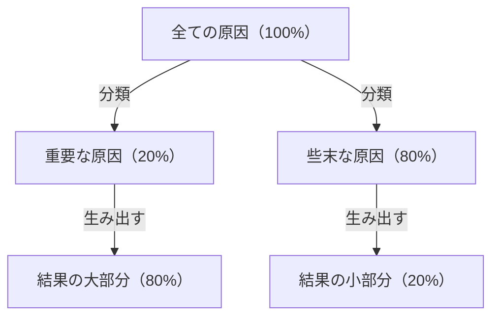
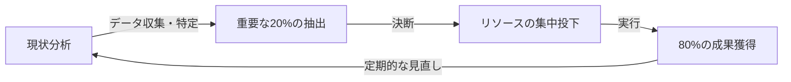

# はじめに：なぜ「パレートの法則」が今、不可欠なのか？

現代社会は情報と選択肢に溢れています。ビジネスパーソンは日々膨大なタスクに追われ、経営者は無数の戦略オプションの中から最適なものを選び出す必要があります。このような複雑性の高い環境において、「すべてを完璧にこなそう」というアプローチは、往々にしてリソースの枯渇と疲弊を招きます。

ここで圧倒的な威力を発揮するのが、「パレートの法則（80:20の法則）」です。「結果の80%は、原因の20%から生み出される」というこのシンプルな経験則は、私たちがどこにエネルギーを集中すべきかを明確に示してくれます。

本記事では、パレートの法則の基礎的な理解から、歴史的背景、ビジネスや個人の生産性向上における具体的な応用戦略、そしてこの法則の限界と誤解に至るまで、徹底的に深掘りして解説します。この記事を読み終える頃には、あなたは「何に集中し、何を捨てるべきか」を見極める強力なレンズを手に入れているはずです。

## パレートの法則とは何か？その歴史と本質

パレートの法則は、19世紀末から20世紀初頭にかけて活躍したイタリアの経済学者、ヴィルフレド・パレート（Vilfredo Pareto）によって提唱されました。彼は1896年に発表した論文の中で、当時の欧州における富の分布を研究し、驚くべき事実を発見しました。それは、「社会全体の富の約80%は、上位20%の富裕層によって所有されている」という富の偏在です。

その後、この「80:20」という非対称な分布が、経済学の枠を超えて自然界やビジネス、社会現象のあらゆる領域に広く当てはまることが多くの研究者によって確認されました。1940年代には、品質管理の権威であるジョセフ・ジュラン（Joseph M. Juran）がこの法則をビジネスの世界に適用し、「重要な少数（vital few）と、些末な多数（trivial many）」という概念を提唱しました。これが現代のビジネスにおけるパレートの法則の基礎となっています。

### 法則のメカニズムを図解する

パレートの法則の核心は、**「投入（原因）」と「産出（結果）」の関係が均等ではない**ということです。以下の図式は、その不均衡な関係性をシンプルに表しています。

私たちが直感的に信じがちな「努力量に比例して成果が出る（1:1の法則）」という考え方は、現実世界ではほとんど成り立ちません。実際には、少数の要素が結果に対して決定的な影響を与えているのです。

## ビジネスにおけるパレートの法則の応用

パレートの法則が最も劇的な効果をもたらすのは、ビジネスの領域です。リソース（時間、資金、人材）が限られている中で利益を最大化するためには、この法則をあらゆる業務プロセスに組み込む必要があります。

### 1. 営業・マーケティング戦略

ビジネスにおいて最もよく知られるパレートの法則の適用例は、「売上の80%は、上位20%の顧客によってもたらされる」というものです。

*   **上位20%の優良顧客の特定：** 企業はまず、自社の売上や利益の大半を生み出している上位20%の顧客群をデータから特定しなければなりません。
*   **リソースの集中投下：** 全顧客に均等にサービスを提供するのではなく、この上位20%の顧客に対してVIP待遇や特別なカスタマーサクセスを提供し、ロイヤルティを高めることにマーケティング予算や営業リソースの大半（80%）を集中させます。
*   **製品開発へのフィードバック：** 上位20%の顧客が何を求めているかを徹底的に分析し、彼らのニーズに合わせて製品をアップデートすることで、最も費用対効果の高い改善が可能になります。

### 2. 人事・組織マネジメント

組織のパフォーマンスにおいても、パレートの法則は如実に現れます。「会社の成果の80%は、上位20%の優秀な従業員によって生み出されている」という傾向です。

*   **ハイパフォーマーへの投資：** 上位20%の従業員のモチベーションを維持し、彼らが最大限の力を発揮できる環境（権限移譲、報酬、柔軟な働き方など）を整備することが、組織全体の生産性を飛躍的に高めます。
*   **スキル伝播の仕組み作り：** 20%の優秀な人材が持つ暗黙知や行動特性を抽出し、それを残りの80%の従業員に共有する仕組み（マニュアル化やメンタリング）を作ることで、組織全体の底上げを図ります。

### 3. 在庫管理と品質管理

*   **在庫管理（ABC分析）：** 取扱商品のうち、上位20%のアイテムが総売上の80%を占めることが多々あります。これらの重要アイテム（Aランク）の在庫切れを絶対に防ぐよう厳重に管理し、売上貢献度の低いアイテム（Cランク）は発注頻度を減らすか、取り扱いを中止するなどの判断が必要です。
*   **品質管理（バグの修正）：** ソフトウェア開発において、「システムのバグや不具合の80%は、全体の20%のモジュール（コード）に起因している」と言われます。テストやリファクタリングのリソースをその20%に集中させることで、効率的に品質を向上させることができます。

## 個人の生産性と時間管理への応用

ビジネスだけでなく、個人の働き方や日常生活においても、パレートの法則を取り入れることで「エッセンシャル思考（本質的なことに集中する思考）」を実践できます。

### 1. タスク管理：「重要な20%」を見極める

毎日ToDoリストに10個のタスクがあるとします。パレートの法則に従えば、そのうち本当に価値を生み出し、目標達成に直結するタスクは「わずか2個（20%）」に過ぎません。

多くの人は、「簡単なタスクから片付けて弾みをつけよう」と考えがちですが、これでは些末な80%に時間とエネルギーを奪われてしまいます。生産性の高い人は、その日一番エネルギーレベルが高い朝一番に、最も重要な20%のタスク（最も難易度が高く、最も成果につながるタスク）に取り組みます。

### 2. スキル習得における80:20

新しい言語やプログラミング、楽器などを学ぶ際にもパレートの法則は有効です。
「言語の日常会話の80%は、全体の中で最も頻繁に使われる20%の単語で構成されている」という事実があります。したがって、マイナーな単語や複雑な文法を完璧に覚える前に、まずはコアとなる20%の基礎を徹底的に反復練習することが、上達への最短ルートとなります。

### 3. デジタル・ミニマリズムと情報収集

現代人はSNSやニュースサイトから大量の情報を浴びていますが、「本当に自分の人生や仕事にポジティブな影響を与える情報は、全情報源の20%以下」です。
成果を出すためには、不要なアプリを削除し、価値の低いメールマガジンを解約し、真に質の高い20%の情報源（優れた書籍、専門誌、信頼できるメンターなど）にのみ時間を割く勇気が必要です。

## パレートの法則の実践サイクル

知識として理解するだけでなく、実際に法則を適用し続けるためのフレームワークを紹介します。

1.  **現状分析（測定とデータの収集）：** まずは事実を正確に把握します。時間は何に使われているか？ 売上はどこから来ているか？ 勘に頼るのではなく、データに基づいた分析が不可欠です。
2.  **重要な20%の抽出：** 収集したデータから、「クリティカルな少数」を特定します。同時に、「捨てるべき・削るべき80%」も明確にします。
3.  **リソースの集中投下：** 勇気を持って、「やらないこと（Not-to-do）」を決めます。空いた時間、資金、労力を、抽出した重要な20%に全力で注ぎ込みます。
4.  **評価と見直し：** 環境や状況は常に変化します。かつての「重要な20%」が陳腐化することもあるため、定期的に（例えば四半期ごとに）このサイクルを回し、常に焦点を調整し続けます。

## パレートの法則の落とし穴と注意点

パレートの法則は非常に強力なツールですが、盲信すると危険な副作用をもたらすこともあります。以下の点には十分注意する必要があります。

### 1. 「80:20」は絶対的な比率ではない
80と20という数字はあくまで経験則に基づく目安であり、数学的に厳密な法則ではありません。状況によっては「90:10」になることもあれば、「70:30」になることもあります。重要なのは「数字の正確さ」ではなく、「原因と結果の不均衡性」を認識することです。

### 2. 残りの80%が「全く無価値」なわけではない
例えば、「売上の80%を生む20%の優良顧客」に集中するあまり、残り80%の顧客を完全に切り捨ててしまうと、企業の評判が落ちたり、将来優良顧客に育つはずだったポテンシャル層を逃したりするリスクがあります。また、商品ラインナップにおいても、ニッチな商品（ロングテール）がブランドの専門性や魅力を支えているケースも少なくありません。
重要なのは「切り捨てる」ことではなく、「リソースの配分比率を最適化する（メリハリをつける）」ことです。

### 3. 長期的な視点の欠如
パレートの法則は、現在のデータに基づく最適化には強いですが、未来のイノベーションを生み出すものではありません。今は「利益を生まない80%の活動」の中に、5年後のビジネスを支える種が眠っている可能性があります。短期的な効率化（80:20の徹底）と、長期的な探求（あえて無駄に見えることへの投資）のバランスをとることが、真に持続可能な成長には不可欠です。

## 究極の応用：「80/20の80/20」

さらに上級レベルのアプローチとして、パレートの法則を入れ子構造で適用するという考え方があります。

「上位20%の要素」の中にも、さらにパレートの法則が適用されます。つまり、20%の中の20%（＝全体の4%）が、80%の中の80%（＝全体の64%）の成果を生み出す、という極端な集中です（64:4の法則）。

もしあなたが、今取り組んでいるプロジェクトの中で「最も重要な20%」を見つけたなら、さらに自問してみてください。「その20%の中で、さらに圧倒的な違いを生み出す『4%の核』は何か？」と。そこまで焦点を絞り込むことができれば、あなたの生産性は文字通り次元の違うレベルへと到達するでしょう。

## おわりに：引き算の美学

私たちは、「足し算」によって問題を解決しようとする傾向があります。売上を上げるために商品数を増やし、プロジェクトを成功させるために会議を増やし、生産性を上げるためにツールを増やします。

しかし、パレートの法則が私たちに教えてくれるのは、「引き算」の美学です。真のブレイクスルーは、何かを付け足すことではなく、結果に直結しない80%のノイズを取り除き、本質的な20%のシグナルを研ぎ澄ますことによってもたらされます。

今日から、あなたの仕事や生活の中で「重要な20%」は何かを見つめ直してみてください。すべてを完璧にする必要はありません。一番大切なことだけに、あなたの最高のエネルギーを注いでください。それが、最小の努力で最大の結果を出し、より豊かで意味のある人生を送るための最も確実な道筋なのです。
