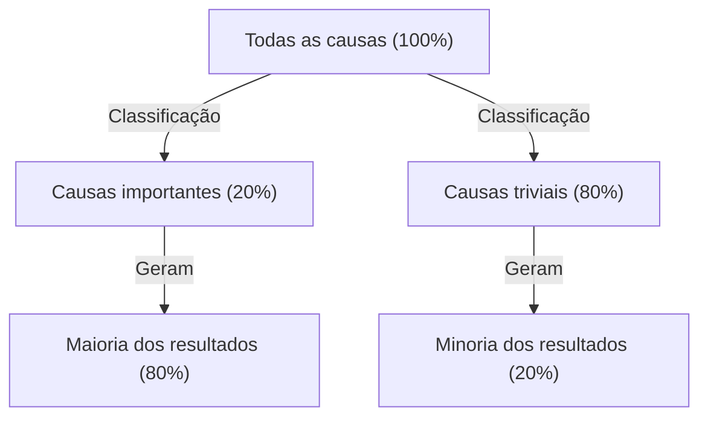
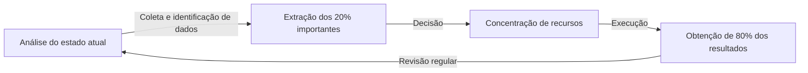

# Introdução: Por que o "Princípio de Pareto" é Indispensável Agora?

A sociedade moderna está repleta de informações e escolhas. Os profissionais de negócios lidam diariamente com um volume imenso de tarefas, e os líderes precisam selecionar as melhores opções em meio a inúmeras estratégias. Neste ambiente de alta complexidade, a abordagem de tentar "fazer tudo com perfeição" frequentemente resulta em esgotamento de recursos e fadiga.

Aqui, o "Princípio de Pareto (Regra 80/20)" demonstra um poder avassalador. Esta regra empírica simples, segundo a qual "80% dos resultados vêm de 20% das causas", mostra-nos claramente onde devemos concentrar nossa energia.

Neste artigo, aprofundaremos e explicaremos tudo sobre o Princípio de Pareto, desde a compreensão básica e contexto histórico até estratégias específicas de aplicação para aprimorar a produtividade pessoal e dos negócios, e até mesmo as limitações e equívocos dessa lei. Ao terminar de ler este artigo, você deverá ter adquirido uma lente poderosa para discernir "em que se concentrar e o que descartar".

## O Que é o Princípio de Pareto? Sua História e Essência

O Princípio de Pareto foi proposto pelo economista italiano Vilfredo Pareto, que atuou do final do século XIX ao início do século XX. Em um artigo publicado em 1896, ele estudou a distribuição da riqueza na Europa da época e descobriu um fato surpreendente. Era a distribuição desigual da riqueza, onde "cerca de 80% da riqueza total da sociedade pertencia aos 20% mais ricos".

Posteriormente, muitos pesquisadores confirmaram que esta distribuição assimétrica "80:20" se aplicava amplamente além da economia, abrangendo o mundo natural, os negócios e os fenômenos sociais. Na década de 1940, Joseph M. Juran, uma autoridade em controle de qualidade, aplicou essa lei ao mundo dos negócios e propôs o conceito de "poucos vitais (vital few) e muitos triviais (trivial many)". Isso formou a base do Princípio de Pareto nos negócios modernos.

### Ilustrando o Mecanismo da Lei

O núcleo do Princípio de Pareto é que **a relação entre "investimento (causa)" e "produção (resultado)" não é igual**. O diagrama abaixo ilustra de forma simples essa relação desigual.

A ideia em que tendemos a acreditar intuitivamente, de que "os resultados são proporcionais à quantidade de esforço (regra 1:1)", raramente se sustenta no mundo real. Na prática, um pequeno número de fatores tem um impacto decisivo nos resultados.

## Aplicação do Princípio de Pareto nos Negócios

A área onde o Princípio de Pareto tem o efeito mais dramático é a dos negócios. Para maximizar os lucros em um cenário de recursos limitados (tempo, dinheiro, pessoal), é necessário incorporar esta lei em todos os processos de negócios.

### 1. Estratégia de Vendas e Marketing

O exemplo mais conhecido da aplicação do Princípio de Pareto nos negócios é que "80% das vendas vêm de 20% dos principais clientes".

*   **Identificação dos 20% principais clientes fiéis:** As empresas devem primeiro usar os dados para identificar o grupo dos 20% principais clientes que geram a maior parte de suas vendas e lucros.
*   **Concentração de recursos:** Em vez de oferecer serviços igualmente a todos os clientes, a maior parte (80%) do orçamento de marketing e recursos de vendas deve ser focada em fornecer tratamento VIP e sucesso do cliente especial para os 20% melhores clientes, a fim de aumentar a fidelidade.
*   **Feedback para desenvolvimento de produtos:** Analisando detalhadamente o que os 20% principais clientes desejam e atualizando os produtos para atender às suas necessidades, é possível realizar as melhorias com o melhor custo-benefício.

### 2. Gestão de RH e Organização

O Princípio de Pareto também se manifesta claramente no desempenho organizacional. É a tendência de que "80% dos resultados da empresa são gerados por 20% dos melhores funcionários".

*   **Investimento em alto desempenho:** Manter a motivação dos 20% melhores funcionários e criar um ambiente onde possam maximizar suas capacidades (delegação de autoridade, remuneração, trabalho flexível, etc.) melhorará drasticamente a produtividade de toda a organização.
*   **Criação de um sistema de propagação de habilidades:** Ao extrair o conhecimento tácito e as características comportamentais dos 20% de funcionários excelentes e criar um sistema (manuais ou mentoria) para compartilhá-los com os 80% restantes, a organização como um todo se eleva.

### 3. Gestão de Estoque e Controle de Qualidade

*   **Gestão de estoque (Análise ABC):** Frequentemente, os 20% principais itens entre os produtos comercializados representam 80% das vendas totais. Esses itens cruciais (Categoria A) devem ser rigorosamente controlados para evitar a falta de estoque, enquanto os itens de baixa contribuição para as vendas (Categoria C) requerem decisões como reduzir a frequência de pedidos ou descontinuar a sua comercialização.
*   **Controle de qualidade (Correção de bugs):** No desenvolvimento de software, diz-se que "80% dos bugs e falhas do sistema são causados por 20% dos módulos (código)". Ao concentrar recursos de teste e refatoração nesses 20%, a qualidade pode ser melhorada de forma eficiente.

## Aplicação à Produtividade Pessoal e Gestão do Tempo

Não apenas nos negócios, mas também nos estilos de trabalho individuais e na vida diária, a adoção do Princípio de Pareto permite a prática do "Essencialismo (pensamento focado no que é essencial)".

### 1. Gestão de Tarefas: Identificando os "20% Importantes"

Suponha que você tenha 10 tarefas em sua lista de afazeres diária. De acordo com o Princípio de Pareto, apenas "2 (20%)" dessas tarefas realmente criarão valor e estarão diretamente ligadas ao cumprimento de seus objetivos.

Muitas pessoas tendem a pensar "vou começar com as tarefas simples para ganhar impulso", mas isso consome tempo e energia nos 80% triviais. Pessoas altamente produtivas enfrentam os 20% de tarefas mais importantes (as mais difíceis e as que trazem mais resultados) logo pela manhã, quando seus níveis de energia estão mais altos.

### 2. A Regra 80:20 na Aquisição de Habilidades

O Princípio de Pareto também é eficaz ao aprender um novo idioma, programação, um instrumento musical, etc.
É um fato que "80% das conversas diárias em um idioma são compostas pelos 20% das palavras usadas com mais frequência em todo o idioma". Portanto, antes de memorizar perfeitamente palavras raras e gramática complexa, praticar repetidamente e dominar os 20% básicos do núcleo é o caminho mais curto para o domínio.

### 3. Minimalismo Digital e Coleta de Informações

As pessoas modernas são bombardeadas com grandes quantidades de informações de mídias sociais e sites de notícias, mas "as informações que realmente têm um impacto positivo em sua vida e trabalho são menos de 20% de todas as fontes de informação".
Para obter resultados, é preciso coragem para excluir aplicativos desnecessários, cancelar assinaturas de newsletters de baixo valor e dedicar tempo apenas às 20% de fontes de informação de verdadeira qualidade (livros excelentes, revistas especializadas, mentores confiáveis, etc.).

## O Ciclo Prático do Princípio de Pareto

Aqui está um modelo não apenas para entender isso como conhecimento, mas para continuar aplicando a lei na prática.

1.  **Análise do estado atual (Medição e coleta de dados):** Primeiro, entenda os fatos com precisão. Com o que o tempo é gasto? De onde vêm as vendas? Uma análise baseada em dados, em vez de depender da intuição, é essencial.
2.  **Extração dos 20% importantes:** A partir dos dados coletados, identifique a "minoria crítica". Ao mesmo tempo, clarifique os "80% a serem descartados/cortados".
3.  **Concentração de recursos:** Com coragem, decida "o que não fazer (Not-to-do)". Despeje todo o tempo, dinheiro e esforço liberados nos 20% importantes extraídos.
4.  **Avaliação e Revisão:** O ambiente e as situações estão em constante mudança. Os "20% importantes" de outrora podem se tornar obsoletos, portanto, circule este modelo regularmente (por exemplo, trimestralmente) e continue ajustando o seu foco constantemente.

## Armadilhas e Precauções do Princípio de Pareto

O Princípio de Pareto é uma ferramenta extremamente poderosa, mas pode trazer efeitos colaterais perigosos se acreditado cegamente. É preciso ter muita cautela em relação aos seguintes pontos.

### 1. "80:20" Não é Uma Proporção Absoluta
Os números 80 e 20 são apenas guias baseados em regras empíricas e não constituem uma lei matemática exata. Dependendo da situação, pode ser "90:10" ou "70:30". O importante não é a "precisão dos números", mas reconhecer o "desequilíbrio entre causa e resultado".

### 2. Os 80% Restantes Não São "Totalmente Sem Valor"
Por exemplo, focar tanto nos "20% dos clientes excelentes que geram 80% das vendas" e abandonar completamente os 80% restantes de clientes acarreta o risco de prejudicar a reputação da empresa ou perder um segmento potencial que poderia se tornar de clientes excelentes no futuro. Além disso, no caso das linhas de produtos, não é raro que produtos de nicho (cauda longa) sustentem o charme e a expertise da marca.
O importante não é "descartar", mas sim "otimizar a proporção de alocação de recursos (estabelecer prioridades)".

### 3. Falta de Visão de Longo Prazo
O Princípio de Pareto é forte para a otimização com base em dados atuais, mas não gera inovação futura. As sementes para sustentar o negócio daqui a 5 anos podem estar adormecidas agora dentro das "atividades dos 80% que não geram lucros". Equilibrar a eficiência de curto prazo (aplicação rigorosa de 80:20) e a exploração de longo prazo (investir naquilo que parece inútil de propósito) é indispensável para o crescimento verdadeiramente sustentável.

## Aplicação Extrema: O "80/20 do 80/20"

Como uma abordagem de nível ainda mais avançado, existe a ideia de aplicar o Princípio de Pareto em uma estrutura aninhada.

O Princípio de Pareto aplica-se ainda mais aos "20% principais dos elementos". Ou seja, é uma concentração extrema onde 20% dos 20% (= 4% do total) geram os resultados de 80% dos 80% (= 64% do total) (A regra 64:4).

Se você encontrou os "20% mais importantes" no projeto em que está trabalhando, pergunte a si mesmo: "Dentro desses 20%, qual é o 'núcleo de 4%' que criará uma diferença ainda mais impressionante?". Se você conseguir estreitar o seu foco a esse ponto, a sua produtividade alcançará literalmente outro nível de dimensão.

## Conclusão: A Estética da Subtração

Temos a tendência de tentar resolver os problemas através da "adição". Aumentamos o número de produtos para aumentar as vendas, aumentamos as reuniões para que um projeto seja bem-sucedido e aumentamos as ferramentas para melhorar a produtividade.

No entanto, o que o Princípio de Pareto nos ensina é a estética da "subtração". Um verdadeiro avanço não vem de acrescentar algo, mas de remover o ruído dos 80% que não estão diretamente ligados aos resultados e refinar o sinal dos 20% essenciais.

A partir de hoje, tente reavaliar o que são os "20% importantes" em seu trabalho ou em sua vida. Não há necessidade de tornar tudo perfeito. Despeje sua melhor energia apenas nas coisas mais importantes. Este é o caminho mais seguro para obter resultados máximos com o mínimo de esforço, e para levar uma vida mais rica e significativa.
