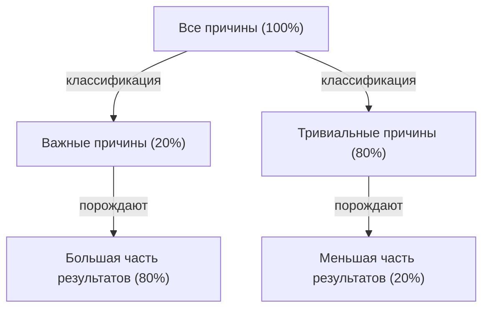

# Введение: Почему «Закон Парето» сегодня абсолютно необходим?

Современное общество переполнено информацией и выбором. Деловые люди ежедневно утопают в огромном количестве задач, а руководителям приходится выбирать оптимальные стратегии из бесчисленного множества вариантов. В такой крайне сложной среде подход «сделать всё идеально» часто приводит к истощению ресурсов и выгоранию.

Именно здесь подавляющую силу демонстрирует «закон Парето (правило 80/20)». Это простое эмпирическое правило, гласящее, что «80% результатов проистекают из 20% причин», ясно показывает нам, на чем следует сосредоточить нашу энергию.

В этой статье мы подробно рассмотрим закон Парето, начиная с базового понимания и исторического контекста, заканчивая конкретными стратегиями применения для повышения продуктивности в бизнесе и личной жизни, а также обсудим ограничения и заблуждения, связанные с этим правилом. К тому времени, когда вы закончите читать эту статью, у вас появится мощная призма, позволяющая определить, «на чем сосредоточиться и от чего отказаться».

## Что такое закон Парето? Его история и суть

Закон Парето был предложен итальянским экономистом Вильфредо Парето (Vilfredo Pareto), который работал в конце 19-го и начале 20-го веков. В своей статье, опубликованной в 1896 году, он исследовал распределение богатства в Европе того времени и обнаружил удивительный факт. Это было неравномерное распределение богатства: «около 80% всего богатства общества принадлежит верхним 20% богатых людей».

Впоследствии многие исследователи подтвердили, что это асимметричное распределение «80/20» широко применяется не только в экономике, но и в природе, бизнесе и всех сферах социальных явлений. В 1940-х годах Джозеф Джуран (Joseph M. Juran), авторитет в области управления качеством, применил этот закон к миру бизнеса и предложил концепцию «жизненно важного меньшинства (vital few) и тривиального большинства (trivial many)». Это стало основой закона Парето в современном бизнесе.

### Иллюстрация механизма закона

Суть закона Парето заключается в том, что **отношение между «вкладом (причиной)» и «отдачей (результатом)» не является равным**. Следующая схема просто показывает эту неравновесную взаимосвязь.

Идея о том, что «результаты пропорциональны количеству усилий (закон 1:1)», в которую мы интуитивно склонны верить, в реальном мире почти никогда не работает. На самом деле небольшое количество элементов оказывает решающее влияние на результаты.

## Применение закона Парето в бизнесе

Наиболее впечатляющий эффект закон Парето приносит в сфере бизнеса. Чтобы максимизировать прибыль в условиях ограниченных ресурсов (времени, средств, человеческих ресурсов), этот закон необходимо интегрировать в каждый бизнес-процесс.

### 1. Стратегия продаж и маркетинга

Самым известным примером применения закона Парето в бизнесе является утверждение: «80% продаж обеспечивают 20% лучших клиентов».

*   **Выявление верхних 20% премиальных клиентов:** Компании должны сначала определить по данным верхние 20% клиентов, которые приносят большую часть их доходов или прибыли.
*   **Концентрация ресурсов:** Вместо того чтобы предоставлять одинаковые услуги всем клиентам, подавляющую часть маркетинговых бюджетов и ресурсов продаж (80%) следует сосредоточить на повышении лояльности путем предоставления VIP-обслуживания или особого подхода (Customer Success) этим лучшим 20% клиентов.
*   **Обратная связь для разработки продукта:** Тщательный анализ того, чего хотят верхние 20% клиентов, и обновление продуктов в соответствии с их потребностями позволяет осуществлять наиболее экономически эффективные улучшения.

### 2. Управление персоналом и организацией

В организационной деятельности закон Парето также проявляется очень четко. Это тенденция к тому, что «80% результатов компании создаются 20% лучших сотрудников».

*   **Инвестиции в высокоэффективных сотрудников (High Performers):** Поддержание мотивации верхних 20% сотрудников и создание среды, в которой они могут полностью реализовать свой потенциал (делегирование полномочий, вознаграждение, гибкий график работы и т.д.), значительно повысит производительность всей организации.
*   **Создание системы передачи навыков:** Извлечение неявных знаний и поведенческих характеристик, которыми обладают 20% талантливых сотрудников, и создание механизмов (составление руководств или наставничество) для их передачи остальным 80% сотрудников приведет к повышению общего уровня организации.

### 3. Управление запасами и контроль качества

*   **Управление запасами (ABC-анализ):** Часто случается так, что верхние 20% ассортимента товаров составляют 80% от общего объема продаж. Эти важные товары (класс A) должны строго контролироваться, чтобы не допустить их отсутствия на складе, тогда как для товаров с низким вкладом в продажи (класс C) необходимо принимать решения, такие как снижение частоты заказов или прекращение их продажи.
*   **Контроль качества (исправление ошибок):** При разработке программного обеспечения часто говорят, что «80% системных ошибок и багов вызваны 20% модулей (кода)». Сосредоточение ресурсов на тестирование и рефакторинг на этих 20% позволяет эффективно повысить качество.

## Применение для личной продуктивности и тайм-менеджмента

Применяя закон Парето не только в бизнесе, но и в личной работе и повседневной жизни, вы сможете практиковать «эссенциализм (мышление, сфокусированное на существенном)».

### 1. Управление задачами: Определение «важных 20%»

Представьте, что в вашем списке дел на день (ToDo list) 10 задач. Согласно закону Парето, только «всего 2 задачи (20%)» действительно принесут ценность и напрямую приведут к достижению цели.

Многие люди склонны думать: «Давайте начнем с простых задач, чтобы набрать темп», но в этом случае их время и энергия тратятся на тривиальные 80%. Высокопродуктивные люди берутся за самые важные 20% задач (самые сложные задачи, которые принесут наибольшие результаты) рано утром, когда их уровень энергии максимален.

### 2. 80/20 в освоении навыков

Закон Парето также эффективен при изучении новых языков, программирования, музыкальных инструментов и так далее.
Существует факт: «80% повседневной речи на любом языке состоит из 20% наиболее часто используемых слов». Поэтому, прежде чем пытаться идеально выучить редкие слова или сложную грамматику, тщательное повторение и отработка базовых 20% будет самым коротким путем к совершенствованию.

### 3. Цифровой минимализм и сбор информации

Современные люди подвергаются воздействию огромного количества информации из социальных сетей и новостных сайтов, но «информация, которая действительно оказывает положительное влияние на вашу жизнь и работу, составляет менее 20% от всех источников информации».
Чтобы добиться результатов, вам нужно иметь мужество удалять ненужные приложения, отписываться от малополезных рассылок и уделять время только действительно качественным 20% источников информации (отличным книгам, специализированным журналам, надежным наставникам).

## Цикл применения закона Парето

Вместо того чтобы просто понимать это в теории, мы представим фреймворк, который поможет вам постоянно применять этот закон на практике.

1.  **Анализ текущей ситуации (измерение и сбор данных):** Во-первых, точно поймите факты. На что тратится время? Откуда приходят продажи? Обязательно проводить анализ на основе данных, а не полагаться на интуицию.
2.  **Выделение важных 20%:** По собранным данным определите «критически важное меньшинство». В то же время, четко определите «80%, которые следует отбросить или сократить».
3.  **Концентрация ресурсов:** Имей мужество решить, что «вы не будете делать (Not-to-do)». Вложите все освободившееся время, деньги и усилия в выбранные важные 20%.
4.  **Оценка и пересмотр:** Окружающая среда и ситуации постоянно меняются. То, что когда-то было «важными 20%», может устареть, поэтому вам следует регулярно (например, ежеквартально) повторять этот цикл, чтобы всегда корректировать свой фокус.

## Подводные камни и меры предосторожности закона Парето

Закон Парето является очень мощным инструментом, но слепая вера в него может иметь опасные побочные эффекты. Вам необходимо обратить особое внимание на следующие моменты.

### 1. «80/20» не является абсолютным соотношением
Цифры 80 и 20 — это лишь ориентир, основанный на эмпирическом правиле, а не математически строгое правило. В зависимости от ситуации это может быть «90/10» или «70/30». Важна не «точность цифр», а признание «непропорциональности причин и следствий».

### 2. Остальные 80% не являются «абсолютно бесполезными»
Например, если вы сосредоточитесь только на «20% премиальных клиентов, приносящих 80% продаж», и полностью откажетесь от оставшихся 80% клиентов, вы рискуете нанести ущерб репутации вашей компании и упустить потенциальных клиентов, которые в будущем могли бы стать премиальными. Кроме того, в ассортименте продукции часто встречаются случаи, когда нишевые товары (длинный хвост) поддерживают специализацию и привлекательность бренда.
Суть не в том, чтобы «отбросить», а в том, чтобы «оптимизировать соотношение распределения ресурсов (расставить приоритеты)».

### 3. Отсутствие долгосрочной перспективы
Закон Парето отлично подходит для оптимизации на основе текущих данных, но он не порождает будущих инноваций. Вполне возможно, что в «80% деятельности, не приносящей прибыли» сейчас, кроются семена, которые поддержат бизнес через пять лет. Баланс между краткосрочной эффективностью (полное соблюдение 80/20) и долгосрочными исследованиями (инвестиции в вещи, которые на первый взгляд кажутся бесполезными) необходим для действительно устойчивого роста.

## Высшее применение: «80/20 от 80/20»

Как более продвинутый подход, существует концепция применения закона Парето по принципу вложенности.

Даже среди «топ-20% элементов» все еще применяется закон Парето. Другими словами, 20% от 20% (= 4% от общего числа) производят 80% от 80% результатов (= 64% от общего числа). Это экстремальная концентрация (закон 64/4).

Если вы нашли «самые важные 20%» в проекте, над которым сейчас работаете, спросите себя еще раз: «Что является тем "ядром в 4%" среди этих 20%, которое создаст подавляющую разницу?». Если вы сможете сузить свой фокус до такой степени, ваша продуктивность буквально выйдет на совершенно новый уровень.

## Заключение: Эстетика вычитания

Мы склонны пытаться решить проблемы путем «сложения». Мы увеличиваем количество продуктов для повышения продаж, увеличиваем количество встреч для успеха проекта и добавляем новые инструменты для повышения производительности.

Однако закон Парето учит нас «эстетике вычитания». Настоящий прорыв происходит не за счет добавления чего-либо, а за счет устранения 80% шума, который не приводит напрямую к результату, и оттачивания существенных 20% сигнала.

С сегодняшнего дня попробуйте еще раз определить, что является вашими «важными 20%» в работе и жизни. Вам не нужно делать все идеально. Просто вложите свою лучшую энергию в самые важные вещи. Это самый надежный путь к достижению максимальных результатов с минимальными усилиями и к жизни, полной смысла и богатства.
