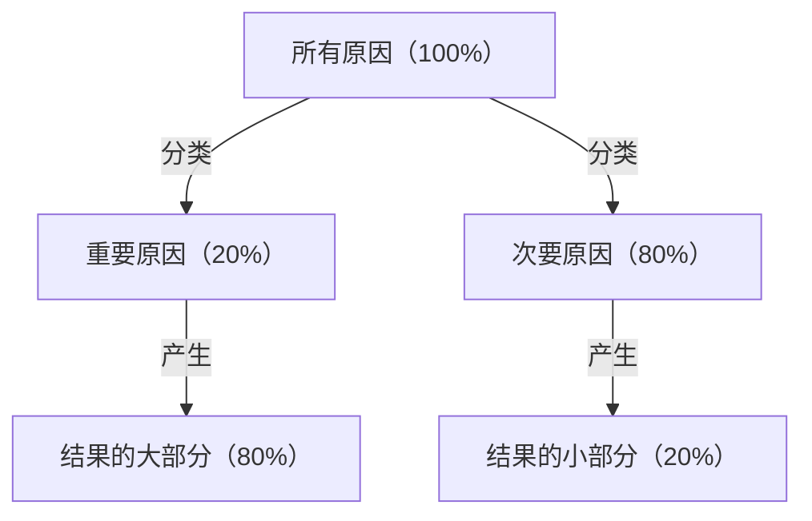
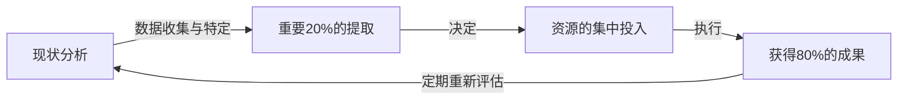

# 引言：为什么现在“帕累托法则”不可或缺？

现代社会充满了信息和选择。商务人士每天被庞大的任务追赶，经营者需要从无数的战略选项中选出最佳方案。在这样高度复杂的环境中，“完美完成所有事”的方法，往往会导致资源的枯竭和疲惫。

在这里能发挥压倒性威力的是“帕累托法则（80:20法则）”。“80%的结果，由20%的原因产生”这一简单的经验法则，明确地告诉我们应该把精力集中在哪里。

本文将从帕累托法则的基础理解开始，深入探讨其历史背景、在商业和个人生产力提升中的具体应用战略，乃至该法则的局限性与误区，进行全面解说。读完这篇文章时，你应该会获得一个强大的镜头，看清“应该集中精力做什么，应该舍弃什么”。

## 什么是帕累托法则？其历史与本质

帕累托法则是由活跃于19世纪末到20世纪初的意大利经济学家维尔弗雷多·帕累托（Vilfredo Pareto）提出的。他在1896年发表的论文中，研究了当时欧洲的财富分布，发现了一个惊人的事实。那就是“整个社会约80%的财富，被前20%的富裕阶层所拥有”的财富偏态分布。

此后，这种“80:20”的不对称分布被许多研究人员证实，它超越了经济学范畴，广泛适用于自然界、商业和社会现象的各个领域。在20世纪40年代，质量管理权威约瑟夫·朱兰（Joseph M. Juran）将该法则应用于商业领域，提出了“重要的少数（vital few）和琐碎的多数（trivial many）”的概念。这构成了现代商业中帕累托法则的基础。

### 图解法则的机制

帕累托法则的核心在于，**“投入（原因）”与“产出（结果）”的关系是不均等的**。下图简单地展示了这种不均衡的关系。

我们直觉上容易相信的“成果与努力量成正比（1:1法则）”的思维方式，在现实世界中几乎不成立。实际上，少数要素对结果起着决定性的影响。

## 帕累托法则在商业中的应用

帕累托法则能带来最显著效果的是商业领域。在资源（时间、资金、人才）有限的情况下为了最大化利润，必须将这个法则融入所有的业务流程中。

### 1. 销售与营销战略

在商业中最广为人知的帕累托法则应用实例是：“80%的销售额由前20%的客户带来”。

*   **识别前20%的优质客户：** 企业必须首先从数据中识别出带来公司大部分销售额和利润的前20%的客户群。
*   **集中投入资源：** 而不是对所有客户提供同等的服务，而是将大部分（80%）营销预算和销售资源集中在这前20%的客户上，提供VIP待遇或特殊的客户成功服务，以提高他们的忠诚度。
*   **对产品开发的反馈：** 彻底分析前20%的客户到底需要什么，并根据他们的需求更新产品，可以实现最高性价比的改善。

### 2. 人事与组织管理

在组织的绩效中，帕累托法则也表现得淋漓尽致。即“公司80%的成果由前20%的优秀员工产生”的趋势。

*   **对高绩效者的投资：** 维持前20%员工的动力，为他们提供能最大限度发挥实力的环境（授权、薪酬、灵活的工作方式等），将使整个组织的生产力产生飞跃性的提升。
*   **技能传播机制的建立：** 提取20%优秀人才所拥有的隐性知识和行为特征，并建立将其分享给其余80%员工的机制（手册化或导师制），从而实现整个组织底蕴的提升。

### 3. 库存管理与质量管理

*   **库存管理（ABC分析）：** 在经营的商品中，往往前20%的商品占了总销售额的80%。需要严密管理这些重要商品（A类）以绝对防止缺货；对于对销售额贡献低的商品（C类），则需要做出减少订货频率或停止销售等判断。
*   **质量管理（Bug修复）：** 在软件开发中，据说“系统中80%的Bug或缺陷，源于全体20%的模块（代码）”。将测试和重构的资源集中在这20%上，可以高效地提升质量。

## 个人生产力与时间管理的应用

不仅是商业，在个人的工作方式和日常生活中引入帕累托法则，也能实践“本质主义（专注于本质事物的思维）”。

### 1. 任务管理：识别“重要的20%”

假设每天的待办事项列表（ToDo List）里有10个任务。根据帕累托法则，其中真正创造价值并直接有助于达成目标的任务，仅仅只有“2个（20%）”。

许多人往往认为“先从简单的任务开始做，以获取动力”，但这反而让琐碎的80%占据了时间和精力。高生产力的人，会在一天中精力水平最高的早晨，首先着手处理那最重要的20%的任务（难度最高、最能带来成果的任务）。

### 2. 技能学习中的80:20

在学习新语言、编程、乐器等时，帕累托法则同样有效。
事实是“日常会话中80%的内容，由全体中最常用的20%的单词构成”。因此，在完美掌握冷门单词和复杂语法之前，首先彻底反复练习作为核心的那20%的基础，是取得进步的最短路线。

### 3. 数字极简主义与信息收集

现代人从社交网络（SNS）和新闻网站中接收了大量信息，但“真正对自己的生活和工作产生积极影响的信息，不到所有信息源的20%”。
为了取得成果，需要有勇气删除不必要的应用、退订价值不高的邮件订阅，并仅将时间花在真正高质量的那20%信息源（优秀的书籍、专业杂志、值得信赖的导师等）上。

## 帕累托法则的实践循环

这不仅是理论理解，以下介绍可以让你在实际中持续应用该法则的框架。

1.  **现状分析（测量和数据收集）：** 首先准确掌握事实。时间用在了哪里？销售额从何而来？不能凭直觉，基于数据的分析是必不可少的。
2.  **重要20%的提取：** 从收集到的数据中，识别出“关键的少数”。同时，明确“应该舍弃、应该削减的80%”。
3.  **资源的集中投入：** 拿出勇气，决定“不做的事情（Not-to-do）”。将腾出的时间、资金、精力全力投入到提取出的重要20%中。
4.  **评估与重新评估：** 环境和情况总在变化。曾经的“重要20%”也可能过时，因此需要定期（例如每季度）循环这一流程，并持续调整焦点。

## 帕累托法则的陷阱与注意事项

帕累托法则是一个非常强大的工具，但盲目迷信也可能带来危险的副作用。必须充分注意以下几点。

### 1. “80:20”不是绝对比例
80和20这两个数字终究是基于经验法则的参考，并非数学上严密的法则。根据情况的不同，有时可能是“90:10”，有时也可能是“70:30”。重要的不是“数字的准确性”，而是认识到“原因与结果的不平衡性”。

### 2. 剩下的80%并非“毫无价值”
例如，如果过于集中在“产生80%销售额的20%优质客户”上，而将剩下80%的客户完全抛弃，就有可能导致企业声誉下降，或失去未来可能成长为优质客户的潜在群体。此外，在商品阵容中，小众商品（长尾商品）支撑着品牌的专业性和魅力的案例也不在少数。
重点不在于“抛弃”，而是“优化资源分配比例（张弛有度）”。

### 3. 缺乏长期视角
帕累托法则在基于当前数据的优化上很强，但并不产生未来的创新。在目前“不产生利润的80%的活动”中，可能正沉睡着支撑5年后业务的种子。短期效率化（彻底贯彻80:20）与长期探索（刻意对看似无用的事物进行投资）之间的平衡，对真正可持续的增长是不可或缺的。

## 终极应用：“80/20中的80/20”

作为更高阶的方法，有一种嵌套结构应用帕累托法则的思路。

在“前20%的要素”中，帕累托法则也同样适用。也就是说，20%中的20%（=全体的4%），能产生80%中的80%（=全体的64%）的成果，这是一种极端的集中（64:4法则）。

如果你在当前正在进行的项目中找到了“最重要的20%”，请进一步扪心自问：“在这20%中，能产生更为压倒性差异的‘4%的核心’是什么？”。如果能将焦点缩减到这种程度，你的生产力将切实到达一个截然不同的层面。

## 结语：做减法的美学

我们倾向于通过“做加法”来解决问题。为了提高销售额而增加商品数量，为了项目成功而增加会议，为了提高生产力而增加工具。

然而，帕累托法则教给我们的是“做减法”的美学。真正的突破，不是靠添加什么，而是通过去除不直接产生结果的80%的噪音，并锤炼那本质的20%的信号来带来的。

从今天起，试着重新审视一下你的工作和生活中“重要的20%”是什么。没有必要将一切做到完美。请把你最强的能量，仅仅倾注在最重要的事情上。这才是以最小的努力获得最大的结果，度过更加丰富、更有意义人生的最可靠途径。
