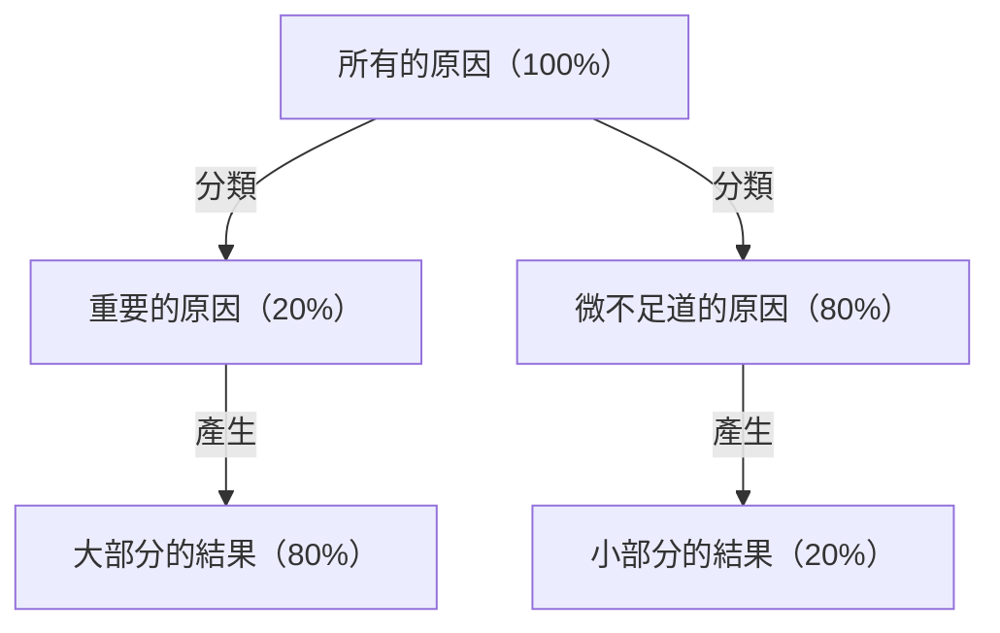
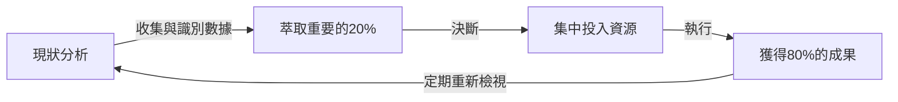

# 前言：為什麼「帕雷托法則」在現在不可或缺？

現代社會充滿了資訊與選擇。商務人士每天被龐大的任務追著跑，經營者必須從無數的策略選項中挑選出最佳方案。在這樣高度複雜的環境中，「想要把每件事都完美做好」的做法，往往只會導致資源枯竭與身心俱疲。

在這裡能發揮壓倒性威力的，就是「帕雷托法則（80:20法則）」。「80%的結果是由20%的原因所產生」，這個簡單的經驗法則明確地指出了我們應該將精力集中在哪裡。

本篇文章將從帕雷托法則的基礎理解開始，徹底深究其歷史背景、在商業與個人生產力提升上的具體應用策略，甚至探討該法則的侷限性與誤解。當您讀完這篇文章時，您應該已經獲得了一個強大的鏡頭，能夠看清「該集中於什麼，又該捨棄什麼」。

## 什麼是帕雷托法則？其歷史與本質

帕雷托法則是由活躍於19世紀末至20世紀初的義大利經濟學家維弗雷多·帕雷托（Vilfredo Pareto）所提出。他在1896年發表的論文中，研究了當時歐洲的財富分配情況，並發現了一個驚人的事實。那就是「社會整體約80%的財富，被前20%的富裕階層所擁有」的財富分配不均現象。

隨後，許多研究人員證實了這個「80:20」的不對稱分佈，跨越了經濟學的範疇，廣泛適用於自然界、商業以及社會現象的各個領域。在1940年代，品質管理權威約瑟夫·朱蘭（Joseph M. Juran）將此法則應用於商業世界，並提出了「關鍵的少數（vital few）與微不足道的多數（trivial many）」的概念。這成為了現代商業中帕雷托法則的基礎。

### 圖解法則的機制

帕雷托法則的核心在於，**「投入（原因）」與「產出（結果）」的關係並不對等**。以下的圖解簡單地呈現了這種不均衡的關係。

我們直覺上往往相信「付出多少努力就會有多少成果（1:1法則）」，這種想法在現實世界中幾乎不成立。事實上，少數的要素對結果產生了決定性的影響。

## 帕雷托法則在商業上的應用

帕雷托法則能帶來最戲劇性效果的地方就是商業領域。在資源（時間、資金、人才）有限的情況下，為了使利益最大化，必須將此法則融入到所有的業務流程中。

### 1. 業務與行銷策略

在商業中最廣為人知的帕雷托法則應用例子是「80%的營業額是由前20%的客戶所帶來的」。

*   **找出前20%的優良客戶：** 企業必須先從數據中找出為公司帶來大半營業額與利潤的前20%客戶群。
*   <strong>集中投入資源：</strong>與其對所有客戶提供同等的服務，不如將大部分（80%）的行銷預算與業務資源集中在這前20%的客戶上，提供VIP待遇或特別的客戶成功服務，以提高忠誠度。
*   **對產品開發的回饋：** 徹底分析前20%客戶的需求，並根據他們的需求來更新產品，這將是成本效益最高的改善方式。

### 2. 人事與組織管理

在組織的績效中，帕雷托法則也明顯地呈現。「公司80%的成果是由前20%的優秀員工所創造的」。

*   **投資高績效員工：** 維持前20%員工的動力，並建立讓他們能發揮最大實力的環境（如權力下放、報酬、彈性工作等），能大幅提升整個組織的生產力。
*   **建立技能傳承的機制：** 萃取這20%優秀人才所擁有的隱性知識與行為特徵，並建立將其分享給其餘80%員工的機制（如手冊化或導師制度），以提升組織整體的底蘊。

### 3. 庫存管理與品質管理

*   **庫存管理（ABC分析）：** 在經營的商品中，前20%的品項往往佔了總營業額的80%。必須嚴格管理這些重要品項（A級）以防止缺貨，而對營業額貢獻度低的品項（C級），則需要做出減少訂貨頻率或停止販售等判斷。
*   **品質管理（修正錯誤）：** 在軟體開發中，常說「系統中80%的錯誤或缺陷，起因於整體20%的模組（程式碼）」。將測試或重構的資源集中在那20%上，可以有效率地提升品質。

## 在個人生產力與時間管理上的應用

不僅是商業，在個人的工作方式或日常生活中，透過引入帕雷托法則，也能實踐「本質思考（專注於本質事物的思考）」。

### 1. 任務管理：看清「重要的20%」

假設每天的待辦清單上有10個任務。依照帕雷托法則，其中真正能創造價值、直接連結到目標達成的任務「只有區區2個（20%）」。

許多人往往想著「先從簡單的任務開始處理來帶動氣勢」，但這會讓時間和精力被微不足道的80%給奪走。生產力高的人，會在一整天中精力最充沛的早晨，著手處理最重要的20%任務（難度最高、最能帶來成果的任務）。

### 2. 技能學習中的80:20

在學習新語言、程式設計或樂器時，帕雷托法則同樣有效。
有一個事實是：「語言中80%的日常對話，是由整體中最常被使用的20%單字所組成的」。因此，與其完美地記住冷門單字或複雜文法，不如先徹底反覆練習核心的20%基礎，這將是進步的最短捷徑。

### 3. 數位極簡主義與資訊收集

現代人每天從社群媒體和新聞網站接收大量資訊，但「真正對自己的人生或工作有正面影響的資訊，不到所有資訊來源的20%」。
為了產出成果，我們必須有勇氣刪除不需要的應用程式、退訂低價值的電子報，並只將時間花在真正高品質的20%資訊來源（如優秀的書籍、專業雜誌、值得信賴的導師等）上。

## 帕雷托法則的實踐循環

為了不僅是將其作為知識來理解，而是持續在實際中應用，以下介紹一個實踐框架。

1.  **現狀分析（測量與收集數據）：** 首先要準確掌握事實。時間花在哪裡？營業額從哪裡來？不可依靠直覺，基於數據的分析是不可不可缺的。
2.  **萃取重要的20%：** 從收集到的數據中，找出「關鍵的少數」。同時，明確指出「應該捨棄、刪減的80%」。
3.  **集中投入資源：** 拿出勇氣，決定「不去做的事（Not-to-do）」。將空出來的時間、資金與精力，全力投注在萃取出的重要20%上。
4.  **評估與重新檢視：** 環境與狀況總是隨時在改變。曾經的「重要20%」也可能變得過時，因此必須定期（例如每季）重複這個循環，不斷地調整焦點。

## 帕雷托法則的陷阱與注意事項

帕雷托法則雖然是一個非常強大的工具，但盲目相信也可能帶來危險的副作用。必須充分注意以下幾點。

### 1. 「80:20」並非絕對的比例
80與20這兩個數字充其量只是基於經驗法則的參考值，並不是數學上嚴謹的法則。根據情況的不同，有時可能是「90:10」，有時也可能是「70:30」。重要的不是「數字的準確度」，而是認知到「原因與結果的不均衡性」。

### 2. 剩下的80%並非「毫無價值」
例如，如果過度專注於「創造80%營業額的20%優良客戶」，而完全捨棄剩下80%的客戶，將會面臨企業聲譽下滑，或是錯失未來可能成長為優良客戶的潛力客群等風險。此外，在商品陣容中，利基商品（長尾）支撐著品牌專業度與魅力的情況也不在少數。
重要的是不是「捨棄」，而是「最佳化資源的分配比例（有所取捨）」。

### 3. 缺乏長遠的眼光
帕雷托法則在基於現有數據進行最佳化時很強大，但它並不能孕育出未來的創新。在現在「不產生利潤的80%活動」中，可能正沉睡著支撐5年後業務的種子。在短期效率化（徹底執行80:20）與長期探索（投資看似無用的事物）之間取得平衡，對於真正永續的成長來說是不可或缺的。

## 終極的應用：「80/20中的80/20」

作為更高階的方法，還有一種將帕雷托法則巢狀應用的思考方式。

在「前20%的要素」中，也能進一步應用帕雷托法則。也就是說，20%中的20%（＝整體的4%），會創造出80%中的80%（＝整體的64%）的成果，這是一種極端的集中（64:4法則）。

如果您在目前參與的專案中找到了「最重要的20%」，請進一步問自己：「在那20%當中，能產生壓倒性差異的『4%核心』又是什麼？」如果能將焦點縮小到這個程度，您的生產力將會到達字面意義上不同次元的等級。

## 結語：減法的減法美學

我們傾向於透過「加法」來解決問題。為了提高營業額而增加商品數量，為了讓專案成功而增加會議，為了提升生產力而增加工具。

然而，帕雷托法則教導我們的是「減法」的美學。真正的突破並非來自於增添什麼，而是透過去除與結果不直接相關的80%雜訊，並磨練本質性的20%訊號所帶來的。

從今天起，試著重新審視您的工作與生活中，什麼是「重要的20%」。您不需要將每件事都做到完美。請將您最棒的能量，投注在最重要的事情上。這才是以最小努力獲取最大成果，並過上更豐富、更有意義的人生的最確定途徑。
