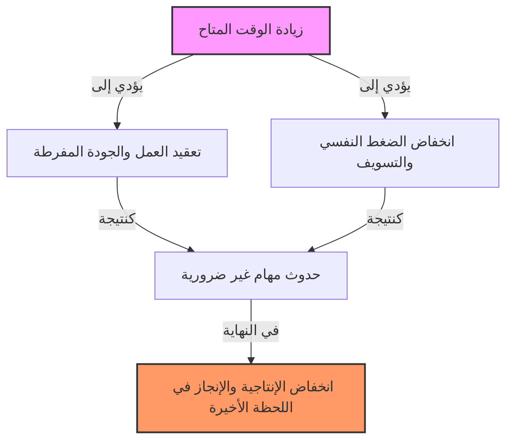
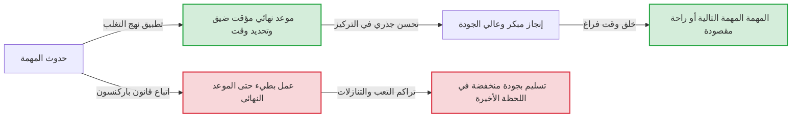

# مقدمة: لماذا ننهي أعمالنا دائمًا في اللحظات الأخيرة قبل الموعد النهائي؟

المشاريع التي بدأناها معتقدين "لا يزال أمامنا أسبوع، لا بأس"، لماذا لا تنتهي إلا في وقت متأخر من ليلة اليوم الأخير؟ لطالما كنا ننجز واجباتنا المدرسية الصيفية ونحن نبكي في 31 أغسطس. إذا تم تحديد وقت الاجتماع بساعة واحدة، فإن النقاش الذي قد ينتهي في 5 دقائق يستمر لمدة ساعة كاملة...
هذه الظواهر التي اختبرها الجميع في وقت ما، لا تعني أبدًا أن إرادتك ضعيفة أو أن قدراتك منخفضة. يمكن تفسير ذلك من خلال قانون عالمي يستهدف بذكاء مبادئ السلوك البشري والتنظيمي يسمى "قانون باركنسون (Parkinson’s Law)".

في هذا المقال، سنقدم شرحًا مفصلاً بآلاف الكلمات حول قانون باركنسون هذا، بدءًا من خلفيته التاريخية وآلياته النفسية، وصولاً إلى كيفية الهروب من هذه اللعنة في الأعمال المعاصرة والحياة اليومية، وتحسين الإنتاجية بشكل جذري. يجب أن يكون دليلاً كاملاً لا غنى عن قراءته لكل من يعاني من إدارة الوقت، إدارة المشاريع، وحتى إدارة الشؤون المالية الشخصية.

---

# القانون الأول: "العمل يتمدد ليملأ الوقت المتاح لإنجازه"

القانون الأول هو الأكثر شهرة ويعتبر جوهر قانون باركنسون. يُعبر عنه باللغة الإنجليزية كالتالي: **"Work expands so as to fill the time available for its completion."**

## الخلفية التاريخية وسيريل نورثكوت باركنسون

تم اقتراح هذا القانون لأول مرة في عام 1955 في مقال نُشر في المجلة الاقتصادية "The Economist" بقلم سيريل نورثكوت باركنسون، المؤرخ وعالم السياسة البريطاني. في وقت لاحق، في عام 1958، تم نشره ككتاب بعنوان "قانون باركنسون: السعي وراء التقدم"، وأصبح من أفضل الكتب مبيعًا على مستوى العالم.

راقب باركنسون عن كثب بيانات البيروقراطية البريطانية (خاصة وزارة البحرية والمكتب الاستعماري). من المدهش أنه منذ الحرب العالمية الأولى، على الرغم من الانخفاض الهائل في عدد السفن الحربية والجنود في البحرية الإمبراطورية البريطانية، استمر عدد الموظفين الإداريين في وزارة البحرية في الزيادة عامًا بعد عام. وبالمثل في المكتب الاستعماري، على الرغم من انخفاض عدد المستعمرات التي يجب إدارتها، زاد عدد الموظفين.
من هنا، استنتج باركنسون مرض البيروقراطية حيث "يستمر حجم العمل وعدد المسؤولين في الازدياد بغض النظر عن بعضهما البعض".

## الآلية النفسية: لماذا يمتلئ الوقت؟

وراء تمدد العمل ليملأ الوقت المتاح، هناك تحيزات نفسية بشرية قوية.

1. **وهم التعقيد**
   عندما يتوفر الكثير من الوقت، يميل البشر دون وعي إلى اعتبار العمل "مهمًا ومعقدًا". المهام التي يمكن إنجازها بتقرير بسيط، يتم زخرفتها بشكل مفرط أو تُضاف إليها بيانات غير ضرورية، مما يزيد من صعوبة المهمة بأنفسهم.
2. **فخ المثالية**
   طالما أن الوقت يسمح، فإنهم يستمرون في المراجعة معتقدين أنه "يمكن جعله أفضل". وفقًا لقانون باريتو (قاعدة 80:20)، فإن الوقت اللازم لتحقيق 80% من النتائج هو 20%، لكنهم يهدرون 80% من الوقت في محاولة جعل جودة الـ 20% المتبقية مثالية.
3. **التسويف (المماطلة)**
   عندما يكون الموعد النهائي بعيدًا، ينخفض دافع الإنسان لاتخاذ إجراء. الشعور بالأمان بأن "لا يزال هناك وقت" يسلب الشعور بالإلحاح، مما يؤدي في النهاية إلى عدم العمل بجد حتى اللحظة الأخيرة.

## أمثلة ملموسة في الأعمال الحديثة

- **إطالة الاجتماعات**: إذا تم تخصيص إطار زمني لاجتماع مدته ساعة، حتى بالنسبة للمواضيع التي يمكن استنتاجها في 15 دقيقة، يتم تمديد المناقشات غير الضرورية والأحاديث الجانبية لاستهلاك الساعة كاملة.
- **استهلاك الميزانية**: في نهاية السنة المالية، ظاهرة شراء معدات غير ضرورية أو إطلاق مشاريع متسرعة من أجل إنفاق الميزانية المتبقية.
- **تطوير البرمجيات**: إذا كانت مهلة التسليم طويلة جدًا، سيحاول فريق التطوير تنفيذ ميزات زائدة (زحف الميزات) معتقدين أنها "قد تكون مفيدة"، ونتيجة لذلك يتم الضغط على وقت إصلاح الأخطاء في الميزات الأساسية.

---

# [رسم توضيحي] آلية قانون باركنسون

دعونا نتحقق من مدى رعب قانون باركنسون ليس فقط بالكلمات بل بصريًا أيضًا. يوضح الرسم البياني أدناه كيف يؤدي الوقت المتاح إلى تضخم العمل وانخفاض الإنتاجية.

هنا يكمن التناقض: فكلما كان مورد الوقت متوفرًا بكثرة، فإنه لا يُستخدم بكفاءة، بل يصبح بؤرة لخلق الهدر.

---

# القانون الثاني: "النفقات تتمدد لتصل إلى حجم الدخل"

لا يقتصر قانون باركنسون على إدارة الوقت (حجم العمل) فحسب، بل له قانون قوي في إدارة الموارد المالية والمال أيضًا. هذا هو القانون الثاني.

## زحف أسلوب الحياة (تضخم مستوى المعيشة)

على الرغم من زيادة راتبك، لسبب ما لا يتبقى لك أي أموال. كنت أنوي ادخار المال لأنني حصلت على مكافأة، لكن قبل أن أدرك ذلك، كنت قد أنفقتها بالكامل. هذا هو المثال النموذجي للقانون الثاني.
عندما يزداد دخل الناس، فإنهم يرفعون مستوى معيشتهم دون وعي بشكل يتناسب معه. مثل "الذهاب إلى مطعم أفضل قليلاً"، "الانتقال إلى شقة بإيجار أعلى درجة"، "زيادة خدمات الاشتراك". في علم النفس الاقتصادي، يُطلق على هذا اسم "زحف أسلوب الحياة".

## فخ إدارة الميزانية في الشركات

ينطبق هذا القانون ليس فقط على الشؤون المالية الشخصية ولكن أيضًا على الشؤون المالية للشركات والدول. بمجرد تخصيص الميزانيات لكل قسم، سيحاول المديرون إنفاق كل قرش من تلك الميزانية. والسبب هو أنه إذا تركوا أموالاً فائضة، فسيتم اعتبار أنه "لن يحتاج هذا القسم إلى قدر كبير من الميزانية في العام المقبل" وسيتم خفض ميزانيتهم (حافز استهلاك الميزانية).
ونتيجة لذلك، فإن النفقات التي ليست استثمارات ضرورية حقًا، بل "نفقات لإنفاق الميزانية"، تصبح هي القاعدة وتضغط على هوامش الربح للمؤسسة بأكملها.

---

# القانون الثالث؟: قانون التفاهة لباركنسون (نقاش موقف الدراجات)

على الرغم من أنه مرتبط بالقانونين الأول والثاني، فقد اقترح باركنسون أيضًا مفهومًا مثيرًا للاهتمام يسمى "قانون التفاهة (Law of Triviality)".
هذا هو القانون الذي ينص على أن **"المنظمات تقضي قدرًا غير متناسب من الوقت في قضايا تافهة"**.

شرح باركنسون هذا بمثال لاجتماع حول "بناء محطة طاقة نووية وبناء موقف دراجات".
- **خطة بناء محطة طاقة نووية (ملايين الدولارات)**: تقنية للغاية بحيث لا يستطيع معظم أعضاء مجلس الإدارة فهمها ولا يتحدث أحد، لذلك تتم الموافقة عليها في بضع دقائق فقط.
- **مادة سقف موقف دراجات الموظفين (عشرات الدولارات)**: نظرًا لأن أي شخص يمكنه فهمها ويمكن للجميع إبداء رأيهم، تدور مناقشات حادة لساعات مثل "الحديد المجلفن أفضل" أو "لا، يجب أن يكون من الألومنيوم".

وبهذه الطريقة، إنه قانون مخيف حيث يتناسب الوقت الذي يتم قضاؤه في النقاش عكسيًا مع المبلغ المعني أو أهمية الحدث. إذا لم تكن على دراية بذلك، فسيستمر فريقك في إهدار وقته الثمين في مناقشات "موقف الدراجات".

---

# نهج عملي لكسر قانون باركنسون

حتى الآن، رأينا كيف يستنزف قانون باركنسون وقتنا وأموالنا وإنتاجية المنظمة. إذن، كيف يمكننا مواجهة هذا القانون؟ سأشرح طرقًا محددة للتغلب عليه.

## [إدارة الوقت]

### 1. تحديد مواعيد نهائية مصطنعة (طريقة تحديد الوقت)
إذا كان الوقت المتاح سيمتلئ، يجب عليك فقط تحديد وقت أقصر بشكل مصطنع. قم بتقدير "المدة التي يستغرقها الأمر حقًا" للمهمة وحدد هذا الوقت الأقصر كمهلة.
والأقوى من ذلك هو "طريقة تحديد الوقت (Timeboxing)". تقوم بتقسيم صندوق (وقت) بقولك "سأقضي 30 دقيقة فقط في هذه المهمة"، وضبط مؤقت، وإنهاء العمل بالقوة. تعتمد تقنية بومودورو (25 دقيقة عمل + 5 دقائق راحة) أيضًا على هذا المبدأ.

### 2. تصغير المهام (إدارة المهام الدقيقة)
المهام الكبيرة (مثل: "إنشاء وثيقة خطة مشروع") تميل إلى التوسع لأن هناك مساحة كبيرة حتى الموعد النهائي. قم بتقسيمها إلى مستوى يكتمل في بضع دقائق إلى عشرات الدقائق، مثل "تحديد العنوان (5 دقائق)"، "إنشاء جدول المحتويات (15 دقيقة)"، "جمع البيانات اللازمة (30 دقيقة)". من خلال القيام بذلك، يمكنك القضاء فعليًا على مساحة التمدد لكل مهمة على حدة.

### 3. عقلية "الإنجاز أفضل من الكمال"
لأننا نسعى للكمال، يتمدد الوقت. دعونا ندرك المقولة الشهيرة لمارك زوكربيرغ، مؤسس شركة فيسبوك (ميتا حاليًا): "الإنجاز أفضل من السعي وراء الكمال". من المهم تبني "تفكير النماذج الأولية" حيث تشكل النتيجة بأسرع ما يمكن، حتى لو كانت بدرجة 60٪ في البداية، ثم تستخدم الوقت المتبقي لتحسينها.

## [رسم توضيحي] التغييرات في سير العمل من خلال نهج التغلب

يوضح هذا الرسم البياني الاختلاف في سير العمل بين الانجراف وراء قانون باركنسون وتحديد موعد نهائي مصطنع.

## [الشؤون المالية والميزانية]

### 1. الادخار الاستباقي
فكرة "ادخار الأموال المتبقية" ستفشل دائمًا بسبب القانون الثاني. الحل الوحيد هو "الادخار الاستباقي"، حيث تقوم في لحظة استلام دخلك بنقل الأموال إلى "المدخرات" أو "الاستثمار" من خلال الخصومات أو التحويلات التلقائية. من خلال تقليل "الأموال المتاحة (الميزانية المخصصة)" بشكل قسري، ستتعلم إدارة حياتك ضمن هذا الحد.

### 2. الميزانية الصفرية
لمنع إهدار الميزانية في الشركات، من الفعال عدم استخدام ميزانية العام السابق كقاعدة، بل بالأحرى استخدام طريقة "الميزانية الصفرية (ZBB)" للنظر من الصفر كل عام في "الأعمال الضرورية حقًا". يمكنك إعادة ضبط تضخم الإنفاق الناجم عن القصور الذاتي الماضي.

---

# الخلاصة: جعل قانون باركنسون "حليفًا" لك

قانون باركنسون هو قانون قاسي يشير إلى الضعف الجوهري للبشر. ومع ذلك، إذا فهمت آلية هذا القانون بعمق، يمكنك "اختراقه" وجعله حليفك.

- إذا كان لديك وقت فراغ، فقدم الموعد النهائي عن قصد لإنشاء "قيود".
- إذا كان لديك المزيد من المال، فقم بتضييق الإطار المتاح عن قصد لإنشاء "قيود".

يخلق البشر الهدر عندما لا تكون هناك قيود، ولكن **في ظل قيود معتدلة، يُظهرون تركيزًا وإبداعًا مذهلين.**
ابتداءً من اليوم، حاول وضع "إطار ضيق" مقصود لعملك وحياتك. يجب أن تكون قادرًا على تجربة شيء سحري حيث تنتهي المهمة التي كانت تستغرق أسبوعًا في يوم واحد فقط. من يسيطر على قانون باركنسون، يسيطر على وقته وحياته.
