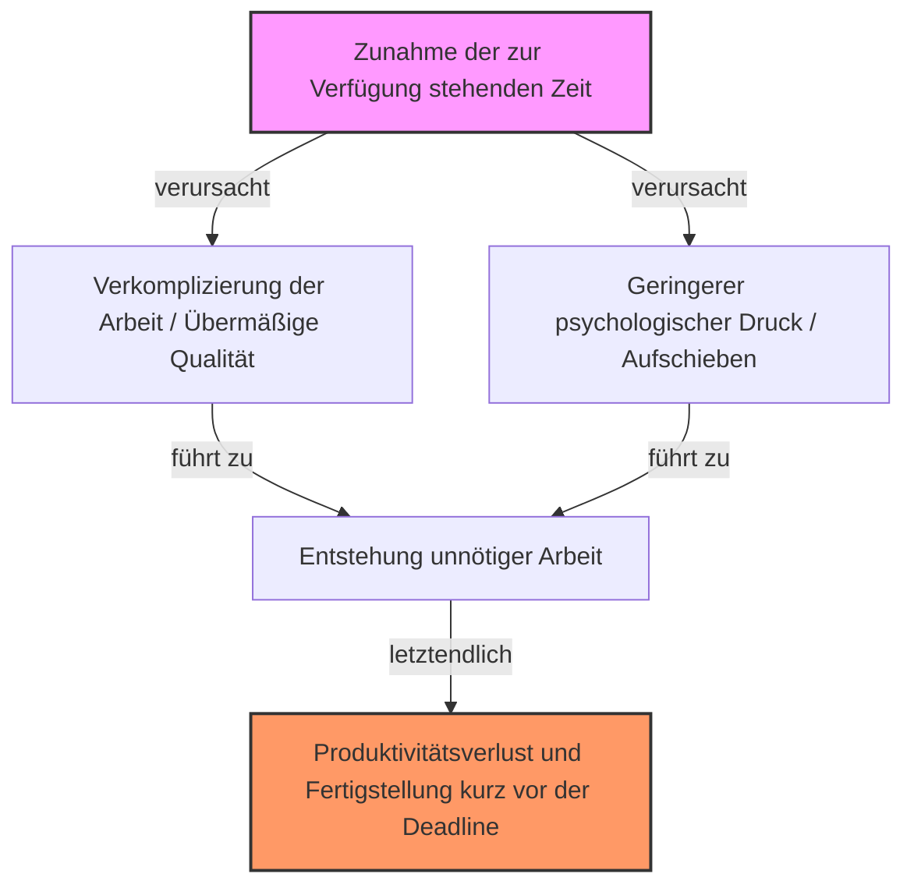
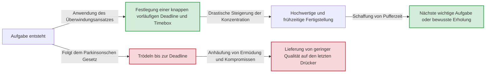

# Einleitung: Warum erledigen wir unsere Arbeit immer auf den letzten Drücker?

Ein Projekt, das wir mit dem Gedanken „Ich habe noch eine Woche Zeit, also kein Problem“ begonnen haben, wird aus irgendeinem Grund bis spät in die Nacht des letzten Tages nicht fertig. Die Hausaufgaben für die Sommerferien haben wir früher immer am 31. August unter Tränen erledigt. Wenn für ein Meeting eine Stunde angesetzt ist, wird eine Stunde lang diskutiert, auch wenn das Thema in fünf Minuten abgehakt sein könnte...
Diese Phänomene, die wohl jeder schon einmal erlebt hat, liegen keineswegs an einem schwachen Willen oder mangelnder Fähigkeit. Sie lassen sich durch ein universelles Gesetz namens „Parkinsonsches Gesetz“ (Parkinson’s Law) erklären, das die Verhaltensprinzipien von Menschen und Organisationen treffend beschreibt.

Dieser Artikel bietet eine ausführliche Erklärung dieses Parkinsonschen Gesetzes, die mehrere tausend Zeichen umfasst, von seinem historischen Hintergrund und dem psychologischen Mechanismus bis hin zur Frage, wie man sich in der modernen Geschäftswelt und im Alltag aus diesem Fluch befreien und die Produktivität drastisch steigern kann. Es ist ein unverzichtbarer, vollständiger Leitfaden für alle, die mit Zeitmanagement, Projektmanagement oder sogar der persönlichen Haushaltsführung zu kämpfen haben.

---

# Das erste Gesetz: „Arbeit dehnt sich in dem Maß aus, wie Zeit für ihre Erledigung zur Verfügung steht“

Dies ist das bekannteste und zentrale erste Gesetz des Parkinsonschen Gesetzes. Auf Englisch lautet es: **"Work expands so as to fill the time available for its completion."**

## Historischer Hintergrund und Cyril Northcote Parkinson

Dieses Gesetz wurde 1955 von Cyril Northcote Parkinson, einem britischen Historiker und Politikwissenschaftler, in einem Essay vorgeschlagen, das in der Wirtschaftszeitschrift *The Economist* veröffentlicht wurde. Im Jahr 1958 wurde es als Buch unter dem Titel *Parkinson's Law: The Pursuit of Progress* veröffentlicht und wurde zu einem weltweiten Bestseller.

Parkinson beobachtete die Daten der britischen Bürokratie (insbesondere der Admiralität und des Kolonialministeriums) genau. Erstaunlicherweise stellte er fest, dass die Zahl der Beamten in der Admiralität von Jahr zu Jahr weiter zunahm, obwohl die Zahl der Schiffe und Offiziere der britischen Marine nach dem Ersten Weltkrieg drastisch zurückgegangen war. Auch im Kolonialministerium wuchs die Zahl der Mitarbeiter, obwohl die Zahl der zu verwaltenden Kolonien abnahm.
Daraus leitete Parkinson die Pathologie der Bürokratie ab: „Die Zahl der Beamten wächst unabhängig von der Arbeitsmenge weiter.“

## Psychologischer Mechanismus: Warum füllt sich die Zeit?

Dass sich Arbeit so weit ausdehnt, dass sie die zur Verfügung stehende Zeit ausfüllt, ist stark von psychologischen Voreingenommenheiten des Menschen geprägt.

1. **Die Illusion der Komplexität**
   Wenn viel Zeit zur Verfügung steht, neigen Menschen unbewusst dazu, die Arbeit als „wichtig und komplex“ anzusehen. Sie steigern selbst den Schwierigkeitsgrad der Aufgabe, indem sie einem eigentlich einfachen Bericht übermäßige Verzierungen oder unnötige Daten hinzufügen.
2. **Die Falle des Perfektionismus**
   Solange es die Zeit erlaubt, überarbeiten wir unsere Arbeit immer wieder mit dem Gedanken: „Das geht doch sicher noch besser.“ Gemäß dem Pareto-Prinzip (80/20-Regel) erfordert das Erreichen von 80 % der Ergebnisse 20 % der Zeit, aber wir verschwenden 80 % der Zeit, um die verbleibenden 20 % der Qualität zu perfektionieren.
3. **Aufschieben (Prokrastination)**
   Wenn die Deadline noch weit entfernt ist, sinkt die Motivation, aktiv zu werden. Das beruhigende Gefühl „Ich habe noch Zeit“ nimmt die Spannung, was dazu führt, dass man sich der Aufgabe erst im letzten Moment ernsthaft widmet.

## Konkrete Beispiele im modernen Geschäftsumfeld

- **Verlängerung von Meetings**: Wenn ein Zeitfenster von einer Stunde für ein Meeting geblockt ist, wird oft genau eine Stunde verbraucht, selbst wenn das Thema in 15 Minuten entschieden sein könnte, da Abschweifungen und unnötige Diskussionen entstehen.
- **Budgetausschöpfung**: Zum Ende des Geschäftsjahres kommt es vor, dass unnötige Ausrüstung gekauft oder eilige Projekte gestartet werden, nur um das verbleibende Budget aufzubrauchen.
- **Softwareentwicklung**: Wenn die Lieferzeit zu lang ist, versuchen Entwicklungsteams oft, übermäßige Funktionen einzubauen, die „vielleicht nützlich sein könnten“ (Feature Creep), was letztendlich die Zeit für die Fehlerbehebung der Kernfunktionen einschränkt.

---

# [Diagramm] Der Mechanismus des Parkinsonschen Gesetzes

Lassen Sie uns die erschreckenden Auswirkungen des Parkinsonschen Gesetzes nicht nur in Worten, sondern auch visuell verdeutlichen. Das folgende Diagramm zeigt, wie die zur Verfügung stehende Zeit zu einer Aufblähung der Arbeit und einem Rückgang der Produktivität führt.

Hier liegt das Paradoxon: Je mehr Zeit als Ressource zur Verfügung steht, desto ineffizienter wird sie genutzt, wodurch sie zu einem Nährboden für Verschwendung wird.

---

# Das zweite Gesetz: „Die Ausgaben steigen stets bis an die Grenzen des Einkommens“

Das Parkinsonsche Gesetz ist nicht nur ein starkes Prinzip für das Zeitmanagement (Arbeitsvolumen), sondern auch für das Finanz- und Geldmanagement. Das ist das zweite Gesetz.

## Lifestyle Creep (Inflation des Lebensstandards)

Obwohl das Gehalt gestiegen ist, bleibt am Ende aus irgendeinem Grund kein Geld übrig. Man hatte eigentlich vor, den Bonus zu sparen, doch plötzlich war alles aufgebraucht. Dies ist ein typisches Beispiel für das zweite Gesetz.
Wenn das Einkommen steigt, passen Menschen unbewusst ihren Lebensstandard entsprechend an. Man geht in ein etwas besseres Restaurant, zieht in eine teurere Wohnung oder abonniert mehr Dienste. In der Wirtschaftspsychologie nennt man dies „Lifestyle Creep“.

## Die Falle der Budgetverwaltung in Unternehmen

Dieses Gesetz gilt nicht nur für die persönlichen Finanzen, sondern auch für die Finanzen von Unternehmen oder Staaten. Wenn einer Abteilung ein Budget zugewiesen wird, versucht der Manager, dieses bis auf den letzten Cent auszuschöpfen. Denn wenn Budget übrig bleibt, wird davon ausgegangen, dass „diese Abteilung in der nächsten Periode nicht so viel Budget braucht“, und das Budget wird gekürzt (Anreiz zur Budgetausschöpfung).
Infolgedessen werden „Ausgaben zur Ausschöpfung des Budgets“ statt wirklich notwendiger Investitionen zur Norm, was die Gewinnspanne der gesamten Organisation unter Druck setzt.

---

# Das dritte Gesetz?: Parkinsons Gesetz der Trivialität (Fahrradschuppen-Diskussion)

Streng genommen hängt es mit dem ersten und zweiten Gesetz zusammen, aber Parkinson stellte auch ein sehr interessantes Konzept vor, das als „Gesetz der Trivialität“ (Law of Triviality) bekannt ist.
Dieses besagt: **„Organisationen verwenden eine unverhältnismäßig hohe Menge an Zeit für die Diskussion trivialer Angelegenheiten.“**

Parkinson erklärte dies am Beispiel eines Meetings über den „Bau eines Atomkraftwerks und den Bau eines Fahrradschuppens“.
- **Vorschlag für den Bau eines Atomkraftwerks (Millionen von Dollar)**: Es ist zu technisch, sodass es die meisten Vorstandsmitglieder nicht verstehen, und da niemand etwas sagt, wird es in nur wenigen Minuten genehmigt.
- **Das Material für das Dach des Fahrradschuppens für die Mitarbeiter (Dutzende von Dollar)**: Jeder versteht es und jeder kann eine Meinung dazu äußern, weshalb stundenlang hitzig darüber diskutiert wird: „Wellblech ist besser“ oder „Nein, wir sollten Aluminium verwenden“.

Es ist ein erschreckendes Gesetz, dass der diskutierte Betrag oder die Wichtigkeit eines Ereignisses umgekehrt proportional zur dafür aufgewendeten Diskussionszeit ist. Wenn Sie dies nicht wissen, wird auch Ihr Team weiterhin wertvolle Zeit durch „Fahrradschuppen“-Diskussionen verlieren.

---

# Praktische Ansätze zur Überwindung des Parkinsonschen Gesetzes

Bisher haben wir gesehen, wie das Parkinsonsche Gesetz unsere Zeit, unser Geld und die Produktivität unserer Organisationen untergräbt. Wie können wir uns also diesem Gesetz entgegenstellen? Hier erklären wir konkrete Überwindungsmethoden.

## [Teil: Zeitmanagement]

### 1. Das Setzen künstlicher Deadlines (Timeboxing)
Wenn sich die gegebene Zeit füllt, sollte man die Zeit künstlich verkürzen. Schätzen Sie, „wie lange die Aufgabe wirklich dauert“, und legen Sie diese kürzestmögliche Zeit als Deadline fest.
Noch wirkungsvoller ist das „Timeboxing“. Man grenzt einen Kasten (Box) ein und sagt sich: „Ich verbringe nur 30 Minuten mit dieser Aufgabe“, stellt einen Timer und beendet die Arbeit gezwungenermaßen. Die Pomodoro-Technik (25 Minuten arbeiten + 5 Minuten Pause) wendet dieses Prinzip ebenfalls an.

### 2. Minimierung von Aufgaben (Micro-Tasking)
Große Aufgaben (z. B. „Einen Projektplan erstellen“) lassen bis zur Deadline viel Spielraum, weshalb sie sich leicht ausdehnen. Brechen Sie diese auf eine Ebene herunter, die in wenigen bis einigen Dutzend Minuten erledigt werden kann, wie etwa „Titel festlegen (5 Minuten)“, „Inhaltsverzeichnis erstellen (15 Minuten)“, „Benötigte Daten sammeln (30 Minuten)“. Dadurch wird der Spielraum für die Ausdehnung jeder einzelnen Aufgabe physisch beseitigt.

### 3. Die Einstellung „Done is better than perfect“
Die Zeit dehnt sich aus, weil wir Perfektion anstreben. Denken Sie an den berühmten Satz von Mark Zuckerberg, dem Gründer von Facebook (heute Meta): „Fertig ist besser als perfekt.“ Es ist wichtig, das „Prototyp-Denken“ zu übernehmen, bei dem man zunächst ein Ergebnis von 60 % anstrebt und dieses in der verbleibenden Zeit verfeinert.

## [Diagramm] Veränderungen im Workflow durch den Überwindungsansatz

Das folgende Diagramm zeigt den Unterschied im Workflow zwischen dem Nachgeben gegenüber dem Parkinsonschen Gesetz und dem Setzen einer künstlichen Deadline.

## [Teil: Finanzen und Budgets]

### 1. Vorab-Sparen
Der Ansatz „Ich spare das Geld, das übrig bleibt“ wird aufgrund des zweiten Gesetzes unweigerlich scheitern. Die einzige Lösung ist das „Vorab-Sparen“, bei dem das Geld sofort nach Eingang des Einkommens automatisch abgezogen oder auf ein „Spar-“ oder „Anlagekonto“ überwiesen wird. Indem man das „verfügbare Geld (das zugewiesene Budget)“ gezwungenermaßen reduziert, lernt man, innerhalb dieses Rahmens auszukommen.

### 2. Zero-Based-Budgeting
Um die Verschwendung von Budgets in Unternehmen zu verhindern, ist die Methode des „Zero-Based-Budgeting (ZBB)“ wirksam, bei der nicht das Budget des Vorjahres als Grundlage dient, sondern jedes Jahr von Null an geprüft wird, „welche Projekte wirklich notwendig sind“. Dadurch kann die durch Trägheit bedingte Aufblähung von Ausgaben aus der Vergangenheit zurückgesetzt werden.

---

# Fazit: Das Parkinsonsche Gesetz zum „Verbündeten“ machen

Das Parkinsonsche Gesetz ist ein unerbittliches Gesetz, das auf grundlegende menschliche Schwächen hinweist. Wenn man den Mechanismus dieses Gesetzes jedoch tiefgründig versteht, kann man es stattdessen „hacken“ und zu seinem eigenen Verbündeten machen.

- Wenn Sie zu viel Zeit haben, ziehen Sie die Deadline bewusst vor und schaffen Sie sich eine „Einschränkung“.
- Wenn Ihr Geld gewachsen ist, verkleinern Sie den verfügbaren Rahmen bewusst und schaffen Sie sich eine „Einschränkung“.

Menschen produzieren Verschwendung, wenn es keine Einschränkungen gibt, aber **unter angemessenen Einschränkungen zeigen sie eine unglaubliche Konzentration und Kreativität.**
Versuchen Sie ab heute, bewusste „knappe Rahmen“ in Ihre Arbeit und Ihr Leben einzubauen. Sie werden die magische Erfahrung machen, dass eine Aufgabe, für die Sie bisher eine Woche gebraucht haben, in nur einem Tag erledigt ist. Wer das Parkinsonsche Gesetz beherrscht, beherrscht seine Zeit und sein Leben.
