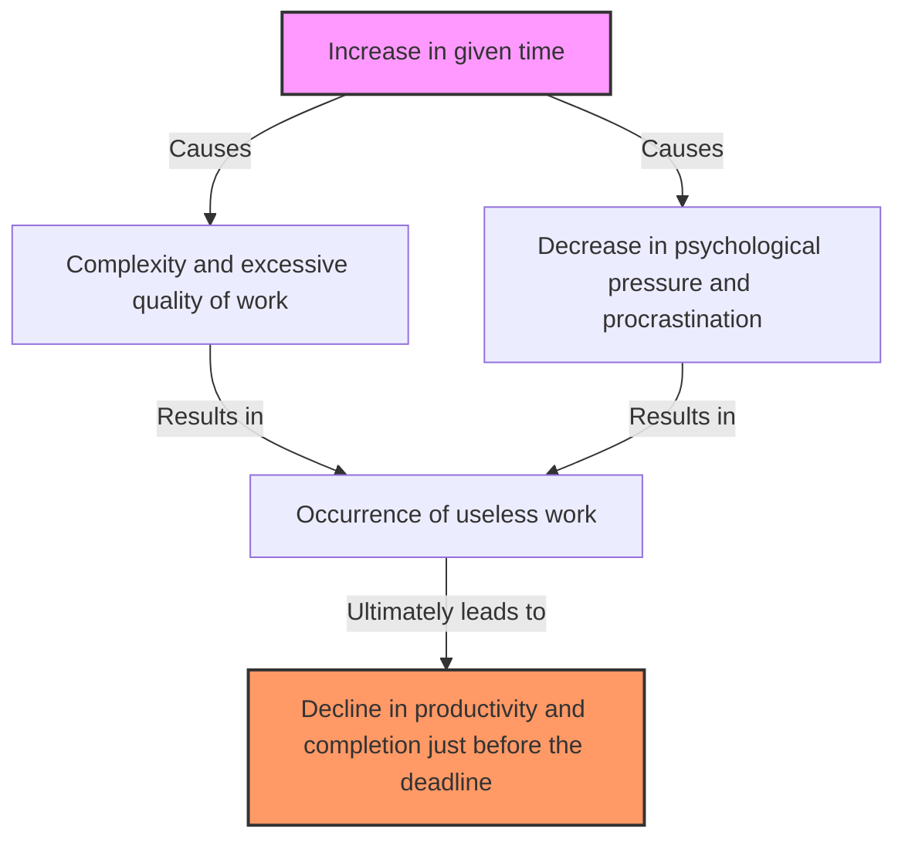
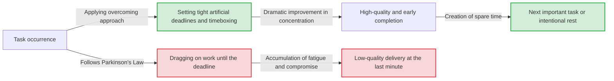

# Introduction: Why Is Our Work Always Finished Just Before the Deadline?

A project you started thinking, "I have a week left, so it's fine," somehow doesn't finish until late at night on the final day. You always did your summer homework crying on August 31st. If a meeting is scheduled for an hour, the discussion will continue for exactly an hour even if the agenda could be concluded in five minutes...
These phenomena, which everyone has experienced at least once, are not because your willpower is weak or your abilities are low. They can be explained by a universal law that sharply points out the behavioral principles of humans and organizations called "Parkinson's Law".

In this article, we will provide a detailed explanation of thousands of words about Parkinson's Law, from its historical background to its psychological mechanisms, and how to escape from its curse to dramatically improve productivity in modern business and daily life. It should be a must-read complete guide for anyone struggling with time management, project management, and even personal financial management.

---

# The First Law: "Work expands so as to fill the time available for its completion"

The most famous and core of Parkinson's Law is this First Law. It is expressed in English as **"Work expands so as to fill the time available for its completion."**

## Historical Background and Cyril Northcote Parkinson

This law was first proposed in 1955 by Cyril Northcote Parkinson, a British historian and political scientist, in an essay published in the economic magazine "The Economist". It was later published as a book titled "Parkinson's Law: The Pursuit of Progress" in 1958 and became a worldwide bestseller.

Parkinson closely observed the data of the British bureaucratic organization (especially the Admiralty and the Colonial Office). Surprisingly, even though the number of ships and personnel in the British Empire's Navy had drastically decreased since World War I, the number of administrative officials in the Admiralty continued to increase year by year. Similarly, in the Colonial Office, the number of staff increased even though the colonies to be managed decreased.
From this, Parkinson discovered the pathology of bureaucracy that "the amount of work and the number of officials continue to increase independently."

## Psychological Mechanism: Why Does Time Get Filled Up?

Behind the expansion of work until it fills the time, human psychological biases are strongly at work.

1. **Illusion of Complexity**
   When there is plenty of time, humans unconsciously tend to regard the work as "important and complex." We increase the difficulty of tasks ourselves by adding excessive decorations or unnecessary data to what could originally be a simple report.
2. **Trap of Perfectionism**
   As long as time permits, we continue to polish it, thinking, "Couldn't I make it better?" According to the Pareto Principle (the 80:20 rule), the time required to produce 80% of the results is 20%, but we waste 80% of the time to perfect the quality of the remaining 20%.
3. **Procrastination**
   When a deadline is far away, the motivation for humans to take action decreases. The sense of security that "there is still time" deprives us of tension, resulting in a situation where we do not take it seriously until the very end.

## Concrete Examples in Modern Business

- **Prolongation of Meetings**: If you book a one-hour meeting slot, even for an agenda that could be concluded in 15 minutes, digressions and unnecessary discussions will unfold, and exactly one hour will be consumed.
- **Budget Consumption**: At the end of the fiscal year, this is the phenomenon of purchasing unnecessary supplies or launching hastily arranged projects to use up the remaining budget.
- **Software Development**: If the delivery time is too long, the development team will try to implement excessive features ("feature creep") that "might be convenient to have," which ultimately squeezes the debugging time for core features.

---

# [Diagram] The Mechanism of Parkinson's Law

Let's visually confirm the horror of Parkinson's Law, not just in words. The diagram below shows how the given time leads to the bloating of work and a decline in productivity.

The paradox here is that the more abundant the resource of time is, the more it becomes a hotbed for creating waste, rather than being used efficiently.

---

# The Second Law: "Expenditures rise to meet income"

Parkinson's Law has a powerful rule not only in time management (workload) but also in financial and money management. That is the Second Law.

## Lifestyle Creep (Inflation of Living Standards)

Even though your salary has increased, somehow no money remains in your hands. You intended to save money because you got a bonus, but before you knew it, you had spent it all. This is a typical example of the Second Law.
When people's income increases, they unconsciously raise their living standards in proportion to it. Examples include "going to a slightly better restaurant," "moving to a room with a higher rent," and "increasing subscription services." This is called "lifestyle creep" in economic psychology.

## The Trap of Budget Management in Companies

This law applies not only to personal household finances but also to corporate and national finances. When a budget is allocated to each department, managers try to use up every single cent of that budget. This is because if there is surplus budget left over, it will be judged that "this department does not need that much budget next term," and the budget will be cut (incentive to consume budget).
As a result, spending to "use up the budget" becomes the norm rather than truly necessary investments, putting pressure on the profit margins of the entire organization.

---

# The Third Law?: Parkinson's Law of Triviality (The Bike-Shedding Argument)

Strictly speaking, following the First and Second Laws, Parkinson also proposed a very interesting concept called the "Law of Triviality."
This is the law that **"Organizations spend disproportionate amounts of time on trivial matters."**

Parkinson explained this with an example of a meeting about "building a nuclear power plant vs. building a bike shed."
- **Proposal to build a nuclear power plant (millions of dollars)**: It is too specialized for most board members to understand, and no one speaks up, so it is approved in just a few minutes.
- **Material for the roof of the employee bike shed (tens of dollars)**: Anyone can understand it and everyone can give an opinion, so a fierce debate continues for hours, arguing "Galvanized iron is good" or "No, it should be aluminum."

Thus, it is a terrifying law that the time spent discussing is inversely proportional to the amount of money or importance of the matter being handled. If you don't know this, your team will continue to be robbed of precious time by "bike-shedding" arguments.

---

# Practical Approaches to Break Through Parkinson's Law

So far, we have seen how Parkinson's Law undermines our time, money, and organizational productivity. Then, how should we confront this law? We will explain concrete methods to overcome it.

## [Time Management Edition]

### 1. Setting Artificial Deadlines (Timeboxing Method)

If the given time will be filled, you just need to artificially set the time shorter. Estimate "how long it can actually be done" for a task, and set the shortest time as the deadline.
What is even more powerful is the "Timeboxing Method." You divide a box saying "I will only spend 30 minutes on this task," set a timer, and forcefully terminate the work. The Pomodoro Technique (25 minutes work + 5 minutes break) also applies this principle.

### 2. Minimizing Tasks (Micro-Task Management)

Large tasks (e.g., "Create a project plan") tend to expand because there is a large margin until the deadline. Break this down into a level that can be completed in a few minutes to tens of minutes, such as "Decide on a title (5 minutes)," "Create a table of contents (15 minutes)," and "Gather necessary data (30 minutes)." This physically eliminates the room for expansion for each individual task.

### 3. The Spirit of "Done is better than perfect"

Time expands because you aim for perfection. Be conscious of the famous words of Mark Zuckerberg, founder of Facebook (now Meta): "Done is better than perfect." It is important to adopt "prototype thinking," where you first give it shape as fast as possible, even if the result is only 60 points, and use the remaining time to polish it.

## [Diagram] Workflow Changes by Overcoming Approaches

We will illustrate the difference in workflow between when swept away by Parkinson's Law and when an artificial deadline is set.

## [Financial & Budget Edition]

### 1. Proactive Savings

The idea of "saving the remaining money" will invariably fail due to the Second Law. The only solution is "proactive savings," where you move funds to "savings" or "investments" through payroll deductions or automatic transfers the moment income arrives. By forcefully reducing "usable money (given budget)," you will learn to manage your life within that limit.

### 2. Zero-Based Budgeting

To prevent wasteful budgeting in companies, a "Zero-Based Budgeting (ZBB)" approach is effective, where you review from scratch "what projects are truly necessary" every year, rather than basing it on the previous year's budget. You can reset the expansion of expenditures caused by past inertia.

---

# Conclusion: Making Parkinson's Law Your "Ally"

Parkinson's Law is a ruthless rule that points out essential human weaknesses. However, if you deeply understand the mechanism of this law, you can conversely "hack" it and make it your ally.

- If you have extra time, intentionally bring the deadline forward and create a "constraint".
- If your money increases, intentionally narrow the usable limit and create a "constraint".

Humans create waste in a state without constraints, but **under moderate constraints, they exert incredible concentration and creativity.**
Starting today, try setting intentional "tight frameworks" for your work and life. You should be able to experience the magic of a task that used to take a week finishing in just one day. He who controls Parkinson's Law controls his time and his life.
