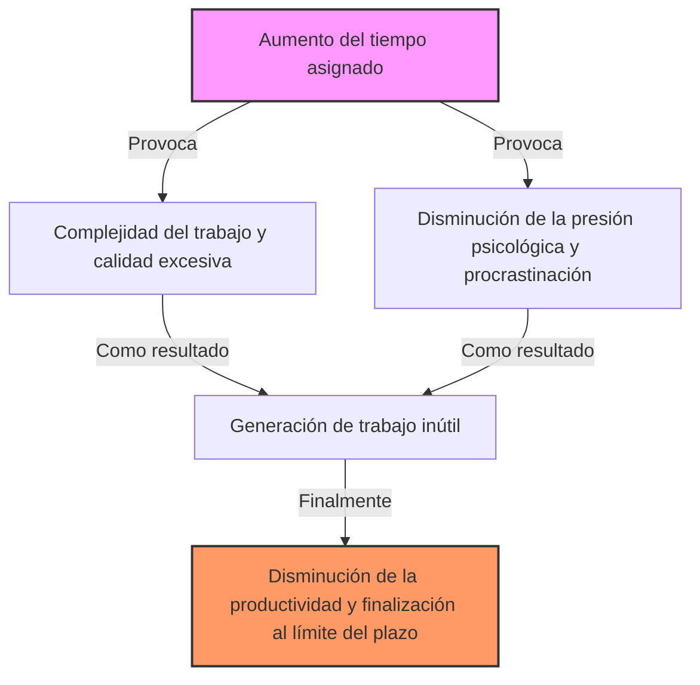
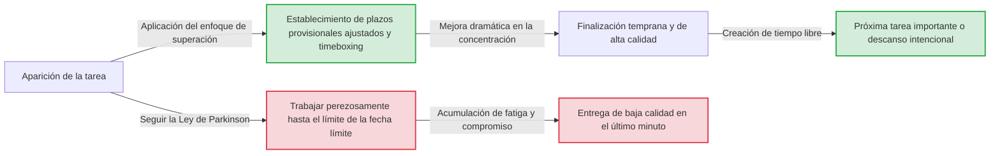

# Introducción: ¿Por qué nuestro trabajo siempre llega al límite del plazo?

Ese proyecto que empezaste pensando "todavía tengo una semana, no hay problema", por alguna razón no termina hasta la medianoche del último día. Los deberes de las vacaciones de verano siempre los hacías llorando el 31 de agosto. Si una reunión está programada para durar una hora, incluso si el tema se puede resolver en 5 minutos, la discusión continuará exactamente durante una hora...
Estos fenómenos que todos hemos experimentado alguna vez no se deben a que tengas una voluntad débil o baja capacidad. Esto se puede explicar mediante una ley universal que apunta agudamente a los principios de comportamiento humano y organizacional, llamada la "Ley de Parkinson" (Parkinson’s Law).

En este artículo, ofreceremos una explicación detallada de miles de palabras sobre esta Ley de Parkinson, desde su contexto histórico hasta sus mecanismos psicológicos, y cómo escapar de esta maldición en los negocios y la vida cotidiana moderna para mejorar drásticamente la productividad. Debería ser una guía completa y de lectura obligada para cualquiera que luche con la gestión del tiempo, la gestión de proyectos e incluso la gestión de las finanzas personales.

---

# Primera Ley: "El trabajo se expande hasta llenar el tiempo disponible para su finalización"

La más famosa y el núcleo de la Ley de Parkinson es esta primera ley. En inglés se expresa como **"Work expands so as to fill the time available for its completion."**

## Contexto histórico y Cyril Northcote Parkinson

Esta ley fue propuesta por primera vez en 1955 por el historiador y politólogo británico Cyril Northcote Parkinson en un ensayo publicado en la revista económica "The Economist". Posteriormente, se publicó como libro en 1958 bajo el título "La Ley de Parkinson: La búsqueda del progreso" y se convirtió en un éxito de ventas mundial.

Parkinson observó de cerca los datos de la burocracia británica (particularmente el Almirantazgo y la Oficina Colonial). Sorprendentemente, a pesar de que el número de buques y personal naval de la Armada del Imperio Británico había disminuido drásticamente desde la Primera Guerra Mundial, el número de funcionarios administrativos en el Almirantazgo continuaba aumentando año tras año. Del mismo modo, en la Oficina Colonial, aunque el número de colonias a administrar estaba disminuyendo, el número de empleados estaba aumentando.
A partir de esto, Parkinson descubrió la patología de la burocracia donde "el volumen de trabajo y el número de funcionarios continúan aumentando independientemente el uno del otro".

## Mecanismo psicológico: ¿Por qué se llena el tiempo?

Detrás del hecho de que el trabajo se expande hasta llenar el tiempo disponible, hay fuertes sesgos psicológicos humanos en juego.

1. **La ilusión de la complejidad**
   Cuando hay mucho tiempo, las personas tienden a percibir inconscientemente el trabajo como "importante y complejo". Lo que originalmente podría haber sido un simple informe termina con adornos excesivos o datos innecesarios agregados, aumentando la dificultad de la tarea por sí mismos.
2. **La trampa del perfeccionismo**
   Mientras el tiempo lo permita, se seguirá revisando pensando "podría hacerlo mejor". Según el Principio de Pareto (la regla del 80/20), el tiempo requerido para lograr el 80% de los resultados es el 20%, pero desperdiciamos el 80% de nuestro tiempo para perfeccionar el 20% restante de la calidad.
3. **Procrastinación (Procrastination)**
   Cuando la fecha límite está lejos, la motivación humana para actuar disminuye. La sensación de seguridad de "todavía hay tiempo" quita la tensión, lo que resulta en una situación en la que no se trabaja en serio hasta el último minuto.

## Ejemplos concretos en los negocios modernos

- **Prolongación de reuniones**: Si reservas un espacio de una hora para una reunión, incluso si el tema puede concluirse en 15 minutos, se desarrollarán digresiones y discusiones innecesarias, consumiendo exactamente una hora.
- **Consumo de presupuesto**: Hacia el final del año fiscal, para gastar el presupuesto sobrante, se compran suministros innecesarios o se lanzan proyectos apresurados.
- **Desarrollo de software**: Si el plazo de entrega es demasiado largo, el equipo de desarrollo intentará implementar características excesivas ("feature creep") pensando "sería útil tenerlo", lo que en última instancia reduce el tiempo disponible para corregir errores en las funciones principales.

---

# [Diagrama] El mecanismo de la Ley de Parkinson

Comprobemos lo aterradora que es la Ley de Parkinson de forma visual, no solo con palabras. El siguiente diagrama muestra cómo el tiempo asignado conduce a un trabajo inflado y a una disminución de la productividad.

Existe aquí una paradoja: cuanto más abundante es el recurso del tiempo, no se usa de manera más eficiente, sino que se convierte en un caldo de cultivo para el desperdicio.

---

# Segunda Ley: "Los gastos se expanden hasta alcanzar el nivel de los ingresos"

La Ley de Parkinson tiene una poderosa ley no solo en la gestión del tiempo (carga de trabajo) sino también en las finanzas y la gestión del dinero. Esta es la Segunda Ley.

## Inflación del estilo de vida (Lifestyle Creep)

Se suponía que tu salario iba a aumentar, pero por alguna razón no te queda dinero a mano. Planeabas ahorrar porque recibiste un bono, pero te diste cuenta de que lo habías gastado todo. Este es un ejemplo típico de la Segunda Ley.
A medida que aumentan los ingresos de las personas, aumentan inconscientemente su nivel de vida de manera proporcional. Por ejemplo, "ir a un restaurante un poco mejor", "mudarse a un apartamento con un alquiler más alto" o "aumentar los servicios de suscripción". Esto se llama "Lifestyle Creep" o inflación del estilo de vida en psicología económica.

## La trampa de la gestión presupuestaria en las empresas

Esta ley se aplica no solo a las finanzas personales, sino también a las finanzas corporativas y nacionales. Cuando se asigna un presupuesto a cada departamento, los gerentes intentan gastar hasta el último centavo. Esto se debe a que si dejan presupuesto sobrante, se considerará que "este departamento no necesitará tanto presupuesto el próximo período" y se les recortará el presupuesto (incentivo para agotar el presupuesto).
Como resultado, el "gasto para agotar el presupuesto" se convierte en la norma en lugar de la inversión verdaderamente necesaria, lo que presiona el margen de beneficio de toda la organización.

---

# ¿Tercera Ley?: Ley de la trivialidad de Parkinson (El debate del cobertizo de bicicletas)

Estrictamente hablando, está conectada con la primera y segunda ley, pero Parkinson también propuso un concepto muy interesante llamado "Ley de la trivialidad" (Law of Triviality).
Esta es la ley que establece que **"las organizaciones dedican una cantidad de tiempo desproporcionadamente grande a asuntos triviales"**.

Parkinson lo explicó con el ejemplo de una reunión sobre "la construcción de una planta de energía nuclear y la construcción de un cobertizo de bicicletas".
- **Propuesta de construcción de una planta de energía nuclear (millones de dólares)**: Es demasiado técnica para que la mayoría de los directores la entiendan, así que nadie habla y se aprueba en solo unos minutos.
- **El material del techo para el cobertizo de bicicletas de los empleados (decenas de dólares)**: Cualquiera puede entenderlo y cualquiera puede expresar una opinión, por lo que se debaten acaloradamente durante horas argumentos como "el zinc es mejor" o "no, debería ser aluminio".

De esta manera, es una ley aterradora en la que el tiempo dedicado a la discusión es inversamente proporcional a la cantidad de dinero involucrada o la importancia del evento. Si no sabes esto, a tu equipo se le seguirá robando un tiempo valioso en discusiones sobre el "cobertizo de bicicletas".

---

# Enfoques prácticos para superar la Ley de Parkinson

Hasta ahora, hemos visto cómo la Ley de Parkinson socava nuestro tiempo, dinero y la productividad de la organización. Entonces, ¿cómo deberíamos enfrentarnos a esta ley? Explicaremos métodos específicos para superarla.

## [Sección de Gestión del Tiempo]

### 1. Establecer plazos artificiales (Método Timeboxing)
Si el tiempo asignado se va a llenar, simplemente deberíamos acortar el tiempo de manera artificial. Estima "cuánto tiempo se tarda realmente" para una tarea y establece ese tiempo más corto como la fecha límite.
Aún más poderoso es el "Timeboxing". Divides las cajas diciendo "Solo dedicaré 30 minutos a esta tarea", configuras un temporizador y finalizas a la fuerza el trabajo. La Técnica Pomodoro (25 minutos de trabajo + 5 minutos de descanso) también aplica este principio.

### 2. Minimización de tareas (Micro-gestión de tareas)
Las tareas grandes (ej. "Crear un plan de proyecto") tienden a expandirse porque hay un gran margen hasta la fecha límite. Desglosaremos esto a un nivel que se puede terminar en unos minutos a decenas de minutos, como "Decidir un título (5 minutos)", "Crear una tabla de contenido (15 minutos)", "Reunir los datos necesarios (30 minutos)". Esto elimina físicamente el espacio para que cada tarea individual se expanda.

### 3. La mentalidad de "Hecho es mejor que perfecto"
El tiempo se expande porque apuntas a la perfección. Ten en cuenta la famosa frase de Mark Zuckerberg, fundador de Facebook (ahora Meta): "Hecho es mejor que perfecto". Es importante adoptar el "pensamiento de prototipo" donde primero le das forma lo más rápido posible, incluso si es un resultado de 60 puntos, y lo pules en el tiempo sobrante.

## [Diagrama] Cambios en el flujo de trabajo debido al enfoque de superación

Ilustraremos la diferencia en el flujo de trabajo entre dejarse llevar por la Ley de Parkinson y establecer plazos artificiales.

## [Sección de Finanzas y Presupuesto]

### 1. Ahorro anticipado
La idea de "ahorrar el dinero sobrante" siempre fracasará debido a la Segunda Ley. La única solución es el "ahorro anticipado", donde los fondos se mueven a "ahorros" o "inversiones" mediante deducciones o transferencias automáticas en el momento en que se reciben los ingresos. Al reducir forzosamente el "dinero disponible (presupuesto asignado)", aprenderás a arreglártelas para vivir dentro de ese límite.

### 2. Presupuesto de base cero
Para evitar el despilfarro de presupuesto en las empresas, el método de "Presupuesto Base Cero" (ZBB), que considera desde cero "qué negocios son realmente necesarios" cada año, en lugar de basarse en el presupuesto del año anterior, es efectivo. Esto te permite restablecer la expansión de los gastos debido a la inercia del pasado.

---

# Conclusión: Poner la Ley de Parkinson de "nuestro lado"

La Ley de Parkinson es una ley despiadada que señala la debilidad esencial de los seres humanos. Sin embargo, si comprendes profundamente el mecanismo de esta ley, puedes "hackearla" y ponerla de tu lado.

- Si te sobra tiempo, adelanta deliberadamente la fecha límite para crear "restricciones".
- Si aumenta el dinero, estrecha deliberadamente el margen disponible para crear "restricciones".

Los humanos generan desperdicio cuando no hay restricciones, pero **bajo restricciones moderadas, demuestran una concentración y creatividad increíbles.**
A partir de hoy, intenta establecer intencionalmente "marcos ajustados" en tu trabajo y en tu vida. Deberías poder experimentar algo mágico donde el trabajo que solía llevar una semana se puede terminar en un solo día. Quien domina la Ley de Parkinson, domina el tiempo y la vida.
