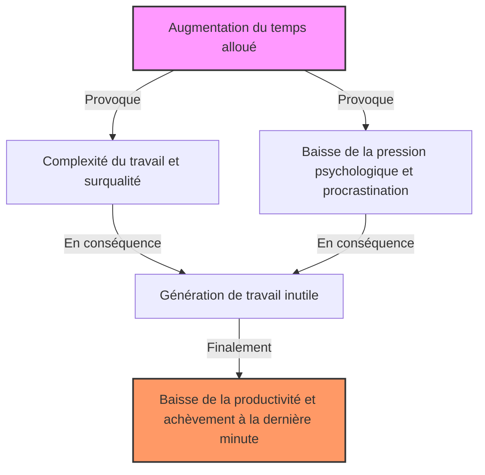
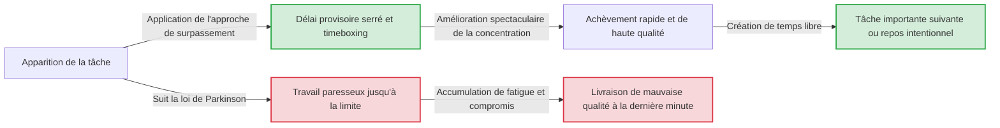

# Introduction : Pourquoi notre travail est-il toujours terminé à la dernière minute ?

Un projet commencé en pensant "J'ai encore une semaine, ça ira" ne se termine bizarrement que tard dans la nuit du dernier jour. Les devoirs de vacances d'été étaient toujours faits en pleurant le 31 août. Si la durée d'une réunion est fixée à une heure, même pour un sujet qui pourrait être réglé en 5 minutes, la discussion se poursuivra exactement pendant une heure...
Ces phénomènes, que tout le monde a vécus au moins une fois, ne sont en aucun cas dus à votre manque de volonté ou à votre faible capacité. Cela s'explique par un principe universel qui pointe avec acuité les principes d'action des humains et des organisations, appelé la « loi de Parkinson » (Parkinson's Law).

Dans cet article, nous fournirons une explication détaillée de plusieurs milliers de mots sur cette loi de Parkinson, de son contexte historique à ses mécanismes psychologiques, et comment échapper à cette malédiction pour améliorer considérablement la productivité dans les affaires et la vie quotidienne modernes. Ce devrait être un guide complet incontournable pour tous ceux qui luttent contre la gestion du temps, la gestion de projet, ou même la gestion de budget personnel.

---

# Première loi : "Le travail s'étale de façon à occuper le temps disponible pour son achèvement"

La plus célèbre et le cœur de la loi de Parkinson est cette première loi. En anglais, elle est exprimée comme **"Work expands so as to fill the time available for its completion."**

## Contexte historique et Cyril Northcote Parkinson

Cette loi a été proposée pour la première fois en 1955 par Cyril Northcote Parkinson, historien et politologue britannique, dans un essai publié dans le magazine économique « The Economist ». Par la suite, elle a été publiée sous forme de livre en 1958 sous le titre « Parkinson's Law: The Pursuit of Progress » et est devenue un best-seller mondial.

Parkinson a observé de près les données des bureaucraties britanniques (notamment l'Amirauté et le Bureau des Colonies). Étonnamment, bien que le nombre de navires de guerre et de marins de la marine de l'Empire britannique ait considérablement diminué depuis la Première Guerre mondiale, le nombre de fonctionnaires administratifs à l'Amirauté a continué d'augmenter d'année en année. De même au Bureau des Colonies, bien que les colonies à administrer aient diminué, le nombre d'employés avait augmenté.
À partir de là, Parkinson a découvert la pathologie de la bureaucratie selon laquelle "la quantité de travail et le nombre de fonctionnaires continuent d'augmenter indépendamment l'un de l'autre".

## Mécanisme psychologique : Pourquoi le temps est-il comblé ?

Derrière le fait que le travail s'étale jusqu'à occuper tout le temps, les biais psychologiques humains jouent un rôle important.

1. **L'illusion de la complexité**
   Lorsqu'il y a beaucoup de temps, les gens ont tendance à considérer inconsciemment le travail comme "important et complexe". Un rapport qui pourrait être simple se voit ajouter des décorations excessives ou des données inutiles, augmentant ainsi soi-même la difficulté de la tâche.
2. **Le piège du perfectionnisme**
   Tant que le temps le permet, on continue de réviser en se disant "Je pourrais faire mieux". Selon la loi de Pareto ([loi des 80/20](/fr/p/business-pareto-principle/)), le temps nécessaire pour obtenir 80% des résultats est de 20%, mais on gaspille 80% de temps pour perfectionner les 20% de qualité restants.
3. **La procrastination**
   Si l'échéance est lointaine, la motivation humaine pour agir diminue. Le sentiment de sécurité que "j'ai encore le temps" enlève la tension, et par conséquent, on ne s'y met pas sérieusement avant la toute dernière minute.

## Exemples concrets dans les affaires modernes

- **L'allongement des réunions** : Si vous réservez un créneau d'une heure pour une réunion, même si la conclusion d'un sujet pourrait être tirée en 15 minutes, des digressions et des discussions inutiles se développent, consommant exactement une heure.
- **La consommation de budget** : À la fin de l'exercice fiscal, pour utiliser le budget restant, il y a un phénomène où l'on achète des fournitures inutiles ou on lance des projets à la hâte.
- **Le développement de logiciels** : Si le délai est trop long, l'équipe de développement essaie d'implémenter des fonctionnalités excessives "qui pourraient être utiles" (feature creep), ce qui réduit finalement le temps consacré à la correction de bugs des fonctionnalités de base.

---

# [Schéma] Les mécanismes de la loi de Parkinson

Vérifions non seulement avec des mots, mais aussi visuellement, la menace de la loi de Parkinson. Le diagramme ci-dessous montre comment le temps accordé conduit à une surcharge de travail et à une baisse de productivité.

Le paradoxe ici est que plus la ressource "temps" est abondante, moins elle est utilisée efficacement, devenant plutôt un terrain fertile pour la perte de temps.

---

# Deuxième loi : "Les dépenses s'élèvent jusqu'à atteindre le montant des revenus"

La loi de Parkinson possède également une loi puissante non seulement pour la gestion du temps (charge de travail), mais aussi pour les finances et la gestion de l'argent. C'est la deuxième loi.

## L'inflation du style de vie (Lifestyle creep)

Bien que le salaire ait augmenté, pour une raison quelconque, il ne reste pas d'argent. Je pensais économiser mon bonus, mais je me suis rendu compte que j'avais tout dépensé. C'est un exemple typique de la deuxième loi.
Lorsque le revenu augmente, les gens augmentent inconsciemment leur niveau de vie en proportion. Par exemple, "aller dans un restaurant un peu meilleur", "déménager dans un appartement au loyer supérieur", ou "augmenter les services d'abonnement". L'économie comportementale appelle cela "l'inflation du style de vie".

## Le piège de la gestion budgétaire dans les entreprises

Cette loi ne s'applique pas seulement au budget des ménages, mais aussi aux finances des entreprises et des États. Lorsqu'un budget est alloué à chaque département, les managers essaient de le dépenser jusqu'au dernier centime. En effet, s'il reste du budget, on jugera que "ce département n'aura pas besoin d'autant de budget pour le prochain exercice" et le budget sera réduit (incitation à la consommation budgétaire).
En conséquence, ce n'est pas un investissement vraiment nécessaire, mais "la dépense pour utiliser le budget" qui devient la norme, faisant pression sur la marge bénéficiaire de l'ensemble de l'organisation.

---

# Troisième loi ? : La loi de futilité de Parkinson (Le débat sur l'abri à vélos)

Strictement parlant, dans la lignée des première et deuxième lois, Parkinson a également proposé un concept très intéressant appelé "loi de futilité" (Law of Triviality).
C'est la loi selon laquelle **"les organisations consacrent un temps disproportionné à des questions insignifiantes"**.

Parkinson a expliqué cela avec l'exemple d'une réunion sur "la construction d'une centrale nucléaire et la construction d'un abri à vélos".
- **Le projet de construction d'une centrale nucléaire (plusieurs millions de dollars)** : Trop technique pour être compris par la plupart des administrateurs, personne ne prend la parole, il est donc approuvé en quelques minutes seulement.
- **Le matériau du toit de l'abri à vélos pour les employés (quelques dizaines de dollars)** : Facile à comprendre pour tout le monde, tout le monde peut donner son avis, et donc des heures de débats acharnés s'ensuivent : "La tôle ondulée c'est mieux", "Non, ça devrait être en aluminium".

C'est ainsi une loi terrible selon laquelle l'importance des montants ou des événements traités est inversement proportionnelle au temps de discussion qui y est consacré. Si vous ne le savez pas, votre équipe continuera à perdre un temps précieux dans des débats sur les "abris à vélos".

---

# Des approches pratiques pour briser la loi de Parkinson

Jusqu'à présent, nous avons vu comment la loi de Parkinson ronge notre temps, notre argent et la productivité de notre organisation. Alors, comment devrions-nous faire face à cette loi ? Voici des solutions concrètes.

## [Section gestion du temps]

### 1. Fixation d'échéances artificielles (Méthode Timeboxing)
Si le temps accordé finit toujours par être rempli, il suffit de fixer artificiellement un temps plus court. Estimez "combien de temps cela devrait vraiment prendre" pour une tâche, et fixez ce temps minimum comme délai.
La méthode « Timeboxing » est encore plus puissante. Vous délimitez une boîte (box) en disant "Je ne consacre que 30 minutes à cette tâche", et réglez un minuteur pour forcer la fin du travail. La technique Pomodoro (25 minutes de travail + 5 minutes de pause) applique également ce principe.

### 2. Minimisation des tâches (Microgestion des tâches)
Les grandes tâches (par exemple : "Créer un plan de projet") ont tendance à s'allonger car la marge jusqu'à l'échéance est grande. Divisez cela jusqu'à un niveau qui peut être terminé en quelques minutes à quelques dizaines de minutes : "Décider du titre (5 minutes)", "Faire un sommaire (15 minutes)", "Rassembler les données nécessaires (30 minutes)". Cela élimine physiquement la place pour l'expansion de chaque tâche individuelle.

### 3. L'esprit de "Done is better than perfect" (Fait vaut mieux que parfait)
C'est parce qu'on vise la perfection que le temps s'allonge. Gardez à l'esprit la célèbre citation du fondateur de Facebook (maintenant Meta), Mark Zuckerberg : "Mieux vaut que ce soit fait que parfait". Il est important d'adopter une "pensée prototype" : créer la forme le plus rapidement possible avec un résultat à 60%, et peaufiner avec le temps restant.

## [Schéma] Changement de flux de travail grâce à l'approche de surpassement

Voici un schéma montrant la différence de flux de travail entre suivre la loi de Parkinson et fixer des délais artificiels.

## [Section finances et budget]

### 1. L'épargne préalable
L'idée d'"économiser l'argent qui reste" échouera inévitablement à cause de la deuxième loi. La seule solution est l'"épargne préalable", où au moment où le revenu arrive, vous déplacez les fonds vers "l'épargne" ou "l'investissement" par déduction ou virement automatique. En réduisant de force "l'argent disponible (budget alloué)", vous apprendrez à vivre dans ces limites.

### 2. Le budget base zéro
Pour éviter le gaspillage de budget dans les entreprises, la méthode du "budget base zéro (BBZ)" est efficace. Plutôt que de se baser sur le budget de l'année précédente, il faut examiner de zéro chaque année "quelles sont les activités vraiment nécessaires". Cela permet de réinitialiser l'expansion des dépenses due à l'inertie passée.

---

# Conclusion : Faire de la loi de Parkinson une "alliée"

La loi de Parkinson est une loi impitoyable qui pointe du doigt les faiblesses fondamentales de l'homme. Cependant, si vous comprenez profondément le mécanisme de cette loi, vous pouvez au contraire la "pirater" et en faire votre alliée.

- S'il vous reste du temps, avancez volontairement l'échéance pour créer une "contrainte".
- Si vous avez plus d'argent, réduisez volontairement votre marge de manœuvre pour créer une "contrainte".

Les êtres humains produisent du gaspillage lorsqu'il n'y a pas de contraintes, mais **sous des contraintes modérées, ils font preuve d'une concentration et d'une créativité incroyables.**
À partir d'aujourd'hui, essayez de fixer intentionnellement un "cadre strict" à votre travail et à votre vie. Vous devriez pouvoir vivre l'expérience magique d'un travail qui prenait auparavant une semaine et qui se termine désormais en un seul jour. Celui qui maîtrise la loi de Parkinson maîtrise son temps et sa vie.
