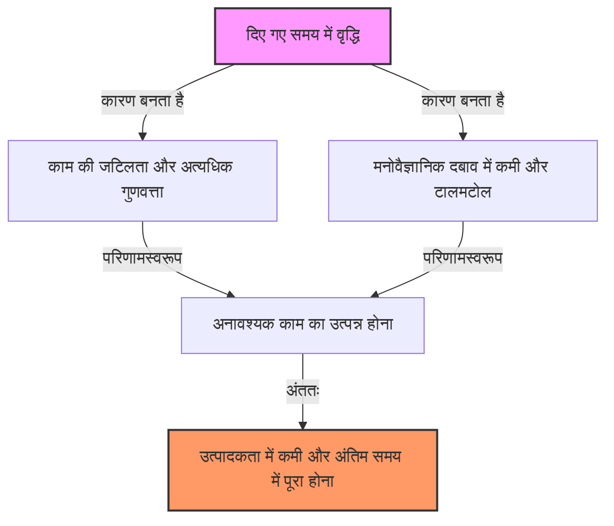
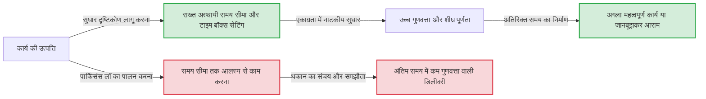

# परिचय: हमारा काम हमेशा अंतिम समय पर ही क्यों पूरा होता है?

"अभी एक हफ्ता बाकी है, चिंता की कोई बात नहीं" सोचकर शुरू किया गया प्रोजेक्ट किसी न किसी कारण से आखिरी दिन की आधी रात तक खत्म नहीं होता। गर्मियों की छुट्टियों का होमवर्क हमेशा 31 अगस्त को रोते हुए किया जाता था। अगर किसी मीटिंग का समय 1 घंटा तय किया गया है, तो 5 मिनट में खत्म होने वाले एजेंडे पर भी ठीक 1 घंटे तक चर्चा चलती रहती है...
हर किसी ने कम से कम एक बार इन घटनाओं का अनुभव किया होगा, और यह बिल्कुल भी इसलिए नहीं है क्योंकि आपकी इच्छाशक्ति कमजोर है या आपकी क्षमता कम है। इसे "पार्किंसंस लॉ (Parkinson’s Law)" नामक एक सार्वभौमिक कानून द्वारा समझाया जा सकता है, जो मानव और संगठनात्मक व्यवहार के सिद्धांतों को तेजी से रेखांकित करता है।

इस लेख में, हम पार्किंसंस लॉ की ऐतिहासिक पृष्ठभूमि, इसके मनोवैज्ञानिक तंत्र, और आधुनिक व्यवसाय और दैनिक जीवन में इस जाल से कैसे बचें और अपनी उत्पादकता में नाटकीय रूप से सुधार कैसे करें, इस पर हजारों शब्दों का विस्तृत विवरण प्रदान करेंगे। समय प्रबंधन, प्रोजेक्ट प्रबंधन, या यहां तक कि व्यक्तिगत वित्त प्रबंधन से जूझ रहे किसी भी व्यक्ति के लिए यह एक अवश्य पढ़ी जाने वाली संपूर्ण मार्गदर्शिका होनी चाहिए।

---

# पहला नियम: "काम पूरा करने के लिए उपलब्ध समय को भरने के लिए फैलता है"

पार्किंसंस लॉ में सबसे प्रसिद्ध और मुख्य नियम यह पहला नियम है। अंग्रेजी में इसे **"Work expands so as to fill the time available for its completion."** के रूप में व्यक्त किया जाता है।

## ऐतिहासिक पृष्ठभूमि और सिरिल नॉर्थकोट पार्किंसन

यह नियम पहली बार 1955 में एक ब्रिटिश इतिहासकार और राजनीतिक वैज्ञानिक सिरिल नॉर्थकोट पार्किंसन (Cyril Northcote Parkinson) द्वारा आर्थिक पत्रिका "द इकोनॉमिस्ट" में प्रकाशित एक निबंध में प्रस्तावित किया गया था। बाद में, 1958 में, इसे "पार्किंसंस लॉ: द परसूट ऑफ प्रोग्रेस" नामक पुस्तक के रूप में प्रकाशित किया गया, जो एक अंतरराष्ट्रीय बेस्टसेलर बन गई।

पार्किंसन ने ब्रिटिश नौकरशाही (विशेष रूप से एडमिरल्टी और औपनिवेशिक कार्यालय) के डेटा का बारीकी से निरीक्षण किया। आश्चर्यजनक रूप से, प्रथम विश्व युद्ध के बाद से ब्रिटिश साम्राज्य की नौसेना में जहाजों और सैनिकों की संख्या में नाटकीय कमी के बावजूद, एडमिरल्टी के अधिकारियों की संख्या में साल-दर-साल वृद्धि जारी रही। इसी तरह, औपनिवेशिक कार्यालय में, भले ही प्रबंधित किए जाने वाले उपनिवेशों की संख्या घट रही थी, कर्मचारियों की संख्या बढ़ रही थी।
यहां से, पार्किंसन ने नौकरशाही की विकृति को पहचाना कि "काम की मात्रा और अधिकारियों की संख्या एक दूसरे से स्वतंत्र रूप से बढ़ती रहती है"।

## मनोवैज्ञानिक तंत्र: समय क्यों भर जाता है?

काम के उस समय तक फैलने के पीछे मानवीय मनोवैज्ञानिक पूर्वाग्रह मजबूती से काम कर रहा है।

1. **जटिलता का भ्रम**
   जब समय भरपूर होता है, तो मनुष्य अनजाने में काम को "महत्वपूर्ण और जटिल" मानने लगते हैं। जो काम एक साधारण रिपोर्ट से किया जा सकता है, उसमें अत्यधिक सजावट जोड़कर या अनावश्यक डेटा जोड़कर, हम खुद ही कार्य की कठिनाई बढ़ा देते हैं।
2. **पूर्णतावाद का जाल**
   जब तक समय अनुमति देता है, हम यह सोचकर संशोधन करते रहते हैं कि "क्या इसे बेहतर नहीं किया जा सकता?"। पारेतो के नियम (80:20 का नियम) के अनुसार, 80% परिणाम प्राप्त करने के लिए आवश्यक समय 20% है, लेकिन शेष 20% गुणवत्ता को पूर्ण बनाने के लिए 80% समय बर्बाद हो जाता है।
3. **टालमटोल (Procrastination)**
   जब समय सीमा दूर होती है, तो मनुष्यों में कार्रवाई करने की प्रेरणा (Motivation) कम हो जाती है। "अभी समय है" की भावना तनाव को खत्म कर देती है, जिसके परिणामस्वरूप हम अंतिम समय तक पूरी लगन से काम नहीं करते हैं।

## आधुनिक व्यवसाय में विशिष्ट उदाहरण

- **मीटिंग का लंबा होना**: यदि 1 घंटे की मीटिंग का समय लिया जाता है, तो वास्तव में 15 मिनट में निष्कर्ष निकलने वाले एजेंडे पर भी, अनावश्यक चर्चाएं और विषयांतर होते हैं, और पूरे 1 घंटे का उपयोग कर लिया जाता है।
- **बजट की खपत**: वित्तीय वर्ष के अंत में, बचे हुए बजट का उपयोग करने के लिए अनावश्यक उपकरण खरीदना या जल्दबाजी में प्रोजेक्ट शुरू करना जैसी घटनाएं होती हैं।
- **सॉफ्टवेयर विकास**: यदि डिलीवरी का समय बहुत लंबा है, तो विकास टीम अनावश्यक सुविधाओं (Feature Creep) को लागू करने का प्रयास करती है जो "शायद उपयोगी हो सकती हैं", जिसके परिणामस्वरूप मुख्य कार्यक्षमता के बग ठीक करने का समय कम हो जाता है।

---

# [चित्र] पार्किंसंस लॉ का तंत्र

आइए शब्दों के साथ-साथ दृश्य रूप में भी पार्किंसंस लॉ के खतरे को देखें। नीचे दिया गया चित्र दिखाता है कि कैसे दिया गया समय काम के विस्तार और उत्पादकता में कमी का कारण बनता है।

समय रूपी संसाधन जितना अधिक होता है, वह उतना ही प्रभावी ढंग से उपयोग नहीं किया जाता है, बल्कि यह अनावश्यकता को जन्म देने का आधार बन जाता है, यह एक विरोधाभास है।

---

# दूसरा नियम: "खर्च आय की राशि तक पहुंचने के लिए फैलता है"

पार्किंसंस लॉ केवल समय प्रबंधन (काम की मात्रा) तक ही सीमित नहीं है, बल्कि वित्त और धन प्रबंधन में भी एक शक्तिशाली नियम है। यही दूसरा नियम है।

## लाइफस्टाइल क्रीप (जीवन स्तर की मुद्रास्फीति)

वेतन बढ़ने के बावजूद भी हाथ में पैसा क्यों नहीं बचता? सोचा था कि बोनस मिलने पर बचत करेंगे, लेकिन महसूस किया कि सब खर्च हो गया। यह दूसरे नियम का एक सटीक उदाहरण है।
जब लोगों की आय बढ़ती है, तो वे अनजाने में उसी अनुपात में अपना जीवन स्तर बढ़ा लेते हैं। "थोड़े अच्छे रेस्तरां में जाना", "एक दर्जे ऊंचे किराए वाले कमरे में जाना", "सदस्यता सेवाओं को बढ़ाना" जैसे उदाहरण हैं। इसे आर्थिक मनोविज्ञान में "लाइफस्टाइल क्रीप" (Lifestyle Creep) कहा जाता है।

## कंपनियों में बजट प्रबंधन का जाल

यह नियम केवल व्यक्तिगत वित्त पर ही नहीं, बल्कि कंपनियों और देशों के वित्त पर भी लागू होता है। जब विभागों को बजट आवंटित किया जाता है, तो प्रबंधक उस बजट का एक-एक पैसा खर्च करने की कोशिश करते हैं। ऐसा इसलिए है क्योंकि अगर वे बजट बचा लेते हैं, तो यह माना जाएगा कि "इस विभाग को अगले साल इतने बजट की आवश्यकता नहीं है", और उनके बजट में कटौती कर दी जाएगी (बजट खपत का प्रोत्साहन)।
नतीजतन, वास्तव में आवश्यक निवेश के बजाय, "बजट खर्च करने के लिए व्यय" एक सामान्य बात बन जाती है, जो पूरे संगठन के लाभ मार्जिन को प्रभावित करती है।

---

# तीसरा नियम? : पार्किंसन का तुच्छता का नियम (साइकिल शेड की चर्चा)

हालांकि यह सीधे तौर पर पहले और दूसरे नियमों से जुड़ा हुआ है, पार्किंसन ने "तुच्छता का नियम (Law of Triviality)" नामक एक बहुत ही दिलचस्प अवधारणा भी प्रस्तावित की है।
यह एक नियम है जो कहता है कि **"संगठन तुच्छ मामलों पर असमान रूप से अधिक समय व्यतीत करते हैं"**।

पार्किंसन ने इसे "परमाणु ऊर्जा संयंत्र का निर्माण और साइकिल शेड का निर्माण" की मीटिंग के उदाहरण के साथ समझाया।
- **परमाणु ऊर्जा संयंत्र के निर्माण का प्रस्ताव (लाखों डॉलर)**: यह बहुत तकनीकी है कि अधिकांश निदेशक इसे समझ नहीं पाते हैं, और कोई भी नहीं बोलता है, इसलिए इसे कुछ ही मिनटों में मंजूरी दे दी जाती है।
- **कर्मचारियों के लिए साइकिल शेड की छत की सामग्री (दसियों डॉलर)**: हर कोई इसे समझ सकता है और कोई भी अपनी राय दे सकता है, इसलिए "टिन अच्छा है" और "नहीं, एल्यूमीनियम होना चाहिए" पर घंटों तक तीखी बहस होती है।

इस तरह, यह एक भयानक नियम है कि खर्च की गई राशि और घटना का महत्व उस पर खर्च किए गए चर्चा के समय के व्युत्क्रमानुपाती होता है। यदि आप इसे नहीं जानते हैं, तो आपकी टीम का कीमती समय "साइकिल शेड" की चर्चाओं में बर्बाद होता रहेगा।

---

# पार्किंसंस लॉ को तोड़ने के व्यावहारिक तरीके

अब तक, हमने देखा है कि पार्किंसंस लॉ कैसे हमारे समय, धन और संगठन की उत्पादकता को नष्ट करता है। तो हम इस नियम का सामना कैसे कर सकते हैं? हम इसे दूर करने के विशिष्ट तरीकों की व्याख्या करेंगे।

## [समय प्रबंधन]

### 1. कृत्रिम समय सीमा निर्धारित करना (टाइम बॉक्सिंग)
यदि दिया गया समय भर जाता है, तो आपको कृत्रिम रूप से समय को कम निर्धारित करना चाहिए। किसी कार्य के लिए अनुमान लगाएं कि "वास्तव में इसे करने में कितना समय लगेगा" और उस न्यूनतम समय को अंतिम सीमा (Deadline) के रूप में निर्धारित करें।
इससे भी अधिक शक्तिशाली "टाइम बॉक्सिंग (Timeboxing)" है। "मैं इस काम पर केवल 30 मिनट लगाऊंगा", इस तरह एक बॉक्स बनाएं, टाइमर सेट करें और काम को जबरन खत्म करें। पोमोडोरो तकनीक (25 मिनट काम + 5 मिनट आराम) भी इसी सिद्धांत का अनुप्रयोग है।

### 2. कार्यों को छोटा करना (माइक्रोटास्क प्रबंधन)
बड़े कार्य (उदाहरण के लिए: "प्रोजेक्ट योजना बनाना") फैलने की संभावना अधिक होती है क्योंकि समय सीमा तक बहुत खाली समय होता है। इसे "शीर्षक तय करना (5 मिनट)", "विषय सूची बनाना (15 मिनट)", "आवश्यक डेटा एकत्र करना (30 मिनट)" जैसे स्तरों तक छोटा (Breakdown) करें जिसे कुछ मिनटों से लेकर कुछ दसियों मिनटों में पूरा किया जा सके। यह प्रत्येक कार्य के विस्तार की गुंजाइश को भौतिक रूप से समाप्त कर देता है।

### 3. "Done is better than perfect" (किया हुआ होना उत्तम होने से बेहतर है) की भावना
समय इसलिए फैलता है क्योंकि हम पूर्णता का लक्ष्य रखते हैं। फेसबुक (अब मेटा) के संस्थापक मार्क जुकरबर्ग के प्रसिद्ध उद्धरण, "पूर्णता का लक्ष्य रखने के बजाय इसे पूरा करें (Done is better than perfect)" को ध्यान में रखें। सबसे पहले, 60% काम के साथ भी इसे जल्द से जल्द आकार देना और "प्रोटोटाइप सोच" को अपनाना महत्वपूर्ण है जो अतिरिक्त समय के साथ इसे बेहतर बनाता है।

## [चित्र] सुधार के दृष्टिकोण के कारण वर्कफ़्लो में परिवर्तन

हम पार्किंसंस लॉ में बह जाने पर और कृत्रिम समय सीमा निर्धारित करने पर वर्कफ़्लो के बीच के अंतर को दर्शाते हैं।

## [वित्त और बजट]

### 1. पहले से बचत करना
"बचे हुए पैसे को बचाना" का विचार दूसरे नियम के कारण हमेशा विफल हो जाता है। आय प्राप्त होते ही "बचत" या "निवेश" में धन स्थानांतरित करने वाली "अग्रिम बचत (Pay yourself first)" ही एकमात्र समाधान है, या तो कटौती (Deduction) या स्वचालित हस्तांतरण (Automatic transfer) के माध्यम से। "उपयोग किए जा सकने वाले धन (दिए गए बजट)" को जबरन कम करके, आप उस सीमा के भीतर अपना जीवन चलाना सीख जाएंगे।

### 2. शून्य-आधारित बजट
कंपनियों में बजट की बर्बादी को रोकने के लिए, "शून्य-आधारित बजट (ZBB)" नामक एक विधि प्रभावी है, जहां पिछले वर्ष के बजट को आधार बनाने के बजाय, आप खरोंच (Zero) से विचार करते हैं कि "हर साल वास्तव में कौन से व्यवसाय आवश्यक हैं"। आप पिछली जड़ता के कारण होने वाले खर्चों के विस्तार को रीसेट कर सकते हैं।

---

# निष्कर्ष: पार्किंसंस लॉ को अपना "सहयोगी" बनाएं

पार्किंसंस लॉ एक निर्दयी नियम है जो मानव की मूलभूत कमजोरियों को इंगित करता है। हालांकि, यदि आप इस नियम के तंत्र को गहराई से समझते हैं, तो आप इसे "हैक" कर सकते हैं और इसे अपने पक्ष में उपयोग कर सकते हैं।

- यदि आपके पास अतिरिक्त समय है, तो जानबूझकर समय सीमा को आगे लाएं और एक "प्रतिबंध" बनाएं।
- यदि आपके पास अधिक पैसा है, तो जानबूझकर खर्च करने की सीमा को कम करें और एक "प्रतिबंध" बनाएं।

मनुष्य बिना किसी प्रतिबंध की स्थिति में कचरा पैदा करता है, लेकिन **उचित प्रतिबंधों के तहत, हम अविश्वसनीय एकाग्रता और रचनात्मकता का प्रदर्शन करते हैं।**
आज ही से अपने काम और जीवन में जानबूझकर "सख्त सीमाएं (Tight frames)" निर्धारित करने का प्रयास करें। आपको एक जादुई अनुभव होगा जहां जो काम करने में एक सप्ताह लगता था, वह सिर्फ एक दिन में पूरा हो जाएगा। जो पार्किंसंस लॉ को नियंत्रित करता है, वह समय और जीवन को नियंत्रित करता है।
