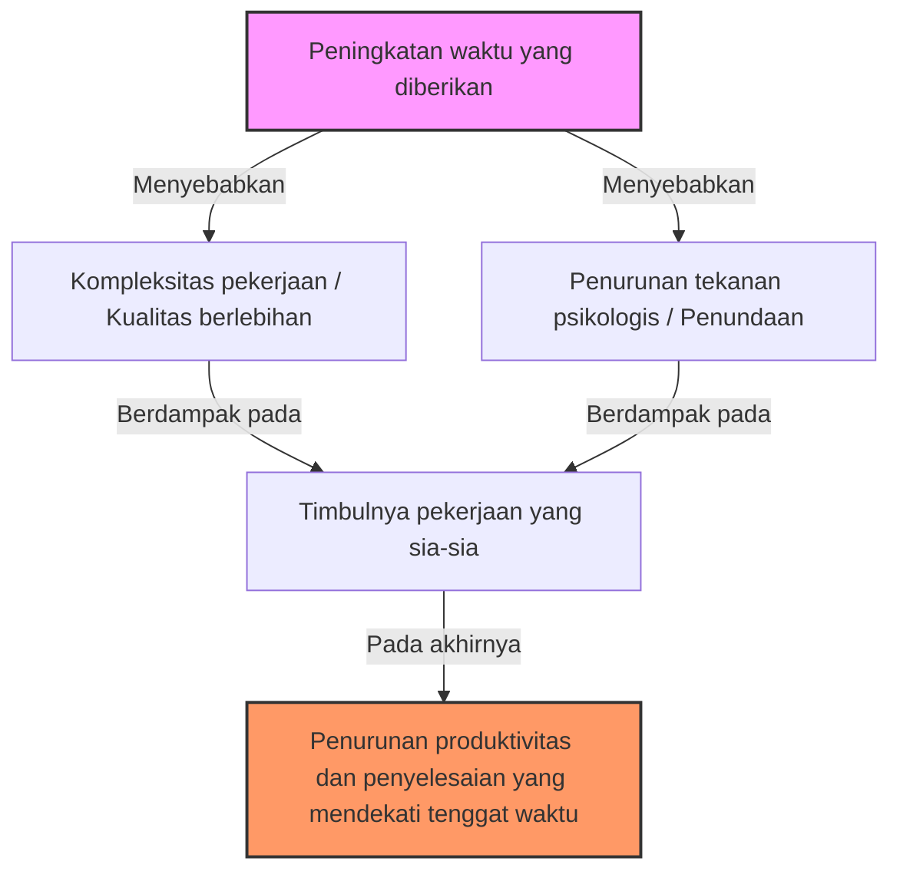
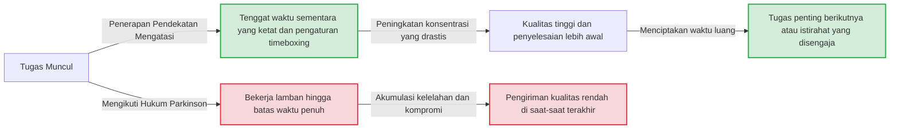

# Pendahuluan: Mengapa Pekerjaan Kita Selalu Selesai Mendekati Tenggat Waktu?

Proyek yang dimulai dengan pikiran, "Masih ada satu minggu lagi, jadi aman," entah kenapa baru selesai larut malam pada hari terakhir. Tugas liburan musim panas selalu dikerjakan sambil menangis pada tanggal 31 Agustus. Rapat yang dijadwalkan selama 1 jam, meskipun agendanya bisa diselesaikan dalam 5 menit, diskusi akan tetap berlanjut tepat selama 1 jam penuh...
Fenomena-fenomena yang pernah dialami semua orang ini, bukan terjadi karena kemauan Anda yang lemah atau kemampuan yang rendah. Hal ini dapat dijelaskan oleh hukum universal yang secara tajam mengungkap prinsip perilaku manusia dan organisasi, yang disebut "Hukum Parkinson" (Parkinson's Law).

Dalam artikel ini, kami akan memberikan penjelasan mendetail hingga ribuan kata mengenai Hukum Parkinson, mulai dari latar belakang sejarah, mekanisme psikologisnya, hingga bagaimana cara melepaskan diri dari kutukan ini dalam bisnis modern dan kehidupan sehari-hari untuk meningkatkan produktivitas secara drastis. Artikel ini pasti akan menjadi panduan lengkap yang wajib dibaca oleh siapa saja yang kesulitan dengan manajemen waktu, manajemen proyek, bahkan manajemen keuangan pribadi.

---

# Hukum Pertama: "Pekerjaan Mengembang untuk Mengisi Waktu yang Tersedia untuk Penyelesaiannya"

Hukum pertama inilah yang paling terkenal dan menjadi inti dari Hukum Parkinson. Dalam bahasa Inggris diungkapkan sebagai **"Work expands so as to fill the time available for its completion."**

## Latar Belakang Sejarah dan Cyril Northcote Parkinson

Hukum ini pertama kali diajukan pada tahun 1955 oleh seorang sejarawan dan ilmuwan politik Inggris, Cyril Northcote Parkinson, dalam sebuah esai yang diterbitkan di majalah ekonomi "The Economist". Kemudian, pada tahun 1958, esai tersebut diterbitkan sebagai buku berjudul "Parkinson's Law: The Pursuit of Progress" dan menjadi buku terlaris di seluruh dunia.

Parkinson mengamati data organisasi birokrasi Inggris secara saksama (khususnya Kementerian Angkatan Laut dan Kementerian Kolonial). Secara mengejutkan, meskipun jumlah kapal angkatan laut dan prajurit Kekaisaran Inggris menurun drastis sejak Perang Dunia Pertama, jumlah pejabat administratif di Kementerian Angkatan Laut terus meningkat setiap tahun. Di Kementerian Kolonial pun hal yang sama terjadi; meskipun jumlah koloni yang harus dikelola berkurang, jumlah pegawai justru meningkat.
Dari sinilah Parkinson menemukan patologi birokrasi bahwa "jumlah pekerjaan dan jumlah pegawai terus bertambah tanpa ada hubungannya satu sama lain".

## Mekanisme Psikologis: Mengapa Waktu Selalu Terisi Penuh?

Di balik pekerjaan yang mengembang hingga memenuhi waktu yang tersedia, terdapat bias psikologis manusia yang bekerja kuat.

1. **Ilusi Kompleksitas**
   Ketika memiliki banyak waktu, manusia cenderung secara tidak sadar menganggap pekerjaan tersebut sebagai "penting dan kompleks". Pekerjaan yang sebenarnya cukup dengan laporan sederhana, malah diberi hiasan berlebihan atau ditambahkan data yang tidak perlu, sehingga membuat tingkat kesulitan tugas meningkat dengan sendirinya.
2. **Jebakan Kesempurnaan**
   Selama waktu masih memungkinkan, kita akan terus menyempurnakannya dengan pikiran, "Mungkin ini bisa dibuat lebih baik lagi." Menurut Prinsip Pareto (Aturan 80/20), waktu yang dibutuhkan untuk mencapai hasil 80% adalah 20%, tetapi kita membuang 80% waktu yang tersisa hanya untuk menyempurnakan kualitas 20% sisanya.
3. **Penundaan (Prokrastinasi)**
   Jika tenggat waktu masih jauh, motivasi manusia untuk bertindak akan menurun. Rasa aman karena "masih ada waktu" menghilangkan rasa urgensi, yang pada akhirnya mengakibatkan situasi di mana kita tidak benar-benar fokus mengerjakannya hingga mendekati tenggat waktu.

## Contoh Konkret dalam Bisnis Modern

- **Rapat yang Berkepanjangan**: Jika mengalokasikan waktu rapat selama 1 jam, meskipun kesimpulan bisa dicapai dalam 15 menit, akan muncul obrolan atau diskusi yang tidak perlu sehingga tepat 1 jam waktu tersebut dihabiskan.
- **Penyerapan Anggaran**: Menjelang akhir tahun anggaran, muncul fenomena pembelian perlengkapan yang tidak perlu atau peluncuran proyek dadakan hanya untuk menghabiskan sisa anggaran.
- **Pengembangan Perangkat Lunak**: Jika tenggat waktu terlalu lama, tim pengembang akan mencoba mengimplementasikan fitur berlebihan yang "mungkin berguna jika ada" (feature creep), yang pada akhirnya menekan waktu yang seharusnya digunakan untuk memperbaiki bug pada fitur inti.

---

# [Ilustrasi] Mekanisme Hukum Parkinson

Mari kita konfirmasi betapa menakutkannya Hukum Parkinson tidak hanya melalui kata-kata, tetapi juga secara visual. Diagram berikut menunjukkan bagaimana waktu yang diberikan menyebabkan pembengkakan pekerjaan dan penurunan produktivitas.

Paradoksnya di sini adalah, semakin banyak sumber daya waktu yang tersedia, bukan berarti waktu tersebut digunakan secara efisien, melainkan menjadi sarang lahirnya kesia-siaan.

---

# Hukum Kedua: "Pengeluaran Mengembang untuk Menyamai Pemasukan"

Hukum Parkinson memiliki aturan yang kuat tidak hanya dalam manajemen waktu (beban kerja), tetapi juga dalam manajemen keuangan dan uang. Itulah Hukum Kedua.

## Gaya Hidup Mengembang (Lifestyle Creep)

Gaji seharusnya naik, tetapi entah kenapa tidak ada uang yang tersisa di tangan. Berniat menabung karena baru mendapat bonus, namun saat disadari semuanya telah habis terpakai. Ini adalah contoh klasik dari Hukum Kedua.
Ketika pendapatan meningkat, orang akan secara tidak sadar menaikkan standar hidup mereka secara proporsional. Misalnya seperti, "Pergi ke restoran yang sedikit lebih bagus", "Pindah ke kamar dengan biaya sewa setingkat lebih tinggi", atau "Menambah layanan berlangganan (subscription)". Dalam psikologi ekonomi, ini disebut sebagai "Lifestyle Creep" (Gaya Hidup yang Mengembang).

## Jebakan Manajemen Anggaran dalam Perusahaan

Hukum ini berlaku tidak hanya pada keuangan pribadi, tetapi juga pada keuangan perusahaan atau negara. Ketika anggaran dialokasikan untuk setiap departemen, manajer akan berusaha menghabiskan anggaran tersebut tanpa menyisakan 1 sen pun. Alasannya, jika anggaran tersisa, akan dinilai bahwa "Departemen ini tidak membutuhkan anggaran sebesar itu untuk periode mendatang", sehingga anggaran akan dipotong (insentif penyerapan anggaran).
Akibatnya, bukan investasi yang benar-benar dibutuhkan yang terjadi, melainkan "pengeluaran untuk menghabiskan anggaran" menjadi suatu kebiasaan, yang menekan margin keuntungan organisasi secara keseluruhan.

---

# Hukum Ketiga?: Hukum Keabangan Parkinson (Diskusi Tempat Parkir Sepeda)

Meskipun secara ketat ini adalah kelanjutan dari Hukum Pertama dan Kedua, Parkinson juga mengajukan konsep yang sangat menarik yang disebut "Hukum Keabangan" (Law of Triviality).
Ini adalah hukum yang menyatakan bahwa **"Organisasi menghabiskan waktu yang tidak proporsional banyaknya untuk hal-hal yang sepele."**

Parkinson menjelaskannya dengan contoh rapat mengenai "pembangunan pembangkit listrik tenaga nuklir dan pembangunan tempat parkir sepeda".
- **Proposal Pembangunan Pembangkit Listrik Tenaga Nuklir (Jutaan Dolar)**: Terlalu teknis sehingga sebagian besar direktur tidak memahaminya, dan karena tidak ada yang berbicara, proposal ini disetujui hanya dalam beberapa menit.
- **Bahan Atap Tempat Parkir Sepeda untuk Karyawan (Puluhan Dolar)**: Karena siapa pun bisa memahaminya dan semua orang dapat memberikan pendapat, terjadi perdebatan sengit selama berjam-jam seperti "Seng lebih baik" atau "Tidak, harusnya aluminium".

Ini adalah hukum yang menakutkan di mana jumlah uang atau tingkat kepentingan suatu masalah berbanding terbalik dengan waktu yang dihabiskan untuk mendiskusikannya. Jika Anda tidak mengetahui hal ini, tim Anda akan terus kehilangan waktu berharga hanya untuk mendiskusikan "tempat parkir sepeda".

---

# Pendekatan Praktis untuk Mematahkan Hukum Parkinson

Sejauh ini, kita telah melihat bagaimana Hukum Parkinson menggerogoti waktu, uang, dan produktivitas organisasi kita. Lalu, bagaimana kita harus menghadapi hukum ini? Kami akan menjelaskan cara-cara konkret untuk mengatasinya.

## [Edisi Manajemen Waktu]

### 1. Menetapkan Tenggat Waktu Buatan (Metode Timeboxing)
Jika waktu yang diberikan pasti akan terisi penuh, kita hanya perlu menetapkan waktu buatan yang lebih singkat. Perkirakan "berapa lama sebenarnya waktu yang dibutuhkan" untuk sebuah tugas, dan tetapkan waktu tersingkat tersebut sebagai tenggat waktu.
Yang lebih ampuh lagi adalah "Metode Timeboxing". Batasi kotak (box) dengan berkata, "Saya hanya akan menghabiskan waktu 30 menit untuk tugas ini", pasang pengatur waktu, dan paksa pekerjaan untuk berhenti. Teknik Pomodoro (25 menit kerja + 5 menit istirahat) juga menerapkan prinsip ini.

### 2. Meminimalisasi Tugas (Manajemen Tugas Mikro)
Tugas besar (misalnya: "Membuat dokumen perencanaan proyek") cenderung membengkak karena memiliki jeda waktu yang besar hingga tenggat waktu. Pecah (breakdown) ini hingga ke level yang bisa diselesaikan dalam beberapa menit hingga beberapa puluh menit, seperti "Menentukan judul (5 menit)", "Membuat daftar isi (15 menit)", "Mengumpulkan data yang diperlukan (30 menit)". Dengan ini, celah pembengkakan secara fisik akan dihilangkan untuk setiap tugas kecil.

### 3. Prinsip "Done is better than perfect" (Selesai lebih baik daripada sempurna)
Waktu membengkak karena kita mengincar kesempurnaan. Sadarilah kutipan terkenal dari pendiri Facebook (sekarang Meta), Mark Zuckerberg: "Selesai lebih baik daripada sempurna" (Done is better than perfect). Membentuk hasil secepat mungkin tidak masalah meskipun kualitasnya hanya 60 poin, dan penting untuk menerapkan "Pemikiran Prototipe" di mana sisa waktu digunakan untuk memolesnya (brush-up).

## [Ilustrasi] Perubahan Alur Kerja Berdasarkan Pendekatan Mengatasi Masalah

Berikut ini adalah ilustrasi perbedaan alur kerja antara ketika terbawa oleh Hukum Parkinson dan ketika menetapkan tenggat waktu buatan.

## [Edisi Keuangan dan Anggaran]

### 1. Menabung di Awal
Pola pikir "menabung uang yang tersisa" pasti akan gagal akibat Hukum Kedua. Satu-satunya solusi adalah "Menabung di Awal", di mana segera setelah pendapatan masuk, Anda memindahkan dana tersebut ke "Tabungan" atau "Investasi" melalui pemotongan otomatis atau transfer otomatis. Dengan mengurangi "uang yang dapat digunakan (anggaran yang diberikan)" secara paksa, Anda akan terbiasa mengatur gaya hidup di dalam batas tersebut.

### 2. Anggaran Berbasis Nol (Zero-Based Budgeting)
Untuk mencegah pemborosan anggaran di perusahaan, metode "Anggaran Berbasis Nol (ZBB)" yang meninjau kembali "bisnis apa yang benar-benar dibutuhkan" dari nol setiap tahun sangat efektif, alih-alih mendasarkannya pada anggaran tahun sebelumnya. Ini dapat mereset pembengkakan pengeluaran yang disebabkan oleh kebiasaan masa lalu.

---

# Kesimpulan: Menjadikan Hukum Parkinson sebagai "Sekutu"

Hukum Parkinson adalah hukum yang kejam yang menunjukkan kelemahan mendasar manusia. Namun, jika Anda memahami mekanismenya secara mendalam, Anda sebaliknya dapat "meretas" dan menjadikannya sekutu Anda.

- Jika ada waktu luang, sengajalah memajukan tenggat waktu untuk membuat "batasan".
- Jika uang bertambah, sengajalah mempersempit batas yang dapat digunakan untuk membuat "batasan".

Manusia akan menghasilkan kesia-siaan dalam kondisi tanpa batasan, tetapi **di bawah batasan yang tepat, mereka akan menunjukkan konsentrasi dan kreativitas yang luar biasa.**
Mulai hari ini, cobalah untuk menetapkan "batasan ketat" yang disengaja dalam pekerjaan dan kehidupan Anda. Anda seharusnya dapat mengalami pengalaman ajaib di mana pekerjaan yang sebelumnya memakan waktu 1 minggu, kini dapat diselesaikan hanya dalam 1 hari. Mereka yang menguasai Hukum Parkinson, akan menguasai waktu dan kehidupan.
