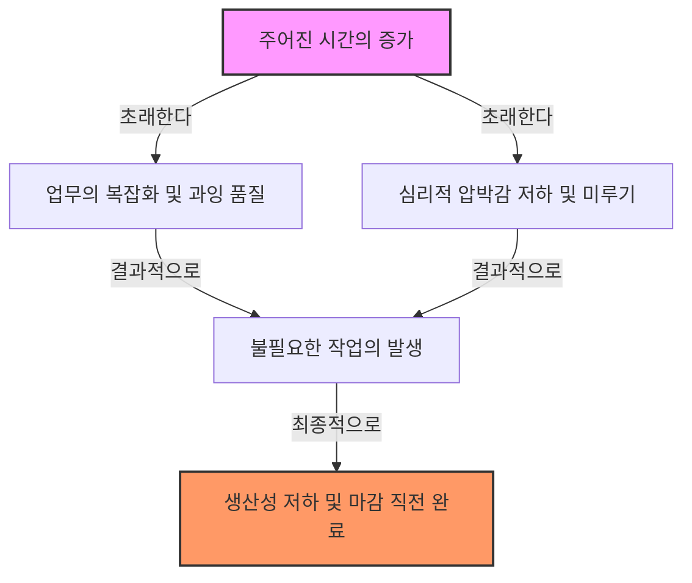
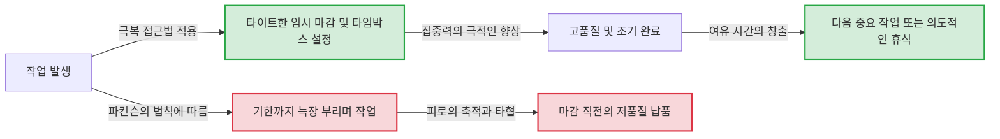

# 서론: 왜 우리의 업무는 항상 마감 기한에 임박해서야 끝날까?

"아직 1주일이나 남았으니까 괜찮아"라고 생각하며 시작한 프로젝트가, 어째서인지 마지막 날 심야까지 끝나지 않는다. 여름 방학 숙제는 항상 8월 31일에 울면서 했었다. 회의 시간이 1시간으로 설정되어 있으면, 5분이면 끝날 안건이라도 꽉 채워 1시간 동안 논의가 이어진다…….
누구나 한 번쯤 경험해 보았을 이러한 현상은 결코 당신의 의지가 약해서도, 능력이 낮아서도 아닙니다. 이는 인간과 조직의 행동 원리를 날카롭게 찌른 '파킨슨의 법칙(Parkinson’s Law)'이라 불리는 보편적인 법칙으로 설명할 수 있습니다.

본 기사에서는 이 파킨슨의 법칙에 대해, 그 역사적 배경부터 심리적인 메커니즘, 그리고 현대의 비즈니스나 일상생활에서 어떻게 이 주술에서 벗어나 생산성을 극적으로 향상시킬 수 있을지에 대해 수천 자에 달하는 상세한 해설을 진행합니다. 시간 관리나 프로젝트 관리, 나아가 개인의 가계 관리에 고민하는 모든 분들에게 필독해야 할 완전한 가이드가 될 것입니다.

---

# 제1법칙: "일은 완성을 위해 주어진 시간을 다 채울 때까지 팽창한다"

파킨슨의 법칙 중에서도 가장 유명하며, 핵심이 되는 것이 이 제1법칙입니다. 영어로는 **"Work expands so as to fill the time available for its completion."**으로 표현됩니다.

## 역사적 배경과 시릴 노스코트 파킨슨

이 법칙은 1955년에 영국의 역사학자이자 정치학자이기도 했던 시릴 노스코트 파킨슨(Cyril Northcote Parkinson)이 경제 잡지 '이코노미스트'에 발표한 에세이에서 처음 제창되었습니다. 그 후, 1958년에 '파킨슨의 법칙: 진보의 추구'라는 책으로 출판되어 세계적인 베스트셀러가 되었습니다.

파킨슨은 영국의 관료 조직(특히 해군성과 식민지성)의 데이터를 면밀히 관찰했습니다. 놀랍게도 제1차 세계 대전 이후, 대영제국 해군의 함정 수나 장병 수가 극적으로 감소하고 있음에도 불구하고, 해군성의 사무 관리 수는 매년 계속해서 증가하고 있었던 것입니다. 식민지성에서도 마찬가지로, 관리해야 할 식민지가 감소하고 있는데도 직원의 수는 증대하고 있었습니다.
여기에서 파킨슨은 "업무의 양과 관리의 수는 무관하게 계속 증가한다"는 관료제의 병폐를 찾아냈습니다.

## 심리적 메커니즘: 왜 시간은 채워져 버리는 걸까?

일이 시간을 채울 때까지 팽창해 버리는 배경에는 인간의 심리적인 편향이 강하게 작용하고 있습니다.

1. **복잡화의 착각**
   시간이 넉넉하면 인간은 그 일을 "중요하고 복잡한 것"으로 무의식적으로 간주하는 경향이 있습니다. 본래라면 간단한 보고서로 끝날 일에 과도한 장식을 더하거나, 불필요한 데이터를 추가하거나 해서 스스로 작업의 난이도를 높여 버리는 것입니다.
2. **완벽주의의 함정**
   시간이 허락하는 한 "더 잘할 수 있지 않을까"라며 수정을 거듭해 버립니다. 파레토의 법칙(80:20의 법칙)에 따르면, 80%의 성과를 내기 위해 필요한 시간은 20%이지만, 나머지 20%의 품질을 완벽하게 만들기 위해 80%의 시간을 낭비해 버립니다.
3. **미루기(Procrastination)**
   기한이 멀면 인간은 행동을 일으킬 동기 부여(모티베이션)가 저하됩니다. "아직 시간이 있다"는 안도감이 긴장감을 빼앗고, 결과적으로 마감 기한에 임박할 때까지 진지하게 임하지 않는 사태를 초래합니다.

## 현대 비즈니스의 구체적인 예

- **회의의 장기화**: 1시간의 회의 시간을 잡으면, 실제로는 15분 만에 결론이 날 안건이라도 여담이나 불필요한 논의가 전개되어 꽉 채워 1시간을 소비하게 됩니다.
- **예산 소진**: 연말이 되면 남은 예산을 다 쓰기 위해 불필요한 비품을 구매하거나, 급조된 프로젝트를 시작하거나 하는 현상입니다.
- **소프트웨어 개발**: 납기가 너무 길면 개발팀은 "있으면 편리할지도 모른다"는 과도한 기능(피처 크립)을 구현하려 하고, 결과적으로 핵심 기능의 버그 수정 시간을 압박하게 됩니다.

---

# 【도해】 파킨슨의 법칙의 메커니즘

말뿐만 아니라, 시각적으로도 파킨슨의 법칙의 무서움을 확인해 봅시다. 아래의 그림은 주어진 시간이 어떻게 업무의 비대화와 생산성의 저하를 초래하는지를 나타낸 것입니다.

시간이라는 자원은, 풍부하면 풍부할수록 효율적으로 사용되는 것이 아니라, 오히려 낭비를 낳는 온상이 되어 버린다는 역설이 여기에 있습니다.

---

# 제2법칙: "지출은 수입액에 도달할 때까지 팽창한다"

파킨슨의 법칙은 시간 관리(업무량)뿐만 아니라, 재무나 돈 관리에서도 강력한 법칙을 가지고 있습니다. 그것이 제2법칙입니다.

## 라이프스타일 크립(생활 수준의 인플레이션)

급여가 올랐을 텐데 어째서인지 수중에 돈이 남지 않는다. 보너스가 나왔으니 저금하려고 생각했는데, 정신 차려보니 전부 써버렸다. 이것이야말로 제2법칙의 전형적인 예입니다.
사람은 수입이 늘어나면, 그에 비례하여 생활 수준을 무의식적으로 올려 버립니다. "조금 좋은 레스토랑에 간다", "한 단계 위의 월세방으로 이사한다", "구독 서비스를 늘려 버린다"와 같은 식입니다. 이를 경제 심리학에서는 '라이프스타일 크립'이라고 부릅니다.

## 기업에서의 예산 관리의 함정

이 법칙은 개인의 가계뿐만 아니라 기업이나 국가의 재정에도 들어맞습니다. 부서별로 예산이 할당되면 매니저는 그 예산을 1원도 남기지 않고 다 쓰려고 합니다. 왜냐하면, 예산을 남겨버리면 "다음 기수에는 이 부서에 그렇게 많은 예산이 필요하지 않다"고 판단되어 예산이 삭감되어 버리기 때문입니다(예산 소진의 인센티브).
그 결과, 진정으로 필요한 투자가 아니라 '예산을 다 쓰기 위한 지출'이 일상화되어, 조직 전체의 이익률을 압박합니다.

---

# 제3법칙?: 파킨슨의 범용 법칙(사소함의 법칙)

엄밀히는 제1, 제2법칙에 이어지는 형태지만, 파킨슨은 '범용 법칙(Law of Triviality)'이라는 매우 흥미로운 개념도 제창했습니다.
이것은 **"조직은 사소한 일에 불균형할 정도로 많은 시간을 할애한다"**는 법칙입니다.

파킨슨은 이를 '원자력 발전소 건설과 자전거 보관소 건설'이라는 회의의 예로 설명했습니다.
- **원자력 발전소 건설안(수백만 달러)**: 너무 전문적이어서 대부분의 이사는 이해하지 못하고, 아무도 발언하지 않기 때문에 단 몇 분 만에 승인된다.
- **직원용 자전거 보관소의 지붕 소재(수십 달러)**: 누구나 이해할 수 있고, 누구나 의견을 말할 수 있기 때문에 "함석이 좋다", "아니, 알루미늄으로 해야 한다"라며 몇 시간이나 격론이 오간다.

이처럼 다루는 금액이나 사안의 중요도와, 거기에 소비되는 논의의 시간은 반비례한다는 무서운 법칙입니다. 이를 알아두지 않으면, 당신의 팀도 '자전거 보관소'의 논의에 귀중한 시간을 계속 빼앗기게 될 것입니다.

---

# 파킨슨의 법칙을 타파하기 위한 실천적 접근법

지금까지 파킨슨의 법칙이 얼마나 우리의 시간이나 돈, 조직의 생산성을 좀먹는지를 살펴보았습니다. 그렇다면 우리는 이 법칙에 어떻게 맞서야 할까요? 구체적인 극복 방법을 해설합니다.

## 【시간 관리 편】

### 1. 인위적인 마감 기한의 설정(타임박스 기법)
주어진 시간이 꽉 찬다면, 인위적으로 시간을 짧게 설정해 버리면 됩니다. 작업에 대해 "실제로는 어느 정도면 될까"를 예측하여, 그 최단 시간을 기한으로 설정합니다.
더욱 강력한 것이 '타임박스 기법'입니다. "이 작업에는 30분만 쓴다"고 상자(박스)를 나누고, 타이머를 맞춰 강제로 작업을 종료시킵니다. 뽀모도로 테크닉(25분 작업 + 5분 휴식)도 이 원리를 응용한 것입니다.

### 2. 작업의 극소화(마이크로 태스크 관리)
큰 작업(예: "프로젝트 계획서를 작성한다")은 기한까지의 여백이 크기 때문에 팽창하기 쉽습니다. 이를 "제목을 정한다(5분)", "목차를 만든다(15분)", "필요한 데이터를 모은다(30분)"처럼 수 분~수십 분 만에 끝나는 수준까지 극소화(브레이크다운)합니다. 이를 통해 하나하나의 작업에 대한 팽창의 여지를 물리적으로 없앱니다.

### 3. "Done is better than perfect"의 정신
완벽을 추구하기 때문에 시간이 팽창하는 것입니다. Facebook(현 Meta)의 창업자 마크 저커버그의 유명한 말 "완벽을 추구하기보다 끝내라"를 의식합시다. 우선은 60점짜리라도 좋으니 가장 빠른 속도로 형태를 갖추고, 남는 시간으로 다듬어 가는 '프로토타입 사고'를 도입하는 것이 중요합니다.

## 【도해】 극복 접근법에 의한 워크플로우의 변화

파킨슨의 법칙에 휩쓸렸을 경우와 인위적인 마감 기한을 두었을 경우의 워크플로우의 차이를 도해합니다.

## 【재무 및 예산 편】

### 1. 선취 저축
"남은 돈을 저금한다"는 생각은 제2법칙에 의해 반드시 실패합니다. 수입이 들어온 순간에 공제나 자동 이체로 '저금'이나 '투자'로 자금을 이동시켜 버리는 '선취 저축'이 유일한 해결책입니다. 강제적으로 '쓸 수 있는 돈(주어지는 예산)'을 줄임으로써, 그 틀 안에서 생활을 꾸려 나가게 됩니다.

### 2. 제로베이스 예산
기업에서의 예산 낭비를 막으려면 전년도의 예산을 베이스로 하는 것이 아니라, 매년 "정말로 필요한 사업은 무엇인가"를 제로에서 검토하는 '제로베이스 예산(ZBB)' 기법이 유효합니다. 과거의 타성으로 인한 지출의 팽창을 리셋할 수 있습니다.

---

# 요약: 파킨슨의 법칙을 '내 편'으로 만들기

파킨슨의 법칙은 인간의 본질적인 약점을 지적한 냉혹한 법칙입니다. 하지만 이 법칙의 메커니즘을 깊이 이해하면, 반대로 그것을 '해킹'하여 자신의 편으로 만들 수 있습니다.

- 시간이 남는다면, 굳이 기한을 앞당겨서 '제약'을 만든다.
- 돈이 늘어났다면, 굳이 쓸 수 있는 한도를 좁혀서 '제약'을 만든다.

인간은 제약이 없는 상태에서는 낭비를 낳지만, **적절한 제약 하에서는 믿을 수 없을 정도의 집중력과 창조성을 발휘합니다.**
오늘부터 당신의 업무나 생활에 의도적인 '타이트한 틀'을 마련해 보세요. 지금까지 1주일 걸렸던 일이 단 하루 만에 끝나는 마법 같은 체험을 할 수 있을 것입니다. 파킨슨의 법칙을 지배하는 자가 시간과 인생을 지배하는 것입니다.
