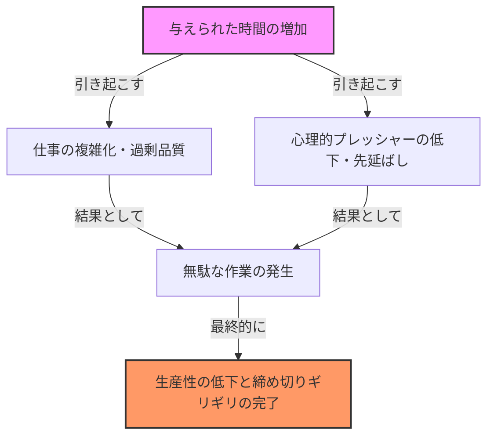
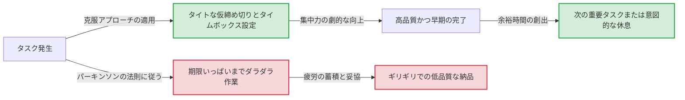

# はじめに：なぜ私たちの仕事は常に締め切りギリギリになるのか？

「あと1週間あるから大丈夫」と思って始めたプロジェクトが、なぜか最終日の深夜まで終わらない。夏休みの宿題はいつも8月31日に泣きながらやっていた。会議の時間は1時間と設定されていれば、5分で終わるような議題でもきっちり1時間議論が続いてしまう……。
誰もが一度は経験したことのあるこれらの現象は、決してあなたの意志が弱いからでも、能力が低いからでもありません。これは、人間と組織の行動原理を鋭く突いた「パーキンソンの法則（Parkinson’s Law）」と呼ばれる普遍的な法則によって説明がつきます。

本記事では、このパーキンソンの法則について、その歴史的背景から心理的なメカニズム、そして現代のビジネスや日常生活においてどのようにこの呪縛から逃れ、生産性を劇的に向上させるかについて、数千文字に及ぶ詳細な解説を行います。時間管理やプロジェクト管理、さらには個人の家計管理に悩むすべての方にとって、必読の完全ガイドとなるはずです。

---

# 第一法則：「仕事は完成のために与えられた時間を満たすまで膨張する」

パーキンソンの法則の中で最も有名であり、核となるのがこの第一法則です。英語では **"Work expands so as to fill the time available for its completion."** と表現されます。

## 歴史的背景とシリル・ノースコート・パーキンソン

この法則は、1955年にイギリスの歴史学者であり政治学者でもあったシリル・ノースコート・パーキンソン（Cyril Northcote Parkinson）が、経済誌『エコノミスト』に発表したエッセイの中で初めて提唱されました。その後、1958年に『パーキンソンの法則：進歩の追求』という書籍として出版され、世界的なベストセラーとなりました。

パーキンソンは、イギリスの官僚組織（特に海軍省と植民地省）のデータをつぶさに観察しました。驚くべきことに、第一次世界大戦以降、大英帝国の海軍の艦艇数や将兵の数が劇的に減少しているにもかかわらず、海軍省の事務役人の数は年々増加し続けていたのです。植民地省においても同様に、管理すべき植民地が減少しているのに、職員の数は増大していました。
ここからパーキンソンは、「仕事の量と役人の数は無関係に増え続ける」という官僚制の病理を見出しました。

## 心理的メカニズム：なぜ時間は埋まってしまうのか？

仕事が時間を満たすまで膨張してしまう背景には、人間の心理的なバイアスが強く働いています。

1. **複雑化の錯覚**
   時間がたっぷりあると、人間はその仕事を「重要で複雑なもの」と無意識に見なす傾向があります。本来ならシンプルな報告書で済むものに、過剰な装飾を施したり、不要なデータを追加したりして、自らタスクの難易度を上げてしまうのです。
2. **完璧主義の罠**
   時間が許す限り「もっと良くできるのではないか」と推敲を重ねてしまいます。パレートの法則（80:20の法則）によれば、80%の成果を出すために必要な時間は20%ですが、残りの20%の品質を完璧にするために80%の時間を浪費してしまいます。
3. **先延ばし（プロクラスティネーション）**
   期限が遠いと、人間は行動を起こす動機づけ（モチベーション）が低下します。「まだ時間がある」という安心感が緊張感を奪い、結果的にギリギリになるまで本気で取り組まないという事態を引き起こします。

## 現代のビジネスにおける具体例

- **会議の長期化**: 1時間の会議枠を取ると、実際には15分で結論が出る議題でも、余談や不要な議論が展開され、きっちり1時間消費されます。
- **予算消化**: 年度末になると、余った予算を使い切るために不必要な備品を購入したり、急ごしらえのプロジェクトを立ち上げたりする現象です。
- **ソフトウェア開発**: 納期が長すぎると、開発チームは「あれば便利かもしれない」という過剰な機能（フィーチャークリープ）を実装しようとし、結果的にコア機能のバグ取り時間が圧迫されます。

---

# 【図解】パーキンソンの法則のメカニズム

言葉だけでなく、視覚的にもパーキンソンの法則の恐ろしさを確認してみましょう。以下の図は、与えられた時間がどのようにして仕事の肥大化と生産性の低下を招くかを示したものです。

時間というリソースは、豊富にあればあるほど効率的に使われるわけではなく、むしろ無駄を生み出す温床になってしまうというパラドックスがここにあります。

---

# 第二法則：「支出は収入の額に達するまで膨張する」

パーキンソンの法則は、時間管理（仕事量）だけでなく、財務やお金の管理においても強力な法則を持っています。それが第二法則です。

## ライフスタイル・クリープ（生活水準のインフレ）

給料が上がったはずなのに、なぜか手元にお金が残らない。ボーナスが出たから貯金しようと思っていたのに、気づいたらすべて使い切っていた。これこそが第二法則の典型的な例です。
人は収入が増えると、それに比例して生活水準を無意識に上げてしまいます。「少し良いレストランに行く」「ワンランク上の家賃の部屋に引っ越す」「サブスクリプションサービスを増やしてしまう」といった具合です。これを経済心理学では「ライフスタイル・クリープ」と呼びます。

## 企業における予算管理の罠

この法則は個人の家計だけでなく、企業や国家の財政にも当てはまります。部門ごとに予算が割り当てられると、マネージャーはその予算を1円残らず使い切ろうとします。なぜなら、予算を余らせてしまうと「来期はこの部門にはそれほど多くの予算は必要ない」と判断され、予算を削減されてしまうからです（予算消化のインセンティブ）。
その結果、真に必要な投資ではなく、「予算を使い切るための支出」が常態化し、組織全体の利益率を圧迫します。

---

# 第三法則？：パーキンソンの凡庸法則（自転車置き場の議論）

厳密には第一・第二法則に連なる形ですが、パーキンソンは「凡庸法則（Law of Triviality）」という非常に興味深い概念も提唱しています。
これは**「組織は、些細な物事に対して、不釣り合いなほど多くの時間を費やす」**という法則です。

パーキンソンはこれを「原子力発電所の建設と、自転車置き場の建設」という会議の例で説明しました。
- **原子力発電所の建設案（数百万ドル）**: 専門的すぎてほとんどの取締役は理解できず、誰も発言しないため、わずか数分で承認される。
- **従業員用自転車置き場の屋根の素材（数十ドル）**: 誰でも理解でき、誰もが意見を言えるため、「トタンが良い」「いや、アルミにすべきだ」と何時間も激論が交わされる。

このように、取り扱う金額や事象の重要度と、それに費やされる議論の時間は反比例するという恐ろしい法則です。これを知っておかなければ、あなたのチームも「自転車置き場」の議論に貴重な時間を奪われ続けることになります。

---

# パーキンソンの法則を打ち破るための実践的アプローチ

ここまで、パーキンソンの法則がいかに私たちの時間やお金、組織の生産性を蝕むかを見てきました。では、私たちはこの法則にどう立ち向かえば良いのでしょうか？具体的な克服法を解説します。

## 【時間管理編】

### 1. 人工的な締め切りの設定（タイムボックス法）
与えられた時間がいっぱいになるなら、人為的に時間を短く設定してしまえば良いのです。タスクに対して「本当はどれくらいでできるか」を見積もり、その最短の時間を期限として設定します。
さらに強力なのが「タイムボックス法」です。「このタスクには30分しかかけない」と箱（ボックス）を区切り、タイマーをセットして強制的に作業を終了させます。ポモドーロ・テクニック（25分作業＋5分休憩）もこの原理を応用したものです。

### 2. タスクの極小化（マイクロタスク管理）
大きなタスク（例：「プロジェクト計画書を作成する」）は、期限までの余白が大きいため膨張しやすくなります。これを「タイトルを決める（5分）」「目次を作る（15分）」「必要なデータを集める（30分）」のように、数分〜数十分で終わるレベルまで極小化（ブレイクダウン）します。これにより、一つ一つのタスクに対する膨張の余地を物理的になくします。

### 3. 「Done is better than perfect」の精神
完璧を目指すから時間が膨張するのです。Facebook（現Meta）の創業者マーク・ザッカーバーグの有名な言葉「完璧を目指すより終わらせろ」を意識しましょう。まずは60点の出来で良いので最速で形にし、余った時間でブラッシュアップする「プロトタイプ思考」を取り入れることが重要です。

## 【図解】克服アプローチによるワークフローの変化

パーキンソンの法則に流された場合と、人工的な締め切りを設けた場合のワークフローの違いを図解します。

## 【財務・予算編】

### 1. 先取り貯蓄
「残ったお金を貯金する」という考え方は、第二法則によって必ず失敗します。収入が入った瞬間に、天引きや自動振替で「貯金」や「投資」に資金を移動させてしまう「先取り貯蓄」が唯一の解決策です。強制的に「使えるお金（与えられた予算）」を減らすことで、その枠内で生活をやりくりするようになります。

### 2. ゼロベース予算
企業における予算の無駄遣いを防ぐには、前年度の予算をベースにするのではなく、毎年「本当に必要な事業は何か」をゼロから検討する「ゼロベース予算（ZBB）」の手法が有効です。過去の惰性による支出の膨張をリセットすることができます。

---

# まとめ：パーキンソンの法則を「味方」につける

パーキンソンの法則は、人間の本質的な弱さを指摘した冷酷な法則です。しかし、この法則のメカニズムを深く理解すれば、逆にそれを「ハック」して自分の味方につけることができます。

- 時間が余っているなら、あえて期限を前倒しして「制約」を作る。
- お金が増えたなら、あえて使える枠を狭めて「制約」を作る。

人間は、制約がない状態では無駄を生み出しますが、**適度な制約の下では信じられないほどの集中力と創造性を発揮します。**
今日から、あなたの仕事や生活に意図的な「タイトな枠」を設けてみてください。これまで1週間かかっていた仕事が、たった1日で終わる魔法のような体験ができるはずです。パーキンソンの法則を制する者が、時間と人生を制するのです。
