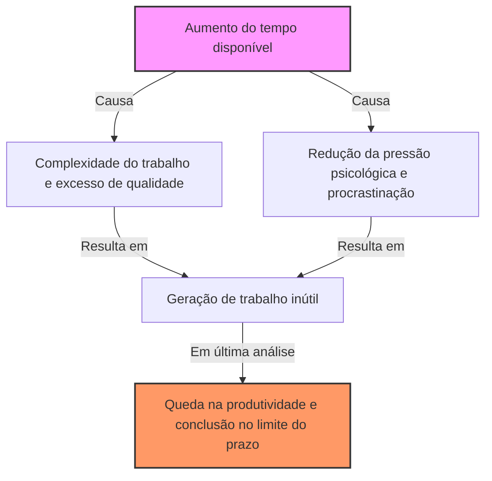
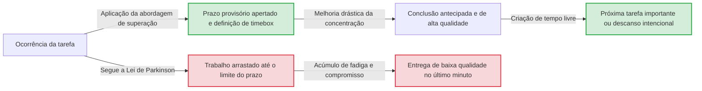

# Introdução: Por que nosso trabalho está sempre no limite do prazo?

Aquele projeto que você começou pensando "Tudo bem, ainda tenho uma semana", por algum motivo só termina de madrugada no último dia. A lição de casa das férias de verão sempre era feita chorando no dia 31 de agosto. Se o tempo de uma reunião está definido para 1 hora, mesmo que seja um tópico que possa ser concluído em 5 minutos, a discussão continuará exatamente por 1 hora...
Esses fenômenos que todos já experimentaram pelo menos uma vez não são de forma alguma porque sua força de vontade é fraca ou sua habilidade é baixa. Isso pode ser explicado por uma lei universal chamada "Lei de Parkinson" (Parkinson's Law), que aponta nitidamente para os princípios de comportamento humano e organizacional.

Neste artigo, explicaremos detalhadamente a Lei de Parkinson, desde seu contexto histórico até o mecanismo psicológico e como escapar dessa maldição nos negócios modernos e na vida cotidiana para melhorar drasticamente a produtividade, em milhares de caracteres. Deve ser um guia completo de leitura obrigatória para todos que lutam com gestão de tempo, gestão de projetos e até mesmo finanças pessoais.

---

# A Primeira Lei: "O trabalho se expande de modo a preencher o tempo disponível para a sua realização"

A mais famosa e central das Leis de Parkinson é esta Primeira Lei. Em inglês, é expressa como **"Work expands so as to fill the time available for its completion."**

## Contexto Histórico e Cyril Northcote Parkinson

Esta lei foi proposta pela primeira vez em 1955 em um ensaio publicado na revista econômica "The Economist" pelo historiador e cientista político britânico Cyril Northcote Parkinson. Mais tarde, em 1958, foi publicado como o livro "Parkinson's Law: The Pursuit of Progress" e se tornou um best-seller mundial.

Parkinson observou de perto os dados de organizações burocráticas britânicas (especialmente o Almirantado e o Escritório Colonial). Surpreendentemente, desde a Primeira Guerra Mundial, embora o número de navios e militares da Marinha do Império Britânico tenha diminuído drasticamente, o número de oficiais administrativos no Almirantado continuou a aumentar ano a ano. Da mesma forma, no Escritório Colonial, embora o número de colônias a serem administradas estivesse diminuindo, o número de funcionários estava aumentando.
A partir disso, Parkinson descobriu a patologia da burocracia, onde "a quantidade de trabalho e o número de oficiais continuam a aumentar independentemente um do outro".

## Mecanismo Psicológico: Por que o tempo se esgota?

Por trás do trabalho que se expande para preencher o tempo, fortes vieses psicológicos humanos estão em jogo.

1. **Ilusão da Complexidade**
   Quando há muito tempo disponível, as pessoas tendem a considerar inconscientemente o trabalho como "importante e complexo". Elas mesmas aumentam a dificuldade da tarefa adicionando decorações excessivas ou dados desnecessários a algo que normalmente bastaria um relatório simples.
2. **A Armadilha do Perfeccionismo**
   Enquanto o tempo permitir, você continuará a revisar, pensando: "Não posso fazer melhor?". De acordo com o Princípio de Pareto (regra 80:20), leva 20% do tempo para produzir 80% dos resultados, mas desperdiça-se 80% do tempo para aperfeiçoar os 20% restantes da qualidade.
3. **Procrastinação**
   Quando o prazo está longe, a motivação das pessoas para agir diminui. A sensação de segurança de que "ainda há tempo" tira o senso de urgência, resultando em uma situação em que não trabalham seriamente até o último minuto.

## Exemplos Concretos em Negócios Modernos

- **Prolongamento de Reuniões**: Se você reservar uma reunião de 1 hora, mesmo que o tópico chegue a uma conclusão em 15 minutos, digressões e discussões desnecessárias ocorrerão, consumindo exatamente 1 hora.
- **Consumo de Orçamento**: No final do ano fiscal, é o fenômeno de comprar suprimentos desnecessários ou lançar projetos apressados para gastar o orçamento restante.
- **Desenvolvimento de Software**: Se o prazo for muito longo, a equipe de desenvolvimento tentará implementar recursos excessivos (feature creep) pensando "pode ser útil ter", comprimindo, como resultado, o tempo de correção de bugs das funcionalidades principais.

---

# [Diagrama] O Mecanismo da Lei de Parkinson

Vamos verificar a terrível natureza da Lei de Parkinson visualmente, bem como em palavras. A figura abaixo mostra como o tempo dado leva ao inchaço do trabalho e ao declínio da produtividade.

O paradoxo aqui é que quanto mais abundante for o recurso de tempo, não significa que será usado com mais eficiência, mas se torna um terreno fértil para o desperdício.

---

# A Segunda Lei: "As despesas se expandem para atingir o valor da renda"

A Lei de Parkinson tem um forte princípio não apenas no gerenciamento de tempo (carga de trabalho), mas também nas finanças e na gestão de dinheiro. Essa é a Segunda Lei.

## Aumento do Estilo de Vida (Inflação do Padrão de Vida)

O salário deveria ter aumentado, mas por algum motivo não sobrou dinheiro em mãos. Eu pretendia economizar porque recebi um bônus, mas quando percebi, havia gasto tudo. Este é o exemplo clássico da Segunda Lei.
Quando a renda das pessoas aumenta, elas aumentam inconscientemente seu padrão de vida em proporção a ela. Isso significa "ir a um restaurante um pouco melhor", "mudar para um apartamento com aluguel mais alto" e "aumentar os serviços de assinatura". Na psicologia econômica, isso é chamado de "lifestyle creep" (aumento do estilo de vida).

## A Armadilha da Gestão Orçamentária nas Empresas

Essa lei se aplica não apenas às finanças das famílias, mas também às finanças das corporações e dos estados. Quando um orçamento é alocado a cada departamento, o gerente tenta gastar cada centavo desse orçamento. O motivo é que, se sobrar orçamento, julgar-se-á que "este departamento não precisa de muito orçamento no próximo período" e o orçamento será cortado (incentivo para gastar o orçamento).
Como resultado, em vez de um investimento verdadeiramente necessário, as "despesas para gastar o orçamento" tornam-se a norma, pressionando a margem de lucro de toda a organização.

---

# A Terceira Lei?: A Lei da Trivialidade de Parkinson (A Discussão do Abrigo de Bicicletas)

Estritamente falando, está ligada à Primeira e à Segunda Leis, mas Parkinson também propôs um conceito muito interessante chamado "Lei da Trivialidade" (Law of Triviality).
Esta é a lei que **"as organizações gastam uma quantidade desproporcional de tempo em coisas triviais"**.

Parkinson explicou isso com o exemplo de uma reunião sobre a "construção de uma usina nuclear e a construção de um abrigo de bicicletas".
- **Plano de construção da usina nuclear (milhões de dólares)**: Muito técnico para a maioria dos diretores entender e ninguém fala, então é aprovado em apenas alguns minutos.
- **O material do teto do abrigo de bicicletas dos funcionários (dezenas de dólares)**: Qualquer um pode entender e dar sua opinião, então discute-se vigorosamente por horas dizendo coisas como "zinco é melhor" ou "não, deve ser de alumínio".

Dessa forma, é uma lei terrível em que a quantidade de dinheiro e a importância do evento são inversamente proporcionais ao tempo de discussão gasto com ele. Se você não souber disso, sua equipe continuará a perder um tempo valioso discutindo sobre "abrigos de bicicletas".

---

# Uma Abordagem Prática para Superar a Lei de Parkinson

Até agora, vimos como a Lei de Parkinson consome nosso tempo, dinheiro e a produtividade de nossa organização. Então, como devemos enfrentar esta lei? Explicaremos métodos específicos para superá-la.

## [Seção de Gestão de Tempo]

### 1. Estabelecimento de Prazos Artificiais (Método Timeboxing)
Se o tempo dado for preenchido, você pode simplesmente definir um tempo artificialmente mais curto. Estime "quanto tempo realmente levará para ser feito" para a tarefa e defina esse tempo mais curto como o prazo final.
Ainda mais poderoso é o "método timeboxing". Divida o tempo em caixas, como "Vou gastar apenas 30 minutos nesta tarefa", defina um temporizador e force a tarefa a terminar. A Técnica Pomodoro (25 minutos de trabalho + 5 minutos de descanso) também aplica esse princípio.

### 2. Minimização de Tarefas (Microgestão de Tarefas)
Uma tarefa grande (por exemplo, "Criar um plano de projeto") tem muita margem antes do prazo, então tende a inflar. Divida-a para um nível que leve de alguns a dezenas de minutos para terminar, como "Decidir o título (5 minutos)", "Fazer o índice (15 minutos)", "Coletar os dados necessários (30 minutos)". Ao fazer isso, a margem de inflação física para cada tarefa é eliminada.

### 3. O Espírito de "Feito é melhor que perfeito"
O tempo se expande porque você busca a perfeição. Vamos estar cientes da famosa frase do fundador do Facebook (agora Meta), Mark Zuckerberg, "Feito é melhor que perfeito". É importante primeiro dar forma o mais rápido possível, pois um trabalho com nota 60 é aceitável, e introduzir o "pensamento de protótipo" para refinar no tempo restante.

## [Diagrama] Mudanças no Fluxo de Trabalho devido à Abordagem de Superação

O diagrama ilustra a diferença no fluxo de trabalho quando levado pela Lei de Parkinson e quando se estabelece um prazo artificial.

## [Seção de Finanças e Orçamento]

### 1. Poupança Antecipada
A ideia de "economizar o dinheiro que sobra" falhará invariavelmente devido à Segunda Lei. A única solução é a "poupança antecipada", em que os fundos são transferidos para "poupança" ou "investimentos" por dedução ou transferência automática no momento em que a renda entra. Ao reduzir compulsóriamente o "dinheiro utilizável (orçamento dado)", você poderá administrar sua vida dentro desse limite.

### 2. Orçamento Base Zero
Para evitar o desperdício orçamentário nas empresas, em vez de se basear no orçamento do ano anterior, é eficaz o método "Orçamento Base Zero (OBZ)", que examina a cada ano "quais projetos são realmente necessários" do zero. Você pode redefinir o inchaço dos gastos devido à inércia do passado.

---

# Conclusão: Tornando a Lei de Parkinson uma "Aliada"

A Lei de Parkinson é uma lei implacável que aponta para a fraqueza essencial dos seres humanos. No entanto, se você entender profundamente o mecanismo dessa lei, poderá "hackeá-la" para se tornar sua aliada.

- Se sobrar tempo, ouse antecipar o prazo e crie "restrições".
- Se o dinheiro aumentar, ouse diminuir o limite utilizável e crie "restrições".

Os humanos criam desperdício quando não há restrições, mas **sob restrições moderadas, exibem uma incrível capacidade de concentração e criatividade.**
A partir de hoje, tente colocar intencionalmente um "limite apertado" no seu trabalho e na sua vida. Você deve ter a experiência mágica de um trabalho que costumava levar uma semana terminar em apenas um dia. Quem domina a Lei de Parkinson, domina seu tempo e sua vida.
