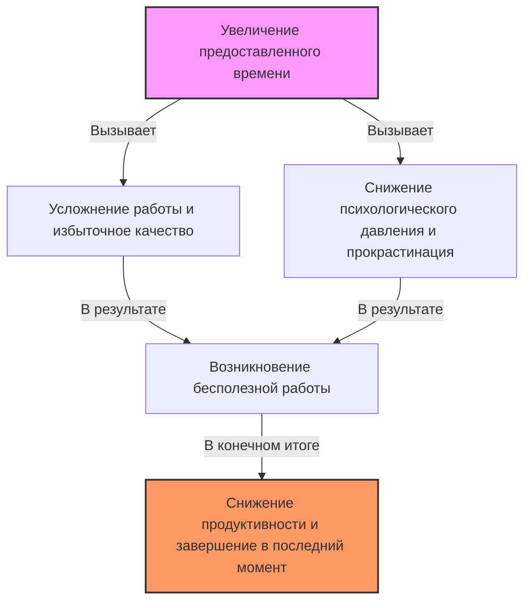
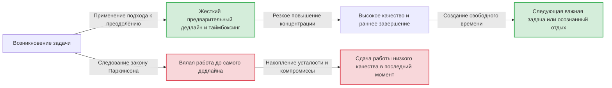

# Введение: Почему мы всегда делаем работу в самый последний момент?

Проект, который вы начали с мыслью "Впереди еще целая неделя, все будет в порядке", почему-то не заканчивается до поздней ночи последнего дня. Летние школьные задания мы всегда делали со слезами на глазах 31 августа. Если время собрания установлено в 1 час, дискуссия будет продолжаться ровно 1 час, даже если обсуждаемый вопрос можно было бы решить за 5 минут...
Эти явления, которые каждый из нас хоть раз в жизни испытывал, происходят не потому, что у вас слабая воля или низкие способности. Это можно объяснить универсальным правилом, известным как "закон Паркинсона", которое точно описывает принципы поведения людей и организаций.

В этой статье мы подробно, на нескольких тысячах слов, разберем этот закон Паркинсона: от его исторического контекста и психологических механизмов до того, как освободиться от этого проклятия и кардинально повысить свою продуктивность в современном бизнесе и повседневной жизни. Это руководство станет обязательным к прочтению для всех, кто испытывает трудности с управлением временем, управлением проектами или даже личными финансами.

---

# Первый закон: "Работа заполняет время, отпущенное на неё"

Самым известным и основным в законе Паркинсона является этот первый закон. По-английски он звучит так: **"Work expands so as to fill the time available for its completion."**

## Исторический контекст и Сирил Норткот Паркинсон

Этот закон был впервые сформулирован в 1955 году британским историком и политологом Сирилом Норткотом Паркинсоном (Cyril Northcote Parkinson) в эссе, опубликованном в экономическом журнале "The Economist". Позже, в 1958 году, он был издан в виде книги "Закон Паркинсона: Погоня за прогрессом" и стал мировым бестселлером.

Паркинсон внимательно изучил данные британских бюрократических организаций (в частности, Адмиралтейства и Министерства по делам колоний). К его удивлению, несмотря на то, что со времен Первой мировой войны количество кораблей и моряков Британской империи резко сократилось, число чиновников в Адмиралтействе продолжало расти из года в год. Аналогичная ситуация была и в Министерстве по делам колоний: количество управляемых колоний сокращалось, а число сотрудников увеличивалось.
Отсюда Паркинсон выявил патологию бюрократии: "Объем работы и количество чиновников продолжают расти независимо друг от друга".

## Психологический механизм: Почему время заполняется?

За разрастанием работы до заполнения отпущенного времени скрываются сильные психологические искажения человека.

1. **Иллюзия сложности**
   Когда времени много, люди склонны бессознательно считать задачу "важной и сложной". Они сами усложняют задачу, добавляя излишние украшения или ненужные данные в отчет, который изначально мог бы быть простым.
2. **Ловушка перфекционизма**
   Пока позволяет время, человек продолжает вносить исправления, думая, что "можно сделать еще лучше". Согласно принципу Парето (правило 80/20), время, необходимое для достижения 80% результата, составляет 20%, но мы тратим 80% времени впустую, пытаясь довести оставшиеся 20% качества до совершенства.
3. **Прокрастинация (откладывание на потом)**
   Если срок сдачи далеко, мотивация к действию снижается. Ощущение безопасности, что "еще есть время", лишает напряжения, в результате чего мы не беремся за работу всерьез до самой последней минуты.

## Конкретные примеры в современном бизнесе

- **Затягивание совещаний**: Если забронировать 1 час для совещания, даже если вопрос можно решить за 15 минут, неизбежно возникнут отступления и ненужные дискуссии, которые займут ровно 1 час.
- **Освоение бюджета**: В конце финансового года возникает явление, когда закупаются ненужные принадлежности или запускаются поспешные проекты, просто чтобы потратить оставшийся бюджет.
- **Разработка программного обеспечения**: При слишком длительных сроках команда разработчиков пытается внедрить избыточные функции ("разрастание функций", или feature creep), которые "могли бы быть удобными", что в итоге сокращает время, отведенное на исправление ошибок в основных функциях.

---

# 【Схема】 Механизм закона Паркинсона

Давайте визуально оценим пугающую силу закона Паркинсона. На схеме ниже показано, как предоставленное время приводит к раздуванию работы и снижению продуктивности.

Парадокс заключается в том, что чем больше у нас такого ресурса, как время, тем менее эффективно он используется и тем больше он становится рассадником расточительства.

---

# Второй закон: "Расходы растут пропорционально доходам"

Закон Паркинсона является мощным правилом не только в управлении временем (объемом работы), но и в управлении финансами и деньгами. Это и есть второй закон.

## Ползучий образ жизни (инфляция уровня жизни)

Зарплата вроде бы выросла, но почему-то денег на руках не остается. Собирались отложить полученную премию, но не заметили, как потратили все до копейки. Это типичные примеры второго закона.
Когда у людей увеличиваются доходы, они бессознательно пропорционально повышают свой уровень жизни. Например, "пойти в ресторан получше", "переехать в квартиру подороже", "подписаться на большее количество сервисов". В экономической психологии это называется "ползучим образом жизни" (lifestyle creep).

## Ловушка управления бюджетом в компаниях

Этот закон применим не только к личным финансам, но и к бюджетам корпораций и государств. Когда бюджет выделяется по отделам, менеджеры стараются потратить его до последней копейки. Это происходит потому, что если останутся средства, руководство решит: "В следующем квартале этому отделу не нужен такой большой бюджет", и бюджет будет урезан (стимул к освоению бюджета).
В результате, вместо действительно необходимых инвестиций нормой становятся "расходы ради освоения бюджета", что снижает рентабельность всей организации.

---

# Третий закон?: Закон тривиальности Паркинсона (дискуссия о велосипедном сарае)

Строго говоря, это продолжение первого и второго законов, но Паркинсон также предложил очень интересную концепцию "закона тривиальности" (Law of Triviality).
Это правило гласит: **"Организации тратят непропорционально много времени на обсуждение тривиальных вопросов"**.

Паркинсон объяснил это на примере совещания, где обсуждаются "строительство атомной электростанции и строительство велосипедного сарая".
- **Проект строительства атомной электростанции (миллионы долларов)**: Вопрос слишком специализированный, большинство членов совета директоров его не понимают, никто не высказывается, и он утверждается всего за несколько минут.
- **Материал крыши для велосипедного сарая для сотрудников (десятки долларов)**: Все это понимают и у каждого есть свое мнение, поэтому часами ведутся ожесточенные споры о том, "лучше использовать жесть" или "нет, нужно использовать алюминий".

Это пугающее правило показывает, что время, затрачиваемое на обсуждение, обратно пропорционально сумме денег или важности обсуждаемого вопроса. Если вы этого не знаете, ваша команда также будет продолжать терять драгоценное время в дискуссиях о "велосипедном сарае".

---

# Практические подходы к преодолению закона Паркинсона

До сих пор мы рассматривали, как закон Паркинсона разъедает наше время, деньги и продуктивность организаций. Так как же нам противостоять этому закону? Разберем конкретные методы преодоления.

## 【Раздел управления временем】

### 1. Установка искусственных дедлайнов (метод таймбоксинга)
Если отпущенное время заполняется полностью, нужно просто искусственно его сократить. Оцените "сколько времени на самом деле требуется" для выполнения задачи и установите это минимальное время в качестве крайнего срока.
Еще более мощным инструментом является "таймбоксинг". Вы выделяете "коробку" времени (box), говоря себе: "Я потрачу на эту задачу только 30 минут", ставите таймер и принудительно завершаете работу. Метод Помодоро (25 минут работы + 5 минут отдыха) также применяет этот принцип.

### 2. Минимизация задач (управление микрозадачами)
Крупные задачи (например: "Создать план проекта") легко раздуваются из-за большого запаса времени до дедлайна. Разбейте их (декомпозируйте) до уровня, который занимает от нескольких минут до нескольких десятков минут: "Придумать заголовок (5 минут)", "Составить оглавление (15 минут)", "Собрать необходимые данные (30 минут)". Это физически устраняет пространство для раздувания каждой отдельной задачи.

### 3. Принцип "Сделанное лучше идеального" (Done is better than perfect)
Время раздувается из-за стремления к совершенству. Вспомните знаменитые слова основателя Facebook (ныне Meta) Марка Цукерберга: "Сделанное лучше идеального". Важно внедрить "прототипное мышление", при котором вы сначала создаете форму в кратчайшие сроки, даже если результат оценивается на 60 баллов из 100, а оставшееся время используете для доработки.

## 【Схема】 Изменение рабочего процесса при подходе к преодолению

На схеме показана разница между рабочим процессом, когда мы поддаемся закону Паркинсона, и когда устанавливаем искусственные дедлайны.

## 【Раздел финансов и бюджета】

### 1. Предварительные сбережения
Идея "откладывать оставшиеся деньги" обязательно потерпит неудачу из-за второго закона. Единственное решение — "предварительные сбережения", когда средства переводятся на "сбережения" или "инвестиции" путем вычета или автоматического перевода в ту же секунду, когда поступает доход. Принудительно сокращая "доступные деньги (выделенный бюджет)", вы начинаете сводить концы с концами в пределах этих рамок.

### 2. Бюджетирование с нуля (Zero-Based Budgeting)
Чтобы предотвратить растрату бюджета в компаниях, эффективно использовать метод "Бюджетирования с нуля (ZBB)", при котором каждый год с нуля рассматривается вопрос "какие проекты действительно необходимы", а не берется за основу бюджет предыдущего года. Это позволяет сбросить раздувание расходов из-за инерции прошлого.

---

# Заключение: Как сделать закон Паркинсона своим "союзником"

Закон Паркинсона — это безжалостное правило, указывающее на сущностные слабости человека. Однако, если глубоко понять механизм этого закона, можно "взломать" его и обратить в свою пользу.

- Если у вас есть свободное время, намеренно сдвиньте дедлайн и создайте "ограничение".
- Если у вас стало больше денег, намеренно сузьте доступные рамки и создайте "ограничение".

Люди создают растраты в условиях отсутствия ограничений, но **при умеренных ограничениях они проявляют невероятную концентрацию и креативность.**
Начиная с сегодняшнего дня, попробуйте установить намеренные "жесткие рамки" в своей работе и жизни. Вы испытаете нечто похожее на волшебство, когда работа, на которую раньше уходила неделя, будет закончена всего за один день. Тот, кто управляет законом Паркинсона, управляет временем и своей жизнью.
