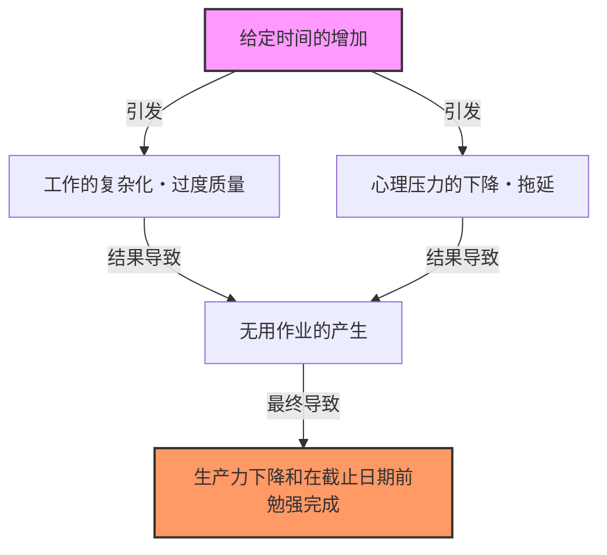
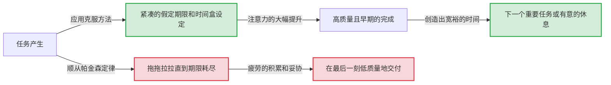

# 引言：为什么我们的工作总是拖到截止日期前最后一刻？

以为“还有一周时间，没问题”而开始的项目，不知为何总是拖到最后一天深夜才完成。暑假作业总是留到8月31日边哭边写。如果会议时间设定为1小时，即便是5分钟就能结束的议题，也会刚刚好讨论满1小时……。
每个人都曾经历过的这些现象，绝不是因为你意志薄弱或能力低下。这可以用被称为“帕金森定律（Parkinson’s Law）”的普遍法则来解释，它尖锐地指出了人类和组织的行动原理。

本文将对这一定律进行数千字的详细解说，从其历史背景到心理机制，再到现代商业和日常生活中如何摆脱这种束缚并大幅提升生产力。对于所有在时间管理、项目管理甚至个人财务管理上感到困扰的人来说，这将是一份必读的完整指南。

---

# 第一定律：“工作会自动膨胀，占满所有可用于完成它的时间”

在帕金森定律中最著名且作为核心的，就是这第一定律。在英语中表述为 **"Work expands so as to fill the time available for its completion."**。

## 历史背景与西里尔·诺斯古德·帕金森

这一定律首次由英国历史学家兼政治学家西里尔·诺斯古德·帕金森（Cyril Northcote Parkinson）在1955年发表于经济学杂志《经济学人》的一篇散文中提出。随后，于1958年作为书籍《帕金森定律：追求进步》出版，并成为全球畅销书。

帕金森仔细观察了英国官僚机构（特别是海军部和殖民地部）的数据。令人惊讶的是，尽管自第一次世界大战以来大英帝国海军的舰艇数量和官兵人数急剧减少，海军部的行政官员数量却在逐年增加。殖民地部也是如此，尽管需要管理的殖民地减少了，职员人数却在增加。
由此，帕金森发现了官僚体制的病理：“工作量与官员人数的增加毫无关系”。

## 心理机制：为什么时间总是会被填满？

工作之所以会膨胀直到填满时间，背后有强烈的人类心理偏见在起作用。

1. **复杂化的错觉**
   当有充足的时间时，人们会无意识地将该工作视为“重要且复杂的任务”。本来只需一份简单的报告即可搞定的事情，却加上了过度的修饰，或者添加了不必要的数据，自己提升了任务的难度。
2. **完美主义的陷阱**
   只要时间允许，就会不断推敲“是不是能做得更好”。根据[帕累托法则](/zh-cn/p/business-pareto-principle/)（二八定律），产出80%的成果需要20%的时间，但为了让剩下20%的质量达到完美，人们会浪费掉80%的时间。
3. **拖延（Procrastination）**
   当截止日期很远时，人们采取行动的动机（动力）就会下降。“还有时间”的安心感剥夺了紧张感，导致直到最后一刻才开始认真对待。

## 现代商业中的具体例子

- **会议的长期化**: 如果预留了1小时的会议时间，即使是实际只需15分钟就能得出结论的议题，也会展开闲聊或不必要的讨论，恰好消耗掉1小时。
- **预算消耗**: 到了财年末，为了用完剩余的预算而购买不必要的设备，或者仓促启动项目的现象。
- **软件开发**: 如果交付期过长，开发团队就会试图实现“如果有可能会很方便”的过度功能（功能蔓延），结果挤压了核心功能除错的时间。

---

# 【图解】帕金森定律的机制

不仅是文字，让我们也从视觉上确认一下帕金森定律的可怕之处。下图展示了给定的时间是如何导致工作膨胀和生产力下降的。

这里的悖论在于，时间这种资源并不是越丰富就越能被高效利用，反而会成为产生浪费的温床。

---

# 第二定律：“支出会自动膨胀，直到与收入持平”

帕金森定律不仅在时间管理（工作量）上，在财务和金钱管理上也具有强大的法则。这就是第二定律。

## 生活方式潜变（生活水准的通货膨胀）

明明工资涨了，不知为何手头却没留下钱。本打算发了奖金就存起来，结果回过神来已经全部花光了。这就是第二定律的典型例子。
人的收入增加后，会无意识地按比例提高生活水准。比如“去好一点的餐厅”、“搬到租金高一档的房间”、“增加订阅服务”等。在经济心理学中，这被称为“生活方式潜变（Lifestyle Creep）”。

## 企业中预算管理的陷阱

这一定律不仅适用于个人财务，也适用于企业和国家的财政。当预算分配给各个部门时，经理会试图将该预算一分不剩地全部花光。因为如果预算有剩余，就会被认为“下个财年这个部门不需要那么多预算”，从而导致预算被削减（预算消耗的动机）。
结果，不是真正必要的投资，而是“为了用完预算的支出”成了常态，挤压了整个组织的利润率。

---

# 第三定律？：帕金森凡俗法则（自行车棚的讨论）

严格来说这与第一、第二定律相连，但帕金森还提出了一个非常有趣的概率，称为“凡俗法则（Law of Triviality）”。
这是一条<strong>“组织会对微不足道的事情花费与其不成比例的大量时间”</strong>的法则。

帕金森用“建设核电站和建设自行车棚”的会议例子来解释这一点。
- **核电站建设方案（数百万美元）**: 太过专业导致大多数董事无法理解，因为无人发言，仅用几分钟就被批准了。
- **员工自行车棚的屋顶材料（几十美元）**: 谁都能理解，谁都能发表意见，于是为了“铁皮好”还是“应该用铝”进行了几个小时的激烈争论。

正如这样，所处理的金额或事件的重要程度，与花费在上面的讨论时间成反比，这是一条可怕的法则。如果不知道这一点，你的团队也会继续被“自行车棚”的讨论夺走宝贵的时间。

---

# 打破帕金森定律的实践方法

到目前为止，我们已经看到了帕金森定律是如何侵蚀我们的时间、金钱和组织生产力的。那么，我们该如何应对这一定律呢？下面解说具体的克服方法。

## 【时间管理篇】

### 1. 设定人为的截止日期（时间盒法）
如果给定的时间总是会被填满，那么只要人为地将时间设定得更短就可以了。针对任务估算“实际上需要多少时间才能完成”，并将这最短的时间设定为期限。
更强大的是“时间盒法（Timeboxing）”。划分出“这个任务只花30分钟”的盒子（Box），设定计时器强制结束作业。番茄工作法（25分钟作业+5分钟休息）也是应用了这一原理。

### 2. 任务的极小化（微任务管理）
大型任务（例如：“制作项目计划书”）因为到期限之前的余地很大，所以很容易膨胀。将这个任务极小化（分解）到几分钟到几十分钟就能完成的程度，比如“决定标题（5分钟）”、“制作目录（15分钟）”、“收集必要数据（30分钟）”。通过这种方式，在物理上消除了每个任务膨胀的空间。

### 3. “完成比完美更重要”的精神
正是因为追求完美，时间才会膨胀。要时刻记住Facebook（现Meta）创始人马克·扎克伯格的名言“完成比完美更重要（Done is better than perfect）”。首先做到60分即可，以最快的速度成型，剩下的时间再进行打磨，引入这种“原型思考”非常重要。

## 【图解】克服方法带来的工作流变化

下图展示了顺从帕金森定律的情况和设定了人为截止日期的情况下工作流的差异。

## 【财务・预算篇】

### 1. 预先储蓄
“把剩下的钱存起来”这种想法，在第二定律的作用下必定会失败。收入进账的瞬间，通过扣款或自动转账将资金转移到“储蓄”或“投资”中的“预先储蓄”，是唯一的解决办法。通过强制减少“可用的钱（给定的预算）”，从而学会在这个额度内精打细算地生活。

### 2. 零基预算
为了防止企业预算的浪费，基于上一财年的预算是不行的，每年从零开始探讨“真正必要的业务是什么”的“零基预算（ZBB）”手法非常有效。这可以重置由于过去惯性导致的支出膨胀。

---

# 总结：让帕金森定律成为“盟友”

帕金森定律是一条冷酷的法则，指出了人类本质上的弱点。但是，只要深刻理解了这一定律的机制，反过来就能将其“黑客化”，让它成为自己的盟友。

- 如果有充裕的时间，就故意提前期限来制造“限制”。
- 如果钱增加了，就故意缩小可使用的额度来制造“限制”。

人类在没有限制的状态下会产生浪费，但**在适当的限制下却能发挥出难以置信的注意力和创造力。**
从今天开始，试着在你的工作和生活中刻意设定“紧凑的框架”吧。你一定能体验到如同施了魔法般，过去需要一周的工作仅用一天就完成了。能够控制帕金森定律的人，就能控制时间和人生。
