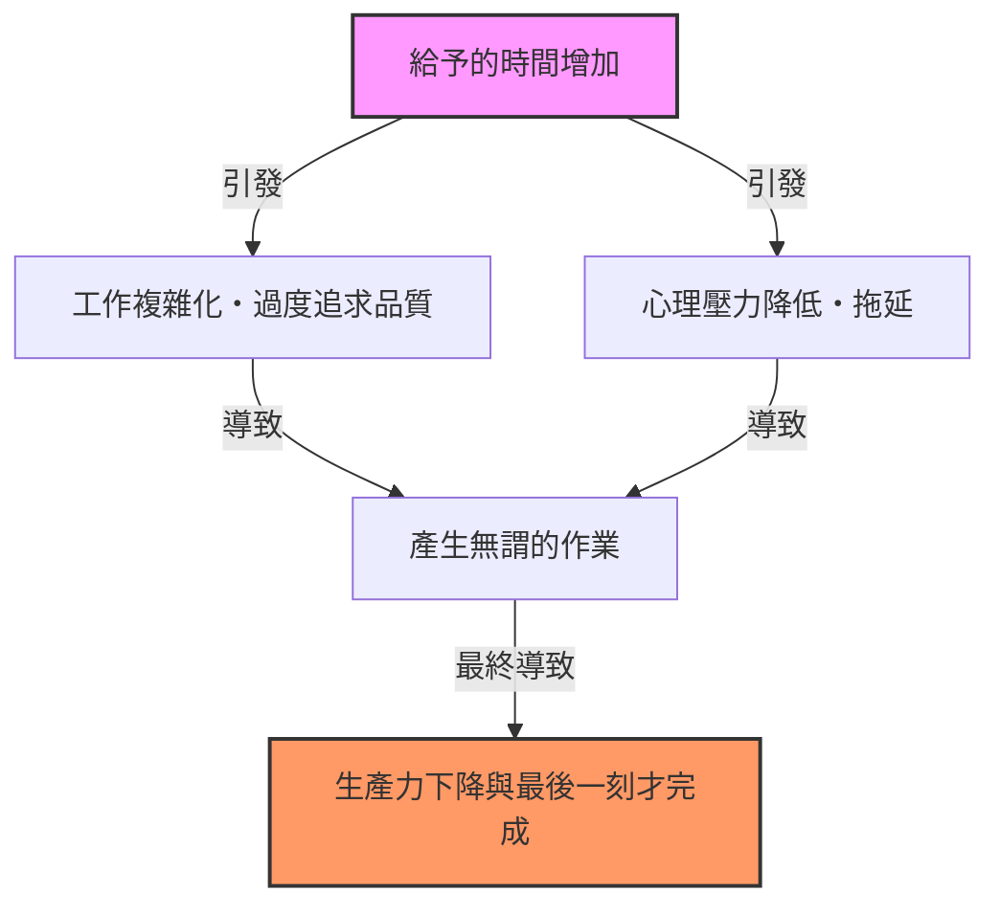
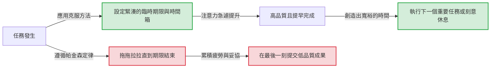

# 前言：為什麼我們的工作總是拖到最後一刻？

心裡想著「還有一個星期，沒問題的」而開始的專案，不知為何總會拖到最後一天的深夜才完成。暑假作業總是在8月31日邊哭邊寫。如果會議時間設定為1小時，即使是5分鐘就能解決的議題，也一定會討論滿整整1小時……。
每個人都曾經歷過這些現象，這絕不是因為你的意志力薄弱，也不是因為能力低落。這是可以用一個敏銳地指出人類與組織行為原理的普遍法則——「帕金森定律（Parkinson’s Law）」來解釋的。

在本文中，我們將對這個帕金森定律，從其歷史背景到心理機制，以及在現代商業與日常生活中，如何擺脫這種束縛並大幅提升生產力，進行數千字的詳細解說。對於所有為時間管理、專案管理，甚至是個人理財而煩惱的人來說，這絕對是一份必讀的完整指南。

---

# 第一定律：「工作會不斷膨脹，直到用完所有可用時間」

在帕金森定律中最著名、也是核心的便是這第一定律。英文表達為 **"Work expands so as to fill the time available for its completion."**

## 歷史背景與西里爾·諾斯古德·帕金森

這個定律最早是由英國歷史學家兼政治學家西里爾·諾斯古德·帕金森（Cyril Northcote Parkinson）在1955年發表於經濟學雜誌《經濟學人》的一篇散文中提出的。隨後在1958年，出版了《帕金森定律：追求進步》一書，並成為全球暢銷書。

帕金森仔細觀察了英國官僚組織（特別是海軍部與殖民地部）的數據。令人驚訝的是，自第一次世界大戰以來，儘管大英帝國海軍的艦艇數量與官兵人數急劇減少，但海軍部的行政官員人數卻逐年持續增加。同樣地，在殖民地部，需要管理的殖民地減少了，職員人數卻在增加。
由此，帕金森發現了官僚體制的病理：「工作量與官員人數的增加毫無關聯」。

## 心理機制：為什麼時間會被填滿？

工作會膨脹直到填滿時間的背後，有著人類強烈的心理偏誤在作祟。

1. **複雜化的錯覺**
   當有充裕的時間時，人們會無意識地將該項工作視為「重要且複雜的」。原本只需一份簡單報告就能解決的事情，卻加上了過多的裝飾、添加了不必要的數據，自己提升了任務的難度。
2. **完美主義的陷阱**
   只要時間允許，就會不斷推敲「是不是能做得更好」。根據帕雷托法則（80/20法則），達到80%成果所需的時間是20%，但為了將剩下的20%品質做到完美，卻浪費了80%的時間。
3. **拖延症（Procrastination）**
   當期限還很遙遠時，人們採取行動的動機（動力）就會降低。「還有時間」的安心感剝奪了緊張感，結果導致直到最後一刻才認真投入的情況。

## 現代商業中的具體例子

- **會議的長期化**: 如果安排了1小時的會議時間，實際上即使是15分鐘就能得出結論的議題，也會因為閒聊或不必要的討論，而整整消耗掉1小時。
- **預算消化**: 到了財政年度末，為了用完剩餘的預算，而購買不必要的辦公用品，或者匆忙設立專案的現象。
- **軟體開發**: 如果交期過長，開發團隊會試圖實作「有的話可能很方便」的過度功能（範圍潛變 Feature Creep），結果壓縮了核心功能修復Bug的時間。

---

# 【圖解】帕金森定律的機制

不僅是文字，讓我們透過視覺來確認帕金森定律的可怕之處。下圖展示了給予的時間如何導致工作膨脹與生產力下降。

時間這項資源，並不是越豐富就能越有效率地被使用，反而會成為產生浪費的溫床，這就是其中的矛盾所在。

---

# 第二定律：「支出會不斷膨脹，直到與收入持平」

帕金森定律不僅在時間管理（工作量）上，在財務與金錢管理上也具有強大的效力。這就是第二定律。

## 生活方式蠕變（生活水準的通貨膨脹）

明明薪水增加了，不知為何手邊卻沒有留下錢。原本打算拿到獎金就要存起來，回過神來卻發現已經全部花光了。這正是第二定律的典型例子。
當人們的收入增加時，會無意識地按比例提高生活水準。例如「去稍微好一點的餐廳」、「搬到租金更高一級的房間」、「增加訂閱服務」等。這在經濟心理學中被稱為「生活方式蠕變（Lifestyle Creep）」。

## 企業預算管理的陷阱

這項定律不僅適用於個人的家庭收支，也適用於企業或國家的財政。當預算分配給各個部門時，經理人會試圖將預算一毛不剩地花光。因為如果預算有剩餘，就會被認為「下個年度這個部門不需要這麼多預算」，進而導致預算被削減（消化預算的誘因）。
結果，導致「為了花光預算而支出」成為常態，而非真正必要的投資，進而壓縮了整個組織的利潤率。

---

# 第三定律？：帕金森的瑣碎定律（腳踏車棚的討論）

嚴格來說，雖然與第一、第二定律有所關聯，但帕金森還提出了一個非常有趣的觀念，稱為「瑣碎定律（Law of Triviality）」。
這個定律是指**「組織會對瑣碎的事物，花費不成比例的大量時間」**。

帕金森以「建設核電廠與建設腳踏車棚」的會議例子來說明這一點。
- **核電廠建設計畫（數百萬美元）**: 因為太過專業，幾乎所有董事都無法理解，也沒有人發言，因此僅僅幾分鐘就被批准了。
- **員工腳踏車棚的屋頂材質（數十美元）**: 因為每個人都懂，每個人都能發表意見，所以會為「用白鐵皮比較好」「不，應該用鋁」而進行數小時的激烈爭論。

像這樣，處理金額與事件的重要性，與花費在上面的討論時間成反比，這是一個可怕的定律。如果不了解這一點，你的團隊也會持續被「腳踏車棚」的討論奪走寶貴的時間。

---

# 打破帕金森定律的實踐方法

到目前為止，我們已經看到了帕金森定律如何侵蝕我們的時間、金錢與組織的生產力。那麼，我們該如何對抗這個定律呢？以下將解說具體的克服方法。

## 【時間管理篇】

### 1. 設定人為的期限（時間箱法 Timeboxing）
既然給予的時間會被填滿，那麼人為地將時間設定得短一點就好了。針對任務估算「實際上需要多少時間」，並將這個最短時間設定為期限。
更強大的是「時間箱法」。將時間劃分成區塊，例如「這項任務只花30分鐘」，設定計時器並強制結束作業。番茄鐘工作法（工作25分鐘＋休息5分鐘）也是應用了這個原理。

### 2. 任務極小化（微任務管理）
龐大的任務（例如：「製作專案計畫書」），因為距離期限的空白很多，所以容易膨脹。將其極小化（分解）到幾分鐘至幾十分鐘就能完成的程度，例如「決定標題（5分鐘）」、「製作目錄（15分鐘）」、「收集必要數據（30分鐘）」。這樣一來，就能從物理上消除每一個單一任務膨脹的空間。

### 3. 「完成比完美更重要（Done is better than perfect）」的精神
正是因為追求完美，時間才會膨脹。請牢記 Facebook（現為 Meta）創辦人馬克·祖克柏的名言：「完成比完美更重要」。首先只要做到60分就可以了，用最快的速度將其成型，然後用剩餘的時間來進行修飾，導入這種「原型思考（Prototype Thinking）」非常重要。

## 【圖解】透過克服方法帶來的工作流程變化

我們用圖解來說明隨波逐流於帕金森定律的情況，與設定人為期限的情況，兩者工作流程的差異。

## 【財務・預算篇】

### 1. 預先儲蓄
「把剩下的錢存起來」這種想法，因為第二定律一定會失敗。唯一的解決辦法是「預先儲蓄」，也就是在收入進帳的瞬間，就透過扣款或自動轉帳將資金轉移到「儲蓄」或「投資」上。透過強制減少「可動用的錢（給予的預算）」，就會開始在這個範圍內打理生活。

### 2. 零基預算
為了防止企業浪費預算，不以去年度的預算為基礎，而是每年從零開始重新檢討「真正必要的事業是什麼」，這種「零基預算（ZBB）」的手法非常有效。這可以重置過去因為慣性而導致的支出膨脹。

---

# 總結：讓帕金森定律成為你的「盟友」

帕金森定律是一個冷酷的定律，指出了人類本質上的弱點。然而，只要深刻理解這個定律的機制，反而可以將其「駭客化（Hack）」，使其成為你的盟友。

- 如果時間有剩餘，就刻意提前期限來製造「限制」。
- 如果金錢增加了，就刻意縮小可使用的額度來製造「限制」。

人類在沒有限制的狀態下會產生浪費，但**在適度的限制下，卻能發揮出令人難以置信的注意力與創造力。**
從今天起，請試著在你的工作與生活中設定刻意的「緊湊框架」。原本需要花1星期的工作，只需要1天就能完成，你一定能體驗到這種宛如魔法般的經歷。能控制帕金森定律的人，就能控制時間與人生。
