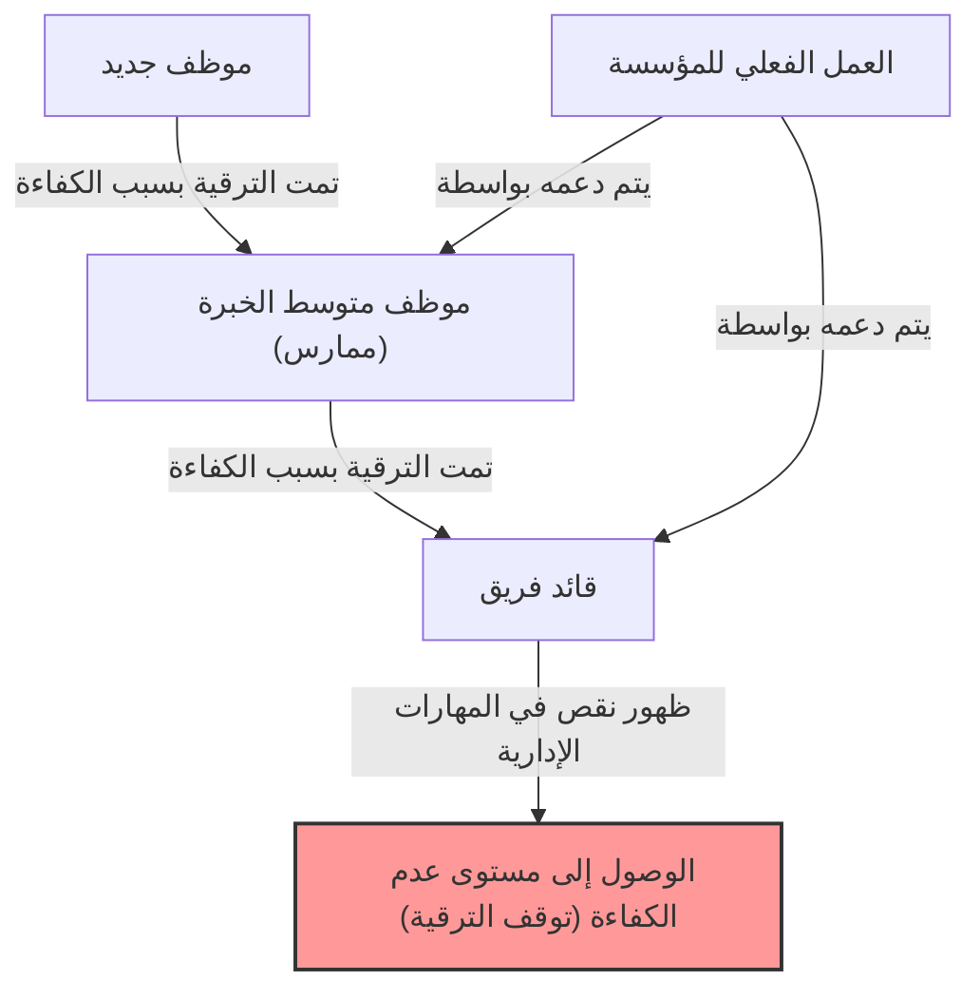
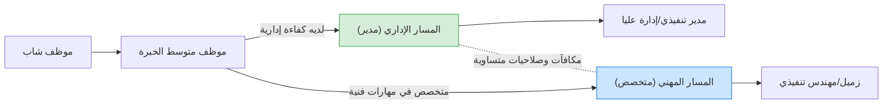

## 1. مقدمة: لماذا تعج المؤسسات بـ "المديرين غير الأكفاء"؟

أثناء عملك في شركة، ألم يساورك هذا التساؤل ولو لمرة واحدة: "لماذا يشغل شخص غير قادر على أداء وظيفته بشكل جيد منصباً إدارياً؟" أو "لماذا أصبح ذلك الزميل الذي كان متفوقاً شخصاً عديم الفائدة بمجرد أن أصبح مديراً؟"

في الواقع، هذه ليست ظاهرة فريدة تقتصر على شركتك فقط. إنها ظاهرة عالمية تُلاحظ في جميع المؤسسات والشركات والهيئات الحكومية وحتى المدارس والمنظمات غير الربحية في جميع أنحاء العالم. ومن صاغ هذه الظاهرة ووضعها في إطار منهجي ببراعة هو "**مبدأ بيتر (The Peter Principle)**".

في هذا المقال، سنتعمق بشكل شامل في هذا المبدأ الذي اقترحه الدكتور لورانس جيه. بيتر (Laurence J. Peter)، من آلياته الأساسية إلى التدابير المضادة للأفراد والمؤسسات، من كل منظور ممكن. إنه قراءة لا غنى عنها لكل من يحاول البقاء في "المجتمع الهرمي" المسمى بالمؤسسة.

## 2. ما هو مبدأ بيتر؟ (المفهوم الأساسي)

مبدأ بيتر هو قاعدة تتعلق بعلم الاجتماع الهرمي تم اقتراحها في كتاب "مبدأ بيتر" الذي شارك في تأليفه لورانس جيه. بيتر وريموند هال في عام 1969. حجته الأساسية هي كما يلي:

> **"في النظام الهرمي، يميل كل موظف إلى الترقي إلى مستوى عدم كفاءته"**

قد يصعب فهم هذه العبارة وحدها، لذا دعونا نوضحها بمثال محدد.

كان هناك مندوب مبيعات (السيد أ). حقق نتائج مبيعات ممتازة للغاية واكتسب ثقة كبيرة من عملائه. قيّمت الشركة "كفاءة السيد أ كمندوب مبيعات" وقامت بترقيته إلى مدير مبيعات.

ومع ذلك، فإن المهارة المطلوبة لمدير المبيعات ليست "القدرة على بيع المنتجات بنفسه"، بل "القدرة الإدارية على تطوير المرؤوسين وتحقيق الأهداف كفريق كامل". كان السيد أ ممتازاً كمدير ممارس (يلعب دوراً مزدوجاً)، لكنه لم يكن بارعاً في تعليم الآخرين أو إدارة تحفيز الفريق.

نتيجة لذلك، فشل السيد أ في تحقيق النتائج كمدير مبيعات ووُصم بـ "عدم الكفاءة". ولأنه غير كفء، لا يمكن ترقيته إلى أبعد من ذلك (مثل مدير قسم)، وسيبقى في منصب "المدير غير الكفء" هذا.

هذا مثال كلاسيكي على مبدأ بيتر. بعبارة أخرى، يتم ترقية الأشخاص لأنهم "أكفاء في مناصبهم الحالية"، ولكن إذا كانوا يفتقرون إلى المهارات المطلوبة للمنصب الذي تمت ترقيتهم إليه، فإنهم يصبحون "غير أكفاء" هناك وتتوقف ترقيتهم.

## 3. "المأساة التنظيمية" التي يسببها مبدأ بيتر

النتيجة الأكثر ترويعاً التي أشار إليها مبدأ بيتر تتلخص في الجملة التالية:

> **"بمرور الوقت، سيمتلئ كل منصب بموظف غير كفء للقيام بواجباته"**

ماذا سيحدث إذا تمت ترقية كل شخص في المؤسسة إلى مستوى عدم كفاءته وركد هناك؟ ستمتلئ جميع المناصب من الإدارة العليا إلى الإدارة الوسطى بـ "أشخاص غير مناسبين لعملهم الحالي".

### لماذا تستمر المؤسسات في العمل؟
إذن، لماذا لا تنهار المؤسسات في الواقع وتستمر في العمل؟ وفقاً لمبدأ بيتر، فذلك ببساطة لأن **"العمل الفعلي يتم إنجازه من قبل أولئك الذين لم يصلوا بعد إلى مستوى عدم كفاءتهم (أي أنهم لا يزالون في طور الترقية)"**. بعبارة أخرى، إنها بنية حيث يقوم "الشباب الأكفاء" و "الممارسون الأكفاء" في المستويات الدنيا والوسطى من المؤسسة بتغطية عدم كفاءة الإدارة العليا ودعم الإنجازات الإجمالية للمؤسسة.

## 4. لماذا يعتبر مبدأ بيتر أمراً لا مفر منه؟ (تعمق في الآلية)

لماذا تكرر الشركات عن قصد ممارسات الموارد البشرية التي تجعل الأشخاص الأكفاء غير أكفاء؟ يكمن السبب في وجود عيوب هيكلية متأصلة في المجتمع الهرمي (التسلسل الهرمي).

### 4.1. الخلط بين "الإنجازات الماضية" و "الكفاءة المستقبلية"
تعتمد أنظمة التقييم في العديد من الشركات على "النتائج المحققة في المنصب الحالي". ومع ذلك، مع ارتقاء التسلسل الهرمي، تتغير طبيعة المهارات المطلوبة بشكل جذري.
- **الممارس (اللاعب)**: المهارات المتخصصة، القدرة على التنفيذ، مهارات الإدارة الذاتية
- **الإدارة الوسطى (المدير)**: مهارات التواصل، مهارات التنسيق، مهارات تطوير الموارد البشرية
- **الإدارة العليا (القائد)**: التفكير الاستراتيجي، بناء الرؤية، مهارات صنع القرار

الكفاءة كلاعب لا تضمن الكفاءة كمدير. ولكن، في تقييمات الموارد البشرية في العالم الحقيقي، من الصعب بناء طريقة تقييم بخلاف "جعل الشخص صاحب أعلى مبيعات مديراً"، مما يؤدي حتماً إلى عدم تطابق.

### 4.2. حدود نظام المكافآت (لعنة الترقية = النجاح)
في العديد من المؤسسات الحديثة، تنحصر الوسيلة الرئيسية لـ "زيادة الراتب" و "اكتساب المكانة" في "الترقية إلى منصب إداري".
حتى بالنسبة للمهندس أو مندوب المبيعات المتميز الذي يرغب في إتقان مساره كمتخصص، فإن النظام يجبره على أن يصبح مديراً لكسب راتب فوق مستوى معين. وهذا يؤدي إلى "الرفع إلى مستوى عدم الكفاءة" وتجاهل كفاءة الفرد ورغباته.

### 4.3. صعوبة خفض الرتبة و "الانزلاق الجانبي"
من الصعب للغاية خفض رتبة شخص تمت ترقيته في ثقافة الشركات اليابانية (وفي العديد من الشركات الغربية أيضاً). وذلك لأن هناك خطراً يتمثل في جرح كبرياء الفرد والتسبب في انخفاض كبير في دافعيته.
لذلك، غالباً ما يتم نقل المديرين الذين يتبين أنهم "غير أكفاء" أفقياً إلى مناصب غير مهمة في نفس المستوى الهرمي (ما يسمى بـ "الموظفين المهمشين" أو "المديرين المكلفين بمهام خاصة" بدون سلطة حقيقية)، بدلاً من خفض رتبتهم. أطلق بيتر على هذا اسم "**الانتقال الجانبي (الأرابيسك)**".

## 5. تدابير مضادة رائدة لمبدأ بيتر

من الصعب للغاية كسر مبدأ بيتر تماماً طالما أن المجتمعات الهرمية موجودة. ومع ذلك، هناك استراتيجيات لتقليل الضرر إلى أدنى حد وتحقيق التوازن بين السعادة الفردية والإنتاجية التنظيمية.

### 5.1. التدابير المضادة الفردية: التوصية بـ "عدم الكفاءة الإبداعية"
أعظم استراتيجية دفاعية للأفراد لحماية أنفسهم، والتي اقترحها بيتر نفسه، هي "**عدم الكفاءة الإبداعية (Creative Incompetence)**".
هذه تقنية متقدمة حيث، بمجرد وصولك إلى منصب تعتقد أنه "وظيفتك المثالية" أو "لا أرغب في الترقية أكثر من ذلك (لا أريد تجاوز حدود قدراتي)"، تتظاهر عمداً بـ "عيوب صغيرة ليست قاتلة ولكنها كافية لجعلهم يترددون في ترقيتك".

على سبيل المثال، على الرغم من أنك تنجز عملك الفعلي بشكل مثالي، إلا أن "مكتبك دائماً فوضوي"، أو "أنت متردد في المشاركة في أحداث الشركة"، أو "ملابسك غير رسمية بعض الشيء". نتيجة لذلك، ستقرر الإدارة العليا أنك "قادر على أداء الوظيفة، ولكن هناك بعض المخاوف بشأن جعلك مديراً"، وسيبقونك في منصبك الحالي (حيث تتألق بشكل أفضل).

### 5.2. التدابير المضادة التنظيمية: فصل الترقية عن المكافآت (نظام السلم المزدوج)
الإجراء المضاد الأكثر فعالية الذي يمكن للمؤسسة اتخاذه هو **"الفصل التام بين مسار 'المنصب الإداري' ومسار 'المهني (المتخصص)'، وتوفير مكافآت وتقييمات متساوية"**. (يسمى هذا بنظام السلم المزدوج).
يتيح هذا للمبرمج الممتاز الاستمرار في إظهار كفاءته دون إجباره على أن يصبح مدير مشروع لمجرد زيادة الراتب.

### 5.3. إضفاء الطابع المؤسسي على الترقيات التجريبية و "الانسحاب المشرف"
تحدث المأساة لأننا نعتبر الترقية "أمراً لا رجعة فيه". على سبيل المثال، قم بإنشاء "فترة تجريبية كمدير" من 3 إلى 6 أشهر، وعند انتهاء تلك الفترة، قدم نظاماً يمكن فيه للفرد والشركة المناقشة والاختيار بين "العودة إلى المنصب الأصلي" أو "الاستمرار كمدير".
وهذا يضمن "الانسحاب المشرف" كنظام في الحالات التي "تمت تجربتها ولكن لم يكن هناك كفاءة لها"، ويمنع الركود عند مستوى عدم الكفاءة.

## 6. الخلاصة: أين يجب أن تُظهر "كفاءتك"؟

للوهلة الأولى، يبدو مبدأ بيتر كقاعدة ساخرة ويائسة للغاية. ومع ذلك، إذا نظرنا إليه من زاوية مختلفة، فهو درس يعلمنا **"أهمية الفهم الدقيق لحدود قدرات الفرد وكفاءته، وإيجاد المكان الذي يتألق فيه بشكل أفضل"**.

بدلاً من الركوب على المسار الفردي لـ "الترقية = النجاح" الذي أعده المجتمع أو الشركة، يجب على المرء أن يحدد المستوى الذي يمكن أن تتجلى فيه "كفاءته" إلى أقصى حد وأن يتحلى بالشجاعة للبقاء هناك (وأحياناً الحكمة لتمثيل عدم الكفاءة الإبداعية). يمكن القول إن هذه هي أفضل استراتيجية للبقاء على قيد الحياة في المجتمع الهرمي المعقد اليوم دون إجهاد وبطريقة مُرضية.

(※ كُتب هذا المقال بهدف المساعدة في فهم "مبدأ بيتر" بعمق والاستفادة منه في بناء مؤسسات الغد. قد يكون "المدير غير الكفء" في مكان عملك لاعباً كفؤاً ورائعاً في يوم من الأيام. إذا فكرت في الأمر بهذه الطريقة، فربما يمكنك النظر إليه بنظرة أكثر لطفاً... ربما.)
