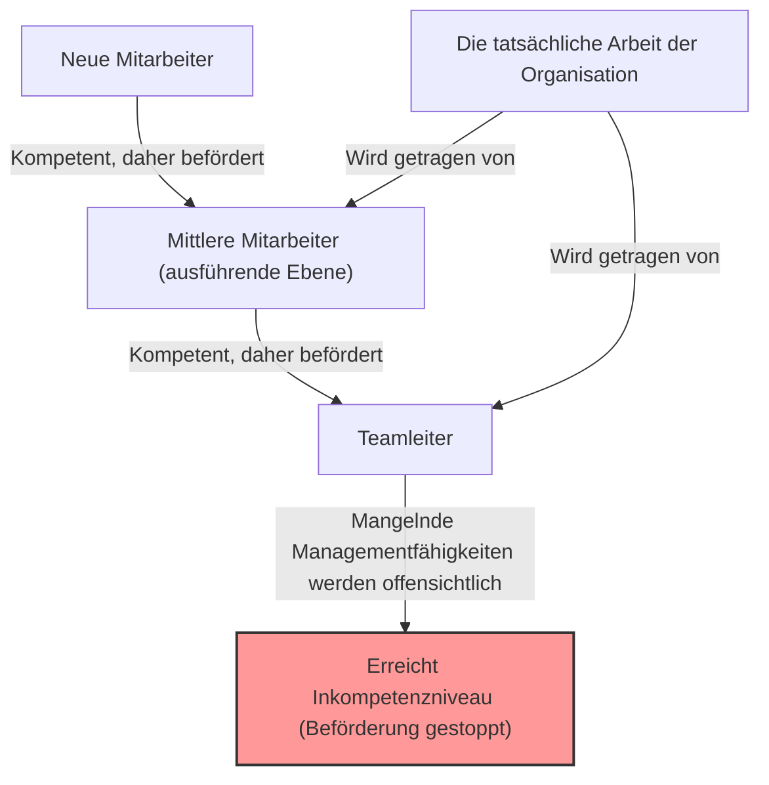
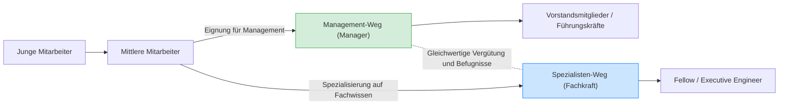

## 1. Einleitung: Warum wimmelt es in Organisationen von "inkompetenten Chefs"?

Wenn Sie in einem Unternehmen arbeiten, haben Sie sich wahrscheinlich schon einmal gefragt: "Warum sind Leute in Führungspositionen, die so unfähig in ihrem Job sind?" oder "Warum ist der Senior-Kollege, der doch so hervorragend war, plötzlich völlig nutzlos geworden, als er Manager wurde?"

Tatsächlich ist dies kein Phänomen, das auf Ihr Unternehmen beschränkt ist. Es ist ein universelles Phänomen, das in jeder Organisation, jedem Unternehmen, jeder Regierungsbehörde und sogar in Schulen und gemeinnützigen Organisationen weltweit auftritt. Dieses Phänomen wurde durch das **"Peter-Prinzip" (The Peter Principle)** brillant formuliert und systematisiert.

In diesem Artikel werden wir das von Dr. Laurence J. Peter vorgeschlagene Prinzip eingehend untersuchen, vom grundlegenden Mechanismus bis hin zu Gegenmaßnahmen auf individueller und organisatorischer Ebene aus jedem erdenklichen Blickwinkel. Es ist eine Pflichtlektüre für jeden, der in der "hierarchischen Gesellschaft" einer Organisation überleben will.

## 2. Was ist das Peter-Prinzip? (Grundkonzept)

Das Peter-Prinzip ist eine Theorie zur Soziologie von Hierarchien, die 1969 in dem von Laurence J. Peter und Raymond Hull gemeinsam verfassten Buch "Das Peter-Prinzip" vorgestellt wurde. Die Kernaussage lautet wie folgt:

> **"In einer Hierarchie neigt jeder Beschäftigte dazu, bis zu seiner Stufe der Unfähigkeit aufzusteigen."**

Diese Aussage allein mag etwas schwer zu verstehen sein, daher lassen Sie uns dies an einem konkreten Beispiel erklären.

Es gab einen Verkäufer (Herr A). Er erzielte hervorragende Verkaufsergebnisse und genoss das immense Vertrauen seiner Kunden. Das Unternehmen würdigte Herrn A's "Fähigkeit als Verkäufer" und beförderte ihn zum Verkaufsleiter.

Die Fähigkeiten, die von einem Verkaufsleiter verlangt werden, sind jedoch nicht "die Fähigkeit, Produkte selbst zu verkaufen", sondern "die Managementfähigkeit, Untergebene auszubilden und Ziele mit dem gesamten Team zu erreichen". Herr A war als spielender Manager (Playing Manager) zwar hervorragend, aber er war nicht gut darin, andere zu unterrichten oder die Motivation des Teams zu steuern.

Infolgedessen konnte Herr A als Verkaufsleiter keine Ergebnisse liefern und wurde als "inkompetent" abgestempelt. Und da er inkompetent ist, kann er nicht weiter befördert werden (z. B. zum Abteilungsleiter) und bleibt auf der Position des "inkompetenten Managers" sitzen.

Dies ist ein typisches Beispiel für das Peter-Prinzip. Mit anderen Worten, Menschen werden befördert, weil sie "in ihrer aktuellen Position kompetent sind", aber wenn ihnen die für die neue Position erforderlichen Fähigkeiten fehlen, werden sie dort "inkompetent" und ihre Beförderung stoppt.

## 3. Die "Tragödie der Organisation", die das Peter-Prinzip mit sich bringt

Die erschreckendste Schlussfolgerung, die das Peter-Prinzip nahelegt, lässt sich in folgendem Satz zusammenfassen:

> **"Nach einiger Zeit wird jede Position von einem Mitarbeiter besetzt sein, der unfähig ist, seine Aufgaben zu erfüllen."**

Was würde passieren, wenn alle Personen in einer Organisation bis zu ihrem Inkompetenzniveau befördert würden und dort stagnieren? Von der Spitze der Organisation bis zum mittleren Management wäre jede Position mit Personen besetzt, "die für ihre aktuelle Aufgabe ungeeignet sind".

### Warum funktionieren Organisationen trotzdem?
Warum brechen reale Organisationen also nicht vollständig zusammen, sondern funktionieren weiter? Laut dem Peter-Prinzip liegt das schlichtweg daran, dass **"die eigentliche Arbeit von denjenigen erledigt wird, die ihre Stufe der Inkompetenz noch nicht erreicht haben (die sich also noch auf dem Weg nach oben befinden)"**. Das bedeutet, dass "fähige junge Mitarbeiter" und "fähige ausführende Mitarbeiter" auf den unteren und mittleren Ebenen der Organisation die Inkompetenz der oberen Ebenen ausgleichen und die Gesamtleistung der Organisation aufrechterhalten.

## 4. Warum ist das Peter-Prinzip unvermeidlich? (Eine tiefe Analyse des Mechanismus)

Warum wiederholen Unternehmen absichtlich Personalentscheidungen, die fähige Leute inkompetent machen? Es gibt strukturelle Mängel in hierarchischen Gesellschaften (Hierarchien).

### 4.1. Verwechslung von "bisheriger Leistung" und "zukünftiger Eignung"
Das Bewertungssystem in vielen Unternehmen basiert auf der "Leistung in der aktuellen Position". Die Art der erforderlichen Fähigkeiten ändert sich jedoch grundlegend, je weiter man in der Hierarchie aufsteigt.
- **Ausführender Mitarbeiter (Player)**: Fachkenntnisse, Umsetzungsfähigkeit, Selbstmanagementfähigkeit
- **Mittleres Management (Manager)**: Kommunikationsfähigkeit, Koordinationsfähigkeit, Fähigkeit zur Personalentwicklung
- **Oberes Management (Leader)**: Strategisches Denken, Visionsbildung, Entscheidungsfähigkeit

Kompetenz als Player garantiert keine Kompetenz als Manager. In der Realität ist es jedoch schwierig, ein anderes Bewertungssystem zu etablieren, als "denjenigen mit den besten Verkaufsergebnissen zum Manager zu machen", was zwangsläufig zu Diskrepanzen führt.

### 4.2. Die Grenzen des Vergütungssystems (Der Fluch von Beförderung = Erfolg)
In vielen modernen Organisationen ist der wichtigste Weg, "das Gehalt zu erhöhen" und "Status zu erlangen", auf die "Beförderung in eine Managementposition" beschränkt.
Selbst hervorragende Ingenieure oder Verkäufer, die ihren Weg als Spezialisten perfektionieren wollen, sind durch das System gezwungen, Manager zu werden, um ein bestimmtes Gehalt zu erreichen. Dies führt dazu, dass sie in ihre "Stufe der Inkompetenz" gedrängt werden, wobei ihre eigenen Eignungen und Wünsche ignoriert werden.

### 4.3. Die Schwierigkeit der Herabstufung und das "seitliche Verschieben"
In der japanischen Unternehmenskultur (und auch in vielen westlichen Unternehmen) ist es sehr schwierig, jemanden, der einmal befördert wurde, wieder zu degradieren. Es birgt das Risiko, den Stolz der Person zu verletzen und ihre Motivation stark zu senken.
Daher werden Führungskräfte, die sich als "inkompetent" erwiesen haben, oft nicht degradiert, sondern eher auf bedeutungslose Positionen auf der gleichen Ebene verschoben (sogenannte "Fensterplatz-Mitarbeiter" oder "Sonderbeauftragte Direktoren" ohne echte Macht). Peter nannte dies den **"arabesken (horizontalen) Transfer"**.

## 5. Bahnbrechende Gegenmaßnahmen gegen das Peter-Prinzip

Es ist extrem schwierig, das Peter-Prinzip vollständig zu durchbrechen, solange hierarchische Gesellschaften existieren. Es gibt jedoch Strategien, um den Schaden zu minimieren und sowohl das individuelle Glück als auch die Produktivität der Organisation zu vereinbaren.

### 5.1. Maßnahme für das Individuum: Die Empfehlung der "Kreativen Inkompetenz"
Die größte Verteidigungsstrategie, die Peter selbst vorschlug, um sich als Individuum zu schützen, ist die **"Kreative Inkompetenz" (Creative Incompetence)**.
Dies ist eine fortgeschrittene Technik, bei der man, wenn man eine Position erreicht hat, von der man denkt: "Das ist meine Berufung" oder "Ich möchte nicht weiter befördert werden (ich möchte nicht über meine Fähigkeiten hinausgehen)", absichtlich "kleine Fehler, die nicht fatal sind, aber eine Beförderung verzögern", vortäuscht.

Zum Beispiel erledigen Sie Ihre praktische Arbeit perfekt, aber "Ihr Schreibtisch ist immer unordentlich", "Sie nehmen nur ungern an Firmenveranstaltungen teil" oder "Ihre Kleidung ist ein wenig locker". Dadurch urteilt das Top-Management: "Er macht seine Arbeit gut, aber ich bin etwas besorgt, ihn zum Manager zu machen", und belässt Sie auf Ihrer jetzigen Position (wo Sie am besten glänzen können).

### 5.2. Maßnahme für die Organisation: Trennung von Beförderung und Vergütung (Dual-Ladder-System)
Die effektivste Maßnahme, die eine Organisation ergreifen kann, besteht darin, **den "Management-Weg" und den "Spezialisten-Weg (Fachkraft)" vollständig zu trennen und gleichwertige Vergütungen und Bewertungen anzubieten**. (Dies wird als Dual-Ladder-System bezeichnet).
Dadurch müssen hervorragende Programmierer nicht gezwungenermaßen Projektmanager werden, um ein höheres Gehalt zu bekommen, und können weiterhin ihre Kompetenzen unter Beweis stellen.

### 5.3. Probebeförderungen und die Institutionalisierung des "ehrenhaften Rückzugs"
Die Tragödie entsteht, weil Beförderungen als "unumkehrbar" angesehen werden. Beispielsweise könnte man eine "Manager-Probezeit" von etwa drei bis sechs Monaten einführen, an deren Ende die Person und das Unternehmen gemeinsam besprechen und entscheiden können, ob sie "in ihre alte Position zurückkehren" oder "weiterhin als Manager tätig sein" möchten.
Dadurch wird ein "ehrenhafter Rückzug" als System für Fälle garantiert, in denen man "es ausprobiert hat, aber nicht geeignet war", wodurch eine Stagnation auf dem Inkompetenzniveau verhindert wird.

## 6. Fazit: Wo Sie Ihre eigene "Kompetenz" einsetzen sollten

Auf den ersten Blick mag das Peter-Prinzip wie ein sehr zynisches und hoffnungsloses Gesetz erscheinen. Wenn man es jedoch umdreht, ist es eine Lektion, die uns **"die Wichtigkeit lehrt, unsere eigenen Grenzen und Eignungen genau zu kennen und den Ort zu finden, an dem wir am besten glänzen können"**.

Anstatt auf der von der Gesellschaft und den Unternehmen vorgegebenen Schiene "Beförderung = Erfolg" mitzufahren, sollten Sie die Ebene ermitteln, auf der Sie Ihre "Kompetenz" maximieren können, und den Mut haben, dort zu bleiben (und manchmal die Klugheit haben, kreative Inkompetenz zu spielen). Dies ist vielleicht die beste Strategie, um die komplexe hierarchische Gesellschaft von heute stressfrei und erfüllt zu überleben.

(* Dieser Artikel wurde geschrieben, um Ihnen zu helfen, das "Peter-Prinzip" besser zu verstehen und es auf die Organisationsentwicklung von morgen anzuwenden. Selbst der "inkompetente Chef" an Ihrem Arbeitsplatz könnte einmal ein glänzender, kompetenter Mitarbeiter gewesen sein. Wenn man das bedenkt, kann man ihn vielleicht mit etwas milderen Augen betrachten... vielleicht.)
