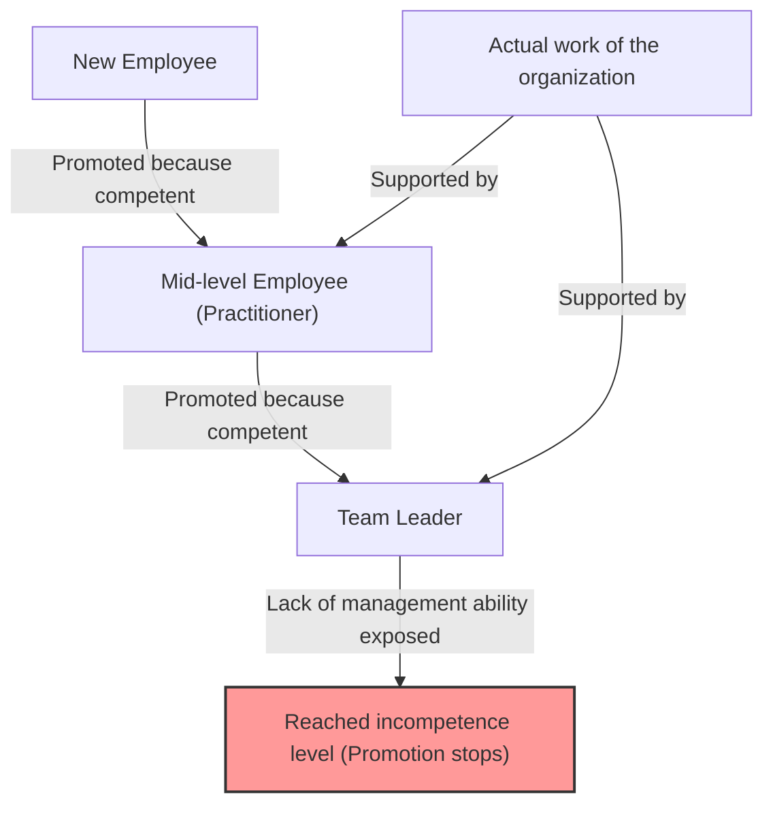
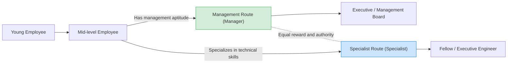

## 1. Introduction: Why are organizations overflowing with "incompetent bosses"?

Have you ever had the following questions while working at a company? "Why is someone who is so bad at their job in a management position?" "Why did that senior colleague, who was supposed to be excellent, become useless as soon as they became a manager?"

Actually, this is not a unique phenomenon only in your company. It is a universal phenomenon seen in all organizations, companies, government agencies, and even schools and non-profit organizations around the world. The "**Peter Principle**" perfectly verbalizes and systematizes this phenomenon.

In this article, we will thoroughly delve into this principle advocated by Dr. Laurence J. Peter from every possible perspective, from its fundamental mechanism to personal and organizational countermeasures. This is a must-read for anyone surviving in the "hierarchical society" that is an organization.

## 2. What is the Peter Principle? (Basic Concept)

The Peter Principle is a rule concerning hierarchical sociology proposed in the 1969 book "The Peter Principle" co-authored by Laurence J. Peter and Raymond Hull. Its core argument is as follows:

> **"In a hierarchy, every employee tends to rise to his level of incompetence."**

This might be a bit hard to understand with just these words, so let's explain with a specific example.

There was a salesperson (Mr. A). He achieved excellent sales results and gained immense trust from customers. The company evaluated Mr. A's "competence as a salesperson" and promoted him to sales manager.

However, the ability required of a sales manager is not the "ability to sell products oneself," but the "management ability to develop subordinates and achieve goals as an entire team." Mr. A excelled as a playing manager, but he was not good at teaching others or managing the team's motivation.

As a result, Mr. A failed to produce results as a sales manager and was branded as "incompetent." And since he is incompetent, he cannot be promoted further (e.g., to general manager) and will remain in that position of "incompetent manager."

This is a typical example of the Peter Principle. In other words, people are promoted because they are "competent in their current position," but if they lack the skills required in their new post, they become "incompetent" there, and their promotion stops.

## 3. The "Organizational Tragedy" Brought by the Peter Principle

The most terrifying consequence suggested by the Peter Principle is summarized in the following sentence:

> **"In time, every post tends to be occupied by an employee who is incompetent to carry out its duties."**

What would happen if everyone in an organization were promoted until they reached their level of incompetence and stagnated there? Every post, from the top management to middle management, would be filled with people "unsuited for their current jobs."

### Why do organizations still function?
Then why do real organizations function without completely collapsing? According to the Peter Principle, it is simply because **"the work is accomplished by those employees who have not yet reached their level of incompetence (i.e., those who are currently in the process of being promoted)."** In other words, the structure is such that "competent young employees" and "competent practitioners" in the lower and middle tiers of the organization cover for the incompetence of the upper management and support the overall results of the organization.

## 4. Why is the Peter Principle Unavoidable? (Deep Dive into the Mechanism)

Why do companies repeatedly make personnel decisions that intentionally turn competent people into incompetent ones? There is a structural flaw inherent in hierarchical societies.

### 4.1. Confusing "Past Results" with "Future Aptitude"
The evaluation system in many companies is based on "results in the current post." However, as the hierarchy rises, the nature of the required skills changes fundamentally.
- **Practitioner (Player)**: Specialized skills, execution ability, self-management ability
- **Middle Management (Manager)**: Communication skills, coordination ability, human resource development ability
- **Upper Management (Leader)**: Strategic thinking, vision building, decision-making ability

Competence as a player does not guarantee competence as a manager. However, in actual personnel evaluations, it is difficult to build an evaluation method other than "making the top salesperson a manager," so a mismatch inevitably occurs.

### 4.2. Limits of the Reward System (The Curse of Promotion = Success)
In many modern organizations, the main means to "increase salary" or "gain status" is limited to "promotion to management."
Even for excellent engineers or salespeople who want to master their path as specialists, the system forces them to become managers in order to earn a salary above a certain level. This causes them to be "pushed up to the level of incompetence," ignoring their aptitude and desires.

### 4.3. The Difficulty of Demotion and "Lateral Movement"
Demoting someone who has once been promoted is very difficult in Japanese corporate culture (and in many Western companies as well). This is because there is a risk of hurting their pride and greatly lowering their motivation.
Therefore, a manager who is found to be "incompetent" is often not demoted, but rather moved laterally to a sinecure in the same hierarchy (such as "window-seat tribe" or "special assignment manager" without real authority). Peter called this a "**lateral arabesque**."

## 5. Groundbreaking Countermeasures Against the Peter Principle

Completely breaking the Peter Principle is extremely difficult as long as a hierarchical society exists. However, there are strategies to minimize the damage and balance individual happiness with organizational productivity.

### 5.1. Personal Countermeasure: Recommendation of "Creative Incompetence"
The greatest defense for individuals to protect themselves, proposed by Peter himself, is "**Creative Incompetence**."
This is an advanced technique where, when you reach a position where you think "this is my calling" or "I don't want to be promoted any further (I don't want to exceed the limits of my ability)," you deliberately act out "small flaws that are not fatal but will make them hesitate to promote you."

For example, while executing your work perfectly, your "desk is always messy," you are "passive about participating in company events," or your "clothing is slightly loose." This leads upper management to judge, "They are good at their job, but I'm a little worried about making them a manager," and keeps you in your current (where you shine the brightest) position.

### 5.2. Organizational Countermeasure: Separation of Promotion and Reward (Dual Ladder System)
The most effective countermeasure an organization can take is to **completely separate the "management route" and the "specialist route" and provide equal rewards and evaluations for both**. (This is called the Dual Ladder system).
This eliminates the need for an excellent programmer to force themselves to become a project manager for the sake of salary, allowing them to continue demonstrating their competence.

### 5.3. Trial Promotion and Institutionalization of "Honorable Retreat"
Tragedies occur because promotion is seen as "irreversible." For example, introduce a system where a "manager trial period" of about 3 to 6 months is set up, and at the end of that period, the individual and the company can discuss and choose whether to "return to the original position" or "continue as a manager."
This guarantees an "honorable retreat" as a system in cases of "tried it but had no aptitude," and can prevent stagnation at the level of incompetence.

## 6. Conclusion: Where Should You Demonstrate Your "Competence"?

At first glance, the Peter Principle seems to be a very cynical and desperate rule. However, if we look at it from another angle, it is also a lesson that teaches us **"the importance of accurately grasping the limits and aptitudes of one's own abilities and finding the place where one can shine the brightest."**

Rather than riding the single rail of "promotion = success" prepared by society or the company, have the courage to identify the level where your own "competence" can be maximized and stay there (sometimes the wisdom to play creative incompetence). That is arguably the best strategy for surviving the complex modern hierarchical society without stress and with fulfillment.

(* This article was written with the aim of helping you deeply understand the "Peter Principle" and utilize it for tomorrow's organization building. The "incompetent boss" in your workplace may also have once been a shiningly competent player. Thinking about it that way, you might be able to look at them with a slightly kinder eye... perhaps.)
