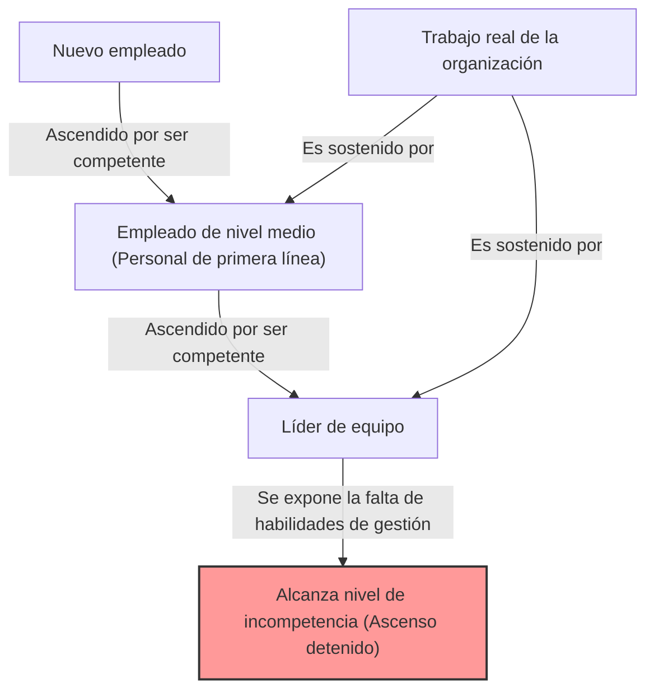
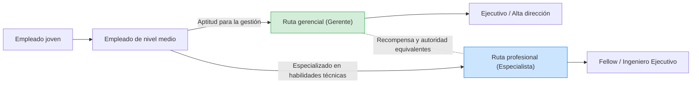

## 1. Introducción: ¿Por qué las organizaciones están llenas de "jefes incompetentes"?

Al trabajar en una empresa, ¿alguna vez te has hecho las siguientes preguntas? "¿Por qué alguien que no puede hacer bien su trabajo ocupa un puesto directivo?" "¿Por qué ese colega que se suponía que era excelente se volvió un inútil tan pronto como se convirtió en gerente?"

En realidad, este no es un fenómeno exclusivo de tu empresa. Es un fenómeno universal que se observa en todo tipo de organizaciones, empresas, oficinas gubernamentales e incluso en escuelas y organizaciones sin fines de lucro de todo el mundo. Este fenómeno fue brillantemente verbalizado y sistematizado como el "**Principio de Peter (The Peter Principle)**".

En este artículo, exploraremos profundamente este principio propuesto por el Dr. Laurence J. Peter desde todas las perspectivas posibles, desde sus mecanismos fundamentales hasta las contramedidas a nivel individual y organizacional. Es una lectura obligada para cualquiera que intente sobrevivir en la "sociedad jerárquica" que es una organización.

## 2. ¿Qué es el Principio de Peter? (Concepto Básico)

El Principio de Peter es un principio sobre la sociología jerárquica propuesto en 1969 en el libro "El Principio de Peter", coescrito por Laurence J. Peter y Raymond Hull. Su afirmación central es la siguiente:

> **"En una jerarquía, todo empleado tiende a ascender hasta su nivel de incompetencia."**

Esta frase por sí sola puede ser un poco difícil de entender, así que expliquémosla con un ejemplo concreto.

Había un vendedor (Sr. A). Tenía un historial de ventas excelente y se había ganado la inmensa confianza de sus clientes. La empresa evaluó la "competencia como vendedor" del Sr. A y lo ascendió a gerente de ventas.

Sin embargo, la habilidad que se requiere de un gerente de ventas no es "la habilidad de vender productos uno mismo", sino "la habilidad de gestión para desarrollar subordinados y lograr objetivos como equipo en su conjunto". El Sr. A era excelente como gerente jugador (que también realiza tareas operativas), pero no se le daba bien enseñar a otros o gestionar la motivación del equipo.

Como resultado, el Sr. A no pudo producir resultados como gerente de ventas y fue etiquetado como "incompetente". Y dado que es incompetente, no puede ser ascendido más allá (como a director de departamento) y seguirá permaneciendo en ese puesto de "gerente incompetente".

Este es un ejemplo típico del Principio de Peter. En otras palabras, las personas son ascendidas porque "son competentes en su puesto actual", pero si no tienen las habilidades requeridas para el puesto al que son ascendidas, se vuelven "incompetentes" allí y su ascenso se detiene.

## 3. La "Tragedia Organizacional" provocada por el Principio de Peter

La consecuencia más aterradora que sugiere el Principio de Peter se resume en la siguiente frase.

> **"Con el tiempo, todo puesto tiende a ser ocupado por un empleado que es incompetente para llevar a cabo sus deberes."**

¿Qué pasaría si todos en la organización fueran ascendidos hasta alcanzar su nivel de incompetencia y se estancaran allí? Todos los puestos, desde la alta dirección hasta los mandos intermedios, estarían ocupados por "personas que no son aptas para su trabajo actual".

### ¿Por qué siguen funcionando las organizaciones?
Entonces, ¿por qué las organizaciones reales siguen funcionando sin colapsar por completo? Según el Principio de Peter, no es por otra razón que **"el trabajo real es realizado por aquellos empleados que aún no han alcanzado su nivel de incompetencia (es decir, que actualmente están en proceso de ascenso)"**. En otras palabras, la estructura es tal que los "jóvenes talentosos" y el "personal competente de primera línea" en los niveles inferiores y medios de la organización cubren la incompetencia de los niveles superiores y sostienen el desempeño general de la organización.

## 4. ¿Por qué es inevitable el Principio de Peter? (Profundizando en los mecanismos)

¿Por qué las empresas repiten decisiones de personal que deliberadamente convierten a personas competentes en incompetentes? Hay fallas estructurales inherentes a las sociedades jerárquicas (jerarquías).

### 4.1. Confusión entre "Logros pasados" y "Aptitud futura"
Los sistemas de evaluación en muchas empresas se basan en "los resultados en el puesto actual". Sin embargo, la naturaleza de las habilidades requeridas cambia fundamentalmente a medida que uno asciende en la jerarquía.
- **Personal de primera línea (Jugador)**: Habilidades especializadas, capacidad de ejecución, autogestión
- **Mando intermedio (Gerente)**: Habilidades de comunicación, capacidad de coordinación, desarrollo de recursos humanos
- **Alta dirección (Líder)**: Pensamiento estratégico, construcción de visión, capacidad de toma de decisiones

La competencia como jugador no garantiza la competencia como gerente. Sin embargo, en las evaluaciones de desempeño reales, es difícil construir un método de evaluación distinto a "convertir al mejor vendedor en gerente", lo que inevitablemente crea un desajuste.

### 4.2. Las limitaciones del sistema de recompensas (La maldición de Ascenso = Éxito)
En muchas organizaciones modernas, el principal medio para "aumentar el salario" y "ganar estatus" se limita a "ser ascendido a un puesto directivo".
Incluso si se trata de un excelente ingeniero o vendedor que quiere dominar el camino de un especialista, el sistema requiere que se convierta en gerente para ganar un salario por encima de cierto nivel. Esto resulta en "ser empujado hacia un nivel de incompetencia" ignorando la aptitud y los deseos del individuo.

### 4.3. La dificultad de la degradación y el "Desplazamiento Lateral"
Degradar a alguien que ha sido ascendido una vez es muy difícil en la cultura corporativa japonesa (y en muchas empresas occidentales también). Esto se debe al riesgo de herir el orgullo del individuo y reducir significativamente su motivación.
Por lo tanto, los gerentes que resultan ser "incompetentes" a menudo no son degradados, sino que son trasladados lateralmente a posiciones de poca importancia en el mismo nivel jerárquico (los llamados "miembros del grupo junto a la ventana" o "directores encargados de misiones especiales" sin poder real). Peter llamó a esto "**Arabesco Lateral (Desplazamiento Horizontal)**".

## 5. Contramedidas innovadoras contra el Principio de Peter

Superar por completo el Principio de Peter es extremadamente difícil mientras existan sociedades jerárquicas. Sin embargo, existen estrategias para minimizar el daño y lograr un equilibrio entre la felicidad individual y la productividad organizacional.

### 5.1. Medida a nivel individual: Recomendación de "Incompetencia Creadora"
La mejor estrategia de defensa para que un individuo se proteja, propuesta por el propio Peter, es la "**Incompetencia Creadora (Creative Incompetence)**".
Esta es una técnica avanzada en la que, cuando llegas a un puesto en el que piensas "esta es mi verdadera vocación" o "no quiero ser ascendido más (no quiero exceder el límite de mis capacidades)", actúas intencionalmente mostrando "pequeños defectos que no son fatales pero hacen dudar sobre un ascenso".

Por ejemplo, realizas tus tareas operativas a la perfección, pero "tu escritorio siempre está desordenado", "eres reacio a participar en eventos de la empresa" o "tu forma de vestir es un poco informal". Como resultado, la alta dirección juzgará que "puede hacer el trabajo, pero hay cierta preocupación en convertirlo en gerente", y te mantendrá en tu posición actual (donde más brillas).

### 5.2. Medida a nivel organizacional: Separación de ascenso y recompensa (Sistema de doble escalera)
La medida más efectiva que puede tomar una organización es **separar completamente la "ruta gerencial" y la "ruta profesional (especialista)" y proporcionar evaluaciones y recompensas equivalentes** (esto se llama sistema de doble escalera).
Esto elimina la necesidad de que los excelentes programadores se conviertan por la fuerza en gerentes de proyectos solo por el salario, permitiéndoles continuar demostrando su competencia.

### 5.3. Promociones de prueba e institucionalización de una "Retirada Honorable"
La tragedia ocurre porque la promoción se considera "irreversible". Por ejemplo, se podría introducir un sistema que establezca un "período de prueba gerencial" de 3 a 6 meses, y al final de ese período, el individuo y la empresa puedan discutir y elegir si "regresar al puesto original" o "continuar como gerente".
Esto garantiza sistemáticamente una "retirada honorable" en los casos en que "lo intentó pero no tenía la aptitud", evitando así el estancamiento en un nivel de incompetencia.

## 6. Conclusión: Dónde deberías demostrar tu propia "Competencia"

A primera vista, el Principio de Peter parece ser una ley muy cínica y desesperanzadora. Sin embargo, si le damos la vuelta, también es una lección que nos enseña **"la importancia de comprender con precisión los límites de tus habilidades y tu aptitud, y encontrar el lugar donde puedas brillar más"**.

En lugar de subirte a la vía única de "ascenso = éxito" preparada por la sociedad o la empresa, deberías identificar el nivel en el que tu propia "competencia" puede maximizarse, y tener el coraje de permanecer allí (y a veces, la sabiduría de jugar a la Incompetencia Creadora). Se podría decir que esa es la mejor estrategia para sobrevivir a la compleja sociedad jerárquica moderna sin estrés y de manera plena.

(*Este artículo fue escrito con el objetivo de ayudar a comprender profundamente el "Principio de Peter" y utilizarlo para construir las organizaciones del mañana. Ese "jefe incompetente" en tu lugar de trabajo también pudo haber sido un jugador brillante y competente alguna vez. Pensándolo de esa manera, podrías ser capaz de mirarlo con un poco más de amabilidad... tal vez.*)
